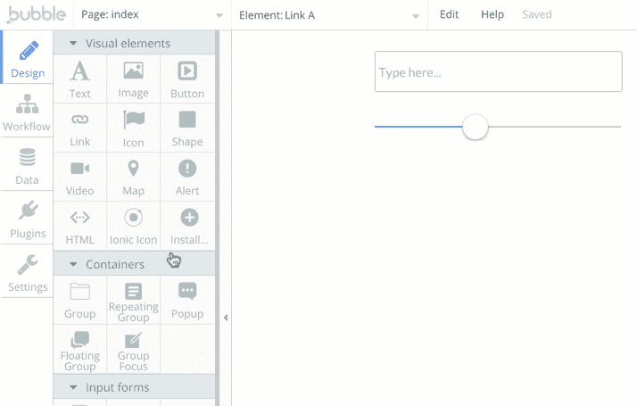
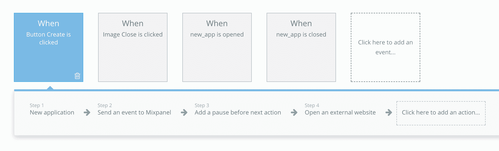
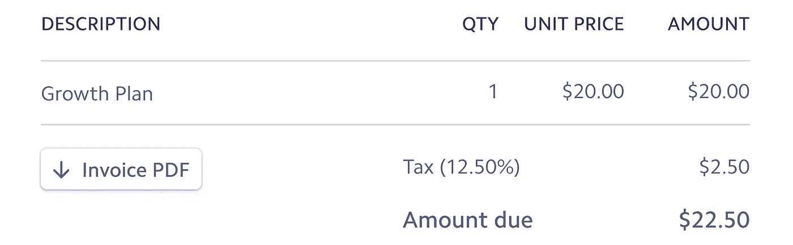
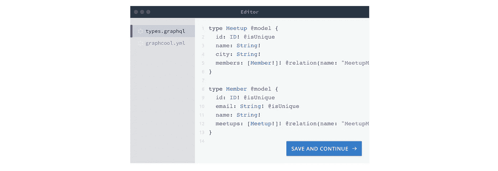
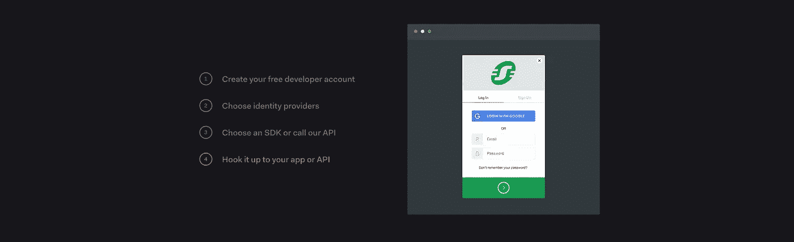
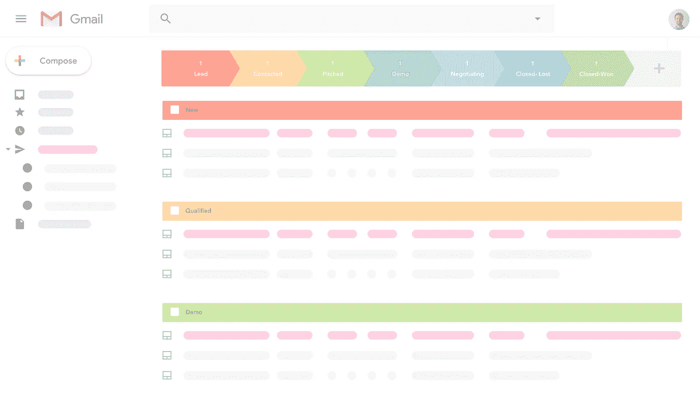

# 如何尽快赶走 SaaS

> 原文：<https://medium.com/hackernoon/how-to-push-out-saas-as-quick-as-possible-12011b049173>

## 如何在几周内建造一个 SaaS？剧透:我不知道

着手建造什么东西？不要把时间花在建筑上。把你的时间花在与顾客交谈和推销你的产品上。对于个体创业者来说尤其如此。问题是建立一个网络或移动应用程序比我们想象的要花更多的时间。

我们都听说过 Pieter Levels 在 12 个月内成立了 12 家公司，但我们大多数人都想知道如何在这么短的时间内开发应用程序。你必须验证你的想法，设计一切，推销产品，建立你的商业逻辑。

Photo by [Dawid Zawiła](https://unsplash.com/@davealmine?utm_source=medium&utm_medium=referral)

更糟糕的是，您必须构建大量不必要的样板文件。对于一个编码员来说，这可能需要几个星期。对于大公司来说，这可能不是最大的问题。但对于独立黑客来说，就像那些自己创业的人，甚至只是作为一个副业项目，这是一种痛苦。

# 选项

在这一点上我必须对你说实话。打造下一个 SaaS 没有现成的解决方案。大多数人都知道他们必须选择一个技术堆栈，但这仍然是一个乏味的任务。我会列出我所知道的选项，以及它们的优缺点，让你的工作变得简单一点。

问题仍然是选择哪些框架。即使您使用样板文件，您仍然需要深入研究这些框架。你必须和他们一起工作，做出合理的决定，看他们是否是正确的选择。另一个选择是使用无代码的 web 应用构建器，比如 bubble.is。

有第三种选择吗？据我所知没有。我很想看到这两者的混合体。稍后会详细介绍。

# 泡泡. is

除了 [Bubble](https://bubble.is/) 还有其他选择，但是经过我(有限的)研究，我认为这个可视化 web 应用构建器是构建 SaaS 的最佳选择。

Their visual editor

像大多数视觉编辑器一样，Bubble 在前端做得很好。创建一个响应式网站并不难。Bubble 最大的优势在于它的其他功能:你可以用它建造任何真正的 SaaS。以支付功能为例。您不仅可以向您的用户收费，还可以让您的用户输入他们自己的条带凭据，并让他们向他们的用户收费。

两个缺点:

*   实际上要慢一些
*   它剥夺了可定制性

当您使用这样的工具时，您会意识到 SaaS 需要什么功能。即使有了 Bubble 这样的工具，工作量还是很大。问题是设置一些东西实际上比你编写代码花费更多的时间。你也不能复制粘贴。当一些开发人员不能使用 CLI 时，他们会变得不高兴，所以对于大多数开发人员来说，只有可视化编辑器不是最好的选择。

可视化编辑器也缺乏很多可配置性。它们对不会编码的人来说很棒，但是如果你会编码，你很可能会觉得被这样的工具困住了。

You can automate your workflows with Bubble

我还是想给 Bubble 的团队一些信任。他们开发了一个神奇的工具，让不会编程的人也能开发 web 应用。使用这个工具甚至可以教会人们许多网络应用背后的概念。Bubble 是一个代码 GUI，有很多样板文件和插件。这也是一个非常年轻的工具，所以请关注他们未来的发展。

# 混血儿

即使是我最喜欢的堆栈，我也能想到一些更简单的东西。玩过视觉编辑器之后，我可以告诉你，这个市场有相当大的潜力。

Photo by [Linh Pham](https://unsplash.com/@linharex?utm_source=medium&utm_medium=referral)

如果你想尽快构建一个 SaaS，你应该会编码。如果你使用一个全功能的样板文件，你仍然需要掌握它的底层框架。因为我们喜欢可配置性，这是一件好事。这是一个可视化应用构建者无法给你的东西。但是在速度方面，用一个好的 GUI 创建应用程序也有它的好处。

GUI 应该用 GUI 来构建。代码不是最好的设计工具，但是从视觉设计过渡到代码通常需要很长时间。可视化技术流程，如营销自动化系统的工作流程，通常是一件好事。在构建 SaaS 的许多阶段，能够在代码和可视化编辑器之间切换是一个很好的特性。代码仍然应该是基础，但是可视化编辑器可以在很多地方提供帮助。

# 样板文件

样板文件通常缺少很多东西。自愿的。这给了你更多的自由，但也花费了更多的时间。SaaS 应用程序通常需要集成许多第三方服务。这是简单的样板不会做的事情。但是，如果你想快速前进，你甚至可能欣赏固执己见的样板。

你甚至可能希望它包括一个营销堆栈。营销组合包括以下内容:

*   分析学
*   电子邮件服务提供商
*   演员表
*   在线聊天
*   客户关系管理

有一些工具，如 Segment 或 Userengage，试图使集成所有这些服务变得更容易一些。
**Segment** 是一款应用程序，可帮助您从每个客户接触点获取数据，并将其发送至能够最有效利用数据的工具。
**Userengage** 集 CRM、营销自动化、实时聊天、分析等功能于一身。这减少了集成许多服务的需要。它还与 Segment 集成。

Photo by [Markus Spiske](https://unsplash.com/@markusspiske?utm_source=medium&utm_medium=referral)

# 选择您的筹码

有很多很棒的样板文件。如果你是一名开发人员，你应该不难发现哪一个最适合你。你可能想试试 [Laravel Spark](https://spark.laravel.com/) 。它为您处理许多您不应该自己编写的东西，因为每个项目都需要:

*   认证(+双因素认证)
*   订阅管理和计费(付款、开具发票)

但是大多数其他样板文件只是将一些框架粘在一起。很多事情你还是得自带服务。

# 我将如何打造我的下一个 SaaS

## 演员表

您可以使用 Stripe 本身来处理订阅。但在撰写本文时，条纹计费仍然缺乏一些功能，如销售税。你需要一个第三方提供商，这将花费你每月 30 美元。如果您想自己构建，可以查看一下[节点-销售税](https://github.com/valeriansaliou/node-sales-tax)。

As far as I know, Stripe Billing doesn’t offer any tax features

你最好选择像 [Recurly](https://recurly.com/) 或 [Chargebee](https://chargebee.refersion.com/c/bb860) 这样的订阅付费提供商。他们创建适当的发票，并在没有第三方服务的情况下处理 EU-增值税。他们还为你提供了许多 SaaS 指标。

如果您直接使用 Stripe，您可能希望使用 [Baremetrics](https://baremetrics.com/) 来了解您的数字。但是不要太担心统计数据，尤其是如果你是新手的话。订阅管理软件是另一项开支。对于您的第一笔 50，000 美元收入，Chargebee 是免费的。像 SaaS 的许多其他地方一样，这经常是一个建造还是购买的问题。

## 后端

根据你操作的规模，你可能不想在这里花太多时间。您的客户看不到您的后端，并且大多数应用程序不需要任何特殊功能。

*   [Graphcool](https://graph.cool/)
    是个 BaaS(后端…)。定义您的模式，您就有了一个 GraphQL API。没有进一步的设置样板。如果你不知道 GraphQL，它可能是值得学习的东西，因为它可以让你在开发中走得更快。Graphcool 有一个免费层。

Their website offers a cool demo

*   虽然主要面向移动应用程序开发者，但它也很容易集成到网络上。它处理像你的数据库，认证和托管。Firebase 是谷歌的产品，有一个慷慨的免费层。

## 作家（author 的简写）

构建自己的认证系统是有意义的。已经做了几百遍了，很容易找到可以复制的东西。但这也让建立自己的公司变得更加奇怪。你也可以使用像 [auth0](https://auth0.com/) 这样的第三方认证提供商，它对多达 7000 个活跃用户免费。付费计划相当昂贵。很容易与 Graphcool 集成。

If your boilerplate doesn’t include authentification, plan an hour or less for that.

如果你使用 Firebase，你已经有了一个认证系统。你也可以使用对多达 50.000 名用户免费的亚马逊认知 T2。

## 半铸钢ˌ钢性铸铁(Cast Semi-Steel)

有许多 CSS 框架。如果你已经习惯了，那就坚持下去。尝试新事物不是一个坏主意，但它不是最节省时间的事情。

*   如果你使用 React，蚂蚁设计是一个不错的设计。
*   布尔玛也能做你所期望的一切。

选择一个 CSS 框架只需要不到一个小时的研究。但总而言之，这正是你的 SaaS 所有部分的问题。您不必花费数小时或数天来决定一个堆栈。如果你想快速移动并打破东西，你可能只是想使用我在这里告诉你使用的技术。

# 智能营销堆栈

您的营销组合将包括许多工具，因此将它们链接在一起非常重要。您希望所有工具中的所有数据都可用。这不仅包括将数据从您的应用程序发送到您的分析和电子邮件工具，还包括在它们之间同步数据。

Photo by [Daria Nepriakhina](https://unsplash.com/@epicantus?utm_source=medium&utm_medium=referral)

[**Segment**](https://segment.com/) 是帮助完成这项任务的最流行的工具，但如果你想每月跟踪超过 1000 人，它会变得相当昂贵。

> 他们的定价是如此痛苦。我仍然没有找到一个好的替代者。😥—贾斯廷·杰克逊

因此，如果你是一个创业者，细分市场对你来说没有太大意义。如果你们是一个团队，那就去争取吧。尤其是当你使用很多与 Segment 集成的服务时，这[是值得的](https://baremetrics.com/startup-calculator)。

## **电子邮件服务提供商**

我个人喜欢[滴滴](https://drip.pxf.io/c/1255426/390571/5674)，但是也有很多服务有类似的功能，但是更便宜。我个人没有使用过这个领域的很多服务，所以你可能想问问这里的其他人。

## **实时聊天**

我推荐[漂移](https://www.drift.com/)或者[酥](https://crisp.chat/?ta=1IYBgGwJVi)。我没用过[对讲机](https://www.intercom.com/)，可能也值得一看，但是不免费。

## **分析学**

如果你喜欢的话，Mixpanel 是一个很好的工具，可以看到每个顾客的旅程。 [Heap](https://heapanalytics.com/) 和 [Hotjar](https://www.hotjar.com/pricing) 也提供免费层。但如果你刚刚起步，你不应该太担心分析。设置它们应该不到一个小时。

## **CRM**

每个企业都应该有某种类型的客户关系管理。Hubspot 的 CRM 看起来很可靠，因为它是免费的，而且与其他公司合作得很好。对于较小的项目，我喜欢使用 Streak CRM。它有邮件合并功能，可以让你直接从 Gmail 发送半批量邮件。

我提到以上所有的服务是为了说明决定你想使用哪一个是多么的麻烦。将它们整合在一起就更麻烦了。我从未使用过 [Userengage](https://userengage.com/) ，但这听起来是一个很棒的解决方案。它在一个应用程序中做了很多事情，这意味着它们已经非常适合你了。

# 结论

就像文章开头承诺的，没有去解。我希望这篇文章仍然可以帮助你建立你的下一个 SaaS。