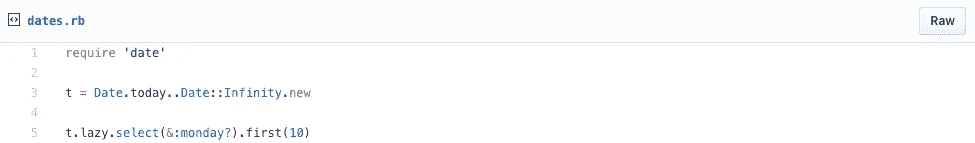
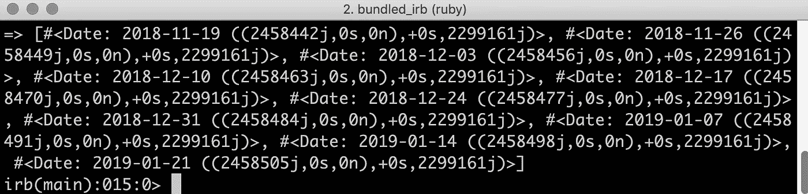

# 如何使用 Ruby 快速获得前 10 个星期一的日期

> 原文：<https://medium.com/hackernoon/how-to-quickly-get-the-dates-for-the-first-10-mondays-using-ruby-ce9066930ab6>

如果你有时感到无聊，想自娱自乐，那么不要漫无目的地浏览社交媒体，你可以尝试学习一些新东西。例如，您可以学习一些您不知道可以用 Ruby 做的事情:获取下一个*星期一*、*星期二*或一周中任何一天的日期。

以下是您的操作方法:

执行之后，您将看到日期列表:

我们可以将部分*星期一*替换为英语中一周中任何一天的其他名称，这样就可以了。

我知道这看起来可能没什么好处，但也许，你可以在你的个人剧本中使用它。在更好的情况下，我希望这能激励你在你使用的编程语言的文档中探索更多，这样你就能学到更多隐藏的宝石，可以节省你很多时间。