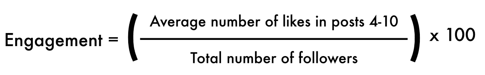
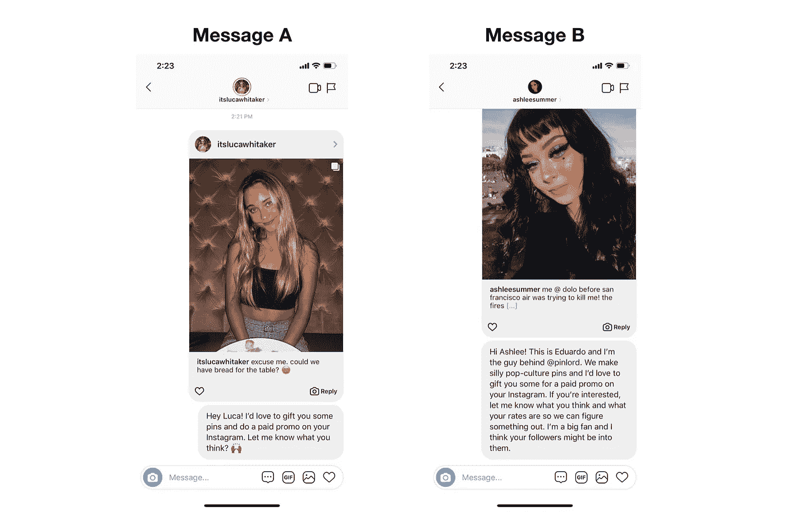
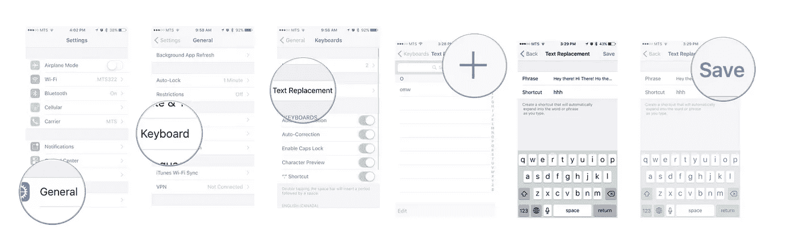
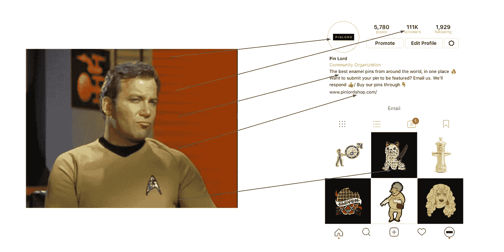
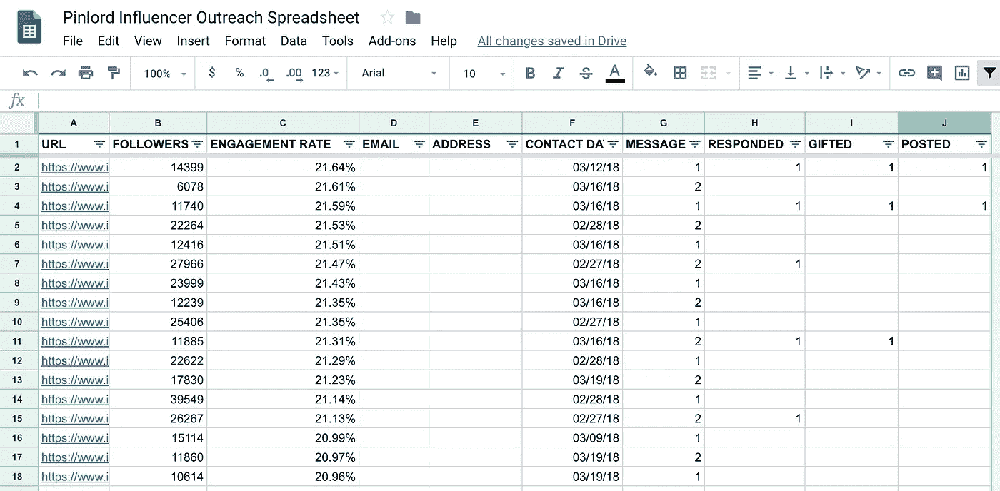
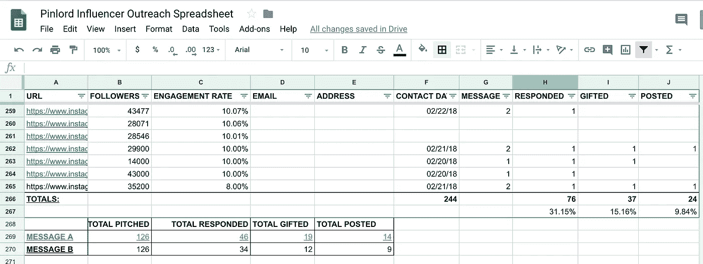
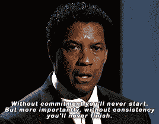

# 如何接触 Instagram 的影响者以最大化回复率

> 原文：<https://medium.com/hackernoon/how-to-reach-out-to-instagram-influencers-to-maximize-response-rates-16f429008f62>

我已经为品牌管理了数百场影响者营销活动，如 [Depop](https://www.vogue.com/article/depop-millennial-friendly-shopping-app) 、[for Foods](https://forafoods.com/)，以及我自己的项目[、【pinlord](/the-mission/how-to-monetize-your-instagram-account-7b13ce4b300d) & [、【potteryforall】和](/the-mission/how-to-grow-your-instagram-without-buying-followers-76e1d984d00e)，如果说我学到了什么，那就是影响者营销推广与“传统”推广非常不同。

如今，大多数有影响力的人 A)不使用电子邮件作为他们的主要工作平台，B)每天/每周都有大量(数百个)潜在的合作机会，C)主要根据你的 Instagram 评估你的品牌，以及 D)与传统企业相比，有非常不同的需求和优先事项。

所以，如果你想让说“是”的内容创作者的数量最大化对于您的下一次活动，您必须重新评估您的外联战略，以最大限度地适应当前的影响者格局。

根据经验，在拓展过程中有四个基本步骤将大大增加你成功的可能性。它们是:

## 1.找到对你的项目最有潜在价值的影响者。

这是影响者营销过程中最重要的一步！如果你没有首先确定对你的活动具有最高潜在价值的内容创作者，不管你的回复率有多高，你肯定会看到令人失望的结果，因为你与之合作的影响者一开始就没有多少价值。[我写过一篇关于这个话题的深度文章](https://hackernoon.com/how-to-measure-what-an-instagram-influencer-is-worth-cb488f605ffe)，但是一般来说，你可以通过衡量一个影响者的有机参与率来衡量他的潜在价值。

[Measure engagement](/@edmo_nyc/how-to-measure-engagement-rates-on-instagram-and-why-its-important-d368486a984a) by dividing an influencer’s average number of likes in post 4–10 by their total number of followers, and multiplying that by 100\. You want to measure posts 4–10 because that will be the most accurate representation of the current engagement rate. Measuring post 1–3 won’t be correct because those posts are still getting likes on explorer pages. Measuring after post 10 won’t be very effective because that will be historic engagement and that isn’t as great of a predictor of value in comparison to current engagement.

与具有相似追随者范围的相似内容创作者相比，它越高，潜在价值越高。从数量上来说，[拥有超过 10K 追随者且有机互动率达到 15%或以上的影响者最有可能给你带来最好的结果](https://hackernoon.com/how-to-search-for-and-find-the-most-valuable-influencers-on-instagram-df8ddd5b2243)(互动率[越高](/@edmo_nyc/how-to-measure-engagement-rates-on-instagram-and-why-its-important-d368486a984a)每美元的关注/点击/销售额就越大)。

## 2.AB 测试你的信息。

一旦你为你的活动确定了大量高价值的影响者(我想说的是，在你开始外联之前，至少要找到 35 个影响者)，是时候精心制作你的外联信息了。我建议你不要使用标准的“商业推销”，而是创建几条新信息，以测试哪条信息对你的影响者营销的回应率最高。

这不必很复杂。我倾向于测试一条超级简单的消息和一条更传统的“商务”类型的消息。为什么？根据经验，我注意到内容创建者倾向于对简单的、更“人性化”的信息做出回应，而不是我们通常被训练使用的标准的“商务”信息。但你不会客观地知道这对你的品牌来说是不是真的，除非你对两者都进行宣传，并测量回复率，然后让数据告诉你哪些信息影响者实际上联系得最多。

这两种类型消息的通用模板如下所示:

*   **消息 A(简单的一条):**“嗨{NAME}！我很乐意送你一些{你的产品或服务}，并在你的 Instagram 上做一个付费宣传。让我知道你的想法？🙌🏾"
*   **信息 B(营销信息):**“你好{姓名}！这是{您的姓名}，我是{您的用户名}的幕后人员。我们生产{产品或服务}，我很乐意在您的 Instagram 上为您的付费推广活动赠送一些。如果你感兴趣，让我知道你的想法和你的利率，这样我们就可以想出一些办法。我是他们的超级粉丝，我想你的粉丝可能会喜欢他们。”

Which one would you respond to? Btw, have you every asked yourself [if your Instagram is actually even worth growing?](/better-marketing/how-to-know-if-your-instagram-is-actually-worth-growing-c0874be37fc5) If not, you should. It might help save you a whole bunch of time and energy. It’s not worth it for everyone…

最重要的是，在这两个信息中，你都清楚而中肯地说明了你提供了什么价值，以及你希望他们提供什么。和我们大多数人一样，他们是大忙人，一句含糊的“嘿！”或者“我们愿意和你一起工作”的信息只是一个信号，无论是谁发送的，都可能会占用你很多时间。

## 3.将 Instagram DMs 作为你的主要推广渠道。

一旦你有了高价值影响者的名单和你的 AB 信息，是时候做你的推广了！除非有人特别要求将与业务相关的信息发送到某个电子邮件地址(有影响力的人通常会在他们的简历中写下这一点)，否则我建议你通过 Instagram DMs 发送所有信息，并且不要忘记首先发送相同数量的 A 和 B 信息，这样你就可以准确地衡量结果。

与电子邮件相比，影响者更有可能首先通过 DMs 看到你的信息并做出回应，因为他们已经花了大部分时间在平台上创建内容(另外，没有人真正喜欢通过电子邮件工作*。*

为了尽可能有效地通过目的地管理系统开展外联活动，我建议:

*   **使用键盘文本替换:**为了节省自己的一些打字时间，[使用手机上的文本替换](https://www.imore.com/how-use-text-shortcuts-iphone-and-ipad)来快速发送你的 AB 消息。每条信息只需要敲几个字母，而不是每次都要把所有的东西都打出来，这样你每周就可以节省几个小时的工作时间。

*   **使用 PayPal 进行快速支付:**对于大多数有影响力的人来说，一个很大的痛点是必须等待 30 到 45 天才能收到一个 Instagram 宣传片的付款。能够在完成一部宣传片后的几个小时内用 PayPal 支付给有影响力的人，这将是与其他仍然采用“给我开发票，然后等 45 天”模式的公司的一大区别。从长远来看，这将为与你共事的有影响力的人创造更愉快的体验，他们会更愿意与你共事(因为每个人都喜欢快速获得回报)。
*   **拥有一个好看的 Instagram:** 当一个有影响力的人收到你的 DM 时，他们会做的第一件事就是点击你的用户名，查看你的 Instagram(像这样的)。如果你的账户与其他吸引他们注意力的类似品牌相比并不突出，他们可能会忽略你的信息。因此，在你开始接触之前，重要的是你要确保你有一个好看的 Instagram，最好地展示你的品牌。大多数影响者评估的最重要的因素是[你的粉丝总数](/the-mission/how-to-grow-your-instagram-without-buying-followers-76e1d984d00e)(越多，他们越有可能做出回应——不管我们喜欢与否，社交证明都是真实的)、你的简历(让它[简短](https://www.instagram.com/burrow/)和[清晰](https://www.instagram.com/headspace/))、你的网格( [@stefansagmeister](https://www.instagram.com/stefansagmeister/) 、[@ blessedboppy](https://www.instagram.com/blessedpoppy/)和 [@tasteofstreep](https://www.instagram.com/tasteofstreep/) 是明显区分 Instagram 网格的很好的例子)确保你在高水平上执行了所有的建议，否则你的回复率会下降。

Like most of us, influencers will likely evaluate the value of your brand solely on how your Instagram page appears at first glance. Btw, here’s an article about the best [Instagram content scheduling and post automation tools](/better-marketing/the-best-instagram-content-scheduling-and-post-automation-tools-2e52e48373d3). Using them will help your posting process a lot more efficient 👍🏽

## 4.使用电子表格来保持组织性和测量回复率。

为了使推广过程尽可能简单和有组织，我还建议你直接在电子表格上管理它(老实说，当涉及到影响者营销时，这仍然是最有效的方法)。这里有一个我通常在活动中使用的电子表格的链接。

You can make it as complex or as simple as you need, but the essential columns for me are: A) URL, where I include a link the Instagram for easy access; B) FOLLOWERS, where I keep track of the number of followers that influencer has; C) ENGAGEMENT RATE, where I calculate the influencer’s engagement rate (=average likes in posts 4 through 10/total number of followers); D) EMAIL, where I include their email if they request to be messaged in that channel; E) ADDRESS, where I keep track of their address for gifting; F) CONTACT DATE, where I note the date I last DM’d them; G) MESSAGE, where I note which AB message I pitched them; H) RESPONDED, where I keep track of who responded; I) GIFTED, where I keep track of everyone who I gifted (or confirmed partnerships with); and J) POSTED, where I keep track of everyone who posted.

通过跟踪你推销的客户总数，哪条信息发给了谁，谁回复了，谁推广了你的品牌，你就能计算出哪条信息更能有效地提高你的回复(和推广)率。

要计算这一点，将通过消息 A 回复您的影响者的数量除以您通过消息 A 联系的影响者的总数，然后对消息 b 执行相同的操作。回复率较高的消息与影响者的联系更好，因此以后要多使用它。

恭喜你。您已经完成了第一轮影响者营销推广活动，并且已经发现哪种推广信息对您更有效。

## 重复并继续你的拓展！

一旦你知道[如何识别对你的品牌最有价值的影响者](https://hackernoon.com/how-to-measure-what-an-instagram-influencer-is-worth-cb488f605ffe)以及哪条信息往往会得到最高的回复率，你就要尽可能地继续尽可能经常地进行外联，并在此过程中改进你的流程。

像任何其他营销策略一样，影响者营销只有在你长期持续有效地进行的情况下才会奏效。不要指望一个有影响力的伙伴关系会成就或毁掉你的生意；不会的。只有当你把它作为日常营销活动的一部分时，巨大的、切实的成功才会到来。所以开始吧！

PS——如果你想了解有助于你发展 Instagram 业务的其他策略，请阅读这些关于[Instagram 到底是什么以及如何工作的文章](https://theeduardomorales.medium.com/what-instagram-really-is-how-it-works-ad5d7ff5b6a0)、[insta gram 算法如何工作的文章](https://theeduardomorales.medium.com/what-the-instagram-algorithm-does-how-it-works-how-to-use-it-to-your-advantage-752356122c67)、 [Instagram 利基市场以及它们为什么是增长的关键](/better-marketing/instagram-niches-why-they-are-the-new-key-to-growth-on-instagram-beca2878d55d)、[如何自动化一个没有垃圾邮件的机器人](/the-mission/how-to-automate-an-effective-instagram-bot-that-isnt-spammy-b2146a2c0b19)、[我如何在 insta gram 上赚钱](/the-mission/how-to-make-money-on-instagram-7b13ce4b300d)， [如何建立一个赚钱的 Instagram 转发账号](/swlh/how-to-create-an-instagram-repost-account-that-makes-money-928a404560)、[如何挑选正确的 Instagram 用户名](/better-marketing/how-to-pick-the-best-instagram-username-9af1b49b7ad)、[Instagram bot 2021](/better-marketing/instagram-bots-in-2021-everything-you-need-to-know-b57fb0a3b8e9)、[哪些是最安全的 Instagram bot](https://bettermarketing.pub/the-best-instagram-bots-for-2022-the-most-effective-options-everything-else-you-need-to-know-73fa36f4e433)、[如何找到最好的 Instagram 标签](/the-mission/a-simple-system-to-find-the-30-most-effective-hashtags-for-your-instagram-4c2a4ffba34a)、[如何制作有效的 insta gram 故事广告](https://hackernoon.com/how-to-create-an-effective-instagram-story-ad-bf9aef9eb9)、[为什么你的 insta gram 账号没有增长](/the-mission/why-your-instagram-account-isnt-growing-and-why-it-s-not-because-of-the-latest-instagram-523f6137014b)、为什么 [如何创建有效的 Instagram 赞助帖子](/@edmo_nyc/how-to-create-effective-instagram-sponsored-posts-ea948b18f582)，如何[将你的媒体文章](https://hackernoon.com/how-to-monetize-a-medium-article-b4c1aeb7fdae)，[如何自动化你的 Instagram 帖子](/the-mission/how-to-schedule-instagram-posts-from-your-computer-7138ba26658f)，[如何提高你的 Instagram 参与度](/swlh/how-to-measure-influencer-marketing-roi-on-instagram-321b9b397ef4)，[如何在 Instagram 上找到最佳时间的时间帖子](/the-mission/how-to-optimize-posting-times-to-fix-your-falling-engagement-rates-on-instagram-f9ecf87e82aa)，以及[如何找到最有价值的 Instagram 影响者](https://hackernoon.com/how-to-search-for-and-find-the-most-valuable-influencers-on-instagram-df8ddd5b2243)，你需要知道的关于[抖音机器人](/better-marketing/tiktok-bots-the-best-bot-providers-ca6ebe9a0134)的一切

## 非常感谢您花时间阅读我的文章！如果你喜欢它，你可以通过注册我的 [Instagram 小企业班](https://theinstaclass.co/)来支持我，分享这篇文章并给它一堆掌声。你也可以[在 Instagram](https://www.instagram.com/theeduardomorales/) 上关注我，每当我发布❤的新作品，你就可以获得更新