# 如何阅读编程错误信息

> 原文：<https://medium.com/hackernoon/how-to-read-programming-error-messages-22795982c217>

也许软件开发曾经是不同的。也许你花了几个小时设计算法，在白板前挤在一起，直到你的记号笔用完，你浑身是汗和干了的咖啡点。

对我们大多数人来说，情况已经不一样了——大多数现代[软件开发](https://hackernoon.com/tagged/software-development)都是通过谷歌搜索正确的术语。

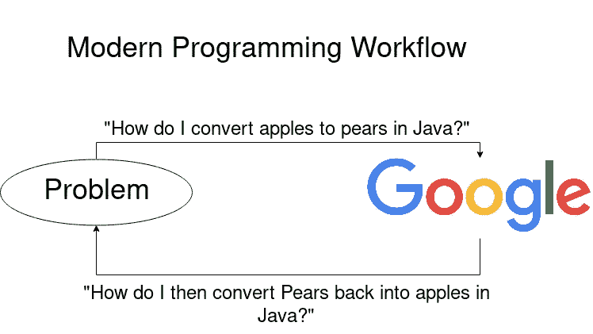

现代[编程](https://hackernoon.com/tagged/programming)工作流程。谷歌一个问题，找到一个解决方案。谷歌下一个问题。

令人惊讶的是，弄清楚什么是“正确的条款”可能相当困难。尤其是如果你是编程新手或者你正在使用的技术。

这是如何谷歌错误信息系列文章的第一篇。然而，要找到正确的搜索词，我们首先需要了解如何阅读错误消息，以及哪些部分是相关的。我将从头到尾尝试使用不同的编程语言，这样我们就可以看到它们之间的不同和相似之处。让我们开始吧！

# 错误消息的剖析

错误信息由两部分组成，即**错误信息**和**堆栈跟踪**。

错误信息是“怎么了”——好的错误信息是有帮助的，告诉你应该做什么，坏的错误信息有时看起来像是可以召唤克苏鲁的东西。

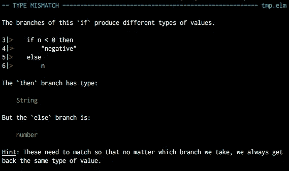

A wonderful error message from the Elm language

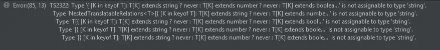

Undecipherable hieroglyphics, aka a bad Typescript error message.

另一方面，堆栈跟踪是“错误的地方”

请注意，堆栈跟踪在不同的语言中有不同的名称，Python 称之为回溯——但核心概念是相同的。

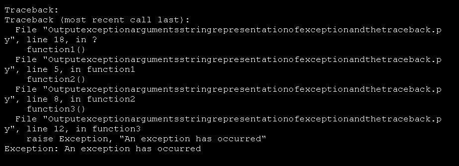

A stack trace, or a traceback as Python prefers to call it.

现在，当你在谷歌上搜索出了什么问题时，你会比使用堆栈跟踪更频繁地使用错误信息。堆栈跟踪很有用，因为它告诉我们各种上下文信息——例如，哪一行出错了，或者哪个库出错了。

# JavaScript 错误消息剖析

让我们试着看一个非常小的 JavaScript 程序，看看我们如何使用错误消息和堆栈跟踪。

这是一个相当简单的程序。它由三个文件组成。第一个`index.js`是应用程序启动的地方，下一个`some-random-file.js`没有做太多事情——它只是让堆栈跟踪更长，而`server.js`启动一个`express`服务器监听端口 3000。

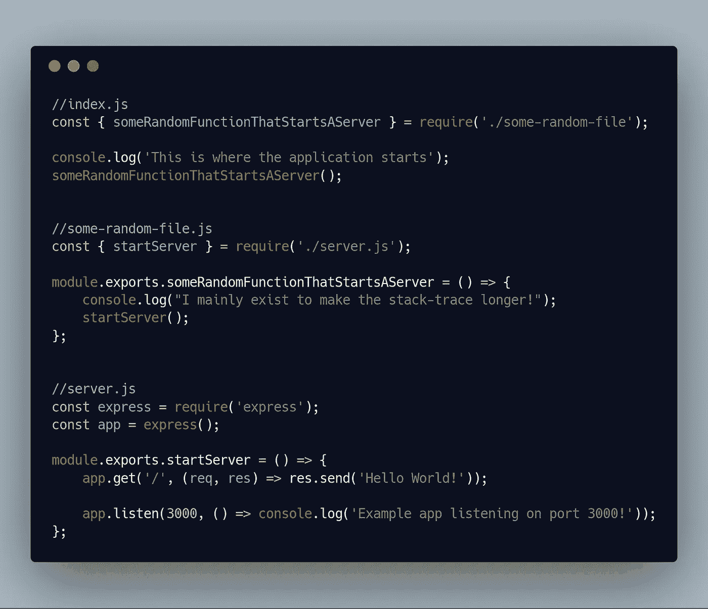

如果我们不小心同时运行这个程序两次，我们将得到一个错误—因为端口已经被占用了。我们将得到下面的错误消息和堆栈跟踪。

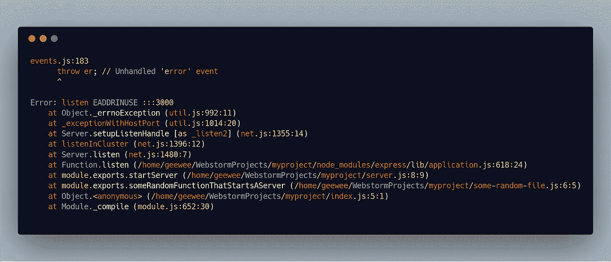

EADDRINUSE? That’s probably some sort of spell.

堆栈跟踪(通常)从底部最旧的条目到顶部最新的条目。让我们看看能否把这个分成几部分。

# 启动噪音

这些经常发生在使用框架的时候。它们的共同点是，它们通常是运行时初始化逻辑，大多数时候它们与我们的实际错误无关。

刚开始时很难分辨什么是启动噪音，但是在看到一些错误后，你通常会很快学会忽略它。一个好的经验法则是，代码的第一行**和堆栈跟踪的开始之间的任何东西都可能是启动噪音。**

在这个例子中，第一行是启动噪声。

# 你的代码

这是你写的代码。您通常可以从文件名或路径中辨别出哪些代码是您的。在这种情况下我们可以看到:
`"/home/geewee/WebstormProjects/myproject/index.js:5:1"`这是我们的`index.js`文件的路径。

我们的代码有两个部分比其他部分稍微特殊一些。代码的**第一行很重要，因为它之前的行通常是启动噪声。**

然而，最重要的部分是代码的最后一行。

# 代码的最后一行。

这通常是奇迹发生的地方。你要找的是你写的堆栈跟踪的最后一行。这意味着最后一行不是来自你正在使用的语言运行时或库。这通常是最有趣的一行，因为这是你可能犯错误的最后一行。

在这个特殊的例子中，我们代码的最后一行是:`"module.exports.startServer (/home/geewee/WebstormProjects/myproject/server.js:8:9)"`

这意味着 **server.js** 第 8 行是一个很好的地方来开始寻找我们做错了什么。

# 在代码的最后一行之后

这一行很重要，如果它存在的话，因为它通常告诉我们错误发生在哪个库或第三方代码中。在这种情况下，该行是:

`"Function.listen (/home/geewee/WebstormProjects/myproject/node_modules/express/lib/application.js:618:24)`

这里值得注意的是，路径是从我们的项目目录进入`node_modules\express\`。

现在`node_modules/`是 Javascript 存储库的目录。这意味着错误发生在`express`库中。这是很有用的，因为我们想知道以后应该搜索什么。

# 内部第三方通话

如果实际的错误发生在第三方库中，在抛出实际的错误之前，通常会有一些内部调用。内部第三方调用是代码最后几行和实际错误信息之间的代码行。他们有时会给出更多的上下文来说明到底哪里出了问题，但通常并不那么重要。

# 实际的错误消息:

最后一个重要部分是实际的错误消息。它不一定在堆栈跟踪的最顶端，但通常非常接近。在这种情况下，是这个部分:

`Error: listen EADDRINUSE :::3000`

这是我们将在搜索查询中使用的部分。在这种情况下，错误消息可以大致翻译为“地址 3000 正在使用”——但是您不知道这一点是情有可原的。这不是一个很好的错误消息。

再次查看完整的错误消息，并对不同部分进行注释，如下所示:

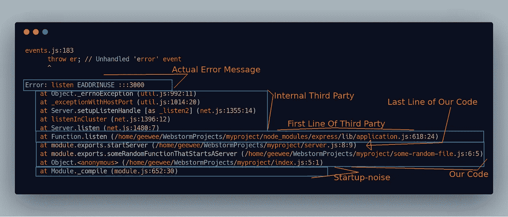

# 剖析 Python 错误消息

让我们试着看看 Python 中的相同情况，看看不同语言的堆栈跟踪是如何变化的。这基本上是与以前相同的程序和相同的文件。唯一的区别是，它使用名为`bottle`的 Python 框架，而不是`express`来监听端口 3000。

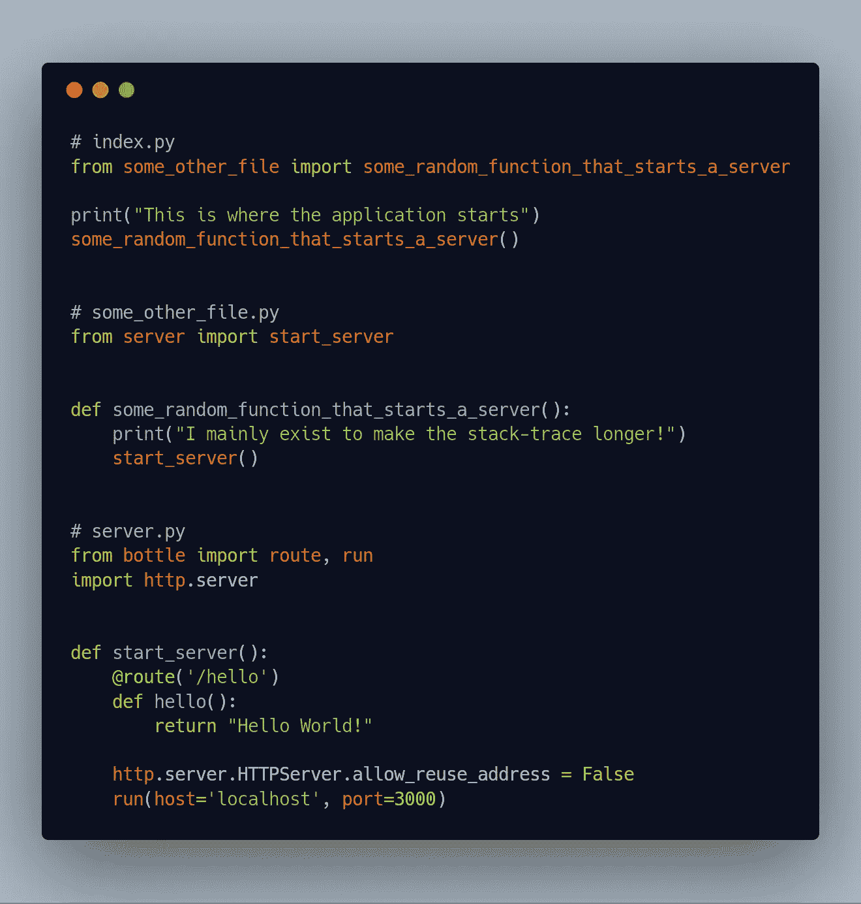

和以前一样，如果我们运行程序的多个实例，我们会得到一个错误:


这种堆栈跟踪(Python 更喜欢称之为回溯)有一些显著的不同。)最明显的一点是，它的顺序不同。

在 Javascript 示例中，最早的调用在底部，但是正如这个 python 示例所指出的，最近的调用在底部。

也没有启动噪音，堆栈跟踪从发生错误的代码行开始。

除此之外，其余部分都是一样的，我们仔细看看。

第一行和最后一行都有“我们的准则”。第一行也是堆栈跟踪的第一行:

```
File "index.py", line 5, in <module> some_random_function_that_starts_a_server()
```

这是我们代码的最后一行:

```
File "/home/geewee/PycharmProjects/myproject/server.py", line 12, in start_server run(host='localhost', port=3000)
```

然后是第三方代码的第一行:

```
File "/home/geewee/PycharmProjects/myproject/venv/lib64/python3.7/site-packages/bottle.py", line 3127, in run server.run(app)
```

这里值得注意的是`/site-packages/`是 python 存储第三方库的地方。因此，根据该目录，我们知道下一个调用是对第三方库的调用。读取目录名，`bottle/`——我们可以猜测错误来自于`bottle`库。

然后是瓶子库中的内部第三方调用，最后是实际的错误消息:

`"OSError: [Errno 98] Address already in use"`

比 express 的好一点，但仍然没有它本来可以做到的那么好。

如果我们用不同的部分注释堆栈跟踪，它看起来像这样:

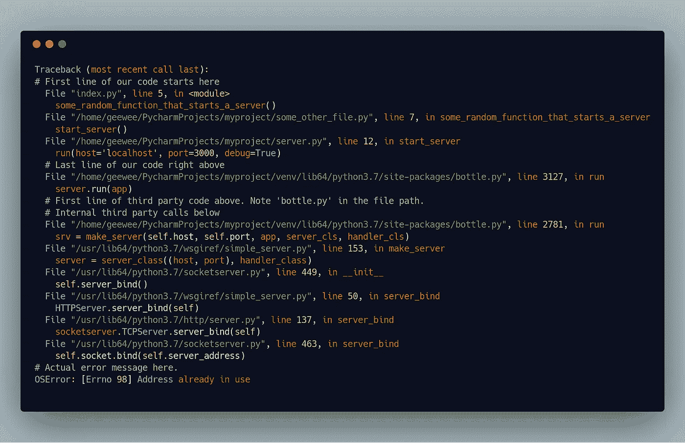

# 五十度灰的堆叠痕迹

现在，我们在这里看到的两个堆栈跟踪相当一致——可能有一些启动噪音、一些我们的代码和一个第三方库中抛出的错误。不是所有的错误条件都是这样，所以也不是所有的堆栈跟踪都是这样。

# 不允许第三方

有时没有第三方调用，正如这个 Java 例子向我们展示的:

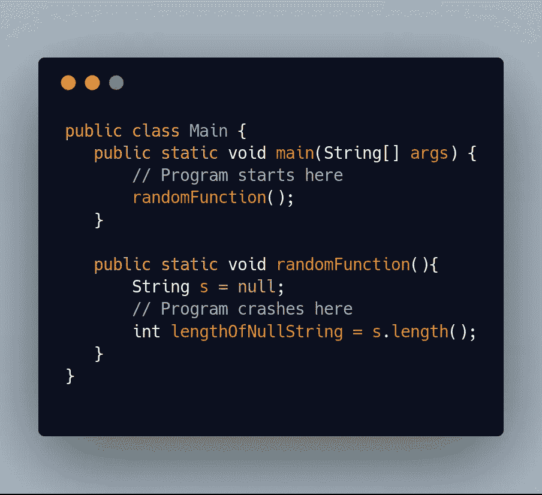

这个程序试图计算出一个已经分配给`null`的 java `String`的长度。运行这个程序会给我们一个非常小的堆栈跟踪:

```
Exception in thread "main" java.lang.NullPointerException at Main.randomFunction(Main.java:9) at Main.main(Main.java:4)
```

注意没有启动噪音，没有第三方代码。只有我们的代码，在我们犯错误的那一行结束。如果没有第三方代码，那么“我们代码的最后一行”就是检查错误的地方。

# 伙计，我的代码呢？

现在让我们看一个使用大型框架 Spring Boot 的例子。Spring 支持 Java 和 Kotlin。这个例子是在科特林。现在，我们将导致一个错误，而不会真正让我们的代码出现在堆栈跟踪中。我们可以通过定义一个非常小的应用程序来做到这一点，这个应用程序有两个类，它们都想监听同一个`/hello` HTTP 端点。Spring 不能决定哪个类应该处理`/hello`端点，因此在启动时崩溃。

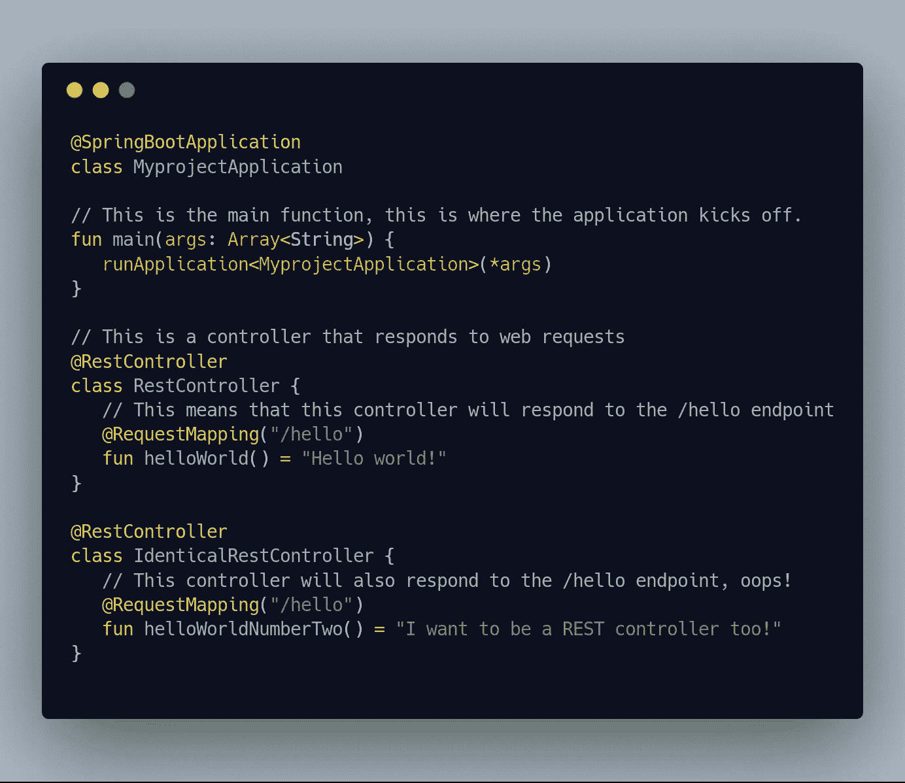

我们将得到的堆栈跟踪是这个庞然大物:

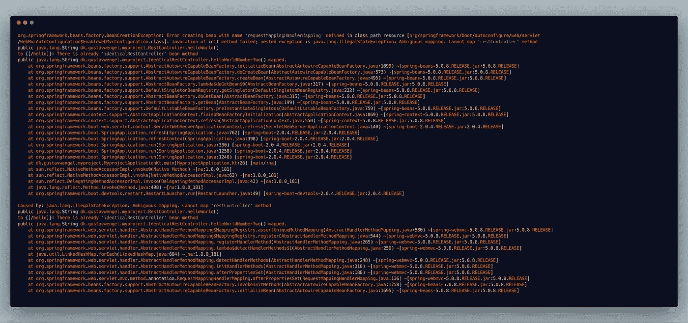

Straight out of the maws of hell

我们不会深入剖析它，因为它非常大。我们的主要方法就在其中的某个地方，但是那个方法实际上做不了多少。相反，堆栈跟踪主要由来自 Spring 框架的内部第三方调用控制。如果我们去掉内部的第三方调用，去掉最后一部分，因为这只是一个内部的 Spring 异常，并不那么重要——我们会得到一些更容易理解的东西。

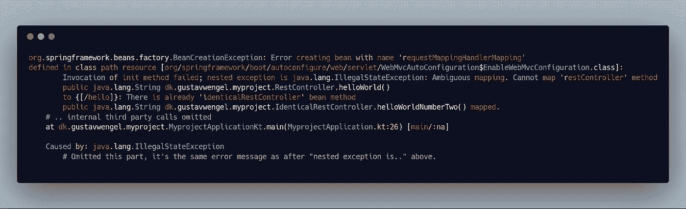

在这里，更容易找到实际的错误消息，幸运的是，它提供了合理的信息:

```
Ambiguous mapping. Cannot map 'restController' method public java.lang.String dk.gustavwengel.myproject.RestController.helloWorld() to {[/hello]}: There is already 'identicalRestController' bean method
```

如果你正在使用一个大的框架，那么在堆栈跟踪中根本没有你的代码的情况会经常发生。这通常意味着这是一个配置问题，但是这些错误很难调试。我们经常依赖框架作者提供的有用图片来帮助我们克服这类错误，因为堆栈跟踪几乎没有用处。

我们已经看到了如何将一条错误消息分成不同的部分。我们已经讨论了哪些部分是重要的，哪些部分通常可以忽略。在下一部分，我们将讨论如何在搜索时选择正确的术语，以及谷歌搜索错误信息实际上是一个边走边学的过程，而不仅仅是一个找到答案的过程。

*你对下一部感到兴奋吗？你对此有什么想法吗，或者你只是想滔滔不绝地说那个 Elm 错误消息有多棒？在 twitter 上联系我* [*@GeeWengel*](https://twitter.com/GeeWengel)