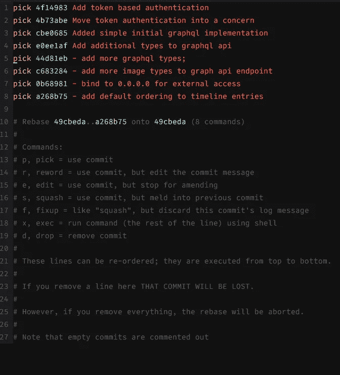

# 如何为了利润和快乐而安全地改变基础

> 原文：<https://medium.com/hackernoon/how-to-rebase-safely-for-profit-and-pleasure-3e7b4c365682>

[Git rebasing](https://git-scm.com/book/en/v2/Git-Branching-Rebasing) 似乎对人们产生了一种 [marmite](https://hackernoon.com/tagged/marmite) 效应——要么喜欢它，要么讨厌它。的确，重置基础开辟了一系列新的令人兴奋的方式来欺骗自己。更好的是，它还提供了一系列欺骗队友的绝佳机会。然而，尽管如此，我最肯定是在支持 rebase 阵营。毕竟，如果你使用不当，所有最强大的工具都会烧伤你。多年来，我积累了一套相当广泛的 rebase scars，这里是我避开陷阱和充分利用 rebase 的便利技巧。

这假设你已经熟悉了 git rebase 的基本操作。如果不是的话，git rebase 文档可能是一个很好的起点。

# 总是交互式地重设基础

Git 有两种主要的 rebase 形式——交互式和非交互式。本质上，他们做同样的事情——利用你的分支，在另一个分支上重新应用代码变更。交互式 rebase 提供了更多的选项，如重新排序和重新措辞提交，但对于注重安全的 rebase，它提供的主要内容是向您显示在 rebase 开始之前将被重新应用的提交列表。以我的经验来看，大多数重定基础的灾难都可以通过简单地回顾这个列表并在重定基础开始前中止它来避免。如果清单不是你所期望的，那就离开，找出原因，然后再试一次。



Example interactive rebase commit list

# 意识到你如何带来上游的变化

总是交互地重置基础的一个必然结果是你永远不应该使用`git pull --rebase`。我会更进一步说，你应该使用的 git pull 的唯一版本是`git pull --ff-only`。这是因为 rebase 和 default case 都可能导致您正在处理的代码在您没有意识到的情况下发生变化。它们都试图透明地合并上游所做的任何更改，而不告诉您它们是什么或让您检查它们。一个典型的例子是，当你和你的同事将同一个方法添加到一个类中，但是在文件的不同位置。Git 很乐意将这些变化结合起来，从而产生一个重复的方法定义。也许您或您的同事会在代码审查中发现它，但是最好在一开始就避免它，注意您的更改所基于的代码可能已经更改了。

# 慢慢来，保持简单

当你开始一个交互式的 rebase 时，很容易变得兴奋。但是，与其只是一头扎进去，到处提交，倒不如慢慢来，分几步重定基础，从长远来看，这会为你省去很多痛苦和不幸。

我做的第一件事是一个没有改变任何东西的交互式 rebase。通过这种方式，您可以检查提交并预先处理任何上游冲突，而不必试图弄清楚这些冲突是由于您正在重定基础的分支中发生了某种变化，还是您在所有提交杂耍中造成的问题。

然后，当你继续前进时，将提交压缩并编辑成小块。这样，如果您遇到任何意外的冲突，您可以中止 rebase 并找出问题，而不会丢失您可能已经做出的任何其他更改。最糟糕的事情莫过于经历一场马拉松式的重选，以接近终点，却不得不放弃整个过程，因为你交换了两个错误的提交，现在其中一个不适用。

# 不要害怕逃跑

重设基数应该不难。如果是的话，你正在尝试做的事情可能存在潜在的问题。也许上游发生了一些你没有意识到的变化。也许您的提交中有您不希望出现的文件。不要害怕放弃重定基础，这样你就可以停下来重新思考你正在努力做的事情，而没有处于重定基础边缘的压力。

# 解决冲突的最好方法是不要有任何冲突

不可避免的是，你有时会因同事的改变而产生冲突。无论如何，你都要和他们打交道，无论是在你合并时通过重新设定基数，还是对你的同事大喊大叫，直到他们回复他们的变更，这样你就可以先合并，从而迫使他们处理冲突。

然而，在您自己的分支内移动提交所导致的冲突更容易避免。保持你的提交小而集中。提交中的文件和更改越少，冲突的可能性就越小，因此重新排序也就越容易。如果你是 TDDing，那么一个好的开始就是每次你添加一个测试并获得相关的代码通过时提交。这样的话，你一次只能提交两个文件，每个文件都包含一个小的变化。

# 有时候多就是少

这里提交的次数越多，重定基数所带来的痛苦就越少。如果你忽略了前面的建议，那并不意味着你失去了一切。交互式重置允许您编辑提交。如果您在提交中添加了太多文件，因此现在无法移动它，您可以编辑提交，从提交中删除一些更改，并为它们创建一个新的提交。

这听起来很复杂，但实际上就像在交互式 rebase 提交列表中标记要编辑的提交一样简单。然后当重设基础暂停运行时

```
git reset HEAD~ some/file/for/another/commit
git commit --amend
git add .
git commit -m '- message for the separate commit'
git rebase --continue
```

这将在单独的提交中保留对该文件的所有更改。

这方面的另一个变化是，当您对同一个文件进行多次更改时，意外地在同一个提交中结束。在这种情况下`git add -p .`是你的朋友。这将允许您选择将对文件的哪些更改合并回您的原始提交，哪些保持不变以准备添加到另一个提交。

# 当一切都出错时，知道如何修复它

git 的一个优点是，一旦提交了任何东西，就很难完全失去它。如果你真的到了重定基数的末尾，并意识到你已经把它搞砸了，你之前的承诺仍然存在，你可以很容易地恢复。

首先，你需要你的枝条顶端的 SHA。假设你手头没有这个，可以用`git reflog`找到。你将能够很容易地看到你的 rebase 从哪里开始，因为这条线将包含`rebase -i (start)`。您只需要找到在此之前提交的 SHA，并使用`git reset --hard SHA`重置为该提交。

# 如果有必要的话，强迫推，但是首先要确定你真的需要

避免重定基的一个经常被引用的原因是，为了将您的更改推回到上游，您需要强制推，这有可能覆盖其他用户的更改。这当然是完全可能的，也是激怒你同事的一个好方法。然而，仅仅因为你可以通过强迫把事情搞砸，并不意味着你必须这么做。

首先，你只在合并之前使用 rebasing。一旦您将某个东西合并到您的“主要”分支之一(通常是主分支，但也可能有其他特殊的发布分支)，那么它就永远存在了。如果你后来发现了一个问题，你必须忍受它或者添加另一个提交。

如果您愿意，您可以对与同事共享的其他分支进行重新排序。你只需要就谁在做什么进行交流。我们每天都这样做，没有任何问题。如果人们积极响应会有所帮助。因此，如果我的一个同事告诉我，他们已经强制推送了我们共享的分支，那么我会立即更新我的本地副本。它有助于避免冲突，并试图弄清楚是否应该或不应该有必要进行强制推送。

你也应该知道在你尝试推之前，你是否期望有必要用力。如果你在没有预料到的时候得到了经典的强制推送错误消息(类似于`error: failed to push some refs...`)，那么不要只是自动强制推送。停下来，看看与远程版本相比，您在本地有哪些提交，然后应该清楚您需要做什么来修复它。

关于共享分支，我个人的经验是，如果我和一个同事同时处理同一个特性，我将从特性分支创建我自己的分支，处理它，然后重新构建并合并回共享特性分支。这是最安全的选择，因为你们两个可能会频繁地推来推去，这样可以节省来回的时间。如果我们在更多的移交类型的场景中独立工作，那么我们可能都在同一个分支上工作，因为踩到对方脚趾的机会要小得多。

另一种方法，这可能是我们最常做的，是保存 rebase 直到最后。因此，我们都只是不断地向分支的顶端添加提交，然后一旦我们对该特性准备就绪感到满意，我们中的一个或两个就会执行 rebase 整理。

# 使用正确的合并类型

重定基础的目的不是为了避免合并提交或维护线性历史。合并提交对于识别一组具有某种程度内聚性的提交非常有帮助。然而，在另一个极端，每一个提交都有一个匹配的合并提交，这是没有用的，而且会弄乱你的日志。

答案很简单，总是与正确的标志集合并。如果我正在合并一个提交，或者如果分支包含多个不相关的提交，那么我将执行一个`git merge --ff-only`。如果没有我会做一个`git merge --no-ff`。就这么简单。

# 你不需要等到最后才改变基础

一旦你完成了上面和[拉请求的诗](/@adphillips/the-poetry-of-pull-requests-c081fbcd0d0)中讨论的所有任务，重新构建你的代码肯定会有好处。然而，有时您会添加一个提交，仅仅是为了修复早期提交中的一个错别字或一些同样微不足道的事情。直接将这些更改压缩到正确的提交中是有益的，这样可以减少您在最终的 pre-PR rebase 中处理的提交数量。

所以，我们有了 10 个简单的技巧，可以让你平稳有效地调整基础。然而，了解处理提交的技术只是事情的一部分。你还需要知道你想要达到什么样的最终结果。关于这方面的更多信息，请查看[《拉请求的诗》](/@adphillips/the-poetry-of-pull-requests-c081fbcd0d0)。