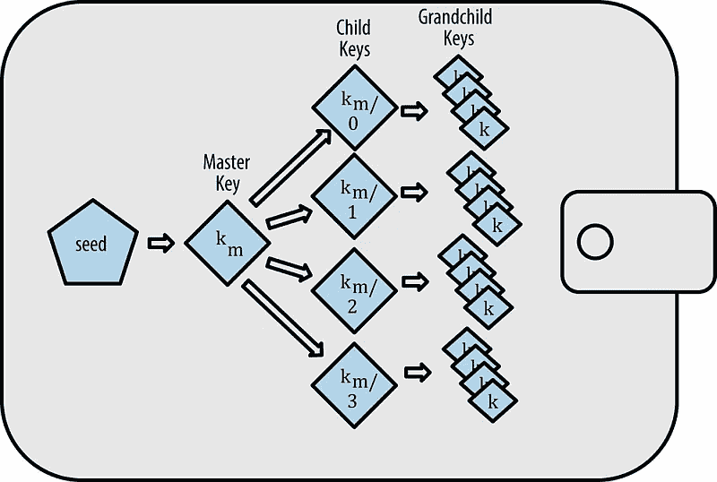

# 如何使用分级确定性(HD)密钥以安全的方式接收加密支付？

> 原文：<https://medium.com/hackernoon/how-to-receive-crypto-payments-in-a-secure-way-with-hierarchical-deterministic-hd-keys-89a8028f3d9>

当我们希望从客户那里接收付款时，我们面临一个问题，如何提供一个安全而简单的支付网关？在这篇文章中，我将分析解决这个问题的流行方法。

有两种主要方法:建立自己的服务或使用外部服务。

## 使用外部支付服务

这样的服务很容易集成，因为它们有很好的文档，它们通常是负担得起的，但是你不知道里面有什么。大多数加密支付网关都有一个封闭的专有代码。所以使用这些服务风险自担。

## 部署您自己的支付服务

这种方法的主要好处是你知道它是如何工作的。通常，您拥有服务的源代码，并且可以根据需要对其进行多次审计。

有两种类型的服务:有完整节点的和没有完整节点的。当您使用完整节点(比特币核心、Go 以太坊、奇偶校验等)时，您可以使用它们的 API 来执行新客户地址生成、检查交易状态、检查余额、将资金转移到冷钱包等任务。此外，完整节点有一个很好的 API 文档，可以简化开发。但是这个选择至少有两个问题。

首先，满节点需要大量资源。比如 2018 年 3 月 18 日，比特币核心约 200 GB，Go 以太坊(geth)约 700 GB。以太坊完整节点也需要大约 32 GB 的内存。

其次，您需要在这些节点上保存您的私钥。因为当一个完整的节点生成一个新地址时，它会将一个私钥保存到 wallet 文件中。任何有权访问服务器的人都可以窃取密钥。我们不会谈论钱包密码，因为无论如何这种类型的服务是不够安全的。

综上所述，全节点服务易于开发但资源密集且不太安全。

第二种类型是没有完整节点的服务。要检查交易或将资金转移到冷钱包(广播交易)，您可以使用已经故障转移的块浏览器，并且您不需要大量资源来使节点全天候可用。要生成新客户的地址，最好使用分层确定性(HD)密钥。

## 用简单的话来说就是分层确定性(HD)密钥

什么是高清键？这是一种算法，它允许你分割公钥和私钥存储。

传统上，当您生成一个新地址时，首先生成一个私钥，存储它，然后从公钥生成一个公钥和地址，也存储它。因此，要创建一个新地址，您需要存储它的私钥。

让我们回到 HD keys。想象一下，我们有一个算法，允许我们分别生成一些私有种子和一些公共种子。然后我们可以从一个地方的私有种子生成一个新的私有密钥，从另一个地方的公共种子生成一个新的公共密钥。这个算法是这样工作的，如果我们从私有种子生成第五个私有密钥，它将是从公共种子生成的第五个公共密钥的私有密钥。

你可以在这里阅读一篇关于 HD 键如何工作的详细文章[。但主要结论是，我们可以将公钥和私钥的生成分开。所以我们只能在您的服务器上生成公钥，并在安全的地方为它们生成私钥。](https://github.com/bitcoin/bips/blob/master/bip-0032.mediawiki)

让我们回到没有完整节点的自有服务。现在我们知道 HD keys 是一种收集资金的安全方式，但是我们需要一个实现来在我们的服务中使用它。不同语言的库并不多，但它们都有很多依赖项。明确地说，在使用这些库之前，您需要审核大量的代码。

我们在 HashEx 通过用 Java 自实现 HD 库解决了这个问题。我们图书馆的主要特点是:

1.  高清按键支持(bip 32)；
2.  助记符种子支持(BIP39)。如果你愿意，你可以在任何高清兼容的钱包里使用我们的钥匙；
3.  REST API 接口；
4.  没有不可信依赖的 Java 应用程序。您可以审核代码；
5.  任何货币的新地址生成(bip 44)；
6.  使用 block explorer 进行余额和交易检查；
7.  资金收集机制发送收集的资金到一个冷钱包与费用优化。用我们的图书馆寄钱比以往任何时候都便宜。

让我们总结一下，没有带有 HD 密钥的完整节点的自有服务是资源有效且安全的。但是它在实现上比第一个更复杂。

如果你想用我们的图书馆，给我留言。

HashEx 网站:【https://hashex.org 

通过 LinkedIn 与我联系【https://www.linkedin.com/in/dmitrymishunin/ 

