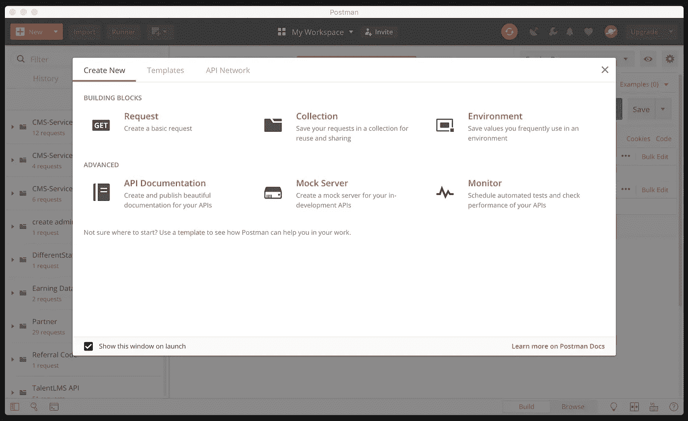
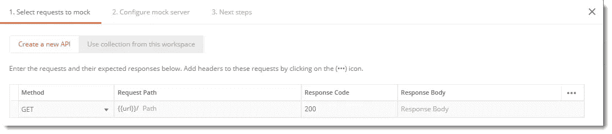
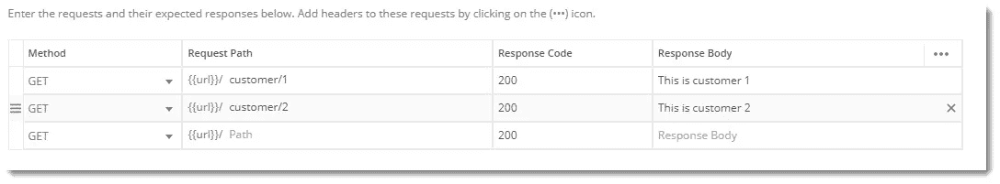
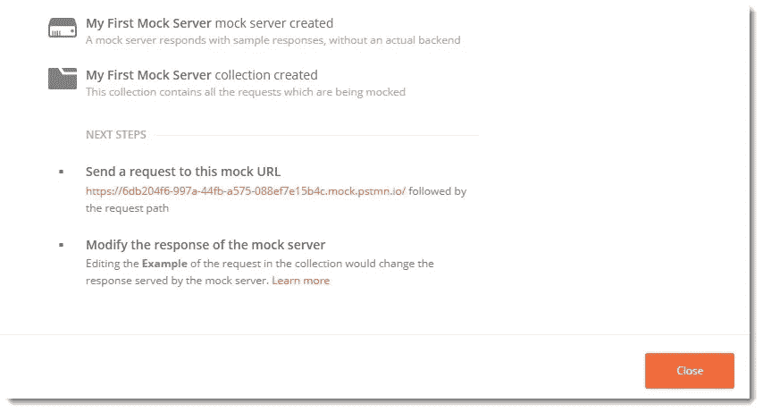
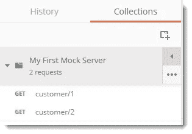
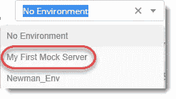
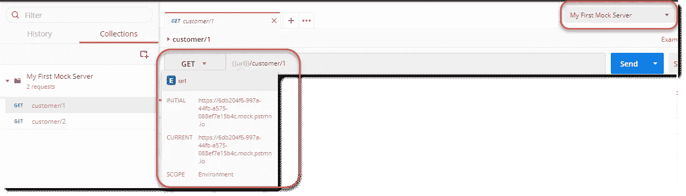
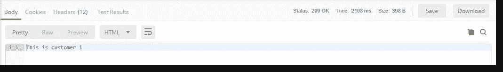

# 如何减少开发时间？嘲笑你的 API

> 原文：<https://medium.com/hackernoon/how-to-reduce-development-time-mock-your-apis-f0c81072fad6>

依赖后端开发者开始编码？总是被纠缠着尽快完成开发，以便前端开发人员可以开始他们的工作？你不用再等了。

今天，一般的办公室[开发](https://hackernoon.com/tagged/development)环境已经转移到一个开放的办公室环境，团队之间有依赖关系，其中开发时间是最重要的。团队为减少开发时间所做的任何事情都被认为是对产品开发的巨大优势。最近，我发现使用 Postman 提供的模拟服务器非常有助于减少前端和后端开发人员的开发时间。因此，我将快速带您进入在 Postman 上制作模拟服务器的步骤。

# 要求

1.  从以下链接下载[邮差](https://www.getpostman.com/)应用并设置应用。
2.  在网站上创建一个帐户。

安装应用程序并创建帐户后，您应该会看到如下屏幕:

Postman Application

安装后，不要忘记在应用程序上登录您的帐户。

# 设置模拟服务器

因此，单击 new 按钮，您会看到上面的屏幕。单击模拟服务器，您会看到以下屏幕:

Create a Mock Server Initial Screen. Image from [Toolsqa](http://toolsqa.com/)

在这里，你可以创建一个新的 [API](https://hackernoon.com/tagged/api) 来模仿，或者你可以模仿一个现有的集合。如果你想知道什么是收藏，在这里查看。在上图中，您可以使用各自的 HTTP 方法构建 REST API 请求。您还可以为它设置路径/端点、响应代码和响应主体。完成这些步骤后，您会得到类似这样的结果:

Example Endpoints. Image from [Toolsqa](http://toolsqa.com/)

单击下一个的*，然后您必须命名模拟服务器，并根据需要设置任何环境变量。这些环境变量现在并不重要，所以把它们设置为 *No Environment。*所以现在你得到了这样的东西:*

Naming the server. Image from [Toolsqa](http://toolsqa.com/)

点击下一个的*，你的模拟服务器就设置好了。您会得到一个链接到由 postman 构建的模拟服务器的模拟 URL。它们总是以 *mock.pstmn.io* 结尾。您可以通过使用之前创建的端点点击模拟 URL 来获得 API 的结果数据。*

Created Server Details. Image from [Toolsqa](http://toolsqa.com/)

当您关闭上面的页面时，您会发现已经使用您各自的 API 创建了一个新的集合，并且还使用与您的服务器的模拟 URL 相同的 URL 创建了一个环境变量。

New Collection created. Image from [Toolsqa](http://toolsqa.com/)

New Environmental Variable Created. Image from [Toolsqa](http://toolsqa.com/)

在打开我们创建的端点时，您需要设置环境变量，如下图所示。然后设置 Postman 接受来自环境变量的 URL，这个 URL 已经被映射到我们的模拟服务器的 URL。

Setting Up Request. Image from [Toolsqa](http://toolsqa.com/)

现在，当你点击*发送*时，你会得到下面的回应，这就是我们之前嘲笑的:

Result of the Request. Image from [Toolsqa](http://toolsqa.com/)

# 恭喜你。不到 5 分钟，您就创建了一个模拟服务器。

现在，您可以作为 JSON 操纵和获取您的响应，设置多个 API 端点来处理特定的响应和错误等。请仔细阅读下面提供的附加资料，探索如何构建更复杂、更好的模拟服务器。

# 优势

1.  前端和后端开发人员都能够没有任何麻烦地开始工作。
2.  模拟服务器是建立在一个约定的 API 契约上的，因此对于两组开发人员来说，未来只会有很小的变化。
3.  构建模拟 API 很快，因此对于两组开发人员来说都很容易实现。
4.  减少两个开发人员的开发时间，因为他们不依赖另一个开发人员开始工作。

> 注意:在邮差免费账户中，你可以在所有模拟服务器上每月点击 1000 次。为了获得更多的点击量，你需要从邮递员那里获得一个付费账户。

# 额外材料

## 邮差解释如何模仿服务器的视频:

Postman Video Explaining How to Mock Server’s

## Postman 收集的关于如何模仿服务器的文章:

 [## 模拟服务器简介|邮差学习中心

### 邮递员学习中心

邮递员学 Centerlearning.getpostman.com](https://learning.getpostman.com/docs/postman/mock_servers/intro_to_mock_servers) 

*我真的希望这篇文章对你有用。我邀请你在下面的评论中参与讨论，我总是有兴趣知道你的想法，并乐意回答你脑海中的任何问题。*

*感谢阅读！:)*

*附注:请随时在* [*LinkedIn*](https://www.linkedin.com/in/rohitjmathew) 上与我联系