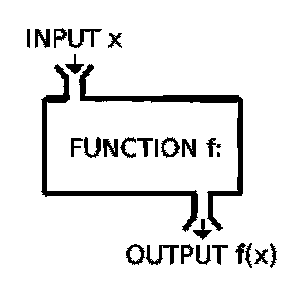

# 如何还原和反应

> 原文：<https://medium.com/hackernoon/how-to-redux-with-react-836ed6d85330>


Official redux logo from [https://github.com/reactjs/redux/tree/master/logo](https://github.com/reactjs/redux/tree/master/logo)

> 先决条件:读者已经知道 JavaScript 和 React。如果没有，请先阅读[这个](/prolanceer/how-to-be-a-frontend-engineer-tips-tricks-utility-belt-a69b2fea1124)。这是对 React 前端工程的更新。

根据[官方文档](https://redux.js.org/)， [Redux](https://hackernoon.com/tagged/redux) 是**可预测的**状态容器，用于 [JavaScript](https://hackernoon.com/tagged/javascript) 应用。

首先，让我们从一个为什么开始。它主要有三个方面:

1.  纯函数
2.  深度不可知的状态订阅
3.  易于测试

## 纯函数

**定义:**只对传入的参数进行操作且没有副作用的函数是纯函数。



在数学上，我们有`sin(x)`。在 JavaScript 中，我们有，

```
const sum = (a, b) => a + b;
```

因为`sum`函数只处理传入的输入，给定的参数是相同的，它将产生相同的输出，而不管我们调用它的次数或条件。

如在，`sum(4, 5)`将永远回到 9。一次又一次。没有失败。

就像`sin(x)`我们的`sum(x, y)`是**可预测的**。

## 如何适用于 redux？

Redux 基于这样一个理念，即应用程序状态应该只有一个真实的来源，无论是 UI 状态(如哪个选项卡是活动的)还是数据状态(如用户配置文件详细信息):

```
{
    first_name: 'John',
    last_name: 'Doe',
    age: 28',
}
```

所有这些数据都被 redux 保留在一个闭包中，redux 称之为`**store**`。它还为我们提供了创建该商店的配方，即`createStore(x)`。

`createStore`函数接受另一个函数`x`作为参数。传入的函数负责返回应用程序在该时间点的状态，然后保存在存储中。

这个传入的函数被称为`**reducer**`。

这是一个有效的(但不完全有用的)缩减函数:

```
export default function reducer(state={}, action) {
    return state;
}
```

Redux 有这个`actions`的概念。动作是一个普通的老式 JavaScript 对象，其形状如下:

```
{
    type: 'SOME_NAME',
    payload: 'SOME FREE FORM DATA'
}
```

例如，假设我们有一个微博站点，一个用户发布了一些内容。结果操作可能是这样的:

```
{
    type: 'Add_USER_POST',
    payload: {
        content: 'A quick brown fox jumped over the lazy dog',
    }
}
```

现在，这个动作被传递到`reducer`中，以根据`action`中传递的来得出更新后的状态。

为了处理它，让我们将我们的`reducer`更新为:

```
export default function reducer(state = {posts: []}, action) {
    switch (action.type) {
        case 'Add_USER_POST':
            return {
                ...state,
                posts: [
                    ...state.posts, 
                    {
                        content: action.payload.content,
                    }
                ]
            }; default:
            return state;
    }
}
```

首先，我们在默认状态中添加了一个默认属性`posts`，并用`[]`初始化它。

接下来，我们简单地添加了一个开启`action.type`的`switch-case`模块。因为我们的动作有一个类型`Add_USER_POST`，它将被我们的 reducer 的`switch-case`中的第一个 case 截获，它将返回一个由我们现有状态组成的新对象，并将新添加的 post 添加到 posts 数组中。

这个返回的对象将被添加到存储中。

这里需要注意的一点是，商店只能通过调度一个动作来更新。

你的 App 调度一个`action`，它被传入`reducer`；`reducer`返回状态的新实例；商店通知你的应用程序，它可以根据需要开始重新渲染。


`store`公开了 3 个函数:`dispatch`、`getState`、&、`subscribe`。

`dispatch`顾名思义，调度由 reducer 消耗的动作。

`getState`返回此时你的应用状态的快照。

`subscribe`接受每次修改/更新状态树时触发的回调函数。

这些由特定于 UI 库的绑定使用，以处理到应用程序桥的 redux。对于`React`，推荐绑定为`react-redux`。

假设我们有一个呈现帖子列表的`Posts`组件。我们是这样写的:

```
import React, { Component } from 'react';
import { connect } from 'react-redux';class Posts extends Component {
    render() {
        const posts = this.props.posts.map((post, i) => (
            <li key={i}>
                {post.content}
            </li>
        ));
        return (
            <h3>Posts</h3>
            <ul>
                {posts}
            </ul>
        )
    }
}const mapState = state => ({
    posts: state.posts,
});const mapDispatch = dispatch => ({});export default connect(
    mapState,
    mapDispatch
)(Posts);
```

正如您所看到的，组件`Posts`只是接收帖子列表作为道具，并按照接收到的内容进行渲染。

我们定义了两个函数:`mapState` & `mapProps`，并将它们作为回调传递给`connect`。

`connect`执行`getState`并将当前状态快照提供给`mapState`作为参数；

然后它将`dispatch`函数作为参数传递给`mapDispatch`，最后将`Posts`组件传递给由`connect(x, y)`调用返回的函数。

在内部，它订阅状态更改并将数据一直传递给组件，以查看是否需要重新呈现。

有人可能会说，对于一个简单的应用程序来说，这是太多的工作，单一的真实来源可以在一些顶级组件中以纯粹的状态反应来实现，并将其作为道具传递下去。

但是，随着应用程序的增长，您会添加数十个组件，并且每次都需要将数据从顶层根一直传递到叶组件。不用说，它会很快变得很麻烦。

Redux 允许我们从任何深度订阅状态树的任何部分。

## 深度不可知的状态订阅

正如我们已经看到的，我们的`Posts`组件可以简单地订阅商店中的`posts`属性。

`Posts`组件与其父组件完全没有关系；因为它可以在 n 级深度中，并且它的逻辑或者它的父/呈现组件的逻辑将不会改变。

假设您有一个呈现一个`SearchBar`的搜索特性，这个特性最终会呈现一组`SearchItems`组件。无论是`<SearchBar/>` & `<SearchItems/>`都可以直接订阅商店。

明天，可能需要将搜索移到`Posts`组件中，除了 CSS 的变化，组件层次结构方面，我们要做的就是剪切粘贴。


## 易于测试

因为 reducers 都是纯函数，所以当我们为它们编写单元测试时，不需要太多的努力。

只需传入`action`并期待返回一个状态快照。您的应用程序逻辑现在可以进行全面的单元测试，因此是防弹的。

乘坐 redux 在 [stackblitz](https://stackblitz.com/edit/learning-redux-1nkg) 转一圈。或者，在这里玩嵌入(向下滚动直到结束)。

感谢阅读。

如果你认为这是值得的，请鼓掌吧:)

在 LinkedIn[上找到我或者回复我的评论。](https://www.linkedin.com/in/rohanbagchi/)