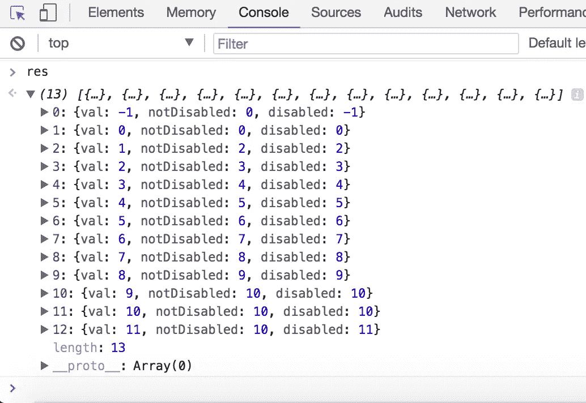

# 如何重构代码以提高可测试性

> 原文：<https://medium.com/hackernoon/how-to-refactor-unwieldy-untestable-code-4a73d75cb80a>

如何编写难以测试的糟糕代码？

对于**不可测试的代码**，有一些反模式是你应该**避免**编写的。这些是:

*   [代码](https://hackernoon.com/tagged/code)具有大量依赖于另一个不可读代码的条件行为。
*   根据相对于其他代码的执行顺序，为您提供不同结果的代码。
*   不同的代码负责设置相同的([全局](https://hackernoon.com/tagged/global))变量
*   依赖于一长串独立的评估和赋值的代码。

我曾经不高兴(或者高兴，因为它告诉我*糟糕的代码可以有多糟糕)试图证明包含所有这些反模式的代码的正确性。它是用 C++为一个特定的嵌入式系统应用程序编写的，我不打算深入讨论。但是我在 JavaScript 中重新创建了代码的要点，如下所示:*

## 糟糕、笨拙的代码

让我们先了解一下这段代码试图做什么。

`valIncrementer`函数接受一个名为`val`的参数，并返回`val+1`，但是有一些注意事项:

*   如果`val`是一个介于 0 和 10 之间的数字，那么函数返回`val+1`。
*   如果`val`在 0 到 10 的范围之外，那么如果`val`小于 0，函数将返回 0；如果`val`大于 10，函数将返回 10。
*   如果`disabled`标志被置位，那么函数只返回`val`而不改变它。

上面的代码不仅难以阅读，也很难测试。为了证明代码的正确性，您必须运行一组测试，看看对于不同的输入，`valIncrementer`函数给出了什么。至少，我们需要测试`val`何时是有效范围(即 0 和 10)之间的数字，以及小于 0、等于 0、等于 10 和大于 10 的边缘情况。

`res`等于以下:

糟糕、笨拙的代码给了我们正确的答案，但是不可能对处理整体逻辑的一个方面的代码的不同部分进行单元测试。例如，当你想让`val`增加时，你如何测试它是否增加？嗯，`nextVal`一开始被指定为`val+1`，但不保证会一直这样。你必须通过`firstStageSetter1`、`firstStageSetter2`和`secondStageSetter`来确保`nextVal`不会被重新分配到其他地方。

## 更好、更易测试的代码

这就是我如何重写糟糕、笨拙的代码，以提高代码的可维护性和可测试性。

请注意，与糟糕、笨拙的代码相比，我重写的代码要短得多。我的重构有两个指导原则:

*   **纯函数:**当一个函数是纯函数时，它不使用任何没有作为参数给出的东西来计算(没有全局状态)，也不修改任何给它的东西。纯函数总是给出一个新的副本(没有突变)。考虑纯函数的一个好方法是如果我给一个函数这个输入，我会得到相同的输出吗？如果答案是否定的，那么它可能不是一个纯粹的函数。
*   **解耦设计:**在你开始编码之前，想想如何把你要做的事情分解成一组简单的构件，每个构件做一件非常简单的事情。我的 better `valIncrementer`将其职责的各个方面委托给助手函数。它将*我应该做什么*的代码与*做这件事*的代码分开，这两个代码可以单独进行单元测试。

每个助手函数负责一个简单的任务，可以很短。它只关心自己的论点，不受外界发生的任何事情的影响。`valIncrementer`唯一的职责就是用一个 if 语句将所有这些函数联系在一起。

为什么我把`incrementedVal`做成一个单独的函数？我不需要为这样一个简单的功能。然而，假设这不仅仅是增加一个数字那么简单。假设这个操作需要访问数据库，并且可能有延迟和其他副作用。我们希望将非确定性代码与确定性代码分离开来。

## 为什么人们会编写笨拙的、不可测试的代码？

我认为这有两个原因:

*   **技术债:**大部分人都不打算写烂代码。随着时间的推移，越来越多的功能被添加进来。在更改之后重构代码通常是不可行的，尤其是当您的代码是一个 API 并且您的代码重写可能会破坏您的用户代码时。
*   **不良文化:**有时还存在管理压力和进度/财政约束，以最小化对“工作”的代码的其他部分的更改(在[中有许多其他常见的借口](https://henrikwarne.com/2014/09/04/a-response-to-why-most-unit-testing-is-waste/)，还有*不修复未损坏的*论点)。[这篇文章](https://movio.co/en/blog/migrate-Scala-to-Go/)指出:

> 事实证明，更大的灵活性导致开发人员编写了其他人难以理解的代码。很难决定一个人是应该为不够聪明理解不了逻辑而感到羞愧，还是对不必要的复杂性感到恼火。另一方面，在一些情况下，一个人会因为理解和应用对其他人来说很难的概念而感到“特别”。开发人员之间的这种聪明程度的差异对团队动态非常不利，而复杂性总是会导致这种情况。

如果您已经处于这种情况，那么请认识到，当您继续忽视代码重构和代码重写时，您正在增加技术债务，并且在某个点上，对其进行更改并确保其仍然有效的成本/时间超过了不重构的好处。那里有[资源](http://misko.hevery.com/code-reviewers-guide/)可以帮助你识别你的代码不可测试的症状以及如何重构的建议。很可能许多其他人也在和你一样的问题做斗争，所以有机会在一个开源的解决方案上发挥创造力并和同一生态系统中的其他开发者合作。

如果你刚刚开始一个项目，这里有一些指导方针:

1.  确保设计好您的代码，以考虑未来的修订。这意味着将代码的可维护性和可测试性作为一个设计目标，并在设计代码时考虑到代码在未来需要进行大量的修改来增加更多的功能。
2.  小心设计模式，例如面向对象编程。虽然面向对象编程迫使设计者经历一个广泛的规划阶段，使基线设计具有更少的缺陷，但它最近因其“高度结构化的物理环境，在这种环境中，事后的改变即使不是不可能的，也是极其昂贵的”，而受到了大量的抨击。乔·阿姆斯特朗在彼得·西贝的《工作中的 [*程序员*](http://www.codersatwork.com/) 中很好地总结了面向对象编程的问题:“面向对象语言的问题在于，它们随身携带着所有这些隐式环境。你想要一个香蕉，但你得到的是一只大猩猩拿着香蕉和整个丛林。”
3.  尽量避免复杂的依赖注入。依赖注入是一种[技术，通过允许客户端在编译时配置对服务的使用，将服务的客户端从服务的实现中分离出来。实际上，复杂的依赖注入意味着在为客户机完全配置服务之前，需要在构造函数中指定许多东西。依赖注入越复杂，行为与环境的耦合就越紧密，使得服务实现的独立测试更加困难。如果你的依赖注入变得太复杂，你总是可以把一个大的、复杂的服务分解成更小的、更简单的服务，它们有自己的依赖注入。](https://accu.org/index.php/journals/2403)

复杂的依赖注入的问题是，它可能导致“它在我的机器上工作”的现象，如下面这幅可爱的漫画所示。

[Derick Bailey’s Blog](https://derickbailey.com/2017/02/08/digging-into-the-works-on-my-machine-problem/)

## 感谢阅读！

如果你觉得这个故事很有趣，请鼓掌**👏**

这里有一些后续阅读，供那些有兴趣了解更多这方面知识的人参考:

*   [Mishko 指南:编写可测试代码](http://misko.hevery.com/code-reviewers-guide/)(也在 [PDF 版本](http://misko.hevery.com/attachments/Guide-Writing%20Testable%20Code.pdf))
*   [单元测试，如何编写可测试的代码以及为什么它很重要](https://www.toptal.com/qa/how-to-write-testable-code-and-why-it-matters)
*   [对为什么大多数单元测试都是浪费的回应](https://henrikwarne.com/2014/09/04/a-response-to-why-most-unit-testing-is-waste/)
*   [c++中依赖注入的功能替代方案](https://accu.org/index.php/journals/2403)
*   [面向对象编程和依赖注入](https://engineering.snagajob.com/dont-like-dependency-injection-898de93dc8d3)
*   [面向对象编程是一场代价高昂的灾难，必须结束](http://www.smashcompany.com/technology/object-oriented-programming-is-an-expensive-disaster-which-must-end)
*   [再见面向对象编程](/@cscalfani/goodbye-object-oriented-programming-a59cda4c0e53)