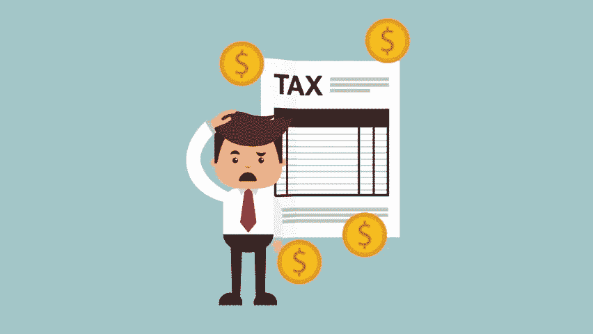

# 如何申报加密货币税

> 原文：<https://medium.com/hackernoon/how-to-report-cryptocurrency-on-your-taxes-d3b7d7da7d8c>

过去一年里，比特币的戏剧性涨跌和 T2 加密货币的爆炸性增长让许多交易者和爱好者想知道如何申报加密货币的税收。

这个问题变得相当棘手，因为在这个问题上有很多争论，但还没有明确的“这是你应该如何做事情”类型的指导。这篇文章深入到在你的税上报告你的密码交易背后的细节。如果你不太熟悉美国国税局目前如何对待加密货币，你应该在继续之前阅读我们详细的[加密税收指南](https://www.cryptotrader.tax/trading/the-traders-guide-to-cryptocurrency-taxes/)。

因此，如果你正在阅读这篇文章，你可能是一个密码交易员或热衷于为你的交易活动缴税的人。也许你有一个自动化交易策略，每个月进行成千上万的交易，现在你意识到你没有办法计算你真正的资本利得税债务是多少——不要担心我们在同一条船上。

但不管你的情况如何，你可能已经做了一些交易，希望能赚到一些钱，现在你想确保你合法地申报了所有的税收。你是怎么做到的？

# 第一步:计算你的资本收益

对于你做的每一笔交易，即使只是硬币对硬币的交易，你也需要知道一些事情。你需要知道你的成本基础(即密码的原始价值)，你需要知道交易时密码的公平市场价值。如果您不熟悉这些术语或它们如何应用于 crypto，请在继续之前阅读我们的指南[以复习资本收益、应税事件和所有与 crypto-tax 相关的内容。完成了吗？很好，我们继续。](https://www.cryptotrader.tax/trading/the-traders-guide-to-cryptocurrency-taxes/)

一旦你知道这两件事，计算你的资本收益就简单了。简单地从公平市场价值中减去成本基础。让我们看一个简单的例子来确定这是有意义的。

假设你购买了价值 100 美元的比特币，包括交易和经纪费。那 100 美元目前大约可以买到 0.01 个比特币。现在让我们假设两个月后你把你所有的 0.1 比特币换成了 0.16 以太。在这个交易的时候，0.1 比特币的价值已经上升，比你最初以 160 美元购买时的价值还要高。160 美元是公平市价，100 美元是你的成本基础。这使得你的资本收益等于 60 美元。

我知道你在想什么，在这个世界上，我怎么能对我过去一年做的每一笔交易都这样做呢？如果你没有保存详细的电子表格，这可能是一项不可能完成的任务。如果你遇到这个问题，简单地使用 [CryptoTrader 可以节省你很多时间。税](https://www.cryptotrader.tax/)。该软件将在几分钟内计算出你的资本利得负债，并为你提供一份可导出的报告(8949 表格)交给税务人员。

# 好了，我已经精确计算了我的资本收益，现在呢？

下一步是把国税局要求的报告你的资本收益的适当表格收集起来。

# 表格 8949 和 1040 附表 D

[附表 D](https://www.irs.gov/forms-pubs/about-schedule-d-form-1040-capital-gains-and-losses) 是你用来报告所有个人财产的资本损益的表格。这包括汽车、艺术品、收藏品、股票和债券，当然还有你的加密货币。这是您将最终报告您的加密交易活动的资本收益的表格；然而，在填写附表 D 之前，你必须在[8949](https://www.irs.gov/pub/irs-pdf/f8949.pdf)中详细说明你的所有交易。

为了正确地填写 8949，你需要知道那些你计算实际资本收益所需要的东西。

上图示例显示了 8949 上的一个条目的样子。在这个例子中，你已经卖出了 0.5 个比特币。你在 2017 年 7 月 16 日获得了比特币，并在 2017 年 12 月 17 日卖掉了它。您出售比特币的总收益为 9848.00 美元，您的成本基础为 970.00 美元。这导致您获得 8873.00 美元的收益(在 h 列中报告)。

继续以与上述示例相同的方式在此表格中列出您在该日历年的所有交易，以完成您的 8949。

如果您一年中有大量的交易，您可以使用 [CryptoTrader 自动创建这个 8949。税](https://www.cryptotrader.tax/)。

一旦你完成了你的 8949，你只需要把你的资本收益/损失的总和转移到表 D 表格上。这是报告过程的最后一步。在完成你的时间表 d 时，一定要记住短期资本收益和长期资本收益。

注意——如果您使用 TurboTax 等税务准备软件，您只需上传您创建的 8949 表格。你也可以把表格交给你的注册会计师或税务专家。

总的来说，这个过程并不复杂。跟踪你所有的加密货币交易和必要的数据。使用该数据正确填写 8949 表格。将 8949 的总收益转入你的 d 表。

你是否忘记在去年的纳税申报单上申报你的加密交易？如果是这样，一定要在这里 *查看我们关于修改您的纳税申报表* [*的文章。*](https://www.cryptotrader.tax/trading/what-to-do-if-you-forgot-to-report-your-crypto-trades-on-last-years-tax-return/)

*使用*[***CryptoTrader***](https://www.cryptotrader.tax)***轻松申报您的加密货币资本收益。*税**。

*原载于 2018 年 5 月 29 日*[*www . cryptotrader . tax*](https://www.cryptotrader.tax/trading/how-to-report-cryptocurrency-on-taxes/)*。*

[https://upscri.be/hackernoon/](https://upscri.be/hackernoon/)