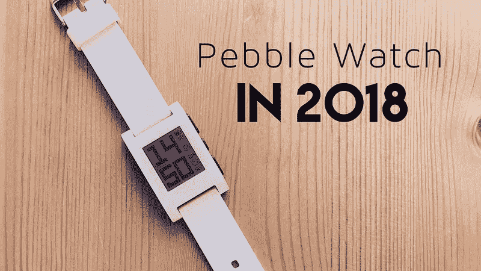

# 如何在 2018 年复兴一块 Pebble 手表

> 原文：<https://medium.com/hackernoon/how-to-revive-a-pebble-watch-in-2018-73ef52eb2e33>

几周前我卖掉了我的第一代 Apple Watch。由于它就在苹果的活动之前，我认为在我等待 Series 4 的时候，复活我的 Pebble watch 并与我的 iPhone 一起使用会很有趣。事情是这样的，Pebble 在 2016 年被 Fitbit 收购，并在今年早些时候停止了对这些旧设备的支持。经过一番研究，我发现了隧道尽头的光明；下面是我如何在 2018 年让一块 Pebble 手表起死回生。

如果你不熟悉的话，Pebble 是 2012 年 Kickstarter 活动中推出的一款智能手表，在一个多月的时间里达到了 1030 万美元。这款手表于 2013 年初开始发货，配有黑白记忆液晶屏，电池续航时间约为一周。

鉴于 Pebble 的领先优势，围绕这款小型设备创建了一个繁荣的生态系统。在 Apple Watch 或 Samsung Gear 等巨头开始销售之前的两年里，Pebble app store 上有 1000 多个应用程序和 watchfaces。

你可能会认为 Pebble 的设计很奇怪，但你可以忘记给它充电，它有很多很酷的应用程序:睡眠追踪器、健身追踪器，甚至是多米诺披萨追踪器。不管怎样，当苹果在 2015 年 4 月发布他们的竞争对手时，Pebble 最终被存放在我的衣柜里，并且一直放在那里……直到现在。

给设备加电是最简单的部分，电池经受住了时间的考验，只需要充满电就可以继续工作。我打开手表的时候，还是 2015 年。相同的应用程序和相同的用户界面，但不幸的是，天气和其他 Pebble 拥有的服务不再有服务器连接，[如预期的那样](https://dev.fitbit.com/blog/2018-01-24-pebble-support/)。

我进入 App Store，找到了官方的 Pebble 应用程序，它应该会保留在那里，直到未来的 iOS 更新打破了兼容性。这个应用程序没有做太多事情，它允许我将手表与手机配对，并控制基本设置。但是，如果我尝试加载一个新的手表表盘或应用程序会怎么样呢？不幸的是，这些服务现在已经不复存在了。

在宣布 Pebble 服务器的消亡后，一群充满激情的开发人员开始了一个项目，以创建一个新的后端来支持新的应用商店和相关服务。其结果是 Rebble Web Services (RWS)，考虑到 Pebble 的源代码不可用，这是一家令人印象深刻的企业。

因此，要将我的旧 Pebble 与新 RWS 连接起来，我只需按照[官方网站](https://rebble.io/)上的步骤操作即可。对于那些喜欢更直观的东西的人来说，还有一个很棒的[视频指南](https://youtu.be/8Z4Jtl_0UMw)几分钟后，我的鹅卵石准备好摇滚了！

这么多人关心 Pebble 的生态系统这一事实绝对值得一提，因为它为其他智能手表制造商提供了一个机会:一个真正开放的平台。Pebble 成功地创建了一个充满活力的生态系统，让应用程序的创建变得简单而有趣，但最重要的是，它给予开发者自由并照顾他们。

5 年后，Pebble 智能手表仍然是一款不错的可穿戴设备。如果你只关心在手表上接收电话通知和做一些轻量级的健身跟踪，你应该考虑在 Amazon.com 上花 50 美元左右买一个 Pebble。

最好的智能手表不一定是有更多应用或更多用户的智能手表，而是能更好地为你服务的智能手表。我希望这能帮助那些试图将生命带回到他们的小玩意中的人。

你喜欢这篇文章吗？ [**订阅**](https://geekonrecord.com/subscribe/) **通过邮件获取新帖。**

[查看伊万·罗德里格斯的所有帖子](https://geekonrecord.com/author/irodrisa/)

*原载于 2018 年 9 月 24 日*[*geekonrecord.com*](https://geekonrecord.com/2018/09/24/how-to-revive-a-pebble-watch-in-2018/)*。*