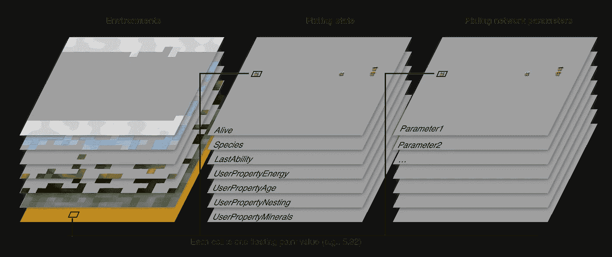

# 在 Pixling 世界的引擎盖下

> 原文：<https://medium.com/hackernoon/how-to-run-1m-neural-network-agents-at-60-steps-per-second-in-a-browser-183c6213156b>

这将是我正在建造的[人工](https://hackernoon.com/tagged/artificial)生命/进化模拟器/上帝模拟器 [Pixling World](https://pixling.world/) 的引擎盖下的一瞥。作为一个玩家，你扮演一个老派神的角色，他创造了他/她自己的世界，将一些生物(“精灵”)放入其中，然后给它们注入生命。你不能直接控制生物的行为，因为它是随着时间的推移通过真正的达尔文进化而进化的，但作为一个神，你可以给它们彼此互动以及与环境互动的能力。目标是创造让自己和他人着迷的世界。

当我在网上发布它的时候([发布在/r/javascript](https://www.reddit.com/r/javascript/comments/9d6r41/water_dynamics_in_my_evolution_simulator_built_in/) 和[发布在/r/proceduralgeneration](https://www.reddit.com/r/proceduralgeneration/comments/99vzan/a_demo_of_two_worlds_i_built_in_pixling_world_an/) )人们问我“它是如何工作的”，所以我想我应该在这篇博文中给出一个概述。首先我会对游戏做一个简单的概述，然后我会谈论神经[网络](https://hackernoon.com/tagged/network)进化是如何工作的，最后我会进入所有这些的技术实现。

# 游戏

对于不熟悉这个游戏的人来说，这是它的样子:

Playing around with water dynamics in Pixling World

有几点需要注意:

*   一个精灵是在世界网格中占据一个方格的单一生命形式。
*   每个像素都有一个控制它们行为的神经网络。
*   我目前可以在我的 GTX1070 笔记本电脑上以每秒 60 步的速度运行超过一百万个像素(尽管它是基于网络的)。
*   这是真正的达尔文进化。像素没有“目标”，谁传播得多，谁就传播得多。

我对这个项目感到兴奋的原因是因为我现在真的不知道像素行为的极限是什么。他们能进化到协作吗？交流？制定计划？创造复杂的文明？我真的不知道。玩家发布的世界中已经有一些很酷的进化行为，比如[捕食者和猎物](https://pixling.world/4KMC0sFCGkMpFOFlN3re)、[觅食和筑巢](https://pixling.world/2veeLnYmyS5pjv1p71cp)和[利用气味寻找物体](https://pixling.world/4aqKHYGbPflkTcZRRIENDB)(我创造了那个)。

Example of Pixlings that have evolved to find “apples” based on the green “smell” they emit

作为一名玩家，你可以建立自己的世界，并准确配置你希望你的精灵生活在什么样的世界。你定义环境，建立规则，并赋予你的像素能力。以下是玩家构建世界的样子:

Editing your world in Pixling World

一旦你有了你的世界的第一个版本，你就可以开始把小精灵放进去，看看它们会进化出什么样的行为。

# 神经网络进化是如何工作的？

正如我之前提到的，每个精灵都有一个独特的神经网络来控制它们的行为。对于那些不熟悉的人来说，神经网络是一种功能，它接受一些输入，通过一个数字矩阵运行它，并产生一个输出。在这种情况下，像素神经网络的输入，或者你可以称之为他们的“大脑”，是关于他们的环境和周围其他像素的信息。输出是一个决策；精灵下一步应该采取什么行动。

神经网络有所谓的“参数”或“权重”，它们精确地控制着它们处理输入的方式。这些参数只是一个大的数字阵列，因此，例如，一个大脑看起来像这样的像素:[5，3，9，2]可能在特定情况下产生“吃”的决定，而另一个具有参数[2，9，3，8]的像素可能在相同情况下产生“睡”的决定。这完全取决于他们的参数。

一开始，像素的参数是完全随机的，因此它们的行为也是随机的。然而，他们中的一些人通常会有一种行为，至少能让他们进食和繁殖。这是进化的种子。一旦你有一个可以繁殖的像素，它的孩子将继承父对象的参数，从而有相同的行为。

轻轻一扭；子对象的参数会被稍微随机调整。例如，具有参数[4，9，2，1]的父节点可以产生具有参数[4，8，2，1]的子节点。这个孩子的行为会和他的父母稍有不同。如果这种新行为在环境中被证明是有益的，这个孩子将比它的兄弟姐妹繁殖更多，因此这种行为将会传播。然后它的一个孙辈可能会有一个随机的变化，使它更好地适应在这个世界上生存，等等。这是达尔文进化论的基础。

最终，你会得到具有真正复杂和“有意义”行为的像素，所有这些都是从随机行为开始的。神经网络是所谓的“通用逼近器”，这意味着只要有足够的参数，理论上没有什么是他们做不到的。(也就是说，Pixling 世界中的网络相当小，所以不要担心，它们还不会成为有感知能力的人工智能:)

# 那么这是如何实现的呢？

在高层次上，游戏由存储游戏所有信息的“游戏状态”、获取游戏状态并将其向前推进一步的模拟引擎以及将游戏状态渲染到屏幕上的渲染器组成。在此之上是一个 UI(内置 React ),用于配置模拟和游戏状态。

最重要的是要知道，整个模拟运行在 GPU 上。这是它能同时快速模拟大量像素的主要原因；GPU 是为并行处理大量信息而构建的。

由于这不是一个非常传统的游戏，我选择从头开始写所有的东西。由于我想在 GPU 上运行它，所以我认为 WebGL 会和任何本地替代产品一样好(我实际上使用 WebGL2，因为 WebGL1 有点太受限制)。基本代码在 Typescript 中。

## 游戏状态

游戏状态看起来像这样:



整个状态由三个纹理组成:环境、像素化状态和像素化神经网络参数。环境由用户定义；每个环境一个切片。像素状态是预定义属性的组合，例如存活、物种和可持续性，以及用户为像素定义的任何属性，例如能量、天数、生日、数量等。如上所述，像素化神经网络参数是进化的。

每个纹理被存储为 WebGL 中的 R32F 2d 阵列纹理，即具有宽度、高度和深度以及每个纹理元素的单个浮点值的纹理。例如，单元(x: 15，y: 23)的岩浆环境值为 19.3。或者活动切片(索引 0)的(x: 4，y: 19)处的像素化状态纹理具有值 1，这意味着单元(x: 4，y: 19)的像素化被认为是活动的。

## 模拟

整个模拟循环如下所示:

```
Each step:
  - Run all user defined environment computations
  - Build inputs to neural networks
  - Run forward pass on neural networks
  - Run all user defined rules and abilities
  - Handle movement and reproduction
```

所有这些步骤都涉及到我所说的计算。一个计算将一些纹理和变量作为输入，对其运行一个函数，并将结果写入一个或多个纹理。然后另一个计算使用该输出作为其输入，依此类推；这个模拟基本上只是一个计算到计算的大图表。这些函数被实现为 GLSL 片段着色器(在 GPU 上按像素运行的函数)，因此整个计算在 GPU 上异步运行。

许多计算使用游戏状态作为输入和输出，但也使用了许多辅助缓冲区，例如，在执行神经网络的前向传递时保存结果，或者在下一次更新中跟踪如何移动像素。我在这篇博文的末尾放了一个计算示例，供感兴趣的人参考。

模拟可以非常快的一个核心原因是因为模拟不需要与 CPU 同步。计算结果被发送到 GPU 进行处理，但我们不需要等待结果，我们可以继续向 GPU 发送计算结果。由于调度计算的成本非常低，游戏大部分时间都是受 GPU 限制的。

计算是为用户定义的每个环境、规则和能力生成的(即，它从用户界面中定义的内容生成 GLSL 代码)。在游戏循环的开始，运行环境的计算。这些通常是像组合两个环境的值、运行模糊过滤器或向环境添加噪声之类的事情。

接下来运行神经网络。最初的输入被收集到一个大的向量中。然后运行网络的每一层，最后对网络的输出运行 argmax，以决定像素化的下一个动作是什么。我把密集层的代码放在附录里给感兴趣的人看。

在这之后，我运行所有的规则和能力，当然，对于每个像素，只有网络选择的能力被调用。

最后，我移动和克隆像素，表明他们想在能力和规则计算。因为这都是在着色器中并行完成的，所以有一堆代码来处理移动和再现。在高层次上，它首先通过计算我称之为“增量”的东西来工作，增量是每个单元的一个向量，它指示它“指向”的一个唯一的相邻单元。我还计算了这个的倒数。然后，这可以用来将像素从一个单元“移动”或“复制”到另一个单元，所有这些都是并行的。目前，增量都是随机的，但在未来，探索让神经网络决定其增量可能会很有趣(现在，它只能通过在“不行走”和“随机行走”之间切换来决定去哪里，这是可行的，因为它获得了关于它将要行走的位置的信息，正如在[苹果猎人示例](https://pixling.world/4aqKHYGbPflkTcZRRIENDB)中看到的那样，但可能会更快)。

## 翻译

一旦模拟运行了一个步骤(或者多个步骤，如果你在极限速度设置上)，我将结果渲染到屏幕上。渲染看起来像这样:

```
render:
  draw each environment that is under the Pixlings;
  draw the current selection rectangles;
  draw Pixlings;
  draw each environment that is over the Pixlings;
```

渲染或多或少只是覆盖整个屏幕的单个四边形(每个环境一个四边形，一个用于像素)，大多数工作发生在着色器中。这意味着屏幕上的每个像素都是独立于缩放级别或位置进行计算的，因此您可以获得非常流畅的缩放体验:

Zooming in and out on a fairly large map, on my MacBook Air.

## 抽样和指标

游戏的另一个重要方面是抽样和度量。取样是我用来记录世界上物种的；基本上，我会时不时地记录下整个游戏的状态，并找出谁是谁的后代。度量是通过运行“减少”计算来计算的，该计算采用纹理并将其大小减半，每个像素是其父四个像素的总和。重复这个过程，直到纹理足够小，可以相当快地移动到 CPU(这很昂贵，所以每 100 步才发生一次)。举例来说，这就是我计算人口的方法。

# 仅此而已！

关于 Pixling World，我还可以写更多的东西，但也许这足以提供一个粗略的概述。我也很兴奋地尝试向 Pixling World 添加许多东西: [LSTMs](https://en.wikipedia.org/wiki/Long_short-term_memory) (有记忆的 Pixlings 会很酷)，一种让 Pixlings“看到”更多世界并更好地控制他们运动的方式，一些更像游戏的东西，如物品和特征，人工训练他们的神经网络(也许控制一个并将其用于 [backprop](https://en.wikipedia.org/wiki/Backpropagation) )等等。如果有人对 Pixling 世界的任何特定领域感兴趣，或者对如何推进它有建议，我洗耳恭听；在这里或 reddit 帖子上发表评论。

最后，如果你有兴趣尝试这款游戏，你可以登录[https://pixling . world](https://pixling.world)(alpha 阶段，所以期待一些奇怪的错误)。

感谢阅读！
/弗雷德里克

(要获得 Pixling World 的新闻和更新，你可以在 Twitter 和 Reddit 上关注这个项目。)

# 附录

## 挑战:像素战场

在准备这篇文章的过程中，我一直在开发一个世界，我希望这个世界能展示一些有趣的行为，但是比起完成它，我意识到把它作为一个“挑战”可能更有趣。所以对于任何人来说；这里有一个世界，你可以试着看看你是否能完成:[https://pixling.world/4YUmyd5eZUgzPVHW73Uvk6](https://pixling.world/4YUmyd5eZUgzPVHW73Uvk6)(公平的警告:我不知道是否有可能完成)

## 计算示例

这将获取神经网络(brainRes)的输出，计算其 argmax 并将其存储在 cellProperties(像素化状态)中。因为它从 cellProperties 中读取和写入，所以它是双缓冲的，并且结果被自动复制回后台缓冲区。

```
// GLSL code for this computation:in vec2 texcoord;
out vec4 out_value;uniform sampler2DArray brainOutputs;
uniform sampler2DArray cellProperties;void main() {
  float maxv = texture(brainOutputs, vec3(texcoord, 0)).r;
  int maxi = 0;
  for (int i=1; i < ${abilitySlotsSize}; i++) {
    float val = texture(brainOutputs, vec3(texcoord, i)).r;
    if (val > maxv) {
      maxv = val;
      maxi = i;
    }
  }
  float ability = texture(cellProperties, vec3(texcoord, ${abilititySlotsStart} + maxi)).r;
  out_value = vec4(ability, 0.0, 0.0, 1.0);
}// Using this computation in the app:computeCopyBack(
  this.copyMultiLayer,
  this.computations.abilitiesArgmax,
  this.config.worldSize,
  outputs2darray(
    this.state.textures.cellProperties[0],
    FixedCellProperties.InvokingAbility, 1),
  this.state.textures.cellProperties[1],
  {
    texture2darrays: {
      brainOutputs:  this.state.textures.brainRes[this.state.brainResRW.read],
  cellProperties: this.state.textures.cellProperties[1]
  }
});
```

## 密集层代码

该代码生成一个着色器，可以同时计算网络中多个节点的输出(最多可达 maxColorAttachments)。

```
return multilayerShaderSource(maxColorAttachements,
  `
  uniform sampler2DArray inputs;
  uniform sampler2DArray weights;
  uniform int layerWeightsOffset;
  uniform bool activation;
  uniform int outputSize;
  #define inputSize ${inputSize}
  `,
  `
  float inputVals[inputSize];
  for (int i=0; i < inputSize; i++) {
    inputVals[i] = texture(inputs, vec3(texcoord, i)).r;
  }
  `,
  i => `
    float res = 0.0;
    // inputLayer is actually the layer in the output
    int weightsOffset = layerWeightsOffset + inputLayer * inputSize;
    for (int i=0; i < inputSize; i++) {
      float weightVal = texture(weights, vec3(texcoord, weightsOffset + i)).r;
      res += inputVals[i] * weightVal;
    }
    float biasVal = texture(weights, vec3(texcoord, layerWeightsOffset + outputSize * inputSize + inputLayer)).r;
    res += biasVal;
    if (activation) {
      res = max(res, 0.0);
    }
    out_values[${i}] = vec4(res, 0.0, 0.0, 1.0);
  `
);
```