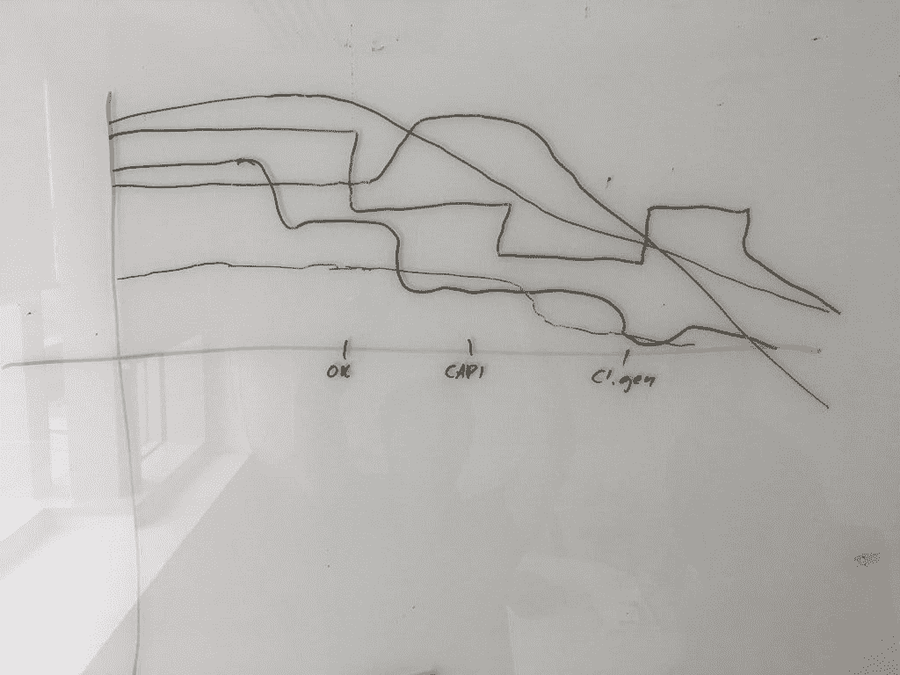

# 如何举办回顾展

> 原文：<https://medium.com/hackernoon/how-to-run-a-retrospective-b48da260b356>

我喜欢做的事情之一是进行回顾。我知道，我有点怪。没有人喜欢开会。嗯，这是[敏捷](https://hackernoon.com/tagged/agile)中的一次重要会议。为什么？因为回顾会让你的团队反思上一次冲刺，做出改变。这些可以是任何变化:过程、代码、度量等等。有了这些改变，你可以试验一下，看看哪些对你的团队有用，哪些没用。这就是敏捷的意义所在——能够改变和应对改变。

# 什么是回顾展？

回顾是对你之前完成的冲刺或工作的回顾。你想深入探究事情发生的原因，以及如何继续(好的)行为和停止(坏的)行为。这对你的团队来说是一个重组和联系的机会。回顾不仅仅是关于工作——它们是关于团队的凝聚力和让每个人畅所欲言的伟大文化。

# 你如何办一个回顾展？

最基本的回顾是你问以下问题:

*   什么进展顺利？
*   什么不顺利？
*   为什么？

这三个问题是一个开始。你将了解什么在伤害团队，你可以更深入地去解决问题。通过回顾，你可以推动敏捷过程的变化。可能有人说沟通不顺利。你需要问为什么。答案可能是因为比尔不知道桑德拉已经修复了一个 bug，所以他们加倍了工作。然后你又问为什么。因为桑德拉周二生病了，所以她错过了《起立鼓掌》，也没有给出更新。所以，现在你知道问题了。如何解决这个问题，取决于你自己。

在回顾展中，你可以玩很多“游戏”。我知道的一些是:“疯狂，高兴，悲伤”，“开始，停止，继续”，“喜欢，学习，缺乏，渴望”，和“爱，喜欢，讨厌”等。这些游戏旨在让你的团队畅所欲言。例如:

# 疯狂，高兴，悲伤

你将在[白板](https://hackernoon.com/tagged/whiteboard)上有三栏。使用便利贴，这样任何人都不会有遵从的压力。在复古开始时，每个人都有五分钟时间写下他们生气、高兴或悲伤的事情。

*   你在生什么气？
*   你难过什么？
*   你高兴什么？

你会发现也许有些人写的是个人原因。也许有人会写他们很难过，因为他们分手了。你知道如果他们这样写，他们相信你和你的团队。大多数情况下，你会发现人们写道，他们很高兴终于推出了这个庞大的特性——或者他们很生气构建服务器花了 20 分钟。这些都是你可以用来改进你的过程和在你的敏捷团队中创造变化的东西。

# 我如何办一个回顾展

目前我倾向于坚持基本问题。哪些进展顺利，哪些进展不顺利。我也喜欢做一个快乐图表来感受一下冲刺的过程。

# 什么是幸福图表？

这是一个你可以在白板(或 A3 纸上)上画的图表。首先你画轴。我喜欢做下面这样的事情。这里你可以看到 y 轴是快乐，x 轴是时间(在冲刺阶段)。你的团队可以标出对他们来说重要的点，以粗略估计是什么导致了他们的改变。

你可以看到，虽然团队是快乐的，但每个人在冲刺阶段的快乐都减少了。然而，没有人不开心——我们只是不像开始冲刺时那么开心了。有了这些数据，你就可以探究人们变得快乐或不快乐的原因。我发现这很方便，因为你可以衡量整个团队，如果你想匿名的话。你可以比较短跑，检查你是否为你的团队带来了进步。

# 回顾是为每个人准备的

你绝对应该抽时间回顾一下。您需要能够回顾您的 sprint，并与您的团队一起评估哪些地方可以改进。但是注意:这是一个团队练习。如果你是团队领导或经理，你不能决定团队应该改进或关注什么。事实上，应该由另一个人(来自另一个团队)来主持会议。我发现这是最好的帮助分离关注点的方法，因为这样团队领导就变成了团队的一员，而不是决定复古的方向。我期待听到你如何进行回顾，以及你如何给你的团队带来改变。

*原载于 2018 年 4 月 9 日*[*www . alexaitken . NZ*](https://www.alexaitken.nz/blog/how-to-run-a-retrospective/)*。*