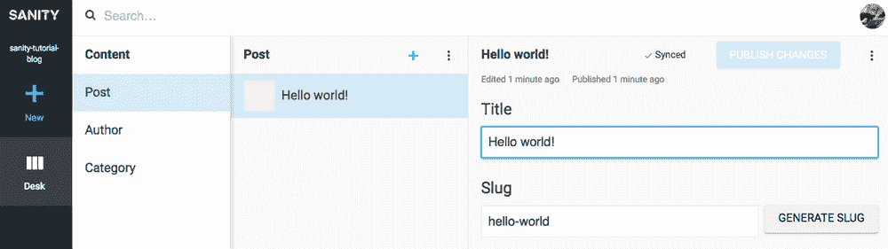
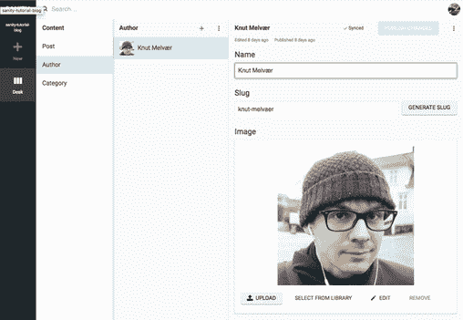
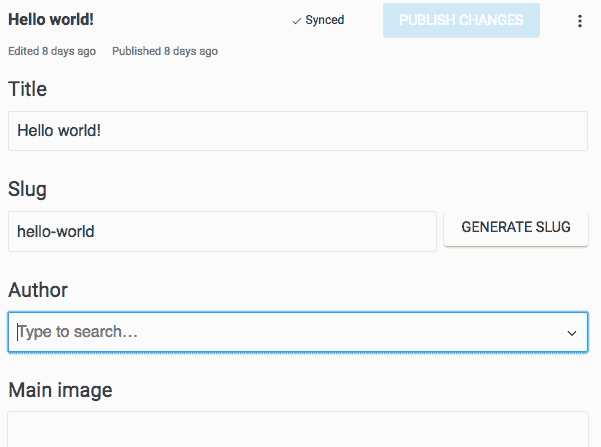
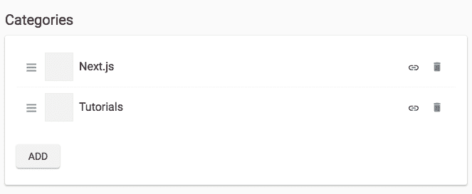
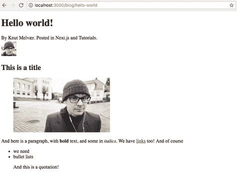

# 如何用 React 和 Next.js 运行一个健全的博客

> 原文：<https://medium.com/hackernoon/how-to-run-a-sanity-backed-blog-with-react-and-next-js-805f4b466413>

## 有时候你只是需要一个博客。那么为什么不用一些闪亮的东西来构建它呢，比如 Sanity、React 和 Next.js？


[有时候你只需要一个博客。虽然有大量的博客平台，但有很好的理由让你的博客内容与你的其他内容一起存在，无论是文档(就像我们的情况)，产品，投资组合还是其他什么。博客的内容模型，或者说数据模式，也是一个简单的起点，可以让你开始制作一些无头的东西，有着](http://foo.bar/)[的健全性](https://hackernoon.com/tagged/sanity)和一个分离的前端。

在本教程中，我们将使用 Sanity 作为内容后端，使用基于 React 的框架 Next.js 来呈现网页。

如果您不想输入以下所有内容，您也可以:

👉 [**查看 Github 上的代码**](https://github.com/sanity-io/sanity-blog-tutorial) **👈**

# 1.安装 Sanity 和预配置的博客模式

如果您还没有这样做，请使用 npm 安装 Sanity 命令行(CLI)工具。

```
npm i -g @sanity/cli.
```

这允许您在项目文件夹中运行`sanity init`命令，事实上，这是下一步。你将被要求在 Google 或 Github 上创建一个账户。之后，您可以创建一个新项目，这时会要求您选择一个项目模板。选择博客模式模板。首先，您需要为您的项目和数据集命名(如果您需要一个数据集用于测试，您可以添加更多的数据集)，并为您想要存储 content studio 文件的位置选择一个路径。

```
$ Select project to use: Create new project 
$ Informal name for your project: sanity-tutorial-blog 
$ Name of your first data set: production 
$ Output path: ~/Sites/sanity-tutorials/blog 
$ Select project: template Blog (schema)
```

安装完成后，您可以运行`sanity start`来启动 Content Studio，在这里您可以开始编辑您的内容。一旦点击发布，这些内容将立即同步到云中，并通过 API 提供。通过运行`sanity deploy`，你将上传这个工作室，并让那些有访问权限的人可以在网上使用它(你可以通过导航到 [manage.sanity.io](https://manage.sanity.io/) 来添加用户)。

—


**明白了** 您可以继续操作并使您的数据集私有，但是如果您这样做，您需要在 [manage.sanity.io](https://manage.sanity.io/) 上为自己创建一个令牌，并将其添加到下面的客户端配置中。

—

您可以对存储在项目文件夹中的模式做很多事情，但是这是另一个教程的内容。现在，我们只想让我们的博客运行起来！

# 2.安装 Next.js 并让它运行

Next.js (由牛逼公司 [Zeit](https://zeit.co/) 开发)提供了一个简洁的设置，用于制作基于 React 的网页，在第一次请求时提供服务器渲染，以及许多其他有用的功能。如果你已经习惯了 [React](https://hackernoon.com/tagged/react) ，或者已经尝试过 create-react-app，这应该不难上手。

为您的前端文件创建一个文件夹，并运行`npm init`为您的项目创建一个 package.json 文件。然后安装 Next.js 依赖项

```
npm install --save next react react-dom
```

并将以下内容添加到 package.json 中:

```
{ 
  "scripts": { 
    "dev": "next", 
    "build": "next build", 
    "start": "next start"
  }
}
```

Next.js 根据您在文件系统中的位置进行路由。因此，如果你添加一个名为`pages`的文件夹，并添加`index.js`，它将成为你网站的首页。同样，如果你在`/pages`中添加`about.js`，一旦你启动项目，这将显示在`[localhost:3000/about](http://localhost:3000/about)`上。为了确保一切就绪，尝试将以下代码添加到`pages/index.js`，并在 shell 中键入`npm run dev`:

```
const Index = (props) => <div>Hello world!</div> export default Index
```

现在，如果你在浏览器中前往`[localhost:3000](http://localhost:3000/)`，你应该有一个对世界的问候。

# 3.制作动态页面模板

到目前为止一切顺利，但现在是有趣的部分:让我们从 Sanity 中获取一些内容，并在 React 中呈现出来。首先安装连接到 Sanity API 所需的依赖项:`npm install @sanity/client --save`。在根前端文件夹中创建一个名为`client.js`的新文件。打开文件，放入以下内容:

```
import sanityClient from '@sanity/client'
export default sanityClient({
  projectId: 'your-project-id',
  dataset: 'production',
  useCdn: true
})
```

为每个新的博客条目添加一个新文件是不切实际的。甚至是一场争论。因此，让我们制作一个页面模板，使我们能够使用来自 Sanity 的 URL slugs。不幸的是，Next.js 没有开箱即用的动态页面。为了解决这个问题，我们必须添加一些服务器代码。让我们重用来自`nextjs/examples`的代码，并使用以下代码在根文件夹中添加一个`server.js`文件:

```
const { createServer } = require('http')
const { parse } = require('url')
const next = require('next')
const pathMatch = require('path-match')const port = parseInt(process.env.PORT, 10) || 3000
const dev = process.env.NODE_ENV !== 'production'
const app = next({ dev })
const handle = app.getRequestHandler()
const route = pathMatch()
const match = route('/blog/:slug')app.prepare().then(() => {
  createServer((req, res) => {
    const { pathname, query } = parse(req.url, true)
    const params = match(pathname)
    if (params === false) {
      handle(req, res)
      return
    }
    // assigning `query` into the params means that we still
    // get the query string passed to our application
    // i.e. /blog/foo?show-comments=true
    app.render(req, res, '/blog', Object.assign({}, query, params))
  }).listen(port, err => {
    if (err) throw err
    console.log(`> Ready on [http://localhost:${port}`](http://localhost:${port}`))
  })
})
```


**明白了**

如果您对`server.js` 或`package.json`进行更改，您必须重启`npm run dev`

您还应该运行`npm install http url path-match --save` 以获得必要的依赖项，并将`package.json`中的脚本部分更改为:

```
{ 
  "scripts": { 
    "dev": "node server.js",
    "build": "next build",
    "start": "NODE_ENV=production node server.js" 
  } 
}
```

您的前端文件夹现在应该如下所示:

```
~/blog/frontend
$ tree -I node_modules
.
├── client.js
├── package-lock.json
├── package.json
└── pages
    ├── blog.js
    └── index.js
├── server.js
1 directory, 6 files
```

Next.js 附带了一个名为`getInitialProps`的特殊函数，在`/pages`中呈现模板之前，调用该函数并向 react 组件返回道具。这是获取页面所需数据的绝佳位置。


**抓住你了**

`getInitialProps`只对 pages 文件夹中的文件*起作用，并用于路由，也就是说，它不会被包含在这些页面中的 react 组件调用。[阅读 Next.js 文档了解更多信息。](https://github.com/zeit/next.js/#user-content-fetching-data-and-component-lifecycle)*

有很多不同的方法可以编写 react 页面组件，这只是一个简单的例子，可以让你更容易上手。将以下内容放入 blog.js。这里我们将 slug 设置为标题，只是为了在添加从 Sanity 获取内容的代码之前测试代码是否有效:

```
const Post = ({ title = 'No title' }) => (
  <div>
    <h1>{title}</h1>
  </div>
)Post.getInitialProps = ({ query: { slug = '' } }) => { 
  const title = slug
  return { title }
}export default Post
```

如果你转到`localhost:3000/blog/whatever`，你现在应该看到“whatever”作为 H1 打印在页面上。

# 4.从理智中获取一些内容

我们现在已经为 Next.js 设置了一个用于首页的模板(index.js)和一个自定义服务器，该服务器使 blog.js 模板可以将/blog/下的 slug 作为查询。现在有趣的部分开始了，让我们给这个组合增加一些理智:

```
import client from '../client'const BlogPost = ({ title = 'No title' }) => (
  <div>
    <h1>{title}</h1>
  </div>
)BlogPost.getInitialProps = async ({ query: { slug } }) => {
  const { title } = await client.fetch('*[_type == "post" && slug.current == $slug][0]', { slug })
  return { title }
}export default BlogPost
```

我们使用 async/await，因为我们正在进行异步 API 调用，这使得代码更容易理解。`client.fetch()`接受两个参数:[一个查询](https://www.sanity.io/docs/data-store/how-queries-work)和一个带有参数和值的对象。


**亲提示**

本教程中的 GROQ 语法可以这样理解:

`*`👈选择所有文档

`[_type == 'post' && slug.current == $slug]`👈将所选内容向下过滤到类型为“post”的文档，以及那些与我们在参数中的 slug 相同的文档

`[0]`👈选择列表中的第一个也是唯一一个

为了让前端服务器真正从 Sanity 获取数据，我们必须将其域添加到 [CORS 设置](https://www.sanity.io/docs/front-ends/cors)。换句话说，我们必须将`localhost:3000`(以及最终你的博客所在的域名)添加到 Sanity 的 CORS 源设置中。如果您在 shell 中输入`sanity manage`,您将在浏览器中看到该项目的设置。导航到设置并添加`http://localhost:3000`作为新的原点。

现在，你可以创建并发布一个至少有一段文字和一个标题的帖子:



如果你向世界致意，世界最终也会向你致意

转到[http://localhost:3000/Hello-world](http://localhost:3000/hello-world)并确认 H1 拼写为“Hello world！”。现在，您已经成功地将前端与理智连接起来。🎉

# 5.添加作者和类别署名

在 Content Studio 中，您会发现，您可以为作者和类别添加条目。去添加至少一个有图片的作者。



我

回到你的博客文章，在作者栏附上这个作者，像这样:



发布更改，然后回到代码编辑器。我们刚刚做的是*引用*一个来自博客帖子的作者。引用是健全性的一个强大部分，它使得跨类型连接和重用内容成为可能。如果*检查*您的块文档(`Ctrl + alt/opt + i`)，您会看到该对象看起来像这样:

```
"author": {
  "_ref": "fdbf38ad-8ac5-4568-8184-1db8eede5d54",
  "_type": "reference"
}
```

如果我们现在只取出了 author 变量(`const { title, author } = await client.fetch('*[slug.current == $slug][0]',{ slug })`)，这就是我们将得到的内容，在这种情况下这对我们不是很有用。这就是 GROQ 中的*投影*派上用场的地方。 [Projections 是 GROQ](https://www.sanity.io/docs/data-store/query-cheat-sheet#object-projections) 的一个强大特性，允许我们指定 API-response 来满足我们的需求。

```
import client from '../client'const BlogPost = ({ title = 'No title', name = 'No name' }) => (
  <div>
    <h1>{title}</h1>
    <span>By {name}</span>
  </div>
)BlogPost.getInitialProps = async ({ query: { slug } }) => {
  const document = await client.fetch('*[_type == "post" && slug.current == $slug][0]{title, "name": author->name}', { slug })
  return document
}export default BlogPost
```

在这里，我将投影`{title, "name": author->name}`添加到我们的查询中。在这里，我指定我希望在 API 调用中返回文档中的什么内容。我们需要为作者姓名创建一个键，并使用箭头`->`跟踪对作者文档上 name-property 的引用。换句话说，我们要求 Sanity 遵循`_ref`下的 id，并从该文档中返回名为`name`的变量的值。

让我们试着对类别做同样的事情。首先，在 Content Studio 中创建至少两个类别。我给 *Next.js* 加了一个，给*教程*加了一个。



将类别添加到您的博客文章中

现在我们的博客文章中有了一系列对类别的引用。如果您在文档检查器中取一个峰值，您会看到这些显示为作者条目，带有`_ref` -id 的对象。所以我们也必须使用投影来得到这些。

```
import client from '../client'const BlogPost = ({ title = 'No title', name = 'No name', categories = [] }) => (
  <div>
    <h1>{title}</h1>
    <span>By {name}.</span>
    {categories && (
      <ul>Posted in
        { categories.map(category => (
          <li key={category}>{category}</li>
        ))}
      </ul>
      )
    }
  </div>
)BlogPost.getInitialProps = async ({ query: { slug } }) => {
  const document = await client.fetch('*[_type == "post" && slug.current == $slug][0]{title, "name": author->name, "categories": categories[]->title}', { slug })
  return document
}export default BlogPost
```

类别的投影与 author 非常相似，唯一的区别是我在关键类别上加了方括号，因为这是一个引用数组。

但是我们也想把作者的照片添加到署名中！Sanity 中的图像和文件资产也是引用，这意味着如果我们要获得作者图像，我们首先必须遵循对作者文档和图像资产的引用。我们可以通过访问`"imageUrl": author->image.asset->url`直接检索 imageUrl，但是这里使用我们制作的[图像 Url 包](https://www.sanity.io/docs/front-ends/presenting-images)更容易。用`npm i --save @sanity/image-url`在前端工程中安装包。它获取图像对象并确定从哪里获取图像，这使得使用焦点特征等变得更加容易。

```
import client from '../client'
import imageUrlBuilder from '[@sanity/image-url](http://twitter.com/sanity/image-url)'
const builder = imageUrlBuilder(client)function urlFor(source) {
  return builder.image(source)
}const BlogPost = ({ title = 'No title', name = 'No name', categories = [], authorImage = {} }) => (
  <div>
    <h1>{title}</h1>
    <span>By {name}.</span>
    {categories && (
      <ul>Posted in
        { categories.map(category => (
          <li key={category}>{category}</li>
        ))}
      </ul>
      )
    }
    <div>
      
    </div>
  </div>
)BlogPost.getInitialProps = async ({ query: { slug } }) => {
  const document = await client.fetch(`*[_type == "post" && slug.current == $slug][0]{
      title,
      "name": author->name,
      "categories": categories[]->title,
      "authorImage": author->image
    }`, { slug })
  return document
}export default BlogPost
```

放入图像 URL 构建器的代码行后，我们可以在`urlFor()`函数中发送来自 Sanity 的图像对象，并在不同的方法(例如`.width(50)`)后面添加`.url()`-方法。

# 6.添加富文本内容

如果没有对文本内容的强大支持，一个博客就没有意义了。Sanity 中的富文本是以一种允许我们在许多不同的上下文中使用它的方式构建的:从浏览器中的 HTML 到语音界面中的语音实现。关于块内容和它的可扩展性有很多要说的，但在本教程中，我们将只使用包[块内容反应](https://github.com/sanity-io/block-content-to-react)附带的现成特性。用`npm install --save @sanity/block-content-to-react`安装。

```
import BlockContent from '[@sanity/block-content-to-react](http://twitter.com/sanity/block-content-to-react)'
import imageUrlBuilder from '[@sanity/image-url](http://twitter.com/sanity/image-url)'
import client from '../client'
const builder = imageUrlBuilder(client)
function urlFor(source) {
  return builder.image(source)
}
const BlogPost = ({ title = 'No title', name = 'No name', categories = [], authorImage = {}, body = [] }) => (
  <div>
    <h1>{title}</h1>
    <span>By {name}.</span>
    {categories && (
      <ul>Posted in
        { categories.map(category => (
          <li key={category}>{category}</li>
        ))}
      </ul>
      )
    }
    <div>
      
    </div>
    <BlockContent
      blocks={body}
      imageOptions={{w: 320, h: 240, fit: 'max'}}
      projectId={client.clientConfig.projectId}
      dataset={client.clientConfig.dataset}
    />
  </div>
)BlogPost.getInitialProps = async ({ query: { slug } }) => {
  const document = await client.fetch(`*[_type == "post" && slug.current == $slug][0]{
      title,
      "name": author->name,
      "categories": categories[]->title,
      "authorImage": author->image,
      body
    }`, { slug })
  return document
}export default BlogPost
```

我们将 react-component 作为`BlockContent`导入，并从 post-document 获取主体。我们将主体作为`blocks-prop`发送，并添加`projectID`和来自`client-config`的数据集，以便让`BlockContent`组件知道从哪里获取可能出现在富文本字段中的图像。

我还加了一个道具叫`imageOptions`，控制图片默认输出。就是这样！您可以[定制不同元素的输出，甚至通过发送我们称之为“序列化器”的东西来添加您自己的定制块类型](https://github.com/sanity-io/block-content-to-react)——我们将在另一篇博客文章中介绍这些。



如果一切顺利，您应该有一个基本的博客模板

本教程到此结束！当谈到为一个非常常见的内容设置编写前端层时，我们现在已经涉及了很多内容，但是仅仅涉及了我们可以通过结合使用 Sanity 和 React 来完成的功能和漂亮的事情的冰山一角。

您可以从 GitHub 下载[示例项目，并随时向我们询问关于](https://github.com/sanity-io/sanity-blog-tutorial) [Slack](https://slack.sanity.io) 的问题，或者您可能找到我们的其他方式。

*最初发布于*[*www . sanity . io*](https://www.sanity.io/blog/build-your-own-blog-with-sanity-and-next-js)*。*