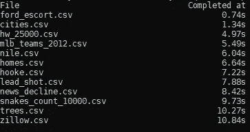
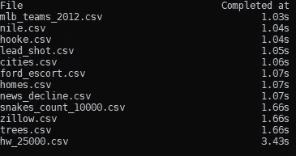

# 如何用 Python 3.5 并行运行异步 web 请求(没有 aiohttp)

> 原文：<https://medium.com/hackernoon/how-to-run-asynchronous-web-requests-in-parallel-with-python-3-5-without-aiohttp-264dc0f8546>


最近在我的工作场所，我们的 IT 团队终于将我们的分布式 Python 版本升级到了 3.5.0。虽然这是对 2.6 的巨大升级，但这仍然伴随着一些成长的烦恼。不幸的是，Python 3.5.0 不满足一些流行库的一些最低要求，包括 [aiohttp](https://aiohttp.readthedocs.io/en/stable/) 。

尽管有这些限制，我仍然需要编写一个脚本来调用数百个。csv 文件并操作数据。Python 本身不是事件驱动的，也不是天生异步的(像 NodeJS)，但是仍然可以达到同样的效果。这篇文章将有助于详述我所学到的东西，同时也展示异步操作的好处。

**免责声明:**如果你有更高版本的 Python 可用(3.5.2+)，我强烈推荐你改用 aiohttp。这是一个非常健壮的库，是解决这类问题的好方法。网上有很多教程详细介绍了如何最好地使用这个库。

# 假设

这篇文章做了如下假设:

*   您已经熟悉 Python 及其大部分语法
*   您已经熟悉了基本的 web 请求
*   您对异步操作有一个模糊的概念

如果你只是在寻找解决方案，向下滚动到底部，完整的代码已经公布。尽情享受吧！

# 设置

在开始之前，确保您的机器上安装了[请求](http://docs.python-requests.org/en/master/)。最简单的安装方法是在终端中键入以下命令:

```
$ python -m pip install requests
```

或者，如果您没有管理权限，可以使用以下命令安装该库:

```
$ python -m pip install requests --user
```

# 错误的方法:同步请求

为了展示我们的并行方法的好处，让我们首先来看看以同步的方式处理问题。我还将概述代码中发生了什么。最终，我们希望能够对包含。csv 文件，并测量读取其中的文本所需的时间。

我们会下载多个。来自[https://people.sc.fsu.edu/~jburkardt/data/csv](https://people.sc.fsu.edu/~jburkardt/data/csv/)/的不同大小的 csv 文件，为我们的例子提供了大量的数据。

作为免责声明，我们将使用来自`requests`库的`Session`对象来执行我们的 GET 请求。

首先，我们需要一个执行 web 请求的函数:

这个函数接受一个`Session`对象和。csv 文件，执行 web 请求，然后在响应中返回文本。

接下来，我们需要一个函数，它可以有效地循环我们想要的文件列表，并测量执行请求所需的时间:

这个函数创建我们的`Session`对象，然后遍历每个对象。csv 文件在`csvs_to_fetch`列表中。一旦`fetch`操作完成，测量的时间就会被计算出来并以一种易于阅读的格式显示出来。

最后，我们的`main`函数将是简单的(目前如此),并调用我们的函数:

一旦我们将所有这些放在一起，下面是我们的同步示例的代码:

让我们看看运行这个脚本的结果:



Synchronous example. Notice how each operation doesn’t start until the last one is completed

谢天谢地，我们可以通过 Python 3 的内置`asyncio`库极大地提高这个性能！

# 正确的方法:异步地一次执行多个请求

为了让这个工作，我们将不得不返工我们现有的一些功能。从`fetch`开始:

接下来，我们需要使我们的`get_data`函数异步:

这段代码现在将为每个线程创建多个线程。csv 文件，并对每个需要下载的文件执行`fetch`函数。

最后，我们的`main`函数需要一点小调整来正确初始化我们的异步函数:

现在，让我们运行新代码，看看结果:



Asynchronous example. Notice how the files are not being obtained in order.

有了这个小小的改变，所有的 12 个。csv 文件的下载时间从 3.43 秒缩短到 10.84 秒。下载时间缩短了近 70%。

# 异步代码

我希望您喜欢这篇文章，并且可以将这些技能用于任何需要旧版本 Python(或者没有那么多依赖)的项目。尽管 Python 可能没有直接的 async / await 模式，但要获得惊人的结果并不困难。

尽情享受吧！