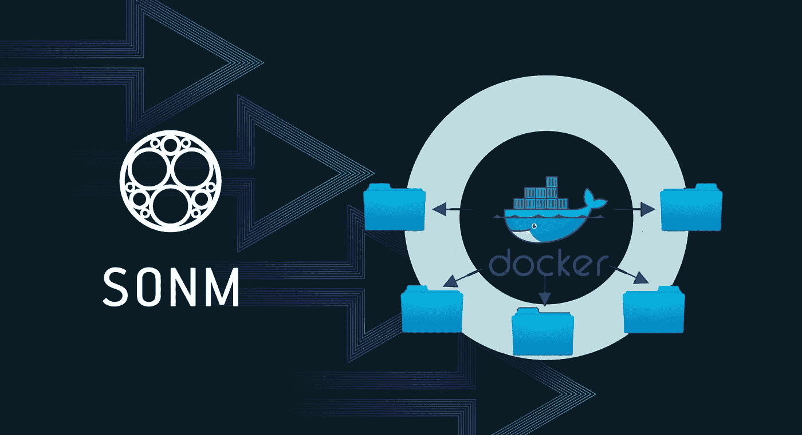

# 如何在 SONM 上运行自定义应用程序

> 原文：<https://medium.com/hackernoon/how-to-run-custom-application-on-sonm-caa6b7879f3c>



这个小指南将帮助有经验的 SONM 用户在 SONM 供应商上运行定制应用程序。如果你对 SONM 一无所知，最好从阅读文件开始。

*你需要通过* [*KYC3*](https://docs.sonm.com/how-to/how-to-pass-kyc-by-cryptonomica) *，没有它你只能运行* [*允许列表*](https://github.com/sonm-io/allowed-list) *中的任务。*

作为本指南的一个例子，我将使用 [SONM 社区电报机器人](https://github.com/taskula/sonm-community-telegram-bot)，最后你应该能够在 SONM 上构建并运行它。

# 建立形象

Docker 有很棒的文档，你可以阅读这本[手册](https://docs.docker.com/get-started/part2/)来基本了解映像构建过程和[编写 docker 文件的最佳实践](https://docs.docker.com/develop/develop-images/dockerfile_best-practices/)。

那么，如果 Docker 拥有所有文档，我们为什么还需要这个指南呢？

是的，你可以在 SONM 上运行任何 docker 映像，但是如果他们使用命令行参数来配置应用程序运行时或者将参数传递给容器内部的 deamon，那么你就不能使用它。SONM 任务不接受来自命令行的参数，将参数传递到容器的唯一方法是使用[环境变量](https://docs.docker.com/engine/reference/run/#env-environment-variables)。

## Dockerfile 文件

Dockerfile 包含了为你的应用程序准备环境的命令列表，你可以在这里安装任何你想要/需要的东西。

我们的 bot 是用 python 编写的，所以我们将使用 Docker Hub 和 pip 中的 python 基础映像来安装所需的 python 库。

以下是来自 bot repo 的 Dockerfile:

```
FROM python:3-slim
WORKDIR /usr/src/app
COPY . .
RUN pip install python-telegram-bot seaborn pandas numpy scipy
RUN chmod +x init.sh
ENTRYPOINT ["./init.sh"]
```

正如我提到的，我们只能通过环境变量将参数传递给容器内部的应用程序，所以我们需要一些包装器将它们转换成命令行参数。

这是什么意思？通常，要运行 docker 映像，您需要从命令行为应用程序设置参数，如下所示:

```
$ docker run <someimage> [ARGS]
```

为了让 SONM 能够做到这一点，我们可以编写简单的 bash 脚本，从环境中获取参数并将其附加到应用程序中。

入口点 bash 脚本可能如下所示:

```
#!/usr/bin/env bash
exec python ./start.py "$COMMANDVAR"
```

现在，您可以向环境变量$COMMANDVAR 添加参数，它们将作为命令行参数添加到应用程序中。

要使用 docker 环境变量，您可以使用如下命令:

```
$ docker run -e "COMMANDVAR=--verbose" <someimage>
```

为了简化示例脚本，它们没有任何输入验证，所以按原样使用可能不安全。

我们的 bot 不使用任何命令行参数，但需要在配置文件中设置电报令牌。以下是 bot repo 中的 init.sh，它使用了环境中的$TOKEN 变量:

```
#!/usr/bin/env bash
if [ ! -z "$TOKEN" ]; then
  echo "[+] Using provided Telegram token."
  cat config/telegram.json.template|sed "s/ADD_BOT_TOKEN_HERE/$TOKEN/g" > config/telegram.json
else
  echo "[-] No Telegram token provided."
  exit 1
fi
exec python ./start.py
```

## 应用

[SONM 社区电报机器人](https://github.com/taskula/sonm-community-telegram-bot)包含所有必要的代码，所以你可以克隆这个回购协议，并进一步进行。

```
$ git clone [https://github.com/taskula/sonm-community-telegram-bot](https://github.com/taskula/sonm-community-telegram-bot)
```

## 建设

构建过程与通常的 docker 映像相同。

```
$ cd sonm-community-telegram-bot
$ docker build -t sonm-community-telegram-bot .
```

## 奔跑

如果你想测试环境变量，你可以用-e 标志来设置它们。

```
$ docker run -e TOKEN=YOUR_TOKEN_HERE sonm-community-telegram-bot
```

# 码头枢纽

好了，我们已经建立了我们的映像，并且能够运行它，现在我们需要使它可以从外部访问。你可以设置你自己的[注册表](https://docs.docker.com/registry/)、Docker Hub 或任何其他可用的注册表。

我们将坚持使用 [Docker Hub](https://hub.docker.com) ，这是最简单的方法，你可以使用公共或私人回购，任务文件都支持。

## 登录 Docker Hub

如果您在 Docker Hub 上没有帐户，现在是时候注册一个了。拥有帐户后，您需要从命令行登录，只需运行:

```
$ docker login
```

## 标签构建

在上传图片到 Hub 之前，我们需要标记它，我不会详细介绍这个过程，你可以在[这里](https://medium.freecodecamp.org/an-introduction-to-docker-tags-9b5395636c2a)阅读，所以我们将使用最基本的变化:

```
$ docker tag sonm-community-telegram-bot <DockerHubLogin>/sonm-community-telegram-bot
```

## 推送图像

设置标签后，我们可以上传我们的图像，并继续编写 SONM 任务文件。

```
$ docker push <DockerHubLogin>/sonm-community-telegram-bot
```

## 自动化构建

如果你的项目在 GitHub 上是开源的，我建议你阅读 Docker Hub 上的[自动构建](https://docs.docker.com/docker-hub/builds/)，这将使构建新版 image 的过程更加容易。

# 运行任务

*您必须有一个活动的交易才能运行任务，如果您对 SONM 任务文件一无所知，* [*阅读此*](https://docs.sonm.com/how-to/manage-tasks) *。如果你不知道如何得到一笔交易* [*读读这个*](https://docs.sonm.com/getting-started/as-a-consumer) *。*

我们的应用程序非常简单，task.yaml 看起来像:

```
container:
  image: <DockerHubLogin>/sonm-community-telegram-bot
  env:
    TOKEN: add_your_telegram_token_here
```

*这个任务文件并没有涵盖你可以设置的所有选项，但是你可以在* [*这个例子*](https://github.com/sonm-io/core/blob/master/task.yaml) 中找到。

要运行此任务，您只需键入:

```
$ sonmcli task start <dealID> task.yaml
```

# 摘要

恭喜你，现在你知道如何在 SONM 上运行任何自定义应用程序了！

如果你有任何问题，给我写信。