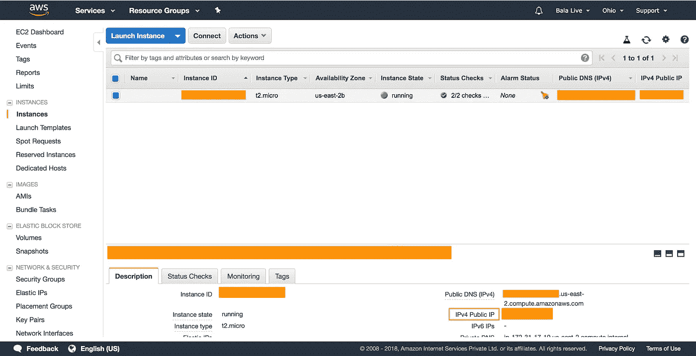
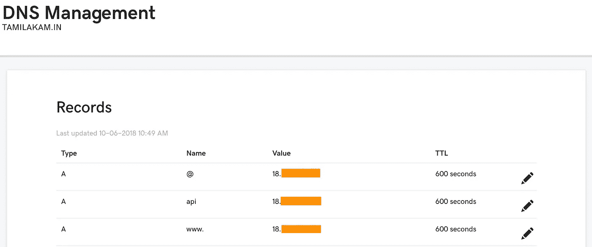
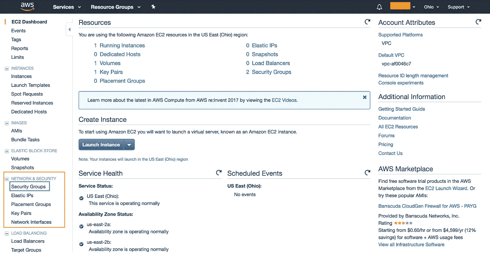
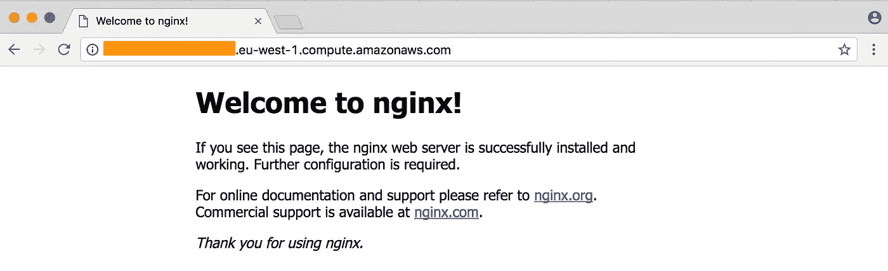

# 如何用 Nginx 在单个 EC2 实例上运行多个 app，并映射自己的自定义域？

> 原文：<https://medium.com/hackernoon/how-to-run-multiple-apps-on-a-single-ec2-instance-with-nginx-and-map-your-custom-domain-2640630ce1e7>

## 在本教程中，我们将在 EC2 实例中托管一个单独的 React 和 Node.js 应用程序，并映射我们的自定义域。

这是我第一次尝试在我的 EC2 实例上运行多个(Node.js & React JS)应用程序，幸运的是，我成功了。我想确保没有人会像我一样在 EC2 中设置多个实例时感到沮丧。实际上实现起来很容易，因为有很多答案已经充斥在 StackOverflow 中，但没有一个是实用的。这让我有机会写这篇文章并帮助他人，因为我知道，分享是关爱。

**必需:**在自定义域中运行我们的客户端和在子域中运行服务器会更棒(例如:[https://tamila kam . in](https://tamilakam.in)&[https://API . tamila kam . in .](https://api.tamilakam.in.)您可以通过@ [GoDaddy](https://in.godaddy.com/) 或任何其他域注册商获得一个域名，域名是完成剩余步骤的必备条件。

我希望你已经知道 Nginx 的配置设置。如果没有，不要担心。我们将在学习本教程时设置它。

## 在生产中部署 Node.js 应用程序并映射您的自定义域。

我已经完成了在生产中部署 node.js 应用程序的教程。你可以通过@

[](/full-stack-web-development-from-scratch-to/deploy-your-node-js-app-in-production-and-use-bitbucket-to-automate-your-deployment-50b07b18914c) [## 在生产中部署 Node.js 应用程序，并使用 BitBucket 来自动化部署。

### 在本教程中，我们将创建一个示例 Node.js 服务器，将其推送到 BitBucket 并使用 PM2，我们将自动…

medium.com](/full-stack-web-development-from-scratch-to/deploy-your-node-js-app-in-production-and-use-bitbucket-to-automate-your-deployment-50b07b18914c) 

在上面的教程中，我刚刚在生产环境中托管了一个 Node.js 应用程序。使用 amazon EC2 默认 URL 和端口号，我们可以访问服务器。

但是现在，在本教程中，我们将映射我们的自定义域以指向我们的远程服务器。

**注意:在本教程中，我们将使用端口 4500 来运行我们的服务器。**

我假设你已经有了 Amazon EC2 实例及其连接过程的经验。如果您不是，请浏览下面的链接，完成提供的步骤，并在继续之前准备好您的远程实例。

[](/full-stack-web-development-from-scratch-to/make-your-amazon-ec2-instance-up-and-running-ab80120eb23) [## 启动并运行您的 Amazon EC2 实例。

### 在这一部分，我们将创建一个 Amazon 帐户 EC2 实例，并通过 SSH 连接到该实例。

medium.com](/full-stack-web-development-from-scratch-to/make-your-amazon-ec2-instance-up-and-running-ab80120eb23) 

**步骤 1** :在互联网域名注册机构 DNS 设置中提供您的 Amazon EC2 `IPv4 Public IP`地址。

从 Amazon 控制台获取 IPv4 公共 IP 地址。这就像`18.xxx.xxx.15`



添加一条记录，其值如下。

```
Type: A
Name: api // Sub domain so we can access it like api.tamilakam.in
Value: 18.xxx.xxx.15 // IPv4 Public IP
TTL: 600 seconds
```

更多信息请参考下图。也添加其他 A 记录，这样我们就不需要再来这里进行客户端应用程序配置了。



DNS Management page — Add Records.

**步骤 2** :让我们首先从终端使用下面的命令连接到我们的远程实例。(在所需位置替换您的 EC2 url)

```
$ ssh -i ~/.ssh/AWS-EC2-INSTANCE-LIVE.pem ubuntu@ec2-xx-xxx-xx-xx.us-east-2.compute.amazonaws.com
```

**第三步**:在 EC2 中，指定一个端口来运行 Node.js 服务器。

在亚马逊控制台中点击`NETWORK & SECURITY`下的`Security Groups`。



Click Security Groups.

右键单击实例的安全组，然后单击`Edit inbound rules`。

点击`Add Rule`。添加如下配置，如下图所示，并点击`Save`。


Security group config rule.

端口 4500 表示我们将在这个端口运行 Node.js 服务器。添加运行服务器的端口。

**第四步**:安装 Nginx 并配置

Ubuntu 自带包管理器， ***apt-get*** 。使用 ***apt-get*** ，我们可以在一个命令中安装 ***nginx*** 。

```
$ sudo apt-get install nginx
```

***apt-get*** 在安装后会自动运行 nginx，所以你现在应该让它在端口`80`上运行，通过在浏览器中输入你的公共 DNS URL 进行检查。



Nginx welcome page.

如果这不起作用，您可能需要手动启动它。

```
$ sudo /etc/init.d/nginx start
```

现在让我们配置 Nginx 来运行 Node.js 服务器。

如何设置 ***nginx*** 配置？配置以任何名称存储在`sites-available`的纯文本文件中。将它们链接到`sites-enabled`文件夹会导致它们在 ***nginx*** 启动时被读取和使用。所有的配置通过 ***nginx*** 组合在一起。

您可以使用 cat 查看这个配置。

```
$ cat /etc/nginx/sites-available/default
```

让我们首先从`sites-enabled`中删除默认配置，我们将把它留在`sites-available`中以供参考。

```
$ sudo rm /etc/nginx/sites-enabled/default
```

让我们用域名在`sites-available`中创建一个配置文件。

```
$ sudo nano /etc/nginx/sites-available/api.tamilakam.in
```

下面是我们将要使用的配置。将其输入文件并保存，替换`server_name`字段中的自定义域。

```
server {
    listen 80;
    server_name api.tamilakam.in;
    location / {
        proxy_set_header X - Real - IP $remote_addr;
        proxy_set_header Host $http_host;
        proxy_pass http: //127.0.0.1:4500;
    }
}
```

这将把所有 HTTP 流量从端口`80`转发到端口`4500`。

我们监听运行 Node.js 服务器的端口 4500，并将其重定向到 api.tamilakam.in。

链接`sites-enabled`中的配置文件(这将使文件看起来像是在`sites-enabled`中实际复制的)。

```
$ sudo ln -s /etc/nginx/sites-available/api.tamilakam.in /etc/nginx/sites-enabled/api.tamilakam.in
```

[如果你不熟悉符号链接，可以在这里阅读更多。](https://kb.iu.edu/d/abbe)

重启 ***nginx*** 让新配置生效。

```
$ sudo service nginx restart
```

就是这样。访问 [https://api.tamilakam.in](https://api.tamilakam.in) 我们的 Node.js API 服务器就准备好了。

## 在生产中部署您的 React 应用程序并映射您的自定义域。

你可以参考下面的链接，我已经创建了一个完整的 React 示例应用程序，上传到 BitBucket，并作为一个生产应用程序托管在配置了 Nginx 的 Amazon EC2 实例中。

按照下面的教程，您可以使用相同的实例来运行客户端。

是的。现在，我们在 Amazon EC2 的同一个实例中运行服务器和客户机。

如果你有任何疑问，请在评论中告诉我。

谢谢你。

参考资料:

[](https://hackernoon.com/tutorial-creating-and-managing-a-node-js-server-on-aws-part-2-5fbdea95f8a1) [## 教程:在 AWS 上创建和管理 Node.js 服务器，第 2 部分

### 在第 1 部分中，我们启动了一个服务器，在端口 3000 上响应 HTTP 请求。在本教程中，我们将再看 4 个…

hackernoon.com](https://hackernoon.com/tutorial-creating-and-managing-a-node-js-server-on-aws-part-2-5fbdea95f8a1) [](/full-stack-web-development-from-scratch-to/deploy-your-node-js-app-in-production-and-use-bitbucket-to-automate-your-deployment-50b07b18914c) [## 在生产中部署 Node.js 应用程序，并使用 BitBucket 来自动化部署。

### 在本教程中，我们将创建一个示例 Node.js 服务器，将其推送到 BitBucket 并使用 PM2，我们将自动…

medium.com](/full-stack-web-development-from-scratch-to/deploy-your-node-js-app-in-production-and-use-bitbucket-to-automate-your-deployment-50b07b18914c)