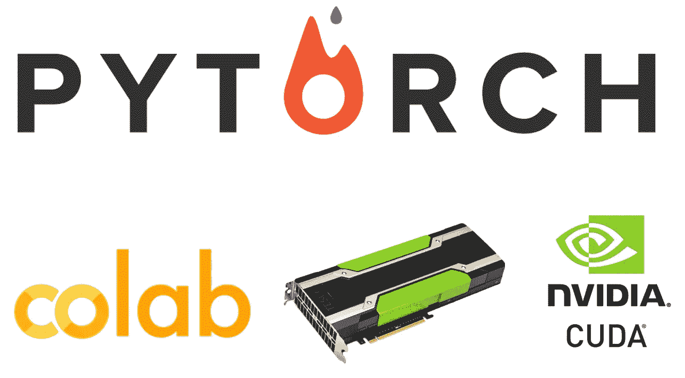
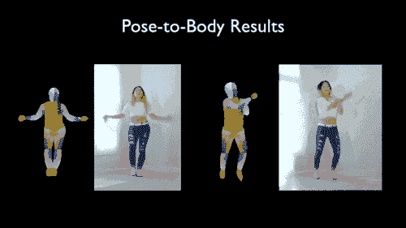

# 如何在 Google Colab 上运行支持 GPU 和 CUDA 9.2 的 PyTorch

> 原文：<https://medium.com/hackernoon/how-to-run-pytorch-with-gpu-and-cuda-9-2-support-on-google-colab-64d58ba3083a>



自从我写了第一篇关于在谷歌的 GPU 支持的 Jupyter 笔记本界面- Colab 上运行深度学习实验的教程以来，已经有一段时间了。从那以后，我的几个博客都是通过 GPU 加速在 Colab 上运行 Keras、TensorFlow 或 Caffe。

Colab 上缺少的一个框架是 PyTorch。最近，我正在检查一个需要在 Linux 上运行的视频到视频合成模型，此外，在我可以带着这个闪亮的模型兜风之前，还有数千兆字节的数据和预先训练的模型要下载。我在想，为什么不利用 Colab 惊人的下载速度和免费的 GPU 来尝试一下呢？

## 享受本教程的 [Colab 笔记本链接](https://colab.research.google.com/drive/1ldg8DbTpe0M8PaioPBmwIwqs-DkH-ha9)。

让我们从在 Colab 上安装 CUDA 开始。

# 安装 CUDA 9.2

为什么不是其他 CUDA 版本？这里有三个原因。

1.  截至 2018 年 9 月 7 日，CUDA 9.2 是 Pytorch 在其网站【pytorch.org上看到的官方支持的最高版本。
2.  有些人可能认为安装 CUDA 9.2 可能会与 TensorFlow 冲突，因为 TF 目前只支持 CUDA 9.0。放松，把 Colab 笔记本当成一个沙箱，即使你弄坏了它，也可以通过几次按钮点击轻松重置，让我测试后安装 CUDA 9.2 后的 TensorFlow 工作正常。
3.  如果你安装了 CUDA 9.0 版本，在为 Pytorch 编译本地 CUDA 扩展时，你可能会遇到[问题](https://devtalk.nvidia.com/default/topic/1028112/cuda-setup-and-installation/nvcc-bug-related-to-gcc-6-lt-tuple-gt-header-/post/5260762/#5260762)。一些复杂的 Pytorch 项目包含[定制 c++ CUDA 扩展](https://pytorch.org/tutorials/advanced/cpp_extension.html#integrating-a-c-cuda-operation-with-pytorch)用于定制层/操作，比它们的 Python 实现运行得更快。不利的一面是，您需要从单个平台的源代码中编译它们。在运行于 Ubuntu Linux 机器上的 Colab 案例中，使用 g++编译器来编译本地 CUDA 扩展。但是 CUDA 9.0 版在使用 g++编译器编译原生 CUDA 扩展时有一个错误，这就是为什么我们选择 CUDA 9.2 版来修复这个错误。

回到安装，[Nvidia 开发者网站](https://developer.nvidia.com/cuda-downloads)会询问你想要运行 CUDA 的 Ubuntu 版本。要找到答案，请在 Colab 笔记本中运行下面的单元格。

它会返回您想要的信息。

```
VERSION="17.10 (Artful Aardvark)"
```

之后，您将能够浏览目标平台选择，使安装程序键入**“deb(local)”**，然后**右键**点击**“下载(1.2 GB)”**按钮复制链接地址。

回到 Colab 笔记本，粘贴一个 **wget** 命令后的链接下载文件。在 Colab 上下载一个 1.2GB 的文件只需要大约 10 秒钟，这意味着没有咖啡休息时间-_-。

```
!wget [https://developer.nvidia.com/compute/cuda/9.2/Prod2/local_installers/cuda-repo-ubuntu1710-9-2-local_9.2.148-1_amd64](https://developer.nvidia.com/compute/cuda/9.2/Prod2/local_installers/cuda-repo-ubuntu1710-9-2-local_9.2.148-1_amd64)
```

运行以下单元来完成 CUDA 安装。

Install CUDA 9.2

如果您在输出的末尾看到这些行，这意味着安装成功了。

```
Setting up cuda (9.2.148-1) ...
Processing triggers for libc-bin (2.26-0ubuntu2.1) ...
```

继续 Pytorch。

# 安装 PyTorch

非常简单，转到[pytorch.org](https://www.dlology.com/blog/how-to-run-pytorch-with-gpu-and-cuda-92-support-on-google-colab/pytorch.org)，这里有一个选择器，你可以选择如何安装 Pytorch，在我们的例子中，

*   操作系统: **Linux**
*   包管理器: **pip**
*   Python: **3.6** ，可以通过在 shell 中运行`python --version`来验证。
*   CUDA: **9.2**

它将让您运行下面这一行，之后，安装就完成了！

```
pip3 install torch torchvision
```

# 运行 vid2vid 演示

出于好奇，Pytorch 在 Colab 上启用 GPU 时表现如何，让我们尝试一下最近发布的[视频到视频合成演示](https://github.com/NVIDIA/vid2vid)，这是 Pytorch 对我们的高分辨率照片级视频到视频翻译方法的实现。那个视频演示把姿势变成了一个跳舞的身体，看起来很诱人。



此外，演示还依赖于定制的 CUDA 扩展，提供了测试已安装的 CUDA 工具包的机会。

下面的单元完成了从获取代码到使用预先训练好的模型运行演示的所有工作。

Run vid2vid demo

生成的帧进入目录**results/label 2 city _ 1024 _ G1/test _ latest/images**，你可以通过调用下面的单元格显示一个。

Show one result image

本教程到此结束。

# 结论和进一步的思考

这篇短文向你展示了如何让 GPU 和 CUDA 后端 **Pytorch** 在 Colab 上快速自由地运行。不幸的是， **vid2vid** 的作者还没有得到[可测试的边缘脸，pose-dance demo 也还没有贴出来](https://github.com/NVIDIA/vid2vid/issues/24#issuecomment-417463746)，我在焦急的等待。到目前为止，它只是作为一个演示来验证我们在 Colab 上安装 Pytorch。请随时在社交媒体上与我联系，我会让你了解我未来的项目和其他实用的深度学习应用。

以下是我之前的一些 Colab 教程。

1.  [“如何免费快速运行视频中的对象检测和分割](https://www.dlology.com/blog/how-to-run-object-detection-and-segmentation-on-video-fast-for-free/)”——我在 Colab 上的第一个教程， [colab 笔记本直接链接](https://drive.google.com/file/d/11yXcMidH2rmnvy5GxFAr0M_0mABr1M_-/view?usp=sharing)。
2.  [“在 Google Colab](https://www.dlology.com/blog/quick-guide-to-run-tensorboard-in-google-colab/) 中运行 TensorBoard 的快速指南”，——[Colab 笔记本直联](https://drive.google.com/file/d/1afN2SALDooZIHbBGmWZMT6cZ8ccVElWk/view?usp=sharing)。
3.  在 Colab 上运行 caffe-cuda—[Colab 笔记本直接链接](https://drive.google.com/file/d/1jqBo2hpFY_xNeFHDf5l1h6q_VTcRTRlQ/view?usp=sharing)。

[在 Twitter 上分享](https://twitter.com/intent/tweet?url=https%3A//www.dlology.com/blog/how-to-run-pytorch-with-gpu-and-cuda-92-support-on-google-colab/&text=How%20to%20run%20PyTorch%20with%20GPU%20and%20CUDA%209.2%20support%20on%20Google%20Colab) [在脸书分享](https://www.facebook.com/sharer/sharer.php?u=https://www.dlology.com/blog/how-to-run-pytorch-with-gpu-and-cuda-92-support-on-google-colab/)

*原载于*[*www.dlology.com*](https://www.dlology.com/blog/how-to-run-pytorch-with-gpu-and-cuda-92-support-on-google-colab/)*。*