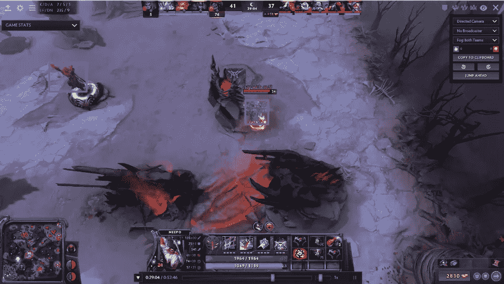
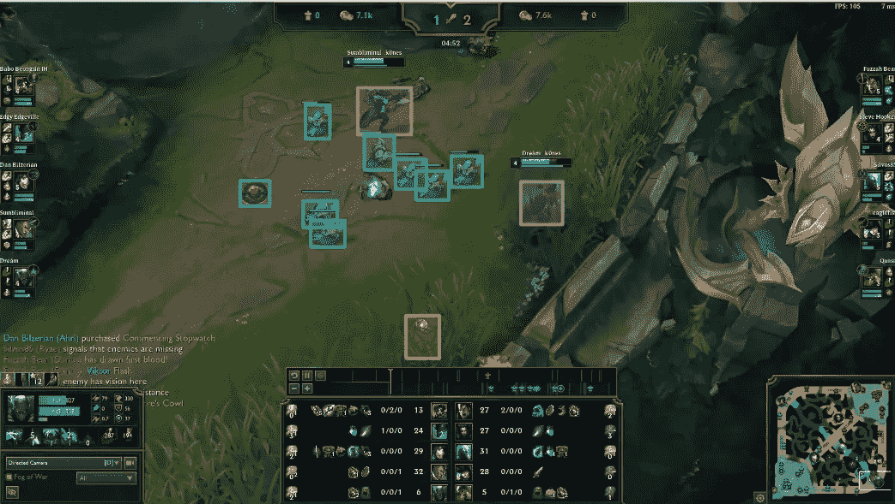
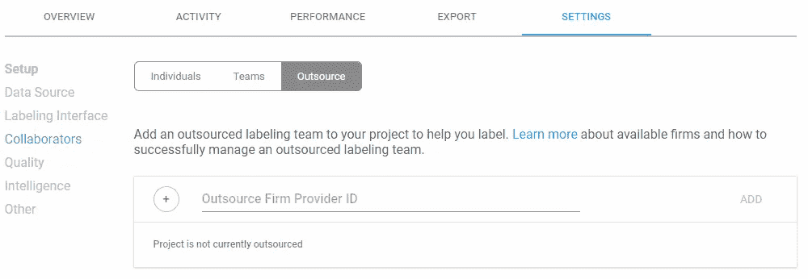

# 如何缩放训练数据

> 原文：<https://medium.com/hackernoon/how-to-scale-training-data-9d75e110048f>

## 不影响数据质量的外包指南

为了让数据科学团队将注释外包给管理劳动力提供商(也称为业务流程外包商(BPO))，他们必须首先拥有存储和管理培训数据的工具和基础架构。数据管理工具和基础设施应支持 R&D 产品管理团队、外包贴标团队以及内部贴标和审查团队在一个完全透明的监督下共同工作。

# 利用主题专业知识进行扩展

训练数据的数量和注释团队的规模之间有着直接的关系。通过外包来扩大注释劳动力的替代方法是雇佣一个内部贴标机团队。虽然这是一个昂贵的选择，但有时是唯一的选择。例如，扩展敏感的培训数据，如受 HIPAA 保护的医疗数据，可能需要专门的内部标签人员。继续这个例子，诸如 CT 扫描的医学数据需要由具有正确解释数据的必要医学专业知识的放射科医师来标记。

外包需要专业知识的贴标工作令人担忧，因为 BPO 无法提供专业贴标机。虽然有充分的理由对外包复杂或小众数据集持怀疑态度，但 BPO 涵盖了令人惊讶的广泛的主题专业知识，通过一点点研究，您可能会发现一种提供专业标注服务的服务，能够以雇用内部团队的一小部分成本标记您的数据集。

Grant Osborne, CTO Gamurs

由人工智能支持的综合电子竞技社区平台 [Gamurs](https://gamurs.group/) 的首席技术官 Grant Osborne 描述了他使用 Labelbox 的外包功能在竞争激烈的游戏行业中扩展注释的决策过程。Gamurs 正在为职业视频游戏玩家开发一种人工智能教练。人工智能教练将通过从玩家表现不佳的类似例子中学习来帮助提高玩家的表现，并提出提高玩家表现的方法。

Grant 最初考虑从他们的大型社交媒体中众包游戏玩家的追随者来标记他们最喜欢的游戏选择。起初，他研究了一些流行的众包工具，但很快就拒绝了这个选项，因为它们的收入来自注释。

> *"这些工具根据边界框的数量收取存储费用。由于我们将有数百万个标签，这种定价结构是不切实际的。”*

然后，他考虑建立一个廉价的内部工具，并雇用一个贴标机的内部团队，直到他与 Labelbox 的联合创始人兼首席运营官 Brian Rieger 交谈。Gamurs 需要一个平台来上传和管理带有对象检测的多个游戏的图像。与其他商业标签工具相比，Labelbox 的定价结构基于三层体系:免费、商业和企业。订阅层根据 ML 项目的数量和数据集大小进行分类。这些层级在价格和对特定平台功能的访问上有所不同。

> “我最喜欢 Labelbox 的部分是 API 的易用性。拥有一个以开发人员为中心的 API 可以轻松地生产模型。”

Dota2 Annotations on Labelbox (photo: Gamurs)

> "我们需要一个机器学习管道解决方案，而 Labelbox 就是这样一个解决方案！"——Grant Osborne， [GAMURS](https://medium.com/u/3e45ab4444a0?source=post_page-----9d75e110048f--------------------------------) 的首席技术官

不出所料，格兰特最初对将 Dota2 或《英雄联盟》的专业游戏活动外包给 BPO 持怀疑态度。“我们希望有一个内部标签团队，因为计算机操作很复杂。我们如何让一个习惯于标记简单物体的外部公司，比如停车标志和树，来标记我们的游戏？然而，Labelbox 的 BPO 合作伙伴告诉我们只需发送一份手册，他们会让一个专门的注释团队跟上进度。

“label box 推荐了两个最符合我们需求的 BPO，并说如果我们感兴趣的话还有更多。BPOs 估计需要大约 3-4 周的时间让每个人都接受完整的培训。虽然这个估计对材料的复杂程度有点乐观，但他们能够在大约 4-5 周内完成培训周期。”尽管两个 BPO 的成本报价截然不同(一个是每个边框 1.5-2 美分，另一个是每个边框 10-12 美分)，Gamurs 仍然决定混合使用两个 BPO，第一个是 20 人的标签团队，第二个是 10 人的标签团队。

League of Legends Annotations on Labelbox (photo: Gamurs)

> “我们可能会根据 BPO 在每场比赛中的优势进行组合。我们将让他们达成共识，如果一个 BPO 在质量保证方面做得更好，但在贴标签方面做得更慢，我们将利用他们来交叉评估另一个团队的工作。”

# 根据数据质量进行扩展

外包主题专业知识的逆向误解是，当涉及到注释一个极其简单的数据集时，相信所有的人都是平等的。这种观点经常淡化数据质量在标注中的重要性。阅读 [*南瓜是什么？*](/labelbox/ai-is-only-a-click-away-bf0b09a82c36) 一节了解如何训练深度卷积对象检测模型来识别像南瓜一样简单的东西实际上比你想象的要复杂得多。即使是简单的标注任务，为了确保数据质量，您也必须能够监督标注者之间和标注时间上的一致性和准确性。

在不影响数据质量的情况下大规模贴标需要整个贴标流程的透明度。外包本地运行的内部工具的数据科学家团队经常将数据发送到几个不同的标注服务，在这些服务中，标注在本地进行，有时在多个国家进行，数据科学家必须依赖这些标注器通过电子邮件发送文件或通过 Dropbox 进行上传。

因此，数据变得支离破碎、杂乱无章、难以管理，容易出现数据安全、数据质量和数据管理方面的问题。为了实时监控外包服务的标签准确性和一致性，像 [SomaDetect](/labelbox/the-internet-of-cows-ai-in-agriculture-with-somadetect-859593db9207) 这样的公司从管理自己开发的工具上的注释劳动力转向通过 Labelbox 来管理。 [Labelbox](https://labelbox.com/) 是世界上最好的将您的内部贴标和审核团队与您的外包团队整合在一个集中的地方的工具。

# 并非所有的贴标机都是平等的

区分外包的因素远不止 it 服务的主题专业知识。Labelbox 根据以下标准手动选择了最佳 BPO 公司:

*   定价透明度
*   优质客户服务
*   公司规模、服务区域、技能范围和参与方式的多样性

我们采访了伴侣实验室的计算机视觉工程师迈克尔·汪，他向我们讲述了他与我们推荐的 BPO 合作伙伴之一在 Labelbox 上进行外包的经历。他解释了为什么外包给一个专门的贴标机团队，而不是众包随机的人工贴标机，可以产生更高质量的训练数据。

> *“直接联系外包贴标机的专门团队有助于您和客户了解如何给项目贴标签，随着时间的推移，贴标机会变得更好。对于随机贴标机，你每次都必须从头开始学习。专门的贴标团队开始理解你的项目，当你解释一些东西时，它会在整个团队中传播。”—迈克尔·汪*

在选择 Labelbox 之前，Companion Labs 将 Labelbox 与领先的竞争对手进行了比较，在质量指标、时间和标记项目的努力方面尝试了两种标记服务 API。迈克尔说，与众所周知的众包竞争对手相比，Labelbox 拥有更高质量的外包资源。当被问及如何在 Labelbox 的合作伙伴 BPOs 中选择合作伙伴时，他解释说，Labelbox 提供了两个建议，他从质量和成本两个方面进行了评估。“这两家供应商在质量方面都非常出色，所以选择最终取决于成本。”

# 标签盒外包

管理劳动力服务通常是使人工智能项目成功的重要部分。因此，我们 Labelbox 希望管理劳动力提供商能够以尽可能无摩擦的方式提供服务。有了 Labelbox，数据科学家、注释者和产品经理团队可以在一个平台上透明地管理小型项目和实验，甚至是超大型项目。我们的重点是让我们的客户在他们的人工智能项目上尽可能成功。我们的客户是各种规模的企业，他们都在构建和运营人工智能。
我们已经手动选择的 BPO 合作伙伴，使我们的客户可以有高质量的标签服务，直接在他们的标签盒项目。

在贴标机上，您的内部和外包贴标机可以*无缝地*在一个贴标项目上合作。它是如此的紧密，以至于两者之间几乎没有缝隙！

# 轻松的两步过程

1.  请联系此处列出的[我们的员工合作伙伴之一。](https://support.labelbox.com/docs/outsourcing)
2.  通过添加他们的“公司提供商 ID”(由工作伙伴提供)，与他们共享您的项目。

真的是这样！您的项目将在工作伙伴的 Labelbox 帐户中显示为共享项目，他们可以在您的项目中添加和管理自己的贴标机。他们将有权批注、审阅批注和管理他们的贴标机。最棒的是，你的内部团队将能够完全透明地监控他们的表现。欲了解更多信息[请查看我们的文档](https://support.labelbox.com/docs/outsourcing)。

# Labelbox 入门

访问[www.labelbox.com](http://www.labelbox.com)免费探索[标签盒](https://labelbox.com/)或[与我们的团队成员之一](https://labelbox.com/sales)谈论适合您业务的企业解决方案。

*原载于 2018 年 12 月 13 日*[*medium.com*](/labelbox/how-to-scale-training-data-8902a0d95d90)*。*