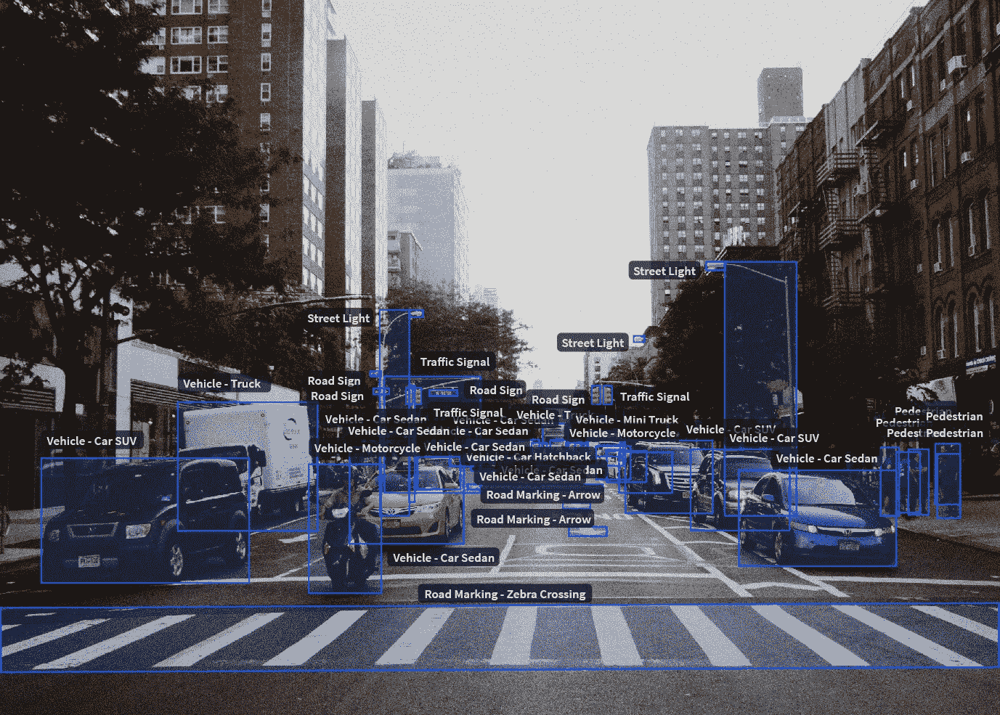
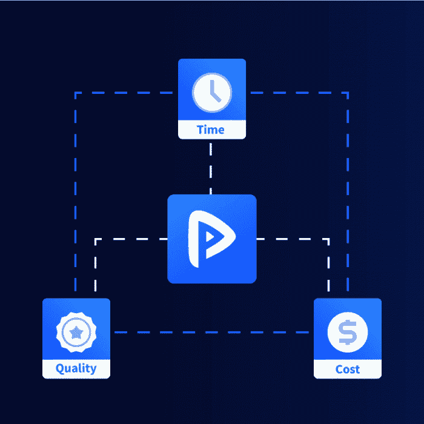

# 如何为 AI Race 缩放训练数据

> 原文：<https://medium.com/hackernoon/how-to-scale-training-data-for-ai-race-d2c075b7f18e>

> “T *这里不能有太多的* ***相关的*** *训练数据！训练你的机器学习模型进行场景理解需要大量的数据。这主要是由于输入传感器的可变性以及自然和人为引入的环境条件。”*

每个公司都需要自己的数据来建立模型，以实现各种识别任务。由于问题领域内的可变性，这种需求出现了。

# 扩展训练数据集的选项

1.  开源数据集
2.  经过人工验证的定制数据集
3.  合成数据生成

尽管如今获取原始数据集相对容易得多，但丰富或注释这些数据却带来了一系列全新的逻辑挑战。正如我们在之前的[博客文章](https://blog.playment.io/training-data-for-computer-vision/)中提到的，有三种方法，

1.  内置的图像注释器(例如，脸书的图像标签，谷歌的 reCaptcha)
2.  传统的 BPO(例如，您更了解)
3.  完全受管理的注释专家(例如 [Playment](https://playment.io/)

但是，一个人如何着手做决定呢？

请继续阅读。

在未来，我希望有一个中央系统，可以看到这么多的数据。它只是一个 API 调用，用来实时获取我们需要的任何数据和多少数据。

但是，这样的系统今天并不存在。因此，在调整训练数据时，人的作用是不可避免的。

# 当扩展训练数据时要寻找什么！

> 可扩展的训练有素的劳动力+无缝的 API 集成+专门的项目经理+严格的质量控制以确保数据准确性=大规模的高质量培训数据

这是我们一个客户的使用案例，

“新的自动驾驶初创公司，为自动驾驶汽车建立人工智能大脑，他们需要大量数据作为车辆和行人的注释数据集。”

把这个分解开来，

交通标志、行人、不同类型的车辆……大约 **45 个不同的类别**。

现有数据集的问题是，自动驾驶汽车已经被训练过。但是，如果把同样的汽车放在美国的道路上会怎么样呢？

这将导致上下文不相关的数据被构建用于高精度和召回准确度的定位、分类。

因此，在冻结工作范围后，我们的项目经理开始分析细微差别并澄清疑问。

对于我们训练有素的员工，唯一的问题是为新案例培训我们的用户，然后是鉴定人员。

# Playment 如何融入其中？

获得成千上万的注释者很容易。困难的部分是*训练他们使用注释工具和复杂的任务*。

**解决用户培训的复杂性**

当我们得到更多的班级数量时，这对我们的项目团队来说是一个真正的挑战。

因此，如果类别较多，我们尝试将它们分组，以方便用户培训。

如上所述，总共 *M* 个班级被分成 *N* 个小组。这样，我们就完成了所有的对象定位任务，并再次将这些组分成单独的 *M* 个类来执行分类任务。

1.  平均每天，我们交付 ***3000+工时***
2.  实现共识逻辑来限定注释
3.  我们每天进行内部质量控制，如果有任何差异，我们会完全重做。

# 结束语

我们知道大量的数据集对于高性能的机器学习算法是多么重要。

我们会准备您需要的所有培训数据，以便您可以专注于创新。有关数据标签问题的更多信息，请随时与[联系](https://playment.io/?utm_source=blog&utm_medium=referral&utm_content=scale_trainingdata)。

*原载于* [*Playment 博客*](https://blog.playment.io/how-to-scale-training-data-efficiently/?utm_source=hackernoon&utm_campaign=scale_trainingdata&utm_medium=referral)*2018 年 2 月 19 日。*