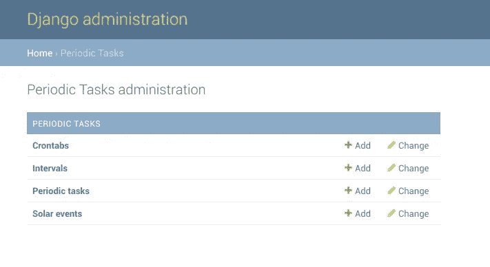
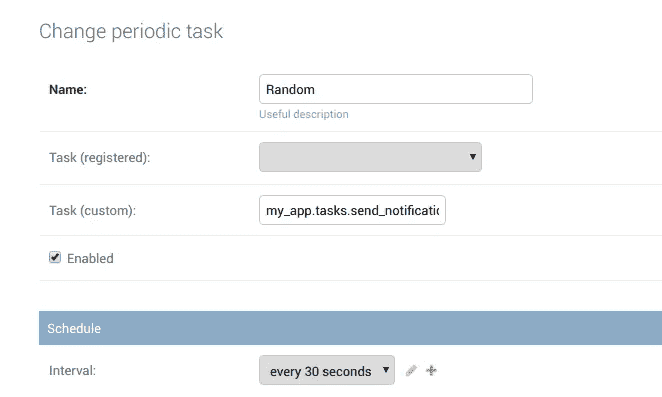

# 如何安排姜戈和芹菜节拍的“无聊的东西”

> 原文：<https://medium.com/hackernoon/how-to-schedule-the-boring-stuff-with-django-and-celery-beat-1817b6f1e9c0>


软件开发人员的工作充满了生成定期报告、处理大量的导入或导出、备份、频繁的 API 请求，或者只是浏览一批电子邮件。将所有这些任务自动化并完美调度，难道不是开发人员的天堂吗？它会——幸运的是，有了芹菜段的帮助。

**什么是芹菜末？**它结合了**芹菜**，一个众所周知的任务委托工具，和一个叫做 **Beat** 的漂亮的调度器。在本指南中，你将发现**它如何帮助你管理甚至是最乏味的任务**。我们开始工作吧！

# 如何开始芹菜的工作？

首先，你需要有芹菜。它的最新版本(4.2)仍然支持 **Python 2.7** ，但由于新版本不支持，**如果你想处理芹菜，建议使用 Python 3。**

出于本文的目的，**我正在 Docker 容器**中运行 Python 3.6.5 映像的 Django 2.0.6。要知道芹菜是一个资金极少的项目，不支持微软 Windows。

要让芹菜上路，您需要一个代理来发送和接收消息。我的选择是 **Redis 4.0.10** ，它也部署在容器中。Redis 的另一个选择是**rabbit MQ**——你可以在官方芹菜文档[中读到更多。](http://docs.celeryproject.org/en/latest/getting-started/brokers/)

Redis 有一个安装和管理起来容易得多的名声，这使得我的选择很简单。安装 Redis 后，您只需调用“redis-server”即可运行它。就是这样。这里有一个快速测试:

```
$ redis-cli ping
PONG
```

在下一步中，您需要确保您的虚拟环境或容器配备了包:celery==4.20 和 redis==2.10.6 。皮普可以很方便地将它们安装到位。在后期，你还会用到**django _ celery _ beat = = 1 . 1 . 1**的好处。

# 怎么用芹菜打？

芹菜配置有时可能是棘手的，即使是顶级软件开发人员。在本指南中，我将使用标准 Django 结构:

```
proj
     /manage.py
     /proj/__init__.py
          /apps.py
          /celery.py
          /tasks.py
          /settings.py
     /my_app/__init__.py
            /apps.py
            /tasks.py
```

记得设置所有的 **apps.py 文件**。此外，每个应用程序 __init__。py 应该指向默认配置:

```
default_app_config = 'my_app.apps.MyAppConfig'
```

例外是 __init__。py 在您的项目文件夹中，其中存储了**芹菜配置**:

```
from __future__ import absolute_import, unicode_literals
from .celery import app as celery_app   
__all__ = ('celery_app',)
```

配置到这里，下一步是转到 **celery.py** :

```
from __future__ import absolute_import, unicode_literals 
import os 
from celery import Celery # Set default Django settings os.environ.setdefault('DJANGO_SETTINGS_MODULE', 'proj.settings') app = Celery('proj') # Celery will apply all configuration keys with defined namespace  app.config_from_object('django.conf:settings', namespace='CELERY') # Load tasks from all registered apps 
app.autodiscover_tasks()
```

除了使用‘config _ from _ object’之外，另一种配置方式是**直接在应用** — [中分配配置值，查看文档](http://docs.celeryproject.org/en/latest/getting-started/first-steps-with-celery.html#celerytut-configuration)了解更多细节。

有了基础的东西，让我们继续设置。py 和**设置芹菜段的细节**。最简单的配置如下所示:

```
CELERY_BROKER_URL = 'redis://localhost:6379' # If time zones are active (USE_TZ = True) define your local CELERY_TIMEZONE = 'Europe/Warsaw' # We're going to have our tasks rolling soon, so that will be handy CELERY_BEAT_SCHEDULE = {}
```

在最新版本的芹菜杆中引入了新的小写设置标准。然而，不必急着更新它，因为这种适应良好的格式仍然受支持。

# 芹菜节拍中的调度任务

到目前为止做得很好——现在是时候移动到应用模块中的 **tasks.py 了。**

```
from celery import task 
from celery import shared_task # We can have either registered task @task(name='summary') 
def send_import_summary():
     # Magic happens here ... 
# or @shared_task 
def send_notifiction():
     print(‘Here I\’m’)
     # Another trick
```

**无论任务是注册的还是共享的，Celery 都能发现它。**如果你写的任务会服务于不能依赖于项目本身的可重用 app，那么 app 实例就不能直接导入。在这种情况下，使用 **@shared_task decorator** 是确保一切就绪的正确方法。

准备好任务的功能后，**让我们回到 settings.py 来添加一个时间表**:

```
from celery.schedules import crontab CELERY_BROKER_URL = 'redis://localhost:6379' 
CELERY_TIMEZONE = 'Europe/Warsaw' # Let's make things happen 
CELERY_BEAT_SCHEDULE = {
 'send-summary-every-hour': {
       'task': 'summary',
        # There are 4 ways we can handle time, read further 
       'schedule': 3600.0,
        # If you're using any arguments
       'args': (‘We don’t need any’,),
    },
    # Executes every Friday at 4pm
    'send-notification-on-friday-afternoon': { 
         'task': 'my_app.tasks.send_notification', 
         'schedule': crontab(hour=16, day_of_week=5),
        },          
}
```

在上面的例子中，你已经使用了**两种处理时间的方法:**

*   **简单的** **时间表示**以秒来声明重复之间的间隔；
*   **crontab** ，作为“运行频率”使用，让您指定确切的时间、星期/月和一年中的月份。

此外，众所周知的 **Python timedelta 方法**可以应用于设置“按时钟”时间表。芹菜打提出的另一个奇特选项是**根据太阳活动执行任务**:

```
from celery.schedules import solar
       # [...]         
'schedule': solar('sunset', -37.81753, 144.96715),
```

# 是时候运行您的第一个工人了！

设置已完成并尘埃落定。让我们试一试。

```
$ celery -A proj beat -l INFO  # For deeper logs use DEBUG
```

Beat 可以嵌入**普通芹菜工**以及带-B 参数的**。但是，不建议在生产中使用:**

```
$ celery -A proj worker -B -l INFO
```

默认调度程序将数据存储在本地 celerybeat-schedule 文件中，并基于硬编码设置。但是，如果你也想让应用程序管理员甚至用户创建或简单地调整时间表呢？

# 姜戈芹菜节拍来了

Celery 允许使用**定制调度类**。为什么我们不能**将它保存在数据库中，并方便地显示在管理界面**中？因为这正是这个扩展所做的，对您和其他用户来说没有任何麻烦。

现在你已经安装了 django_celery_beat==1.1.1，**所以让我们把它添加到 settings.py** 中的 INSTALLED_APPS 中。

```
INSTALLED_APPS = (
     ...,
     'django_celery_beat', 
)
```

Django Celery Beat 使用**自己的模型来存储所有与时间表相关的数据**，因此让它通过应用迁移在您的数据库中构建一个新表:

```
$ python manage.py migrate
```

最后一步是**通知你的工人读取自定义调度程序:django _ celery _ beat . schedulers:database scheduler。**为此，您需要重新运行它:

```
$ celery -A proj beat -l INFO --scheduler django_celery_beat.schedulers:DatabaseScheduler 
... 
LocalTime -> 2018-07-13 09:29:25 
Configuration ->
     . broker -> redis://redis:6379//
     . loader -> celery.loaders.app.AppLoader
     . scheduler -> django_celery_beat.schedulers.DatabaseScheduler
     . logfile -> [stderr]@%DEBUG
     . maxinterval -> 5.00 seconds (5s) 
[2018-07-13 09:29:25,212: INFO/MainProcess] beat: Starting... 
[2018-07-13 09:29:25,212: INFO/MainProcess] Writing entries...
```

瞧啊。让我们看看**管理面板**:



由于你可以**快速点击所有“无聊的东西”或者将它外包给其他人**，所有先前根植于代码中的设置现在都可以在手边使用。就这么简单。

让我们添加一个新的周期性任务:



给你！

```
[2018-07-13 10:25:03,120: DEBUG/MainProcess] DatabaseScheduler: Fetching database schedule 
[2018-07-13 10:25:03,231: WARNING/ForkPoolWorker-1] Here I'm! 
[2018-07-13 10:25:03,232: INFO/ForkPoolWorker-1] Task my_app.tasks.send_notification succeeded in 0.0005994100356474519s: None 
<ModelEntry: Random my_app.tasks.send_notification(*[], **{}) <freq: 30.00 seconds>>
```

虽然你可能有一个印象，配置需要很多努力，但重要的是**不要错过任何初始设置步骤，以确保你的芹菜是健全的，并发现所有任务**。这肯定会使您免于进一步的调试！

还有一个提示:如果您使用数据库，**不要将 Django 模型对象传递给 Celery 任务**。而不是传递它的主键来直接从数据库中获取对象的最新状态。这将有助于避免对象被更改，然后被下一次任务执行覆盖的情况。

# 为什么要在你的编码程序中加入芹菜节拍？

在阅读的过程中，你已经成功地设置了 Celery 并创建了项目中的第一个任务。在芹菜节拍的支持下，你的任务已经被安排在特定的时间执行。为了让您和您的用户的过程更加简单，我添加了 Django Celery Beat 和一个数据库调度器**来管理您的任务，而不会干扰代码**，直接从 Django 管理面板。所有让你烦心的繁琐任务，现在都在芹菜节拍的控制下顺利运行。

*仅供参考，标题的一部分来自阿尔·斯威加特的书:用 Python 自动化枯燥的东西**——我强烈推荐去看看**！

*原载于*[*www.merixstudio.com*](https://www.merixstudio.com/blog/django-celery-beat/)*。*