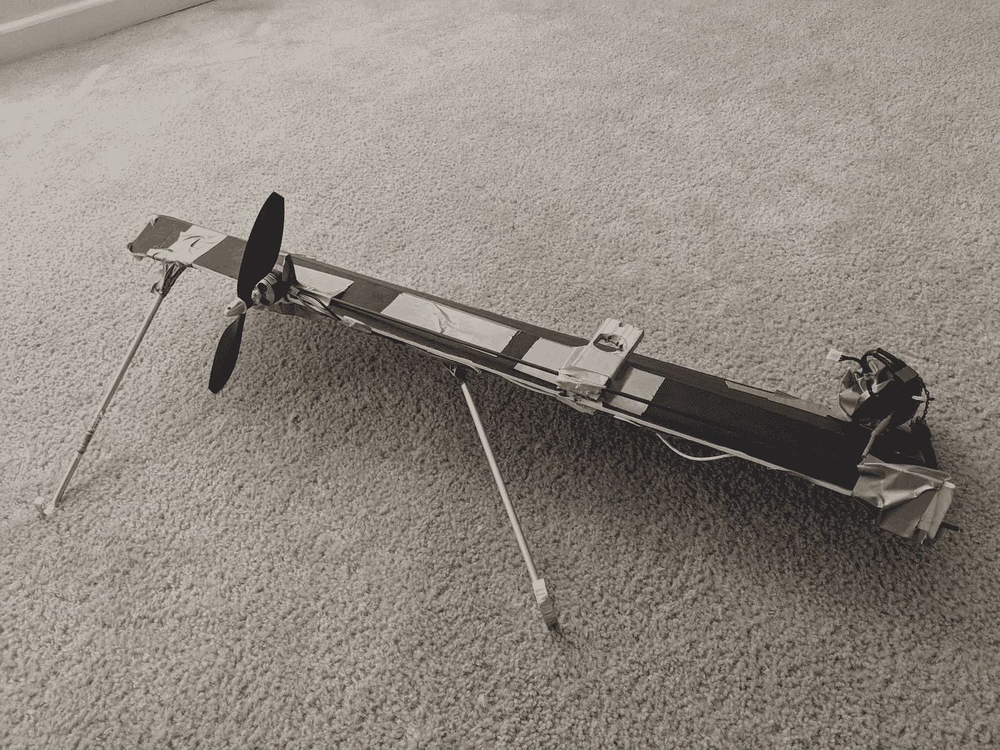
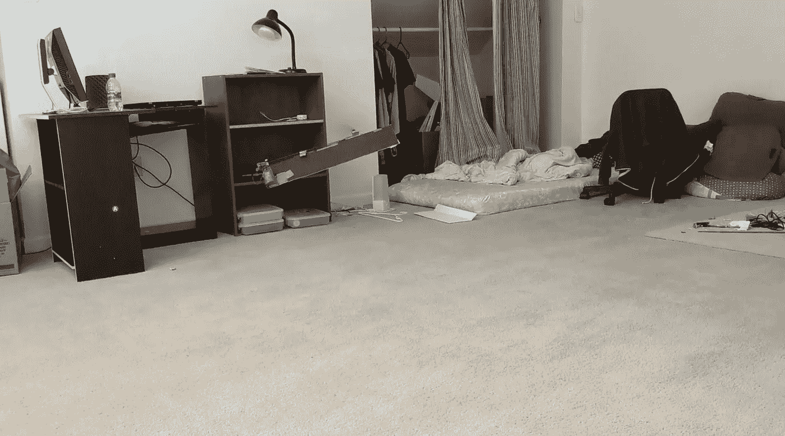
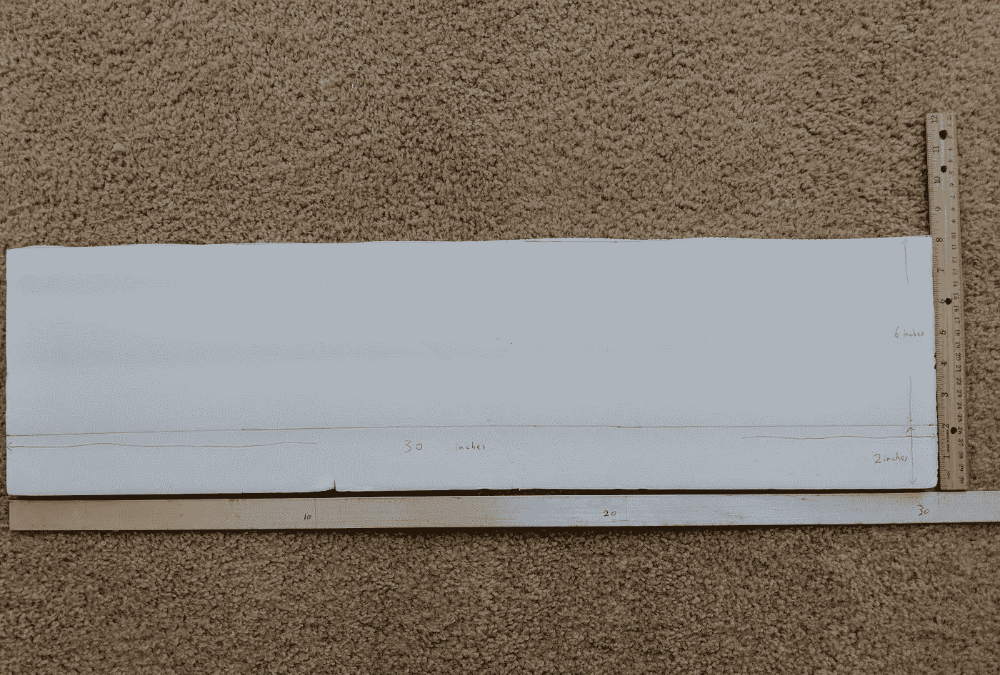
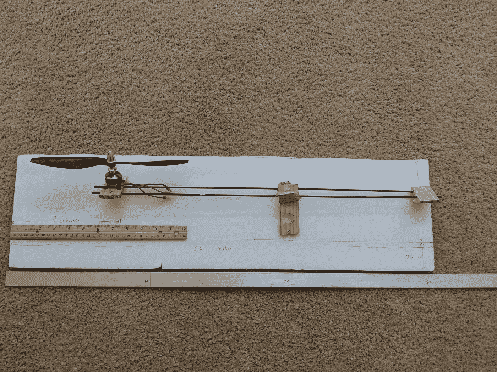
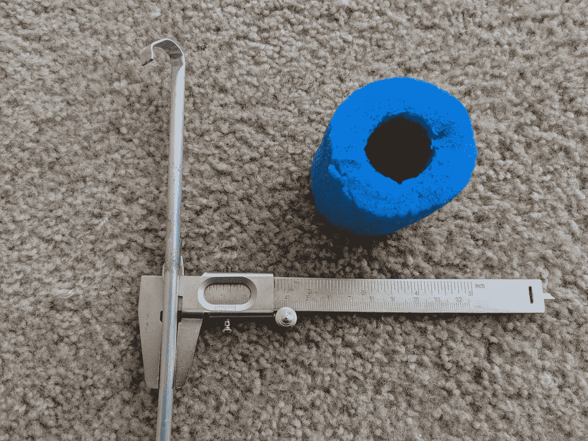
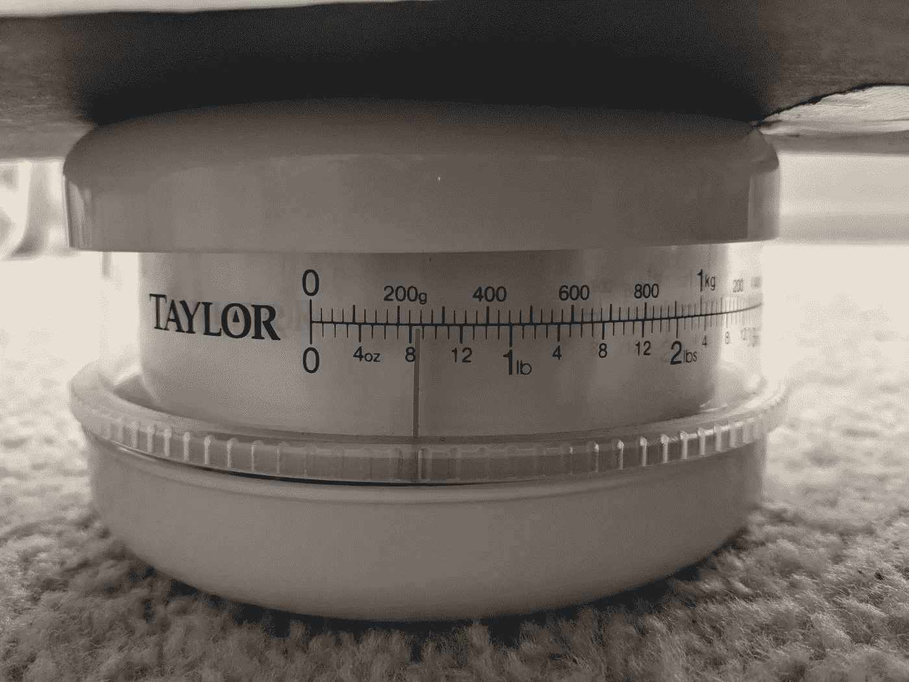
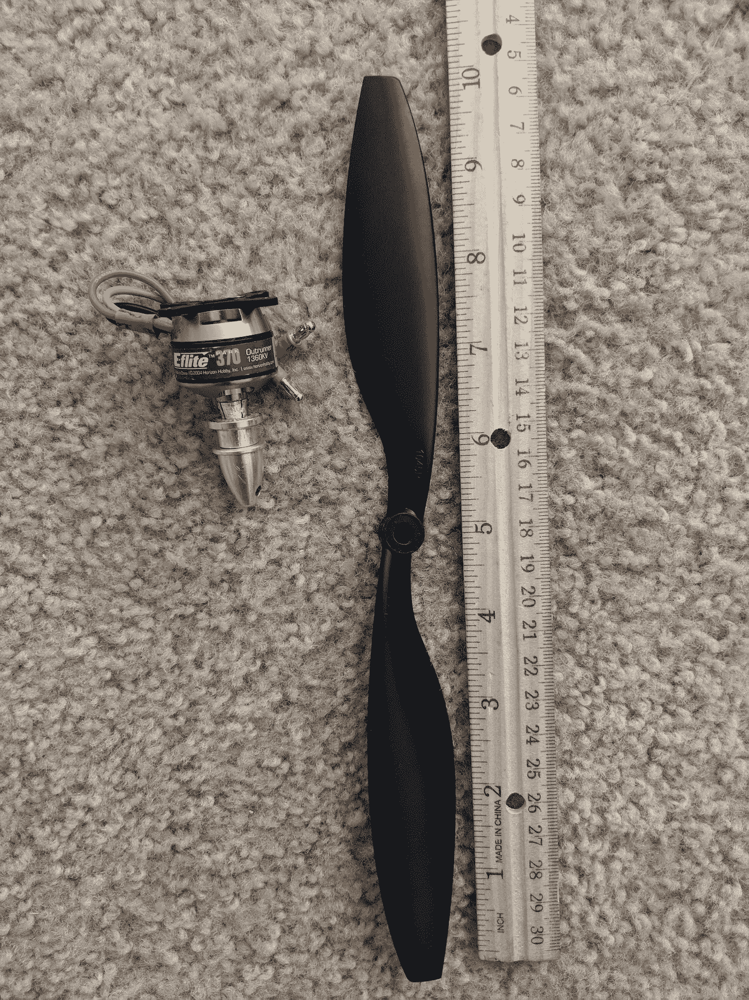
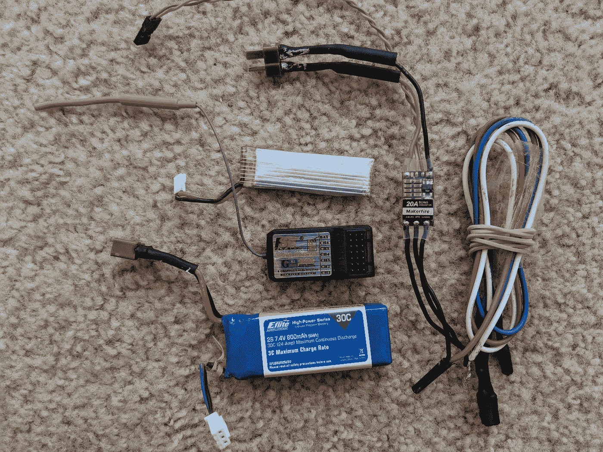

# 如何白手起家造出一架单翼飞机:一架缺了一只翅膀还能飞的飞机

> 原文：<https://medium.com/hackernoon/how-to-scratch-build-a-monocopter-an-airplane-with-a-missing-wing-8df6bfca58ab>

[单翼机](https://hackernoon.com/tagged/monocopter)是一种只有一个旋翼的[飞行器](https://hackernoon.com/tagged/flying-machine)，但可以垂直起降。

这篇文章是关于 scratch 构建一个[设计](https://hackernoon.com/tagged/design)，它看起来像一架飞机，但是少了一个机翼。下面是它的图片。

Scratch-built monocopter

这架[单翼机](https://hackernoon.com/tagged/monocopter)通过旋转飞行。它的翅膀就像直升机的叶片。下面是它飞行的视频和图像。

An airborne monocopter

Flight test of the monocopter

# 机翼:

我从一块美元的泡沫板上剪下一个长方形。这个长方形的尺寸是 8 英寸乘 30 英寸。为了形成机翼，我在距离前缘 2 英寸的地方切割并折叠矩形。

The wing

# 支撑结构:

马达安装在从胶合板上切割下来的马达支架上。我将两根碳纤维棒穿过马达支架。我还在碳纤维杆上贴了更多的胶合板，这样我就可以把机翼粘在上面，防止杆的另一端松脱。

The motor mount and support structure

铝杆(直径 7 毫米)用于形成单翼机的腿。这可以防止刀片接触地面。泡沫被用来包裹电子设备和电池以防止损坏。

Protective gears : aluminum leg and foam container for the electroncis

# 负载和推进:

包括电池在内的整个单翼机重 8.5 盎司。

Weight of everything including the batteries

我从亚马逊买了马达和螺旋桨。使用的电机是 E-flite Park 370 无刷 Outrunner 电机 1360Kv。螺旋桨是 RAYCorp 1045 10x4.5 螺旋桨。

Propeller and motor

# 电子产品:

电子设备包括一个遥控接收器，2 硫脂电池和电子稳定控制速度控制器。由于我的 ESC 不提供电源，我添加了一个额外的小电池来为 RC 接收器供电。

Electronics

# 驾驶技巧:

我开始半油门旋转地面上的单旋翼飞机。然后，我慢慢地加大油门，直到单翼飞机几乎是在空中。在这一点上，我迅速增加到全油门，以保持在空中。