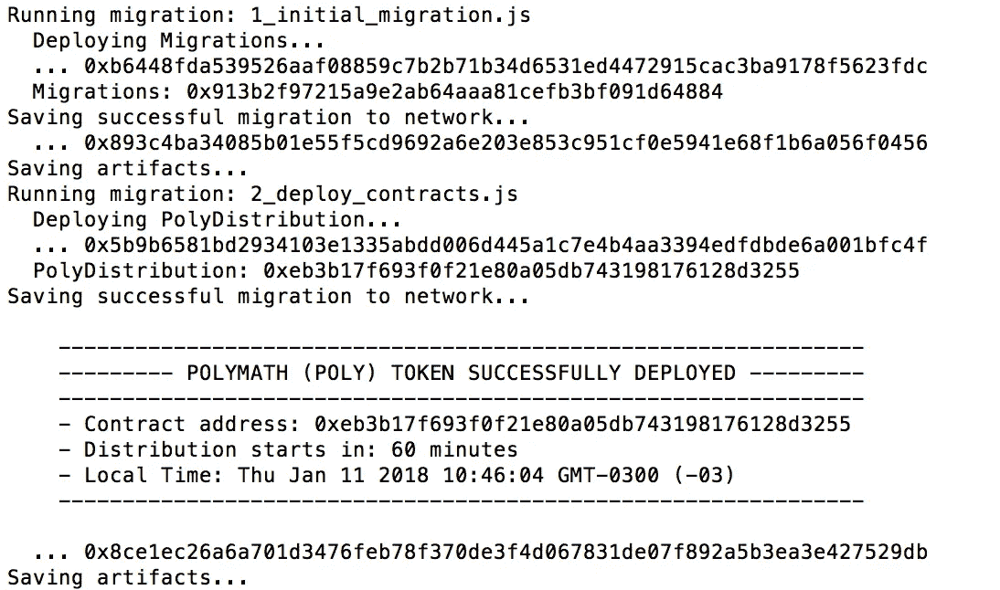
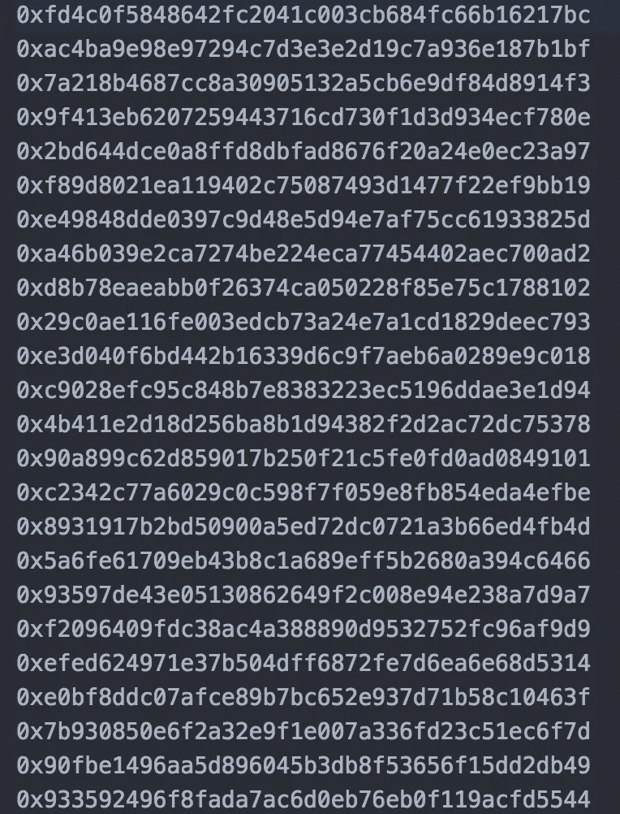
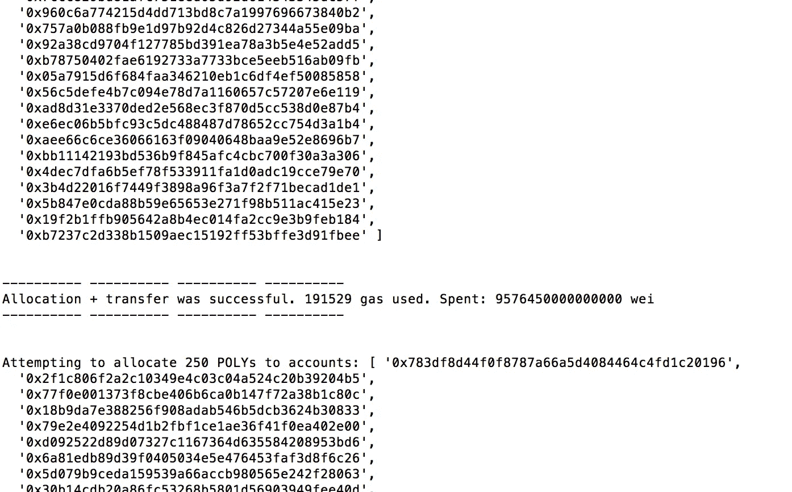
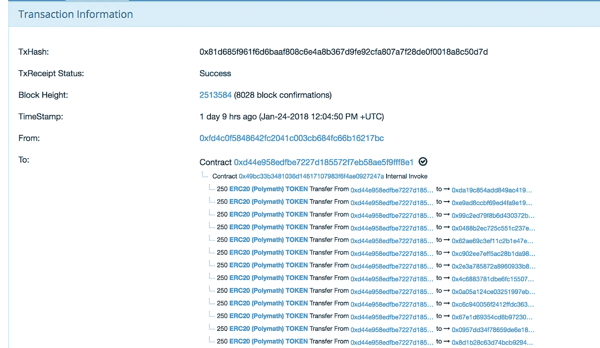

# 如何为 40k 用户编写自动令牌空投脚本

> 原文：<https://medium.com/hackernoon/how-to-script-an-automatic-token-airdrop-for-40k-subscribers-e40c8b1a02c6>


Photo by [Dose Media](https://unsplash.com/photos/DiTiYQx0mh4?utm_source=unsplash&utm_medium=referral&utm_content=creditCopyText) on [Unsplash](https://unsplash.com/search/photos/robot?utm_source=unsplash&utm_medium=referral&utm_content=creditCopyText)

我很高兴地宣布，我最近加入了[博学者](http://polymath.network)团队，成为一名可靠性工程师，负责开发基于[区块链](https://hackernoon.com/tagged/blockchain)的证券代币的新标准。🎆🎆🎆

在这篇文章/教程中，我将介绍编写 node.js 脚本的过程，该脚本执行自动令牌分发/空投到以太坊地址列表。我将使用我们为 Polymath 令牌分发过程编写的代码——这是一个非常标准的 ERC20 令牌——并检查我构建的用于处理令牌自动分发的脚本。

最初，我计划通过 Infura 运行这个脚本，这样我就不必在本地运行一个完整的节点。这需要离线签署交易，我是通过使用最新版本的 web3 中几个方便的功能来完成的。不幸的是，尽管这在 testrpc 和 Ropsten 上很管用，但在 Mainnet 上却是一场灾难。交易并没有增加，这是非常缓慢，昂贵和不可靠的。
如果你无论如何都想检查一下，[你可以参考这个早期提交](https://github.com/PolymathNetwork/polymath-token-distribution/commit/5f1d15bdc9050366a94430956ec74ffda3c93bb8)。

# 令牌和令牌分发合同

我在 Polymath 的首要任务之一是帮助团队敲定令牌和令牌分发智能合同，我们将在未来几天使用这些合同来发布 [POLY](https://hackernoon.com/tagged/poly) 令牌，并向订阅该平台的 4 万人进行空投。

我不打算详细介绍这些合同的代码，但是你可以看看它们，因为它们已经在 [Polymath 的 Github 库](https://github.com/PolymathNetwork/polymath-token-distribution)上公开了。

这里有一些关于`**PolyToken.sol**` 和`**PolyDistribution.sol**`智能合约的值得一提的事情，这将有助于理解本教程的其余部分:

*   `**PolyToken.sol**`是保利令牌的合约。这是一个非常标准的 ERC20 令牌合同，供应固定。
*   `**PolyDistribution.sol**`是处理令牌初始分发的合同。我们将预售投资者、顾问、创始人等的代币分配分开。因为空投的过程是非常不同的。在我们的例子中，我们将使用 1000 万个代币(从发行的 10 亿个代币中)进行空投，向 40，000 人分发 250 个代币。本教程中最重要的函数是`airdropTokens()`，让我们回顾一下:

```
**function airdropTokens(address[] _recipient) public onlyOwnerOrAdmin** {
    require(now >= startTime);
    uint airdropped;
    for(uint i = 0; i< _recipient.length; i++)
    {
        if (!airdrops[_recipient[i]]) {
          airdrops[_recipient[i]] = true;
          require(POLY.transfer(_recipient[i], 250 * decimalFactor));
          airdropped = airdropped.add(250 * decimalFactor);
        }
    }
    AVAILABLE_AIRDROP_SUPPLY = AVAILABLE_AIRDROP_SUPPLY.sub(airdropped);
    AVAILABLE_TOTAL_SUPPLY = AVAILABLE_TOTAL_SUPPLY.sub(airdropped);
    grandTotalClaimed = grandTotalClaimed.add(airdropped);
  }
```

`airdropTokens()`基本上做的是分发(调用 ERC20 的`transfer()`函数)250 个 POLY 令牌——它们是常规的 ERC20 令牌——到一个地址数组。对于我们收到的每个地址，只要他们还没有收到分配，我们就转移 250 个聚给他们。该过程完成后，我们更新可用的供应，并跟踪已经分发了多少令牌。

在本教程**中，我们将只关注为空投接收者分发令牌**。如上所述，这些代币的分配和转让没有授权期或悬崖期。其他类型的分配则不同，在转让/出售之前，需要满足一些特殊条件。

*如果您有兴趣了解其余的分配是如何完成的，您可以查看* `***PolyDistribution.sol***` ***中的* `*setAllocation()*` *和* `*transferTokens()*` *函数。***

# 令牌分发事件

当令牌分发日期到来时，我们团队需要做的是将令牌分发到注册空投的每个帐户。这些数据是在过去几个月里从 comapny 的网站上收集的，其中包含注册空投并在 KYC 验证过程中成功验证的每个帐户的地址。我们为空投过程收集的数据存储在一个只有一列的 CSV 文件中:每个用户的以太坊地址。

*注意，该脚本可以很容易地修改，不仅包含用户的地址，还包含应该传送多少令牌。在这种情况下，由于我们决定给每个人 250 个 POLY，这是没有必要的，我们选择在 distribution smart 合同中硬编码这个数字。*

从理论上讲，空投非常简单。我们需要做的就是为我们收集的每个地址调用 ERC20 令牌的`transfer()`函数。

如果我们只有少数几个订阅者，可以通过手动执行`transfer()` 功能来完成上述操作，但当它启动时，可能会有成千上万的人想要获得他们的令牌，一个接一个地完成上述操作将非常耗时。

# 通过 Node.js 脚本自动化令牌分发过程。

解释了令牌和分发契约的工作原理后，让我们深入研究 JS 代码。为了实现令牌分发过程的自动化，我们需要做一些事情:

1.  我们必须读取 CSV 文件，并处理它以删除空白或无效的条目。我们假设一些数据将会丢失或者一些地址可能是错误的，所以我们将确保在将它们发送到区块链之前将它们删除。
2.  我们将把地址打包到多个数组中，每个数组包含 80 个地址。为什么是 80？经过几次测试，考虑到运送代币的油费，这是一个理想的数字。根据您试图对每个条目做什么，每个事务可能会花费更多或更少的 gas，您应该相应地打包条目，以便事务不会耗尽 gas 并回滚。
3.  一旦我们有了数组集合，我们将把它们传递给智能契约上的`airdropTokens()`函数，该函数将遍历数组并调用每个订户的`transfer()`方法来发送他们的令牌。
4.  之后，我们将运行另一个进程来获取由发行合同生成的所有`Transfer`事件，这样我们就可以检查发行是否顺利。(我们将对分发的令牌进行求和，这应该与我们文件中的数据相匹配)。

**让我们从设置项目开始:**

如果你想跳过整个教程，只运行脚本，你可以在这里找到[完整的源代码](https://github.com/PolymathNetwork/polymath-token-distribution)。

## 建立

运行以下命令来设置一个全新的项目并安装所需的依赖项:

```
$ mkdir distributionTutorial
$ npm init
$ truffle init
$ npm install web3 fast-csv truffle-contract ethereumjs-testrpc  --save
```

对于这个项目，我们将使用一些库和框架:

*   Truffle: 它允许我们轻松地从 JavaScript 编译、迁移和交互我们的合同。
*   **Fast-csv:** 读取并处理 csv 文件中的数据。

您还应该安装奇偶校验，并在 Ropsten(或您喜欢的任何 testnet / mainnet)上同步它。以下命令对我来说非常有效:

```
parity — chain ropsten — rpcapi “eth,net,web3,personal,parity” — unlock <THE ACCOUNT YOU WANT TO UNLOCK> — password $HOME/password.file
```

接下来，将 Polymath Distribution 智能合同复制到项目的`contracts`文件夹中。这些文件可以在这里找到:[https://github . com/polymath network/polymath-token-distribution/tree/master/contracts](https://github.com/PolymathNetwork/polymath-token-distribution/tree/master/contracts)

打开 truffle.js 并用以下代码替换其内容:

```
module.exports = {
  networks: {
   development: {
      host: 'localhost',
      port: 8545,
      network_id: '*', // Match any network id
      gas: 3500000,
    }, 
   ropsten: {
      host: 'localhost',
      port: 8545,
      network_id: '3', // Match any network id
      gas: 3500000,
      gasPrice: 50000000000
    },
  },
  solc: {
    optimizer: {
      enabled: true,
      runs: 200,
    },
  },
};
```

以上将允许我们运行`truffle migrate --network ropsten`来将合同部署到 Ropsten testnet。在能够将合同部署到 Ropsten 之前，我们需要为 truffle 创建部署脚本。用下面的代码在`migrations`文件夹中创建一个名为`2_deploy_contracts.js`的新文件:

```
var PolyToken = artifacts.require('./PolyToken.sol');
var PolyDistribution = artifacts.require('./PolyDistribution.sol');module.exports = async (deployer, network) => {
  let _now = Date.now();
  let _fromNow = 60 * 5 * 1000; // Start distribution in 1 hour
  let _startTime = (_now + _fromNow) / 1000;
  await deployer.deploy(PolyDistribution, _startTime);
  console.log(`
    ---------------------------------------------------------------
    --------- POLYMATH (POLY) TOKEN SUCCESSFULLY DEPLOYED ---------
    ---------------------------------------------------------------
    - Contract address: ${PolyDistribution.address}
    - Distribution starts in: ${_fromNow/1000/60} minutes
    - Local Time: ${new Date(_now + _fromNow)}
    ---------------------------------------------------------------
  `);
};
```

上面的代码将在您执行`truffle migrate --network ropsten`时运行。它将把 PolyDistribution 契约部署到 Ropsten(它还处理 POLY Token 契约的部署)，将`_startTime`设置为五分钟。确保`_startTime`变量设置正确，并且一旦到达`_startTime`就尝试空投，否则执行将失败。我们使用`_startTime`来防止人们在代币分发活动开始前提取代币。

继续运行`truffle migrate --network ropsten`如果一切顺利，您应该会在控制台上看到类似如下的输出:



The tx hashes and contract address will be different for you.

如果您看不到此输出或出现错误，请确保您正在运行奇偶校验，并且完全同步。此外，确保您的帐户中有足够的乙醚用于部署 Ropsten testnet 上的合同。

记下我们刚刚部署的 Poly 分布契约的地址，我们稍后将使用它。

## 读取 CSV 文件

让我们开始编写脚本，该脚本将把 POLY 令牌自动分配给注册了 airdrop 的地址。

首先，创建一个名为`scripts`的新文件夹，并在该文件夹中创建一个名为`csv_allocation.js`的新文件。该文件将包含运行分配过程的所有代码。

在我们继续阅读和处理 CSV 文件的代码之前，让我们将文件添加到项目中。我们需要一个名为`airdrop.csv`的 1 列 CSV 文件，其中包含每个将接收令牌的地址的条目。创建该文件并将其添加到`scripts/data`文件夹。



如果你想轻松地测试 airdrop，你可以用你控制的“随机”地址自己生成这个文件。一个简单的方法是运行 testrpc 并指定想要创建多少个帐户，如下所示:

```
testrpc -m "word1 word2 word3..." -a 300
```

上面的命令将根据您提供的助记符生成 300 个帐户。将地址复制到`airdrop.csv`。

回到我们的 `csv_allocation.js`脚本，让我们添加必要的代码，以便能够读取`airdrop.csv`。`csv_allocation.js`增加如下代码:

```
var fs = require('fs');
var csv = require('fast-csv');
var BigNumber = require('bignumber.js');let polyDistributionAddress = process.argv.slice(2)[0];
let BATCH_SIZE = process.argv.slice(2)[1];
if(!BATCH_SIZE) BATCH_SIZE = 80;
let distribData = new Array();
let allocData = new Array();function readFile() {
  var stream = fs.createReadStream("scripts/data/airdrop.csv");let index = 0;
let batch = 0;console.log(`
    --------------------------------------------
    --------- Parsing distrib.csv file ---------
    --------------------------------------------******** Removing beneficiaries without address data
  `);var csvStream = csv()
      .on("data", function(data){
          let isAddress = web3.utils.isAddress(data[0]);
          if(isAddress && data[0]!=null && data[0]!='' ){
            allocData.push(data[0]);index++;
            if(index >= BATCH_SIZE)
            {
              distribData.push(allocData);
              allocData = [];
              index = 0;
            }}
      })
      .on("end", function(){
           //Add last remainder batch
           distribData.push(allocData);
           allocData = [];
           setAllocation();
      }); stream.pipe(csvStream);
}if(polyDistributionAddress){
  console.log("Processing airdrop. Batch size is",BATCH_SIZE, "accounts per transaction");
  readFile();
}else{
  console.log("Please run the script by providing the address of the PolyDistribution contract");
}
```

您现在可以通过执行以下操作来运行脚本:

```
$ node scripts/csv_allocation.js 0x0... 80
// Where 0x0... is the address of the PolyDistribution contract we previously deployed to Ropsten.
// 80 is the batch size we want to process. (How many accounts per array we want to process and send to the airdropTokens function) Can be omitted, defaults to 80.
```

**查看代码:**

首先，我们导入允许我们读取文件和处理 CSV 文件的库。

然后，如果你看最后几行代码，你会看到我们正在访问运行脚本时传递的参数，如果有聚二甲基硅氧烷契约的地址，我们调用`readFile()`函数。

`readFile()`函数的作用是访问`airdrop.csv`文件并逐行读取。在每一行，我们确保该值不为 null 或空，我们还使用 web3 的`isAddress()`函数来验证传递的地址是否有效。如果地址没问题，我们将其添加到一个数组中，该数组保存了我们将用来构建每个 Ethereum 事务的处理数据。
一旦数据被完全处理完毕，我们到达文件的末尾，我们就调用一个函数，该函数将获取 80 个地址的数组并对其进行处理。

*请注意，该功能非常简单，可以进一步改进以检测超过 POLY 供应量的令牌量、重复地址等。所有这些情况仍然在合同方面得到处理，但是如果我们能节省一些对 Ethereum 的事务调用，那就太好了。*

## 处理令牌分发

现在我们已经将数据处理成了一个数组——我们应该有一个名为`distribData`的数组，它包含几个数组，每个数组最多有 80 个地址——我们将为每个数组调用智能合同中的`airdropTokens()`函数。

```
const delay = ms => new Promise(resolve => setTimeout(resolve, ms));**async function setAllocation() {**console.log(`
    --------------------------------------------
    ---------Performing allocations ------------
    --------------------------------------------
  `);let accounts = await web3.eth.getAccounts();let polyDistribution = await PolyDistribution.at(polyDistributionAddress); for(var i = 0;i< distribData.length;i++){try{
      let gPrice = 50000000000;
      console.log("Attempting to allocate 250 POLYs to accounts:",distribData[i],"\n\n");
      let r = await polyDistribution.airdropTokens(distribData[i],{from:accounts[0], gas:4500000, gasPrice:gPrice});
      console.log("---------- ---------- ---------- ----------");
      console.log("Allocation + transfer was successful.", r.receipt.gasUsed, "gas used. Spent:",r.receipt.gasUsed * gPrice,"wei");
      console.log("---------- ---------- ---------- ----------\n\n")
    } catch (err){
      console.log("ERROR:",err);
    } }
}
```

让我们仔细看看这个函数。JS 脚本中的`setAllocation()`只需遍历填充了来自 csv 文件的已处理数据的`distribData`数组，然后对于每个条目数组，我们继续对智能契约执行`airdropTokens()`，传递数组。

对于我们处理的每一批地址，我们检索事件日志并打印花费了多少汽油，以确保处理成功。

*每批应消耗的气体量大致相同。如果有一个批次的汽油成本更低，这意味着该批次中的一些地址没有被转移令牌，可能是因为它们以前已经被转移了令牌。*

## 从 ERC20 令牌读取转移事件以验证交易

收工前我们可以做的最后一件事是访问 ERC20 POLY token Transfer()函数的事件日志，这样我们可以快速检查有多少帐户获得了令牌。

在`setAllocation()`功能的末尾增加以下几行:

```
console.log("Distribution script finished successfully.")
  console.log("Waiting 2 minutes for transactions to be mined...")
  await delay(90000);
  console.log("Retrieving logs to inform total amount of tokens distributed so far. This may take a while...")let polytokenAddress = await polyDistribution.POLY({from:accounts[0]});
  let polyToken = await PolyToken.at(polytokenAddress);var sumAccounts = 0;
  var sumTokens = 0;var events = await polyToken.Transfer({from: polyDistribution.address},{fromBlock: 0, toBlock: 'latest'});
  events.get(function(error, log) {
      event_data = log;
      //console.log(log);
      for (var i=0; i<event_data.length;i++){
          //let tokens = event_data[i].args.value.times(10 ** -18).toString(10);
          //let addressB = event_data[i].args.to;
          sumTokens += event_data[i].args.value.times(10 ** -18).toNumber();
          sumAccounts +=1;
          //console.log(`Distributed ${tokens} POLY to address ${addressB}`);}
      console.log(`A total of ${sumTokens} POLY tokens have been distributed to ${sumAccounts} accounts so far.`);
  });
```

上面的代码添加了一个超时，因此我们给事务一些时间来完成挖掘，然后我们得到 POLY 令牌的`Transfer()`事件，通过作为 PolyDistribution 契约的`from`字段过滤事件。

然后，我们对事件进行计数，并计算分发了多少令牌。我们可以用这些数据与原始文件进行比较。我们还可以列出每个获得令牌的地址，或者添加一个比较 CSV 文件和事件日志数据的函数，如果我们想更有趣的话。

## 执行脚本

就是这样！让我们试试这个剧本。运行以下命令:

```
$ node scripts/csv_allocation.js 0x0...
// Replace 0x0... with the address of the PolyDistribution contract you deployed to Ropsten
```

如果一切顺利，您应该会在控制台上看到如下内容:



如果你去[以太网扫描](http://ropsten.etherscan.com)并输入你部署的多分销合同的地址，你应该看到这样的内容:



如果您可以在 CSV 文件中看到每个帐户的`Transfer()`事件，那么恭喜您！
您已经成功完成空投！

感谢你通读这篇教程，我希望你能像我写这篇教程一样喜欢阅读它。敬请关注更多与我在区块链构建下一代令牌化证券平台的冒险经历相关的文章、教程和故事！

如果你正在做你自己的空投，需要建议，请在下面的评论区联系我，或者发邮件给我，我会尽我所能尽快回复。