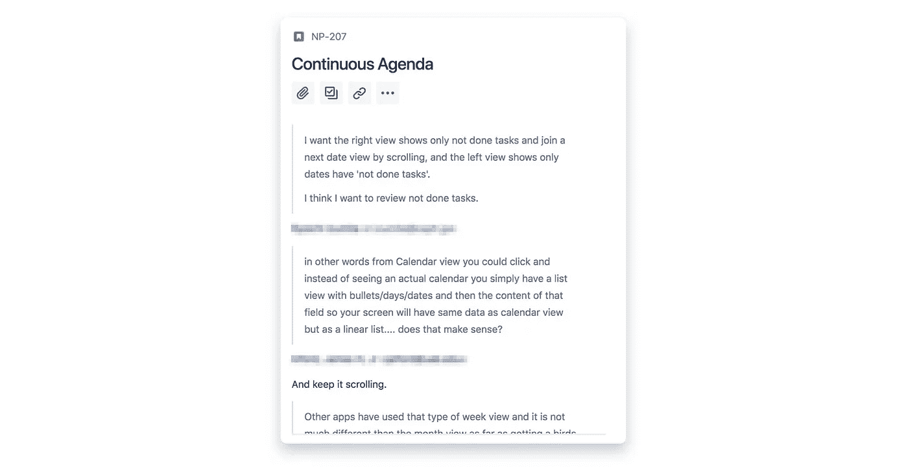

# 如何一个人操作 Scrum

> 原文：<https://medium.com/hackernoon/how-to-scrum-for-one-man-operations-e8fc0dc5a58c>

Originally published on [**noteplan.co**](http://www.noteplan.co/blog/how-to-scrum-for-one-man-operations/)

Scrum 通常适用于至少有 3 名开发人员的团队。而且身边还有一个 Scrum 高手和产品负责人。然而，即使对于单人操作和独立开发者来说，敏捷框架也充满了宝石。在接下来的段落中，我将描述我如何通过首先浏览 Scrum 事件来使用 Scrum 框架，我如何将它们应用于我的应用程序的开发，然后我如何管理积压。这不完全是“书本上的 Scrum ”,然而，Scrum 包含了非常有用的习惯，即使在工作环境之外，作为个人 Scrum，也能让我们人类更快乐和更有效率。我还用我发现对我很有用的实践来填充这个框架。

*我已经使用 Scrum 框架在 swift 中从头开始(完全重写)构建了我的 app 的 2.0 版本，“*[*【note plan*](https://noteplan.co)*”，这是我在这个过程中不得不学习的。我是把 Scrum 引入之前工作的公司学习的，拿到了 PSM 1 证书。*

# 工具

我在用吉拉。UX 并不总是直观的，但是它给了你低价实现 Scrum 所需要的东西(以及更多)。我之前在 Trello 里面尝试过，但是太乱了。无论我怎么做，我很快就失去了概述。98%的时间我在吉拉使用产品和 sprint backlog，并添加或提炼用户故事。在 sprint 结束时，我花了另外 2%的时间写报告。

我也尝试过使用白板、索引卡、便利贴等物理方法。看起来很花哨，但不实用。你需要一些简单的复制粘贴和搜索功能的数字。

# 一个 Scrum 事件

首先，快速总结一下事件。在 Scrum 中，你会遇到:

*   **sprint 规划**在 sprint 的开始，决定 Sprint 的目标，并挑选你能处理的最大用户故事，以实现这个 Sprint 的目标。
*   冲刺评审在冲刺结束时收集关于你刚刚完成的产品增量的反馈，最好是来自真实客户的反馈
*   以及 **Sprint 回顾**(在回顾之后)来反思你做得如何，并寻找改进自己的方法。
*   在这两者之间，你会遇到**待办事项细化**来保持待办事项的干净和更新。这使得冲刺规划的方式更快更容易。
*   最后，还有**每日 Scrum** 会议或“站立”来同步活动并创建当天的计划。

不管你是一个人还是一个团队，都没有关系。你仍然可以并且应该举办 Scrum 活动。作为独立开发者，你可以这样做。

## 1.**冲刺规划**

这里你给自己定一个目标(好习惯！)并从你认为能在接下来的 2 周内完成的吉拉优先产品待办事项中挑选所有用户故事(假设你的 sprint 是 2 周)。如果您保持了 backlog 的整洁和最新，这可能只需要几分钟。结果就是 sprint 积压。这很简单，吉拉支持创建产品待办事项列表、冲刺待办事项列表和冲刺目标，包括开始和结束时间。

Example of starting a sprint in Jira.

您为 sprint backlog 选择的所有用户故事(不是 bug)也应该使用故事点进行评估(这个数字代表用户故事之间的相对大小，通常从 1 到 13，从斐波那契数列中选取:1、2、3、5、8 或 13)。为什么是故事点？您可以计算您的平均速度，衡量您的生产力，并使规划更可预测。你正在完成的点数(这意味着“完成”),包括单元测试和手工测试等。)是你的速度。

## 2.冲刺回顾

在 sprint 结束时，在 Sprint Review 中，你可以自己检查产品，但是如果你能从你的用户那里得到反馈会更好。你可以通过电子邮件、Twitter、Reddit 等与你的用户交流，而不是邀请他们参加会议(如果“只是”一个小应用程序，这变得相当困难)。来验证你是否在正确的轨道上。这偏离了传统的 Scrum，因为评审应该是 sprint 结束时的单个事件。

*我是这样做的:*

> 在发布一个更新后，我经常马上收到带有反馈的电子邮件，因为我鼓励用户在变更日志中写回信。如果你有一个测试程序，这是最好的。此外，我有时会主动给用户发邮件，看看最新的增量。由于我还有原始反馈和保存在用户故事中的电子邮件地址，我可以联系相关用户。我自己每天也在使用 [NotePlan](https://noteplan.co) (我正在开发的应用程序)，这让我有很多机会从最终用户的角度来审视新功能和漏洞修复。

## 3.冲刺回顾

在这里，您回顾一下过去两周的冲刺情况。你的工作流程中有什么可以改进的地方吗？你使用的工具有没有造成什么问题？有什么更好的方法可以节省时间和提高质量吗？如果是，(你应该总能找到一些东西)你把它作为一个用户故事添加到下一个 sprint 中。理想情况下，你在每次冲刺中都学习和提高自己一点点。对于软件项目，这通常意味着单元测试、自动化 UI 测试、持续集成等等。有比你现在使用的工具更好的工具吗？或者有更好的库可以使用吗？

*我是这样做的:*

> 我有一个现实生活中的复古例子:我在 XCode 里面有单元测试和 UI 测试，在发布之前我都至少运行一次。浪费时间的一个大问题是，测试从开始到结束从来都不是一次点击就能自动运行的。有些失败了，甚至造成了崩溃，但不是由于应用程序的错误或变化。相反，我没有以干净的方式关闭一些测试，这样下一个测试就不能独立运行了。这意味着我必须重新运行这些测试，手动点击每一个测试，直到它们完成。在一次复古中，我认识到了这一点，并在接下来的冲刺中修复了它。这为我现在和将来节省了无数的时间，我可以更快地释放。我想添加到我的工作流程中的下一点是与 Jenkins 的持续集成。更频繁地自动运行测试。

## 4.积压优化

这可能发生在你计划下一次冲刺的时候，或者在你处理反馈的时候。您检查项目的优先级是否仍然正确，评估用户故事，并锐化描述和标题。或者给现有的项目添加更多的想法和背景。

*我是这样做的:*

> 每隔 1-2 天，我就会批量处理带有反馈的电子邮件。在这个过程中，我需要打开并编辑产品 backlog，以添加新的用户故事、bug 或向现有用户故事添加更多上下文。与此同时，如果我注意到某个项目比当前的待办事项更重要，我会重新安排它的优先级。通常，我会跟进用户对特定功能的需求或缺陷，以了解更多信息。这意味着我每隔一天都会学到一些关于我正在开发的应用程序的新东西，这也应该反映在 backlog 中，这样就不会丢失任何东西。

## 5.每日混战

在这里，你可以通过回顾当前的 sprint 待办事项，思考(或者更好:日记，这也是一个好习惯)最后一天过得如何，以及今天你打算做什么，以及路上是否有任何障碍需要你去处理。这也是更新 sprint backlog 并检查 sprint 还剩多少天的机会。

*我是这样做的:*

> 在我的日记中(或者有时只是在我短暂的晨间散步时在脑海中)，我简要地回顾了昨天哪些事情进展顺利，哪些事情本来可以做得更好(你也可以在一天结束时这样做)。我昨天没有完成的待办事项被重新安排到今天(如果你需要一个应用程序来帮助你，请查看我的应用程序“ [NotePlan](https://noteplan.co) ”)。如果一个用户故事或 bug 被关闭，我会回顾 sprint backlog 并选择下一个。

This is how a sprint backlog looks like in Jira with the Kanban board layout. The label showing the remaining days is quite useful.

—

就这些，我们已经介绍了所有的 Scrum 事件。在我看来，每一个事件都承载着一个富有成效的习惯:1。设定目标和增量规划，2。回顾你的工作，3。回顾和提高自己，4。提炼和更新你的计划(backlog)最后 5。每日反思(或日志)。

# 产品积压以及事情如何到达那里

在下面的段落中，我描述了(在我看来)作为一名独立应用程序开发人员填充和管理产品积压的理想方式。如何管理积压工作不是 Scrum 的一部分，只是你有一个积压工作。

产品(和 sprint backlog)是你的产品所在的地方。我在把所有东西都加到待办事项里。每一条反馈。是的，一切。因为一切都很重要，而且越多越好。这在吉拉非常有效。由于项目的优先级和使用过滤器，您不会被大量的项目淹没。

积压是反馈循环的关键部分。很简单:最重要的项目在顶部。什么重要？所有这些你从用户那里一遍又一遍听到的有形的东西。如果你已经建立了一个好的反馈循环，即使你放弃你的旧系统，从头开始，积压的工作也会很快完成。

# 反馈回路

我将概述它通常如何为我工作，然后深入到重要的几点:

1.  从用户那里收到一封带有**反馈**的电子邮件，比如功能建议或错误报告。
2.  将反馈作为用户故事添加到 **backlog** 中。然后将邮件中的相关部分连同用户的邮箱地址一起直接复制到用户故事描述中(这样在功能或 bug 完成后就可以回信了)。
3.  **优先考虑**用户故事或 bug。*亲提示:*bug 永远是重中之重。把它们推到你待办事项的首位。您不想让 bug 在您的待办事项中挥之不去。尽快修好它们。你反复听到的、符合你的产品愿景的功能需求也应该放在最上面。
4.  最终，你**实现**特性或者修复接近顶端并进入你的 sprint 的 bug。实际用户的原始描述在开发过程中变得非常方便。
5.  用户获得**更新**，打开他们最喜欢的电子邮件应用，循环再次开始。

## 1.& 2.捕捉原始反馈

反馈可以来自用户、你自己、团队成员(如果你有的话)或任何其他可信的来源。来自实际付费用户的反馈通常比没有“游戏中的皮肤”的人更有价值。这里重要的部分是捕捉原始信息。不要试图在这一点上解释和浓缩反馈。你可以添加你认为用户的意思，但总是保存原来的。创建新的用户故事或 bug 后，将其保存在吉拉项目的描述部分。一旦您开始开发，这将非常方便。此外，保存分享反馈的用户的电子邮件地址。如果您需要关于已关闭特性或 bug 的反馈，这将变得非常有用。或者你需要澄清什么。此外，迅速回复并鼓励人们给你写信。保持反馈循环！

*我是这样做的:*

> 当你获得反馈时，你就戴上了产品负责人的帽子。我分批处理反馈。意味着我会等到积累了足够多的电子邮件和信息，通常是 1-2 天，然后逐一查看，给出详细的回复或澄清细节。我会回复我收到的每一封邮件，通常会在 1-2 天内回复。通常围绕几个特性展开小讨论。我想鼓励一次谈话。

User Story with original snippets of feedback from different users along with a way to contact them back.

严格来说这不是 Scrum，但是你可以把它看作评审的一部分。因为你通常不能邀请利益相关者和客户参加一个单独的实时会议，所以你需要在发布后从现有用户那里获取。由于您保存了来自多个用户的每条反馈以及电子邮件地址，您现在可以写下它们，并询问他们喜欢它的程度。您的用户会因为您的响应能力和快速开发而喜欢您。

## 3.优先考虑

每当您处理反馈或审查待办事项时，您都需要这样做。这可以看作是“Backlog 精化”的一部分。根据 Scrum max。团队 10%的时间应该花在这上面。所以慢慢来，但不要发疯。优先级有时是一个移动的目标。或者功能的优先级差不多，很难说。只要确保最重要的项目在顶部附近。同样，使用故事点来评估你的用户故事。这些是描述特征大小的相对值。稍后，如果你想计算你的速度(每次冲刺你做了多少个故事点),这就变得有用了，使用它你可以估计你什么时候完成了一组用户故事(比如一个特定的版本)。

**现在关键部分:**永远先修复 bug。理想情况下，backlog 中没有 bug。如果没有 bug，就可以发货了。你很灵活。您可以快速添加新功能。所以他们一进来就修理他们。如果你目前正在开发一个特性，完成它，然后从顶部开始处理第一个 bug。

为什么会这样？bug 没有故事点。因为它们属于某个用户故事，这意味着这个故事还没有完成(或者没有经过很好的测试)。还有，估计一个 bug 真的很难。马上修复它会降低你的速度——这是应该的。它给你一个更现实的价值。最坏的情况是，如果您连续开发了几个月，然后决定在临近发布日期时快速测试并修复 bug。你会惊讶这需要多长时间。它变成了一种瀑布模型。

Bugs are always at the top for me. I add them right away to the sprint backlog once I read about a bug in an email from a user.

## 4.& 5.如何快速、经常地发货

短距离冲刺和在冲刺结束时潜在的可释放增量的想法不是发布蹩脚的更新。你运输质量。“诀窍”是将测试和 bug 修复作为过程的一部分。效率和自动化程度越高越好。这通常可以通过自动单元和 UI 测试来解决。

*我是这样做的:*

> 就像每个优秀的程序员应该做的那样，如果可能的话，我首先编写单元测试(如果不是 UI 组件，这很容易)。我不只是先写单元测试，我在写的时候用单元测试来测试实现。启动整个应用程序并导航到使用您当前正在实现的功能的视图是多么浪费时间？运行单元测试要快得多。我可以在不到一个小时的时间里，使用超过 160 个单元测试和近 30 个 UI 测试，以自动化的方式测试大部分应用程序。UI 测试占用了大部分时间，并且经常会发现一些问题。我用这一天剩下的时间修复任何出现的问题，并做一些手工测试以确保万无一失。

尝试在每次 sprint 之后，甚至在一次 sprint 中多次发布更新(只要你不要用新的下载来烦用户)。进行两周的短跑训练。这对于大多数项目来说都是合适的。如果你以前和你的用户接触过，那么在更新上线后不久，反馈会再次涌入。你也可以更主动地给那些请求这些特性或报告你刚刚关闭的 bug 的人发消息，询问他们对结果的看法。这就是反馈回路结束的地方。

# 版本、史诗和标签

在吉拉，使用待办事项旁边的侧面板，可以很容易地根据版本和史诗进行筛选:

These are the filters I’m using right now as I’m ramping up NotePlan for version 2.0.

您可以为您正在开发的主要版本使用不适合单一 sprint 的版本。像个版本“2.0”。然后引入相关的用户故事。记得保持低量。它太容易膨胀，并且永远朝着这个版本发展。

史诗是你需要分解的大用户故事。在吉拉，史诗只是另一个过滤器。将多个用户故事捆绑成一个相关的史诗。

*我是这样做的:*

> 我主要使用版本过滤器。这有助于我将注意力集中在一组用户故事上，而推迟我认为不太重要或者需要花很多努力才能实现的其他故事。我把重要的+容易实现的用户故事精选到一个版本中。无论什么仍然重要，但对这个版本来说太多，我推进到下一个版本。如果当前版本是 2.0，我创建一个 2.1 版本。如果你在 backlog 中有数百个用户故事，通过使用版本过滤它来保持一个概述会很有帮助。

*原载于 2018 年 10 月 21 日*[*【www.noteplan.co*](http://www.noteplan.co/blog/how-to-scrum-for-solo-one-man-operations/)*。*

*感谢您阅读这篇帖子！留下掌声和大量的评论！如果你想查看我正在使用上述工作流程构建的应用程序，请点击* [*查看 NotePlan 这里*](https://noteplan.co/) *。*