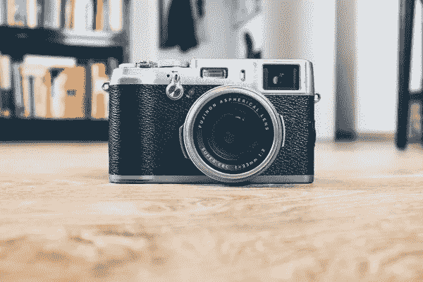
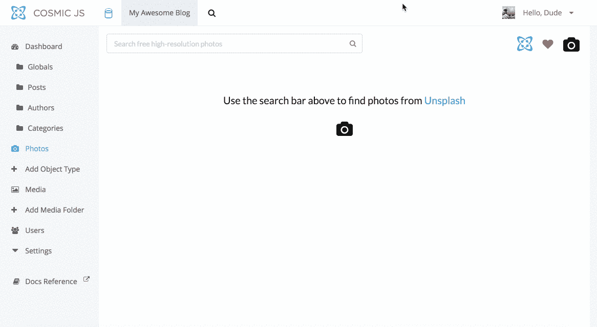

# 如何搜索和添加 Unsplash 照片到你的宇宙 JS 桶

> 原文：<https://medium.com/hackernoon/how-to-search-and-add-unsplash-photos-to-your-cosmic-js-bucket-bdeb172ae163>

在 [Cosmic JS](https://cosmicjs.com) ，我们都致力于在开发者和内容编辑的混合团队中更快地构建应用。过去，使用第三方股票摄影网站的编辑被鼓励利用[宇宙 JS 快速链接](https://cosmicjs.com/articles/how-to-add-quick-links-to-your-cosmic-js-bucket-jd5dailj?ref=search)将这些第三方工具保存到他们的[宇宙 JS](https://cosmicjs.com) 仪表板。现在，编辑们可以使用新的 [Unsplash Photos 扩展](https://cosmicjs.com/extensions/unsplash-photos)来查找并添加库存照片到他们的媒体库，所有这些都可以从他们舒适的桶形仪表板上完成，而不必与 Unsplash 等第三方网站进行交互。

# TL；博士:

[Unsplash Photos Extension](https://cosmicjs.com/extensions/unsplash-photos)
[Unsplash Photos Extension code base](https://github.com/cosmicjs/unsplash-extension)
[Unsplash Photos Extension on Product Hunt](https://www.producthunt.com/posts/unsplash-photos-extension)

现在，您可以在您的 [Cosmic JS](https://cosmicjs.com) 桶中搜索和添加未曝光的照片，这一切都可以从您的桶仪表盘中完成。只需导航到[宇宙 JS 扩展页面](https://cosmicjs.com/extensions/)并点击安装[照片扩展](https://cosmicjs.com/extensions/unsplash-photos)。

安装完成后，您将在仪表板左侧导航栏中看到“照片”选项卡。点击“照片”选项卡，开始输入您的查询，查找照片并将其添加到您的 [Cosmic JS](https://cosmicjs.com) 媒体库，以供立即或以后使用。

我希望本教程对你有所帮助。如果你对 [Cosmic JS](https://cosmicjs.com) 系统中的内容编辑器功能有任何问题或意见，我很乐意倾听。你可以参考我的 [Cosmic JS 个人资料](https://cosmicjs.com/carsongibbons)来获取更多关于如何直观导航 Cosmic JS 仪表盘的内容。