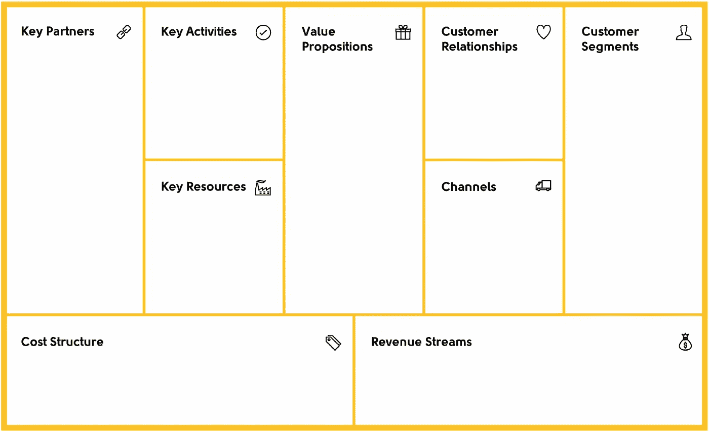

# 如何选择正确的商业模式来创造顶级产品或服务

> 原文：<https://medium.com/hackernoon/how-to-select-the-right-business-model-to-create-a-top-product-or-service-7bf21a3d9db4>

你能想到的每一个企业或公司都有一个共同点——它们都始于一个想法。一个好的想法可以解决一个问题或者增加当前的价值。提出一个想法是为了解决一个未解决的问题，还是仅仅为了升级某些产品或服务而将现有的解决方案应用到新的环境中，这都无关紧要。这一切都是为了激励你采取行动，通过改变环境来创造价值。当你被某个绝妙的想法击中，你经历了能量和成就感的爆发，确保你把那种能量作为动力来源，因为工作最困难的部分即将开始。

## 商业模式

商业[模式](https://hackernoon.com/tagged/model)是第一个指南，它将解释你的想法的整个概念，并以你的合作伙伴、经销商、潜在投资者和其他所有利益相关者都能理解的形式表达出来。对商业模式最简单的解释是“你赚钱的方式”，但我喜欢从更复杂的角度来观察它，这不仅有助于你理解现金流的来源，还有你企业的整体经济价值。

## 如何选择正确的商业模式

开发商业模式应该是一个过程，而不是从互联网上复制粘贴。当然，你可以找到很多“已完成的商业模式”，但是经历整个过程会给你机会去关注关于你的业务的正确细节，并随着你的进展学习更多。它还会让你洞察潜在的问题，并展示额外的优势。一旦你完成了，你工作的最终产品可能会看起来像你可以在网上找到的东西，但这不是重点——这样做的重点是获得你在哪里和你要去哪里的更大图片。为了指导你开发商业模式的过程，我将向你介绍**商业模式画布**，这是一个建立适合你独特商业理念的商业模式的好方法。

商业模式画布是由亚历山大·奥斯特瓦尔德(Alexander Osterwalder)开发的，[strategyzer.com](http://strategyzer.com/)的联合创始人，也是《商业模式的产生》一书的作者，该书以 30 种语言售出了 100 万册。他的画布由九个部分组成:客户群、价值主张、渠道、客户关系、收入流、资源、活动、伙伴关系和成本。

The Business Model Canvas

## 商业模型画布

商业模式画布是在对商业模式文献进行详尽研究后发明的。有很多商业模式的定义和指导方针，所以 Business Model Canvas 作为一个解决方案，将所有现有商业模式指南中最重要的部分结合在一起。在商业模式画布发明出来之后，企业家们对它进行了测试，以确保它是可行的。这种想法首先被 3M 和德勤采用，后来被精益创业运动采纳，它在帮助企业家创造独特的商业模式同时保持一切简单方面有很长的历史。

想了解更多关于商业模式画布如何工作的信息，请访问由亚历山大·奥斯特瓦尔德亲自创建的 strategyzer.com 公司。

## 新产品/服务开发流程

构建创新产品或开始一项新服务有几种方法。在这一章中，我们将讨论三个最常见的问题；首先是“建立它，他们就会来”的方法，然后是风险较小的“增量规划”方法，最后是“建立、测试、修复”的方法，这是创业公司最常用的方法。

## 建造它，他们就会来

这种方法通常可以在新企业中看到，新的创始人对推广某种产品或服务有强烈的热情，但缺乏市场分析的经验。他们所做的假设通常是基于他们的个人感知，而忽略了某种产品或服务的市场条件的事实证据。创始人在这种方法中处理的步骤包括:

1.  仅仅基于对未来客户和市场条件的假设来制造产品或设计新服务
2.  向投资者寻求资金，但由于没有足够的证据证明确实需要该产品或服务而遭到拒绝
3.  不断增加广告预算，为产品做广告
4.  当人们不蜂拥购买产品或服务时感到沮丧

然而，这种方法并不是每次都注定要失败，当然，总会有一些人使用这种方法并取得成功的例子。他们中的一些人可能只是运气好，而其他人可能真的很擅长识别人类需求和行业趋势——这最终使他们在使用这种方法时获得了一点优势。尽管如此，还是有更多的人将他们一生的积蓄投入到一个没人想买的产品上。

关键是，在数字营销的时代，你几乎可以衡量一切，信息比以往任何时候都更容易获取，你不应该只根据你的主观感知来做决定。没有详细的市场调查就开发新产品是有风险的，如果事与愿违，代价会非常昂贵。

*随着时间的推移，我们将继续出版我的免费电子书* ***的某些部分，从零到商业英雄*** *，这样你就能感受到书中涵盖的所有材料的*价值*，并邀请你在*[*【FromZerotoBusinessHero.com】*](https://fromzerotobusinesshero.com/)*亲自查看这本书。*

***甚至还有价值 55K 美元的大赠品专为读者准备(*** [***第 125 页***](https://fromzerotobusinesshero.com/) ***)。***

我们希望你会喜欢它，就像我们喜欢制作它一样。

*原载于*[*www . Avalon . host*](https://www.avalon.host/blog/how-to-select-the-right-business-model-to-create-a-top-product-or-service/)*。*