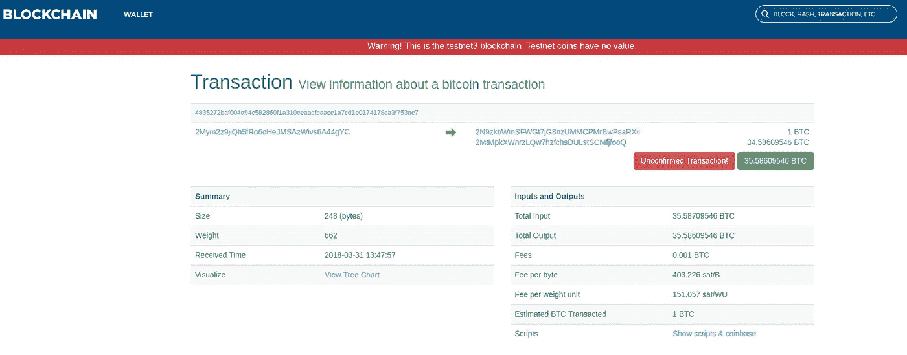
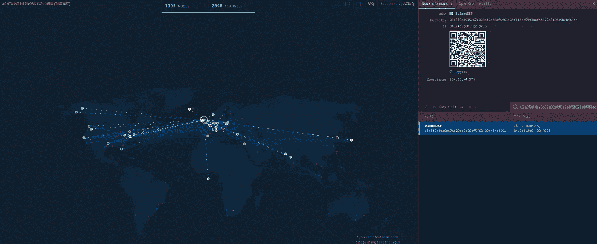
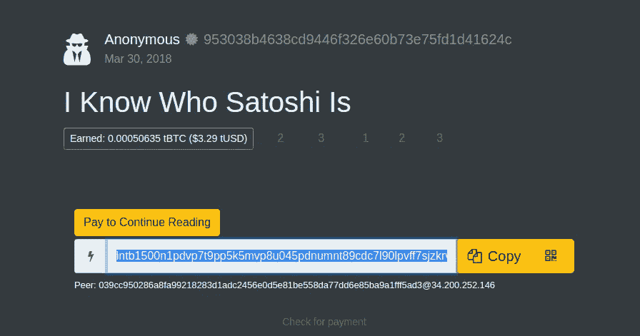
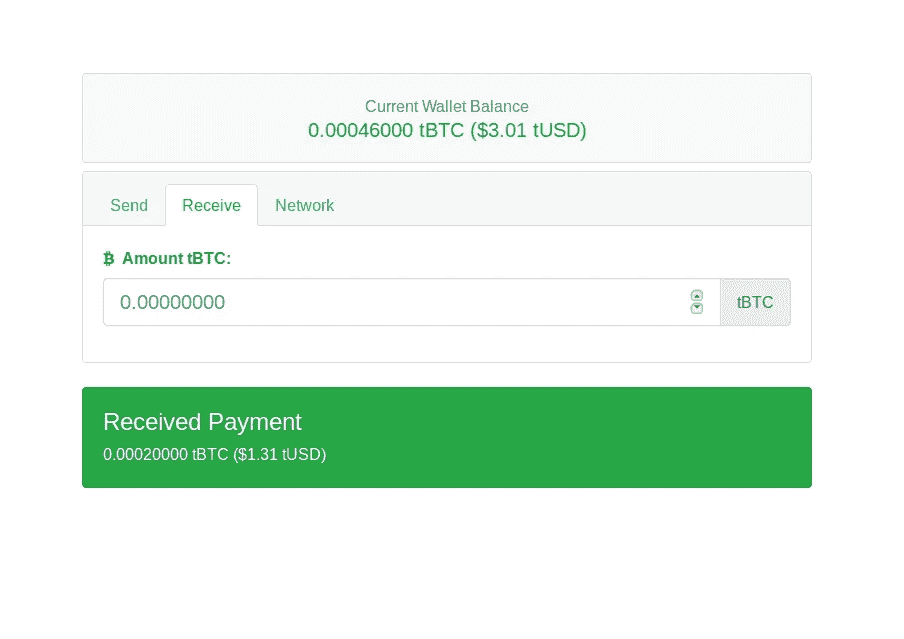

# 如何使用终端发送比特币闪电网络支付

> 原文：<https://medium.com/hackernoon/how-to-send-bitcoin-lightning-network-payments-for-0-00013-usd-fees-1f525153ee9>

在本指南中，我将带你通过使用[比特币](https://hackernoon.com/tagged/bitcoin)的第二层[闪电网络](https://hackernoon.com/tagged/lightning-network)使用 **testnet** 进行演示来完成支付。我们将使用命令行，因为我发现这是使用网络最可靠的方式，这样做可以让您更深入地了解网络是如何运行的。

# 先决条件

你可以访问一个闪电节点。正在运行`bitcoind`和`lightningd`并同步到测试网区块链 2。已安装 blockstream 的 [c-lightning](https://github.com/ElementsProject/lightning) cli 工具`lightning-cli`，并可在其`$PATH`中访问。

如果你还需要设置一个的话，看看我的[设置闪电网络节点指南](https://andrewgriffithsonline.com/blog/180330-how-to-setup-a-lightning-node)。

# 1.生成地址和资金钱包

第 1 层 BTC 交易= 1。等待时间= 60 分钟。

创建新地址。

去 [testnet 水龙头](https://testnet.manu.backend.hamburg/faucet)给自己发点比特币。提示—使用 chrome 获得使用 IPV6 的 70%奖励！

点击下方出现的交易 ID 链接，将带您进入[区块链浏览器](https://testnet.blockchain.info/)，了解交易详情。

你需要等待 6 次确认——大约 1 小时后，资金才会出现在你的钱包里。

```
$ lightning-cli listfunds
{
 "outputs": [{
  "txid": "d30ad72742d5c05343f65a1f78a90191f7b13341ed309cad0297a4e2fd3f0196",
  "output": 1,
  "value": 64849668,
  "status": "confirmed"
 }]
}
```



# 2.连接到一个同行并创建一个支付通道

第 1 层 BTC 交易= 1。等待时间= 60 分钟。

为了在网络上进行支付，您首先需要连接到网络。如何找到另一个要连接的节点？前往 Acinq 的[闪电网络浏览器](https://explorer.acinq.co/)。

寻找一个良好连接的同行(一个有很多渠道)，并复制其 URI。我最初在几个节点上超时了，只要继续尝试，你会找到一个立即连接的节点。

```
$ lightning-cli connect 03e5f9d1935c67a029bf0a26af5f63109f4f4c45993a8f45177a8f2f39bcb46144 77.58.162.148 9735$ lightning-cli list peers
{
 "state": "GOSSIPING",
 "id": "03e5f9d1935c67a029bf0a26af5f63109f4f4c45993a8f45177a8f2f39bcb46144",
 "alias": "IslandDSP",
 "netaddr": ["84.246.200.122:9735"],
 "connected": true
}
```

现在，我们将与刚刚连接的对等方创建一个支付通道。打开和关闭通道需要与主区块链进行交互，所以我们希望为它提供一笔可观的资金(以毫秒计)，以便我们可以使用它进行多次支付。

```
$ lightning-cli fundchannel 03e5f9d1935c67a029bf0a26af5f63109f4f4c45993a8f45177a8f2f39bcb46144 50000 $ lightning-cli listpeers
{
 "id": "03e5f9d1935c67a029bf0a26af5f63109f4f4c45993a8f45177a8f2f39bcb46144",
 "connected": true,
 "netaddr": ["84.246.200.122:9735"],
 "alias": "IslandDSP",
 "color": "68f442",
 "channels": [{
    "state": "CHANNELD_AWAITING_LOCKIN",
    "owner": "lightning_channeld",
    "channel_id": "958b3bd04adb40fd8ff0700a0b24e0298a2ac265273c08ed0218af38140ba678",
    "funding_txid": "78a60b1438af1802ed083c2765c22a8a29e0240b0a70f08ffd40db4ad03b8b95",
    "msatoshi_to_us": 500000000,
    "msatoshi_total": 500000000,
    "dust_limit_satoshis": 546,
    "max_htlc_value_in_flight_msat": 18446744073709552000,
    "channel_reserve_satoshis": 0,
    "htlc_minimum_msat": 0,
    "their_to_self_delay": 6,
    "our_to_self_delay": 144,
    "to_self_delay": 6,
    "max_accepted_htlcs": 483,
    "status": ["CHANNELD_AWAITING_LOCKIN:Funding needs more confirmations."],
```

再次，在[比特币测试网浏览器](https://testnet.blockchain.info/)中搜索`txid`，并等待 3-6 次确认，然后通道才被视为开放。如果是，您应该会看到状态更改为`CHANNELD_NORMAL`。

```
$ lightning-cli listpeers
{
 "peers": [{
  "id": "03e5f9d1935c67a029bf0a26af5f63109f4f4c45993a8f45177a8f2f39bcb46144",
  "connected": true,
  "netaddr": ["84.246.200.122:9735"],
  "alias": "IslandDSP",
  "color": "3399ff",
  "channels": [{
   "state": "CHANNELD_NORMAL",
   "owner": "lightning_channeld",
   "short_channel_id": "1289768:416:0",
   "channel_id": "ba95c71228ce3f57e25f6ac9c4a7418a52a056435b2276dd47437c7521ebda8e",
   "funding_txid": "8edaeb21757c4347dd76225b4356a0528a41a7c4c96a5fe2573fce2812c795ba",
   "msatoshi_to_us": 100000000,
   "msatoshi_total": 100000000,
   "dust_limit_satoshis": 546,
   "max_htlc_value_in_flight_msat": 18446744073709552000,
   "channel_reserve_satoshis": 0,
   "htlc_minimum_msat": 0,
   "their_to_self_delay": 6,
   "our_to_self_delay": 144,
   "to_self_delay": 6,
   "max_accepted_htlcs": 483,
   "status": ["CHANNELD_NORMAL:Funding transaction locked. Channel announced."],
   "in_payments_offered": 0,
   "in_msatoshi_offered": 0,
   "in_payments_fulfilled": 0,
   "in_msatoshi_fulfilled": 0,
   "out_payments_offered": 0,
   "out_msatoshi_offered": 0,
   "out_payments_fulfilled": 0,
   "out_msatoshi_fulfilled": 0
  }]
 }]
}
```



# 3.生成付款申请

现在我们已经建立了一个确定的渠道，我们可以开始使用闪电网络进行交易。

转到[Y’alls](https://yalls.org/)上的一篇文章，点击“继续阅读”按钮生成付款请求。这实际上是一张序列化发票。解码它，以检查你没有被多收费！

```
$ lightning-cli decodepay lntb1500n1pdvp7t9pp5k5mvp8u045pdnumnt89cdc7l90lpvff7sjzkrvawg93ju3mgg3nsdp62fjkzepqg9e8g6trd3jn5gzfyp9kummhyptksmeq2dshgmmndp5jqjtnp5cqzyskw8lzg7w4hcfyhncczcaexlpx3tdefm0vjnh9dkqev23g94tdta8jjqzp87v6r9q8xwe3mnjf0tryaa7zkxxj4gwgfcqea32j0x069qqsjyjhz
{
 "currency": "tb",
 "timestamp": 1522596197,
 "created_at": 1522596197,
 "expiry": 3600,
 "payee": "039cc950286a8fa99218283d1adc2456e0d5e81be558da77dd6e85ba9a1fff5ad3",
 "msatoshi": 150000,
 "description": "Read Article: I Know Who Satoshi Is\r",
 "min_final_cltv_expiry": 144,
 "payment_hash": "b536c09f8fad02d9f37359cb86e3df2bfe16253e848561b3ae41632e47684467",
 "signature": "3045022100b38ff123ceadf0925e78c0b1dc9be13456dca76f64a772b6c0cb151416ab6afa022079480209fccd0ca0399d98ee724bd63277be158c69550e42700cf62a93ccfd14"
}
```



# 4.付款

第 2 层 BTC 事务= 1。等待时间=毫秒。

现在，我们已经做好了进行第二层比特币交易的一切准备，交易应该立即得到确认。

```
$ lightning-cli pay lntb1500n1pdvp7t9pp5k5mvp8u045pdnumnt89cdc7l90lpvff7sjzkrvawg93ju3mgg3nsdp62fjkzepqg9e8g6trd3jn5gzfyp9kummhyptksmeq2dshgmmndp5jqjtnp5cqzyskw8lzg7w4hcfyhncczcaexlpx3tdefm0vjnh9dkqev23g94tdta8jjqzp87v6r9q8xwe3mnjf0tryaa7zkxxj4gwgfcqea32j0x069qqsjyjhz
{
 "code": 206,
 "message": "Fee 1100 is 0.733333% of payment 150000; max fee requested is 0.500000%",
 "data": {
  "fee": 1100,
  "feepercent": 0.733333,
  "msatoshi": 150000,
  "maxfeepercent": 0.500000,
  "getroute_tries": 6,
  "sendpay_tries": 0,
  "failures": []
 }
}
```

回到 Y'alls，点击“检查付款”按钮显示文章。不幸的是，这对我不起作用。当我在命令行上检查时，我发现确实没有付款。

```
$ lightning-cli listpayments
{ "payments": [] }
```

为了解决这个问题，我试图直接与 Y 'alls 创建一个支付渠道(当他们为您创建发票以继续阅读时，他们的地址被列为“同行”)。

```
$ lightning-cli connect 039cc950286a8fa99218283d1adc2456e0d5e81be558da77dd6e85ba9a1fff5ad3 34.200.252.146$ lightning-cli fundchannel 039cc950286a8fa99218283d1adc2456e0d5e81be558da77dd6e85ba9a1fff5ad3 500000
{
 "code": -1,
 "message": "received ERROR channel 3795216ba4a257a1f36f1062af58b4513ad82dac90d298e45ca83271e67cf1d6: Unacceptable channel constraints: minimum HTLC value is too large: 0"
}
```

显然，这是一个已知的[错误](https://github.com/ElementsProject/lightning/issues/1213)与`[lnd](https://github.com/lightningnetwork/lnd)`，你们必须使用他们的闪电守护进程。

作为备用计划，我们将使用 web lightning 钱包向自己付款。转到 [htlc.me](https://htlc.me/) 生成一个钱包，然后点击“接收”选项卡，请求支付 0.0001 tBTC(0.65 tUSD 美元)。复制序列化发票，并在付款前进行检查。

```
$ lightning-cli decodepay lntb100u1pdvzzc4pp5h55942ehdpy5g70sty9mnvt3k2wlvt4ucnctnellau8drhaew8lsdqqcqzyswv3n3vyzx9uua4tjl8ttcp5fp7srn80zywvg4vses6fj4q9n3v846mgkuu648u37venf93znkckadjejvddv04vyq5l2krx486z23ysqhcrxg6
{
 "currency": "tb",
 "timestamp": 1522600725,
 "created_at": 1522600725,
 "expiry": 3600,
 "payee": "03193d512b010997885b232ecd6b300917e5288de8785d6d9f619a8952728c78e8",
 "msatoshi": 10000000,
 "description": "",
 "min_final_cltv_expiry": 144,
 "payment_hash": "bd285aab3768494479f0590bb9b171b29df62ebcc4f0b9e7ffef0ed1dfb971ff",
 "signature": "30440220732338b0823179ced572f9d6bc06890fa0399de223988ab21986932a80b38b0f02205d6d16e73553f23e666692c453b62dd6cb32635ac7d584053eab0cd53e84a892"
}
```

这一次，当我尝试付款时，我收到了多个错误。

```
$ lightning-cli pay lntb100u1pdvzzc4pp5h55942ehdpy5g70sty9mnvt3k2wlvt4ucnctnellau8drhaew8lsdqqcqzyswv3n3vyzx9uua4tjl8ttcp5fp7srn80zywvg4vses6fj4q9n3v846mgkuu648u37venf93znkckadjejvddv04vyq5l2krx486z23ysqhcrxg6
{
 "failures": [{
    "type": "FAIL_PAYMENT_REPLY",
    "erring_index": 1,
    "failcode": 4103...
```

然而，当我刷新 htlc.me 的网页时，我发现支付已经成功了。在控制台检查确认付款已经完成。

```
$ lightning-cli listpayments
{
 "payments": [{
  "id": 1,
  "payment_hash": "bd285aab3768494479f0590bb9b171b29df62ebcc4f0b9e7ffef0ed1dfb971ff",
  "destination": "03193d512b010997885b232ecd6b300917e5288de8785d6d9f619a8952728c78e8",
  "msatoshi": 10000000,
  "msatoshi_sent": 10002020,
  "timestamp": 1522601027,
  "created_at": 1522601027,
  "status": "complete",
  "payment_preimage": "3e75637befbeec9e7056a4103a06d652cd3cdee9134de69799d8b39c6b1f714c"
 }]
}
```

我们发了一笔款项，只支付了 2020 毫希的交易费(在撰写本文时为 0.00013 美元)！

最后，让我们尝试与 [htlc.me](https://htlc.me/) 直接连接，这样我们就不会在支付时出现任何控制台错误。从上面的`decodepay`命令输出中复制`payee` id，并在 [lightning 网络浏览器](https://explorer.acinq.co/#/n/03193d512b010997885b232ecd6b300917e5288de8785d6d9f619a8952728c78e8)中搜索它。复制 URI，然后连接到它，并创建一个频道。

```
$ lightning-cli connect 03193d512b010997885b232ecd6b300917e5288de8785d6d9f619a8952728c78e8 34.201.11.250 9735$ lightning-cli fundchannel 03193d512b010997885b232ecd6b300917e5288de8785d6d9f619a8952728c78e8 500000
```

不幸的是，我们需要等待事务在区块链上确认，以便通道变得可用。

一小时后，我们可以看到通道已经建立—状态为`**CHANNELD_NORMAL**`。

```
$ lightning-cli listpeers
{
 "id": "03193d512b010997885b232ecd6b300917e5288de8785d6d9f619a8952728c78e8",
 "connected": true,
 "netaddr": ["34.201.11.250:9735"],
 "alias": "htlc.me",
 "color": "854cc5",
 "channels": [{
  "state": "CHANNELD_NORMAL",
  "owner": "lightning_channeld",
  "short_channel_id": "1289949:56:0",
  "channel_id": "20dd321c23224b2022f62f59602efc311a8ad63c4481fcd210ef8dade88e8064",
  "funding_txid": "64808ee8ad8def10d2fc81443cd68a1a31fc2e60592ff622204b22231c32dd20",
  "msatoshi_to_us": 500000000,
  "msatoshi_total": 500000000,
  "dust_limit_satoshis": 546,
  "max_htlc_value_in_flight_msat": 18446744073709552000,
  "channel_reserve_satoshis": 0,
  "htlc_minimum_msat": 0,
  "their_to_self_delay": 6,
  "our_to_self_delay": 144,
  "to_self_delay": 6,
  "max_accepted_htlcs": 483,
  "status": ["CHANNELD_NORMAL:Funding transaction locked."],
  "in_payments_offered": 0,
  "in_msatoshi_offered": 0,
  "in_payments_fulfilled": 0,
  "in_msatoshi_fulfilled": 0,
  "out_payments_offered": 0,
  "out_msatoshi_offered": 0,
  "out_payments_fulfilled": 0,
  "out_msatoshi_fulfilled": 0
 }]
}
```

现在在 [htlc.me](https://htlc.me/) 上生成另一张发票，这次是 0.00020000 tBTC(1.31 tUSD)，并在付款前检查详细信息是否正确。

```
$ lightning-cli decodepay lntb200u1pdvzvf8pp5tyjfw9ma9uj8hhrhqvmum9vzvaun45qg6mmesu3c08zkhmgl44ssdqqcqzysah4qe4zef3rssusa42cyx0gxxq6q06g50m38w7chz50en80dfh45fj7kdgpx474udehq22mv2pwxfky66kdjdrw88z34w8hjjdjdu6sq6zy2a4
```

最后付款。

```
$ lightning-cli pay lntb200u1pdvzvf8pp5tyjfw9ma9uj8hhrhqvmum9vzvaun45qg6mmesu3c08zkhmgl44ssdqqcqzysah4qe4zef3rssusa42cyx0gxxq6q06g50m38w7chz50en80dfh45fj7kdgpx474udehq22mv2pwxfky66kdjdrw88z34w8hjjdjdu6sq6zy2a4
{
 "id": 2,
 "payment_hash": "592497177d2f247bdc770337cd958267793ad008d6f798723879c56bed1fad61",
 "destination": "03193d512b010997885b232ecd6b300917e5288de8785d6d9f619a8952728c78e8",
 "msatoshi": 20000000,
 "msatoshi_sent": 20000000,
 "timestamp": 1522610489,
 "created_at": 1522610489,
 "status": "complete",
 "payment_preimage": "1e2767675a227c7f8d57252bfe67d6324829c267f3df38396b4d2bb79a27dfd6",
 "getroute_tries": 1,
 "sendpay_tries": 1,
 "route": [{
  "id": "03193d512b010997885b232ecd6b300917e5288de8785d6d9f619a8952728c78e8",
  "channel": "1289949:56:0",
  "msatoshi": 20000000,
  "delay": 144
 }],
 "failures": []
}
```

这次没有控制台错误。您在 [htlc.me](https://htlc.me/) 的网络钱包应该会立即检测到付款。您现在应该能够立即以类似的低费用进行任何数量的后续支付，直到您耗尽您渠道中的资金或到期。



# 结论

如您所见，testnet 上的节点至少可以说是粗略的。三个主要的 lightning 软件实现(lnd、c-lightning、eclair)都还处于早期开发阶段，所以存在一些 bug 并不奇怪。但这至少会让你对未来当网络更大，运行网络的软件更成熟时，交易会变得多么便宜和快捷有所了解。

*最初发布于*[*andrewgriffithsonline*](https://andrewgriffithsonline.com/blog/guide-to-make-lightning-network-payments)