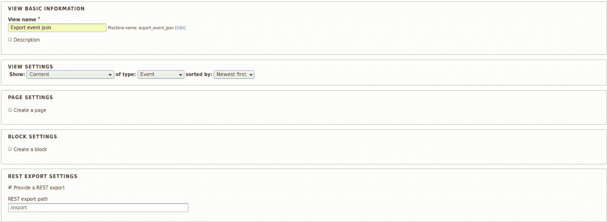
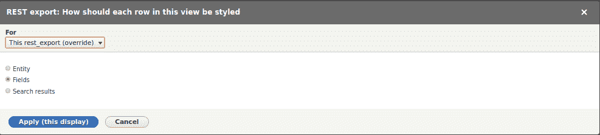
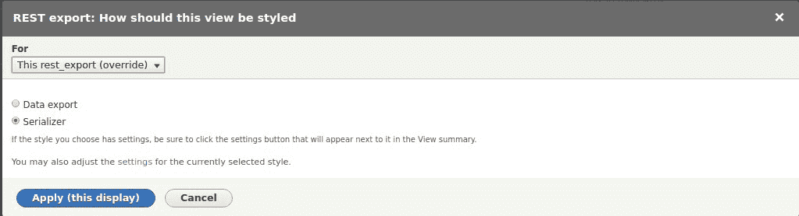
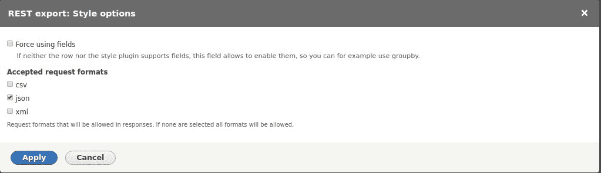
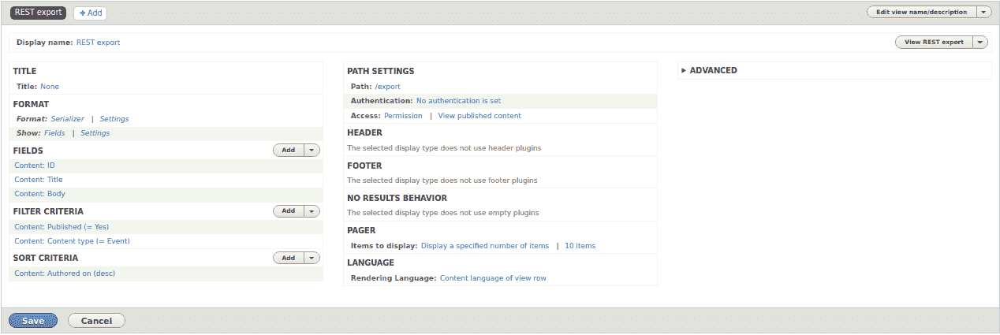
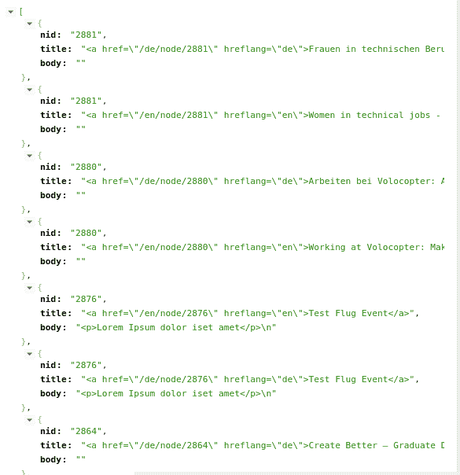

# 如何从 Drupal 8 站点发送 JSON 数据？

> 原文：<https://medium.com/hackernoon/how-to-send-the-json-data-from-a-drupal-8-site-306145e5f5a1>

[By ADCI Solutions](https://www.adcisolutions.com/?utm_source=medium&utm_medium=referral&utm_campaign=medium-story-json-adciwebsite&utm_content=medium-story-json-1)

想象一种情况:您的移动应用程序需要使用 JSON 从 Drupal 8 上的站点获取一些信息。为什么是 JSON？为什么不是 XML？我的客户机需要 JSON 格式的数据，但是为什么在我们的例子中选择 JSON 呢？在客户端应用程序方面，JSON 数据处理非常简单。另一方面，以 JSON 格式发送的数据可能会有安全问题。所以最好在服务器端使用 XML，在客户端使用 JSON。

如何不费力地安装额外的模块，**如何以编程方式改变 JSON 数组**，以及在使用和不使用视图的情况下发送 JSON 数据——所有这些您都将从本文中学到。

# 在 Drupal 8 中创建和发送 JSON 格式数据的几种方法

好消息！您不需要编写代码或下载额外的模块来配置使用 REST 发送 JSON 数据的**和定制 JSON 数组**。你需要的一切都已经在 Drupal 8 的核心里了。首先，您需要安装视图和 Rest 模块，并确定导出的内容类型。如果您从未工作过并且不熟悉 Rest 模块，我建议您在阅读本文其余部分之前先熟悉一下本指南[。](https://www.adcisolutions.com/knowledge/restful-web-services-drupal-8-quick-start-guide?utm_source=medium&utm_medium=referral&utm_campaign=medium-story-json-restful-guide&utm_content=medium-story-json-2)

## 发送带有 REST 和视图的 JSON 数据

**第一步**

创建新视图。在这一步，您只需选择一个名称、内容类型，单击“REST EXPORT SETTINGS ”,并设置一个路径，通过该路径您将在以后获得 JSON 格式的数据。

Create a new view

**第二步**

选择字段。如果您选择一个实体，JSON 将立即发送所有节点字段，但是如果您选择字段，您可以指定想要发送的字段。

Choosing the style of content in view

**第三步**

选择这个视图应该如何样式化，我选择一个标准选项—序列化器(区域格式，显示->设置)。

Choose how this view should be styled

**第四步**

选择 JSON 格式。(区域格式，序列化程序->设置)。

Style options — json

在视图中，我选择了 ID、title 和 body 字段。因此，视图将只根据这些字段中包含的数据形成一个数组。

How the view should look like in the end

在 Chrome“Rest API Testing”扩展的帮助下，我可以在创建的视图的地址(http://hostname/export)获得这个结果。

JSON result in the chrome plugin

## 用规范化器以编程方式发送 JSON 数据

使用视图，您可以定制一个 JSON 数组，并只指定将要返回的某些字段。但是，如果您的应用程序需要以一种您不能在视图中配置的特定形式接收 JSON 数组，该怎么办呢？您可以利用 Normalizer。在自定义模块中，我们创建了文件“services ”,并有必要将优先级设置为高于或等于 2，以便以最高优先级执行自定义规格化器。否则，什么都不管用。

接下来，向/ src / Normalizer 文件夹添加一个类。由于 Rest 模块允许以 JSON 格式接收站点上的不同内容，在**自定义规范器**的帮助下，我们可以为事件内容类型(或任何其他类型)重新定义给定数组的类型。

因此，我们还可以重新定义在前面的方法中创建的视图的输出。

## 用控制器发送 JSON 数据

然而，如果您需要从特定的路径获得完全自定义的 JSON 数组，那么通过规范化器重新定义数组会非常不方便。此外，规范化器的**覆盖将影响该内容类型的所有节点的 JSON 结构**，这就是为什么您可以使用一个更简单的方法:您可以始终使用控制器发送 JSON 数据，将该数据调整到某个路径。这种方法确实可以帮助解决一个更具体的问题，例如，在我的例子中，必须将所有的节点放在一个公共数组中，这是很难甚至不可能通过一个视图来实现的。你可以在本文的[中学习如何创建一个带有控制器的定制模块。](https://www.adcisolutions.com/knowledge/oop-drupal-8-and-how-use-it-create-custom-module?utm_source=medium&utm_medium=referral&utm_campaign=medium-story-json-oop-drupal8&utm_content=medium-story-json-3)

首先，创建一个路由文件并分配一个路径，该路径将使用 GET 方法来获取 JSON。

控制器文件将如下面的代码示例所示。使用控制器和 JSONResponse 中的自定义方法，我们可以完全按照我们想要的方式发送 JSON 数组。

这里我们不使用硬编码的 Symfony 和 Rest 模块方法来改变 JSON 数组，而是创建我们自己的数组。

## 结论

我向您展示了如何在 Drupal 8 中使用 REST 和 JSON 的几种方法，每种方法在某种程度上都对我有用，我希望它们能减少找到特定问题解决方案的时间。

如果你想使用这些解决方案，你可以在 GitHub 找到代码[。](https://github.com/ADCI/knowledge-how-send-json-d8)

**作者是索菲亚·霍多尔科夫斯基，ADCI 解决方案公司的网络开发人员**

索菲娅有着真正多才多艺的个性，她总是给我们的团队带来欢乐。她的工作方式非常新颖和高效，这使得索菲亚成为一名优秀的团队成员。她喜欢做所有有趣的事情，喜欢看电视剧和电影。

*原帖* [*于 ADCI 解决方案网站*](https://www.adcisolutions.com/knowledge/how-send-json-data-drupal-8-site?utm_source=medium&utm_medium=referral&utm_campaign=medium-story-json-knowledge&utm_content=medium-story-json-4) *。*

**在社交网络上关注我们:** [Twitter](https://twitter.com/ADCISolutions) | [脸书](https://www.facebook.com/adcisolutions/) | [LinkedIn](https://www.linkedin.com/company/adci-solutions/)

 [## 如何创建一个无头的 Drupal 站点

### 在我以前的文章“Drupal 8 中的 RESTful Web 服务:快速入门指南”中，我只是提到了一些可能性…

hackernoon.com](https://hackernoon.com/how-to-create-a-headless-drupal-site-a88519f8ce7b)