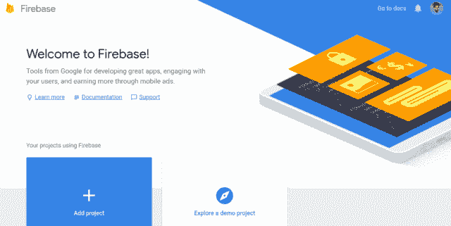
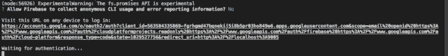
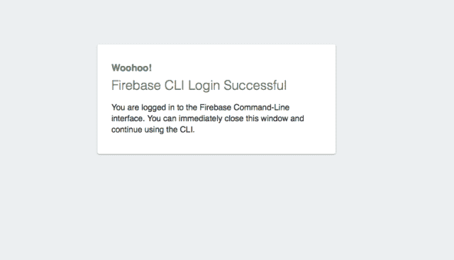
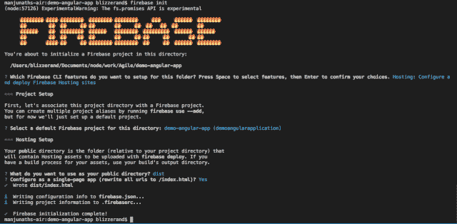

# 如何在 Firebase 上设置角度应用程序

> 原文：<https://medium.com/hackernoon/how-to-set-up-an-angular-application-on-firebase-ed9c7a3654dd>

Angular 是一个前端框架，专注于声明性模板、依赖注入，并集成了一些最佳实践来降低 web 开发的挑战性。Angular 的架构是围绕可重复使用的组件构建的，其构建方式有助于开发人员为 web、移动和桌面编写代码。

在本教程中，我们将讨论如何快速部署 Angular 应用程序，以及您可能会遇到的一些挑战。

# 我们先来看看 Angular CLI

Angular CLI 是官方的命令行工具，让您可以生成、构建、调试和服务 Angular 应用程序，并运行测试和部署它们。

这是一个基本的工具，可以用来为您的 Angular 应用程序创建推荐的样板文件。要安装 Angular CLI，您可以使用以下 npm 命令:

```
npm install -g @angular/cli
```

要创建新的角度应用程序，您只需运行以下命令:

要在本地主机上提供应用程序，可以使用以下命令:

```
cd demoFirebaseApp
ng serve
```

接下来，您需要创建一个 Firebase 帐户。

# 设置 Firebase 帐户

您将需要创建一个 [Firebase 帐户](http://firebase.google.com/),以便能够部署您的应用程序并公开发布。

为什么选择 Firebase？我们选择 Firebase 而不是其他替代方案，因为它易于设置，您可以在几分钟内启动并运行您的 Angular 应用程序。

除了 Firebase，还有亚马逊 S3，这也是理想的文件存储。对于实际的产品构建，您还可以使用 AWS toolkit 来自动化构建过程。

借助 AWS，您可以设置冗余的 S3 存储桶，或者为 AWS 使用[第三方备份工具，这样在上传新的生产版本时就不会出现中断。](https://n2ws.com/product/aws-backup)

这有助于你更快地发布你的产品，并且符合原则**“自动化一切”**。

接下来，你需要遵循以下步骤来设置你的 Firebase 账户。

1.  如果你还没有的话，创建一个 firebase 帐户。单击“添加项目”按钮创建新项目。



1.  给你的项目取一个好名字。我们将把它命名为“演示 Firebase 应用程序”。您还可以为您的应用程序选择子域。你的应用程序将在 subdomain.firebase-app.com 托管。

就是这样！

# 安装 Firebase 工具

要部署您的 firebase 项目，您需要安装 [firebase-tools](https://github.com/firebase/firebase-tools) ，这是一个包含 Firebase 认证和部署的工具箱。

要安装 Firebase 工具，可以使用 npm。

```
npm install -g firebase-tools
```

一旦有了这些工具，您就可以使用 firebase 命令登录到您的 firebase 帐户。运行 firebase 登录，您应该会看到类似这样的内容:



打开链接，像往常一样登录你的谷歌账户，如果一切顺利，你会看到登录成功页面。



# 在我们的 Angular 应用程序中使用 Firebase

在这一步中，我们将使用 firebase CLI 在我们的项目中初始化一个 firebase 存储库，然后使用它将构建版本推送到 firebase 存储中。

当您运行初始化脚本时，会询问您几个问题。

您希望为此文件夹设置哪些 Firebase CLI 功能？(按空格键选择特性，然后回车确认您的选择)
托管:配置和部署 Firebase 托管站点

>**为此目录选择一个默认的 Firebase 项目:**demo-angular-app(demangular application)

>**您希望将什么用作您的公共目录？**地区

>**配置为单页 app(将所有网址改写为/index.html)？**是的

默认的 firebase 项目对应于我们之前创建的项目。对于第三个问题，确保公共目录的名称是 dist。这很重要，因为 Angular 将构件放在 dist 目录中。



此处输入的详细信息是可配置的。Firebase 创建两个文件**。firebaserc** 和 **firebase.json** 。请随意打开文件查看内容。

# 部署应用程序

要部署 Angular 应用程序，可以使用 CLI 工具生成一个构建，然后使用 firebase toolkit 部署到云中。使用 Angular CLI 很容易生成构建。

Angular 生成一个/dist 目录，其中保存了所有的构建工件。如果您打开目录，您会发现以下内容及其各自的文件大小。

```
vendor.bundle.js 2.2 MB 
polyfills.bundle.js 163 KB 
main.bundle.js 13 KB 
inline.bundle.js 6 KB
styles.bundle.js 10 KB
```

2.2 MB 的包不利于生产。加载捆绑包页面可能需要几分钟时间。对于生产版本，您可以运行下面的命令。

prod 标志告诉 ng 脚本为生产生成一个构建文件。Angular 将使用行业标准技术来减少输出大小，并缩小 JavaScript 包，以便产品版本可以在您的服务器上快速加载。

如果你想知道大小的确切差别，这里是文件大小。

```
vendor.bundle.js 352 KB // Reduced from 2.2 MB 
polyfills.bundle.js 57 KB // Reduced from 163 KB 
main.bundle.js 12 KB // Reduced from 13 KB 
inline.bundle.js 2 KB // Reduced from 6 KB
styles.bundle.js 0 KB // Reduced from 10 KB
```

这几乎减少了文件大小的 80%,对于网页来说，文件大小通常是可以接受的。

现在实际部署只需要一个命令。

如果一切正常，您应该会看到类似这样的内容:

```
=== Deploying to ‘demoangularapplication’… i 
deploying hosting i 
hosting: preparing dist directory for upload… 
✔ hosting: 8 files uploaded successfully 
✔ Deploy complete! Project Console: [https://console.firebase.google.com/project/demoangularapplication/overview](https://console.firebase.google.com/project/demoangularapplication/overview)
```

托管网址:[https://demoangularapplication.firebaseapp.com](https://demoangularapplication.firebaseapp.com)

托管 URL 是网站的实际 URL。为了进一步增强和自动化这一点，您可以向 package.json 添加一个小脚本，如下所示:

```
“scripts”: { …“deploy”: “ng build — prod && firebase deploy”},
```

您现在可以执行 npm run deploy 来创建一个构建，然后将其部署到 firebase 中。

# 摘要

在这篇文章中，我们已经介绍了在 Firebase 上部署 Angular 所需要知道的一切。然后，您可以通过进入控制台将 Firebase 连接到您的域。

有了 Firebase，您可以免费进行实验，而且基本计划足以满足几乎所有的开发目的。我们希望你喜欢读这个。如果你有什么想法，请在评论中分享。

*原载于 2018 年 7 月 4 日*[*【codeforgeek.com】*](https://codeforgeek.com/2018/07/how-to-set-up-an-angular-application-on-firebase/)*。*