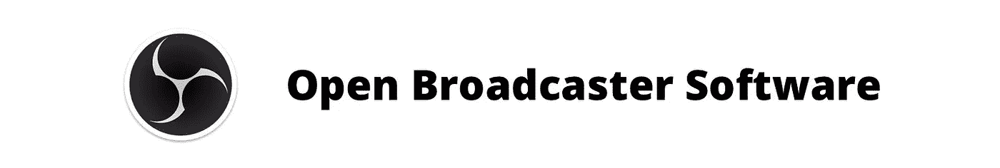
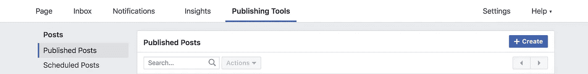
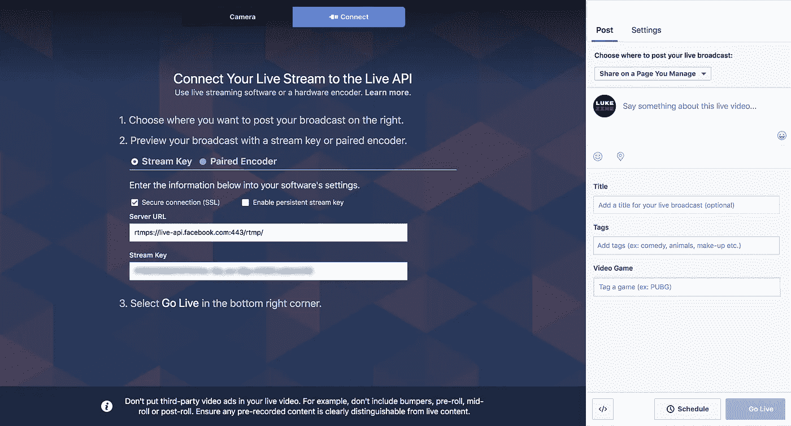
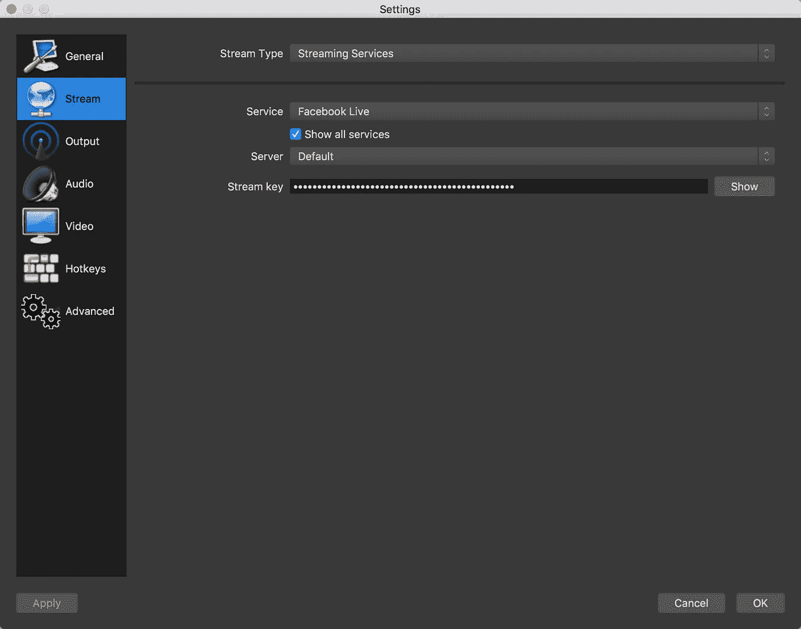
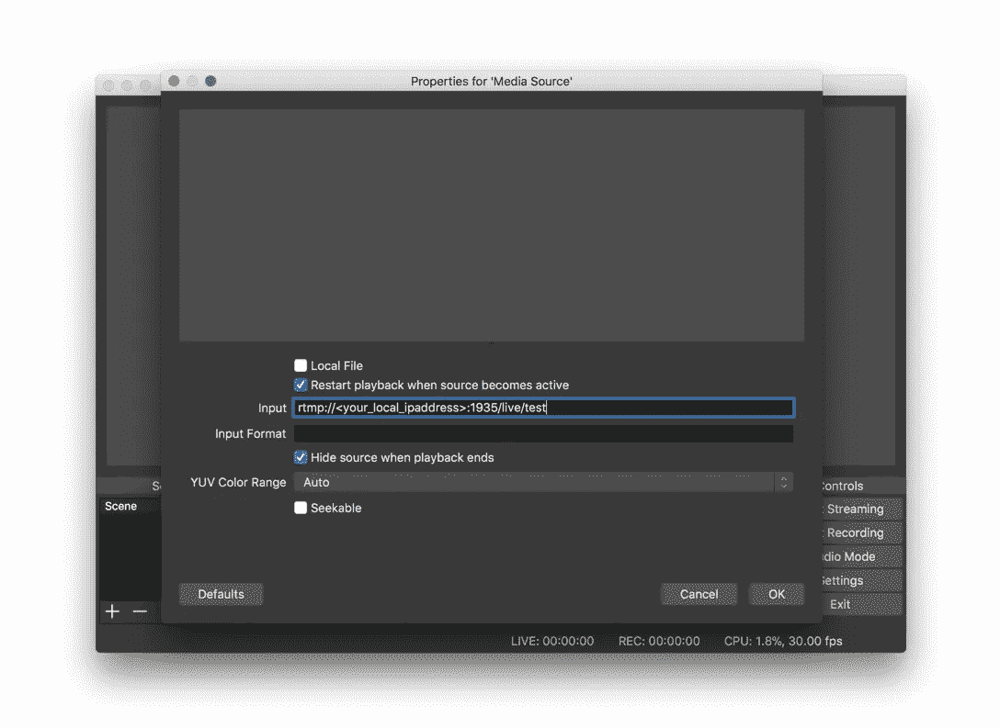

# 如何使用免费软件设置多摄像头脸书直播

> 原文：<https://medium.com/hackernoon/how-to-set-up-multi-camera-streaming-to-facebook-live-with-free-software-f6c66deb8619>

*注意:本指南假设你生活在苹果的围墙花园里，使用 macOS 和 iOS 设备，但是 Windows 和 Linux 的原理是一样的。*


如果你像我的好朋友莎拉·卡塞尔一样，主持你自己的[脸书现场喜剧秀](http://popissodeep.com)——有时一个智能手机摄像头对[脸书](https://hackernoon.com/tagged/facebook)现场直播来说是不够的。如果你想展示不同的拍摄角度，切到观众，或者叠加图形怎么办？使用开源软件，你可以创建一个工作室级别的体验，并增加你的脸书直播流的生产价值。

# 从 OBS 演播室直播到脸书



OBS Studio 是用于视频录制和直播的免费开源软件。您可以使用它来获取不同的输入源，并通过管道将它们传输到脸书直播流中。方法如下:

1.从[https://obsproject.com](https://obsproject.com)拿一份 OBS Studio 安装到你的电脑上。

2.接下来，打开你的网络浏览器。登录你想直播的脸书页面，点击“发布工具”



This should be top of the dashboard you see on your Facebook Page.

3.单击“+创建”创建新帖子。选择**直播视频**作为帖子类型。

4.一旦脸书直播查看器出现，选择**连接**而不是摄像机将 OBS 连接到脸书直播。我检查了“安全连接”以增加安全性。

5.复制**流密钥**。



What the Connect interface looks like.

6.打开 OBS Studio，打开流媒体设置。选择**脸书直播**作为服务并粘贴你的流密钥。



Paste your Stream Key in here

7.点击“确定”,然后您就可以开始流式播放了！一旦你的音频/视频设备在 OBS 中准备就绪，点击“开始流媒体”连接到脸书直播。您将会在您的网络浏览器中的脸书直播查看器中看到您来自 OBS 的视频流。

8.点击脸书上的“直播”开始直播！

> 要获得更多关于脸书直播的帮助，请咨询 https://www.facebook.com/facebookmedia/get-started/live

# 来自 iOS 设备的多摄像头无线流媒体

虽然有线连接提供了最低的延迟，但它也有助于摆脱束缚。以下是如何使用 iOS 设备作为无线摄像机拍摄视频流。

1.如果你还没有自制软件，安装它。

2.使用自制软件安装支持实时消息协议(RTMP)的 Nginx(发音为“engine-ex”)。在终端中运行以下命令，将 nginx 的源代码添加到 Homebrew 中:

`brew tap denji/nginx`

然后运行这个命令来安装 nginx 和必要的模块:

`brew install nginx-full --with-rtmp-module --with-debug --with-http_ssl_module`

> Nginx 是一个网络服务器，通常用于托管网站。我们将使用它作为服务器来传输和指导我们的本地视频流。

3.我们需要调整 nginx 配置以允许 RTMP 流。用文本编辑器打开位于`/usr/local/etc/nginx/nginx.config`的 nginx 配置文件，并在底部添加以下内容:

```
rtmp {
    server {
        listen 1935;
        chunk_size 4096; application live {
            live on;
            record off;
        }
    }
}
```

4.在本地机器上启动 nginx 服务器`sudo nginx`。现在，您可以通过电脑的 IP 地址(可以在“系统偏好设置”中找到)访问您的服务器。

5.在你的 iOS 设备上安装一个支持 RTMP 的相机应用程序，比如[落叶松广播](https://wmspanel.com/larix_broadcaster)。

6.在应用程序中，将您的广播指向您刚启动的服务器。您的手机和电脑必须在同一个本地网络上。如果使用 Larix，尝试点击录音按钮——如果无法连接，应用程序会抛出一条错误消息。

7.回到 OBS Studio，单击+按钮添加新的媒体源。选择“媒体源”作为类型。取消选中“本地文件”,然后将输入设置为您的 RTMP 服务器的地址，并附加您的流的密钥。



Uncheck local and then set the input to the address of your RTMP server and with the key for your stream appended.

8.从你的手机开始广播，看它出现！

现在，您可以像使用 OBS Studio 中的任何其他信号源一样使用这个信号源。有很多延迟，所以使用硬连线连接来消除延迟。

# 把这一切联系在一起

使用 RTMP、OBS Studio、iPhones 和电脑，您可以轻松地为脸书直播流创建自己的多摄像机设置，包括叠加、过渡等等。

如有疑问请在下方留言，我会尽力帮你排忧解难！

如果你想多聊聊，聊聊 React 或者伟大的字体，**在 twitter 上打我@**[**lucasmcgartland**](https://twitter.com/lucasmcgartland)**。**或者在下面的网站上找到我:

> [网站](http://www.lucasmcgartland.com) | [邮箱](mailto:luke@thebeeinc.com)|[LinkedIn](https://www.linkedin.com/in/lucasmcgartland/)|[Twitter](https://twitter.com/lucasmcgartland)