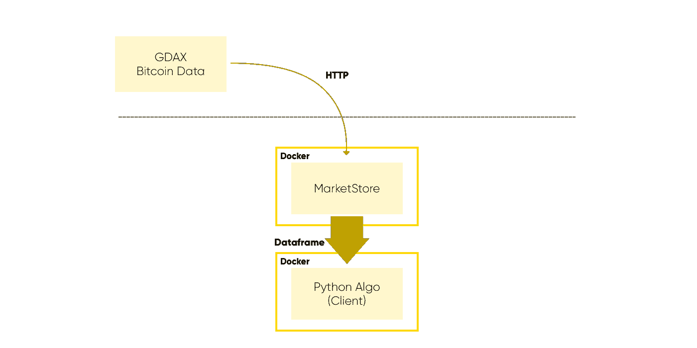

# 如何在五分钟内设置 Algo 交易的比特币历史价格数据

> 原文：<https://medium.com/hackernoon/how-to-setup-bitcoin-historical-price-data-for-algo-trading-in-five-minutes-485cd5a0b3ed>


Photo by [Chris Liverani](https://unsplash.com/photos/dBI_My696Rk?utm_source=unsplash&utm_medium=referral&utm_content=creditCopyText) on [Unsplash](https://unsplash.com/search/photos/data?utm_source=unsplash&utm_medium=referral&utm_content=creditCopyText)

羊驼平台现在[接受报名](https://alpaca.markets/)加入我们的 algo 交易等候名单，我们相信交易自动化是未来的趋势。

算法交易的一大好处是你可以根据历史数据测试你的交易策略。尤其是对于你自己开发的新策略，如果不对照可靠的数据进行测试，你真的不知道它会如何执行。算法交易和 T2 软件开发没什么不同。今天，大多数好的软件代码都被持续测试。随着代码的发展，开发人员不断地用真实的用例来测试它，以确保修改不会导致将来的失败。当你放弃第一个版本时，你想测试你的算法。但是，当您在算法运行时进行更改或调整时，您也想测试算法。

## 这里有一个你面临的问题；数据。

虽然测试尽可能多的角度总是好的，但运行大量回测将是一项非常数据密集型的工作负载，需要访问足够多的数据来了解非常长的历史。这就是为什么您不能直接使用 GDAX API 来运行这个迭代。您需要出于自己的目的将数据存储在某个地方。

# 教程

因此，首先想到的问题总是如何获得数据并为成功的回溯测试做好准备。好了，今天我要告诉你**如何使用**[**market store**](https://hackernoon.com/marketstore-the-financial-time-series-database-is-now-open-source-fd04343f439)**来获取一个长期历史的** [**比特币**](https://hackernoon.com/tagged/bitcoin) **价格数据，以便运行最准确的回溯测试**。本安装教程将会很快完成。不要浪费你的时间设置这个和那个。你只需要:

*   docker(Windows、Mac 或 Linux 上均可)，
*   一种控制台终端，
*   还有一大杯浓咖啡！☕

找到了吗？好吧，我们开始吧。

# 体系结构

这是当今系统的高级图。我们将使用 docker 容器启动一个 MarketStore 实例，并运行一个调用 GDAX price API 的后台工作程序，这样我们就可以快速地从它们的端点提取比特币的历史价格，并使它可供回溯测试客户端通过 HTTP 进行查询。

我们将使用 python3 image 和 python anaconda 为客户机启动另一个容器。我们使用名为 pymarkestore 的官方客户端包。你将从市场商店得到一个数据框架。



# 设置 MarketStore 服务器

今天在 DockerHub 上公开了 MarketStore docker 镜像的官方版本，但是首先，让我们为服务器写一个配置文件。

在 github 存储库中，你可以找到一个 YAML 格式的示例配置文件:[https://github . com/alpacahq/market store/blob/master/mkts . yml](https://github.com/alpacahq/marketstore/blob/master/mkts.yml)但是我把我们的示例放在这里。

```
root_directory: /project/data/mktsdb
listen_port: 5993
log_level: info
queryable: true
stop_grace_period: 0
wal_rotate_interval: 5
enable_add: true
enable_remove: false
enable_last_known: false
bgworkers:
 - module: gdaxfeeder.so
   name: GdaxFetcher
   config:
     symbols:
       - BTC
     base_timeframe: "1D"
     query_start: "2018-01-01 00:00"
```

这将配置服务器，以便它获取自 2018 年 1 月 1 日以来的 1 日棒线的 GDAX 历史价格 API。将此配置保存为$PWD/mkts.yml 文件。默认情况下，服务器监听端口 5993。现在让我们打开服务器。

```
$ docker run -v $PWD/mktsdb:/project/data/mktsdb -v $PWD/mkts.yml:/tmp/mkts.yml --net host alpacamarkets/marketstore:v2.1.1 marketstore -config /tmp/mkts.yml
```

如果您还没有从 DockerHub 下载 docker 映像，服务器应该会自动从 docker hub 下载，并使用配置文件启动服务器进程。希望你会看到这样的东西。

```
I0430 05:54:56.091770       1 log.go:14] Disabling "enable_last_known" feature until it is fixed...
I0430 05:54:56.092200       1 log.go:14] Initializing MarketStore...
I0430 05:54:56.092236       1 log.go:14] WAL Setup: initCatalog true, initWALCache true, backgroundSync true, WALBypass false:
I0430 05:54:56.092340       1 log.go:14] Root Directory: /project/data/mktsdb
I0430 05:54:56.097066       1 log.go:14] My WALFILE: WALFile.1525067696092950500.walfile
I0430 05:54:56.097104       1 log.go:14] Found a WALFILE: WALFile.1525067686432055600.walfile, entering replay...
I0430 05:54:56.100352       1 log.go:14] Beginning WAL Replay
I0430 05:54:56.100725       1 log.go:14] Partial Read
I0430 05:54:56.100746       1 log.go:14] Entering replay of TGData
I0430 05:54:56.100762       1 log.go:14] Replay of WAL file /project/data/mktsdb/WALFile.1525067686432055600.walfile finished
I0430 05:54:56.101506       1 log.go:14] Finished replay of TGData
I0430 05:54:56.109380       1 plugins.go:14] InitializeTriggers
I0430 05:54:56.110664       1 plugins.go:42] InitializeBgWorkers
I0430 05:54:56.110742       1 log.go:14] Launching rpc data server...
I0430 05:54:56.110800       1 log.go:14] Launching heartbeat service...
I0430 05:54:56.110822       1 log.go:14] Enabling Query Access...
I0430 05:54:56.110844       1 log.go:14] Launching tcp listener for all services...
```

如果您看到类似“响应错误:超出速率限制”的内容，这是一个好迹象，而不是坏迹象，因为这意味着后台工作人员成功地获取了价格数据并达到了速率限制。fetch worker 将暂停一段时间，然后重新启动以自动赶上当前价格。你只需要保持运转。

# 客户端

MarketStore 为查询实现了 JSON-RPC 和 MessagePack-RPC。MessagePack-RPC 对于大型数据集的查询性能尤为重要。谢天谢地，已经有 python 和 go 客户端库了，所以你不必实现协议。在本文中，我们使用 python。我们从另一个终端的 miniconda3 图像开始。

```
$ docker run -it --rm -v $PWD/client.py:/tmp/client.py --net host continuumio/miniconda3 bash
# pip install ipython pymarketstore
```

我们已经安装了 ipython 和 pymarketstore，包括它们的依赖项。让我们从这个终端启动一个 ipython shell 并查询 MarketStore 数据。

```
# ipython
(base) root@hq-dev-01:/# ipython
Python 3.6.4 |Anaconda, Inc.| (default, Jan 16 2018, 18:10:19)
Type 'copyright', 'credits' or 'license' for more information
IPython 6.3.1 -- An enhanced Interactive Python. Type '?' for help.In [1]: import pymarketstore as pymktsIn [2]: param = pymkts.Params('BTC', '1D', 'OHLCV', limit=100)In [3]: df = pymkts.Client('[http://localhost:5993/rpc').query(param).first().df()](http://localhost:5993/rpc').query(param).first().df())In [4]: df[-10:]
Out[4]:
                              Open     High      Low    Close        Volume
Epoch
2018-04-14 00:00:00+00:00  7893.19  8150.00  7830.00  8003.11   9209.196953
2018-04-15 00:00:00+00:00  8003.12  8392.56  8003.11  8355.25   9739.103514
2018-04-16 00:00:00+00:00  8355.24  8398.98  7905.99  8048.93  13137.432715
2018-04-17 00:00:00+00:00  8048.92  8162.50  7822.00  7892.10  10537.460361
2018-04-18 00:00:00+00:00  7892.11  8243.99  7879.80  8152.05  10673.642535
2018-04-19 00:00:00+00:00  8152.05  8300.00  8101.47  8274.00  11788.032811
2018-04-20 00:00:00+00:00  8274.00  8932.57  8216.21  8866.27  16076.648797
2018-04-21 00:00:00+00:00  8866.27  9038.87  8610.70  8915.42  11944.464063
2018-04-22 00:00:00+00:00  8915.42  9015.00  8754.01  8795.01   7684.827002
2018-04-23 00:00:00+00:00  8795.00  8991.00  8775.10  8940.00   3685.109169
```

瞧啊。您刚刚获得了数据帧格式的每日比特币价格。注意，第二行(param = …)决定了要查询的符号和时间范围，还有一些查询谓词，比如要查询的行数或日期范围。从这里，您可以做许多事情，包括计算指标，如移动平均线和布林线，或使用一些 scipy 包找到统计量异常。

# 结论

我想强调的是**建立一个高性能的历史数据集来研究和开发一个交易算法**是非常重要的，你可以通过我们刚刚走过的 MarketStore 快速完成。本文演示了如何处理来自 GDAX 的比特币价格，但是您也可以使用 pymarketstore 的 write 方法很容易地连接其他数据源。您也可以编写自己的自定义后台数据提取器。

同样，当进行回溯测试时，查询性能将是至关重要的，因为您希望快速迭代以获得结果。现在你可能想知道 MarketStore 能有多快。我将在下一篇文章中用巨大的数据集展示闪电般的查询速度。

同时，**如有任何问题请在评论中留下或就本教程**咨询[**@羊驼队**](https://twitter.com/AlpacaHQ) **。**

[](https://medium.com/automation-generation)

## 金融市场、算法交易、技术方面的新鲜帖请关注[羊驼](/@alpacahq)和[自动化生成](https://medium.com/automation-generation)。

## 你可以找到我们[@羊驼 HQ](https://twitter.com/AlpacaHQ) ，如果你用 twitter 的话。

[](https://medium.com/automation-generation)

如果你是一个黑客，并且可以创造一些在金融市场上工作的很酷的东西，请查看我们的项目"[免佣金股票交易 API](https://alpaca.markets/?utm_source=medium&utm_medium=blog&utm_campaign=strategy_list&utm_content=part1) "，在那里我们免费提供简单的 REST 交易 API 和实时市场数据。

经纪服务由 FINRA/SIPC 成员 Alpaca Securities LLC([Alpaca . markets](https://alpaca.markets/?utm_source=medium&utm_medium=blog&utm_campaign=strategy_list&utm_content=part1))提供。羊驼证券有限责任公司是 AlpacaDB，Inc .的全资子公司。