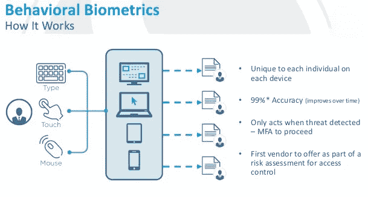

# 无声的签名

> 原文：<https://medium.com/hackernoon/how-to-silently-assemble-an-identity-261d5c4496e3>

## 行为生物测定学导论

Photo by [Jason Wong](https://unsplash.com/photos/iJuqq02pgvU?utm_source=unsplash&utm_medium=referral&utm_content=creditCopyText) on [Unsplash](https://unsplash.com/search/photos/abstract?utm_source=unsplash&utm_medium=referral&utm_content=creditCopyText)

> 有时我们做一件事是为了找出原因。有时我们的行为是问题而不是答案——约翰·勒卡雷

*技术正在一次吃掉一个人。各国的数字化程度可能有所不同，但大方向是一致的。对于大多数技术，如金融技术(FinTech)或区块链，建立数字身份对其实施和长期成功至关重要。* [*据 Nuance Communications，Inc .称，欺诈是一个全球性的重大问题，并且在呼叫中心增长迅速。仅在美国，就有超过 50%的人口称自己是某种欺诈或数据泄露的受害者。*](https://www.nuance.com/about-us/newsroom/press-releases/nuance-biometric-milestone.html)

*如今，各种身份认证方法层出不穷。从芯片和 PIN 技术到生物识别技术，每种认证系统都有自己的优缺点。一种更好的技术正在形成。它被称为行为生物识别技术，它结合了对用户行为的非侵入式监控，并使用该行为和生物识别技术来建立身份。本文介绍了行为生物识别技术，以及它改变数字身份和认证系统领域的方式。*

# 多因素身份认证和生物识别

[国家标准与技术研究所(NIST)](https://www.nist.gov/) 为组织提供了一个[框架](https://www.nist.gov/cyberframework)来处理网络安全问题。2015 年，约 30%的美国公司遵守了这些准则，预计到 2020 年，这一数字将增加到 50%。NIST 框架基于五大支柱，即识别、保护、检测、应对和恢复。多因素身份认证对于实现该框架的要求至关重要。

一个因素是证明你是你所声称的那个人的一个证据。例如，一个安全问题问你你最好的朋友姓什么或者你的第一辆车是什么牌子的，这是一个最好只有你知道的证据。今天，许多身份认证系统是多因素的，这意味着它们要求两个(双因素身份认证)或更多个(多因素)证据。这些因素可以分为三类:

**内在因素:**包括生物特征在内，是用户内在的因素。认证的例子包括指纹和视网膜扫描。

**占有因素:**这些因素是由称为“令牌”的硬件或软件设备生成的证据。这种令牌有三大类

1.  连接的令牌(是连接到计算机的设备)，
2.  断开的令牌是在屏幕上显示数字或字母数字代码的独立设备，
3.  软件令牌是用于访问计算机服务的双因素身份认证设备

**知识因素:**这些因素处理只有真实用户知道的独特知识。示例包括出生日期、社会保险号的最后四位数字、出生城市等。

# 行为生物测定学

行为生物统计学是与人类活动中唯一识别和可测量模式的测量相关的研究领域。该术语与物理[生物特征](https://searchsecurity.techtarget.com/definition/biometrics)形成对比，后者涉及指纹或虹膜图案*等先天人类特征(来源:*[*https://whatis.techtarget.com*](https://whatis.techtarget.com/definition/behavioral-biometrics)*)。*behaviorsec 的这个概念视频很好地展示了行为生物识别技术:

行为生物识别的最大优势在于它是非侵入性的。换句话说，它不会像输入密码那样妨碍用户行为。让我们举一个例子，Sam 以一种特殊的方式在键盘上按键。他还以特定的方式使用跟踪板。软件用来捕捉这两个行为数据点。下一次，收集这些数据点的公司(比如说一家银行)想要验证 Sam，它使用机器学习算法将 Sam 的行为数据点与他的实际击键和跟踪板移动进行匹配，以识别 Sam，而不会在他的用户体验中产生摩擦。

source: paymentscardsandmobile.com

这里有许多 IBM 使用行为生物识别技术来防止偷车的例子。

另一个例子是 [Bio Catch](https://www.biocatch.com/) 帮助金融机构使用行为验证身份。根据 BioCatch 的说法，它从其 500 多项专利行为分析指标中选择了 20 项独特的功能，以分析用户在整个会话中的行为，而不会中断数字体验。BioCatch 实时将用户行为与配置文件进行比较，以返回可操作的风险评分。

[Nuance communications 是语音认证领域的先驱之一](https://www.nuance.com/en-gb/index.html)。它是第一家在 2015 年发布由深度神经网络支持的语音生物识别算法的公司。Nuance 提供了一个名为“ConversationPrint”的解决方案，可以使用语音模式或书写模式实时验证用户身份。

因此，有无数的应用可以受益于行为生物识别的激增。

# 科技的人性一面

联合国世界粮食计划署(WFP)最近在约旦和巴基斯坦启动了一项名为积木的试点项目。它于 2017 年在巴基斯坦信德省推出了概念验证，后来在约旦推出了试点，利用了它在巴基斯坦的学习。根据其网站，WFP 正在测试区块链，作为一种使现金转移更加高效、透明和安全的手段。这个程序是独一无二的，因为它使用生物认证来认证人道主义援助的接受者，查询区块链上记录的账户，并允许接受者结算付款。【2018 年 4 月，《麻省理工科技评论》详细报道了这个迷人的故事。

现在，想象一下，如果行为生物识别技术可以用来识别接收者，然后使用区块链上记录的数据支付慈善或资金转移。这种应用将通过消除中间人而永远改变捐赠的世界。通过帮助建立信任，行为生物识别技术还具有向大众传播金融包容性的巨大潜力。

我父亲是一名金融顾问。每天早上，他醒来后会看着滚动的股票行情显示器，同时在记事本上记下股票价格。很自然地，我会花大部分时间看美国消费者新闻与商业频道。在暑假期间，我会陪他去孟买证券交易所，会见经纪人和其他市场参与者。我只想说，自从我还是一个认为没有什么是不可能的青少年时，金融就是我最喜欢的科目。

我仍然认为一切皆有可能。我想让我的读者重新发现科技做好事的潜力。一如既往，我想把行为生物测定学的故事带给它应该服务的人们。这样做，我想在一个迷人的技术发展中注入积极性。尤其是，当积极性供不应求的时候。

# **资源:**

1.  十大生物识别公司:[https://www . disruptor daily . com/top-10-biometrics-Companies-2017/](https://www.disruptordaily.com/top-10-biometrics-companies-2017/)
2.  [http://the hill . com/opinion/cyber security/369837-behavioral-biometrics-missing-from-network security](http://thehill.com/opinion/cybersecurity/369837-behavioral-biometrics-missing-from-cybersecurity)
3.  [https://www . American banker . com/news/behavior-tracking-security-tech-getting-traction-at-banks？tag = 00000156-3260-df39-a77e-7 EFD 42 f 90000](https://www.americanbanker.com/news/behavior-tracking-security-tech-gaining-traction-at-banks?tag=00000156-3260-df39-a77e-7efd42f90000)