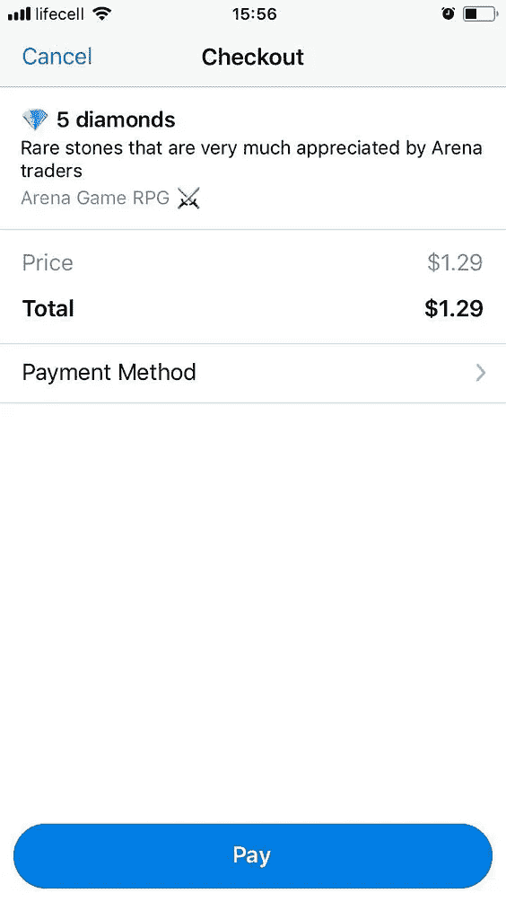

# 如何开始用你的电报机器人接受付款

> 原文：<https://medium.com/hackernoon/how-to-start-accepting-payments-with-your-telegram-bot-6742dd9b2f37>

嗨！这篇文章是针对那些已经掌握了电报驱动的机器人的工作知识，并且想要实现一个货币化选择的开发者。我将概述让你的机器人开始接受使用官方机器人支付 API 和[支付墙](http://paymentwall.com/)提供商支付的基本步骤。

*本文没有深入技术细节，也没有讨论实现所需的任何代码，但是它可以让您对集成过程有一个基本的总体了解。*

# 什么是 Bot 支付 API？

去年，Telegram 发布了一个重要的[更新](https://telegram.org/blog/payments)，它促进了生成发票信息和显示本地支付对话的机器人的创建。但是，该功能目前仅在移动设备上受支持，与桌面和 web 版本不兼容。正如电报官方[文件](https://core.telegram.org/bots/payments)所说:

> 从 [Bot API v.3.0](https://core.telegram.org/bots/api) 开始，Telegram 机器人可以接受用户对商品和服务的支付。用户将需要 [Telegram v.4.0](https://telegram.org/blog/payments) 或更高版本来支付您的商品和服务。

使用 Telegram Web，用户甚至无法获得发票信息。试图用桌面或 web 版本打开付款对话将导致以下错误消息:

然而，不要担心，因为几乎所有的支付处理商都为你提供了生成一个可以集成到你的机器人中并使用浏览器打开的支付部件的机会。您需要添加所有相关的产品细节。您将需要指定您的产品细节，如价格，名称，货币等，以获得链接。所有支付处理商都将提供有关实施的技术文档:

所以现在你有两种可能使用你的机器人:

1.  应用内支付(Bot 支付 API)
2.  使用 web 支付小部件(支付提供商 API 应该支持这一点)

我决定在我的机器人游戏中实现这两者，请看下面的截图:

In-app and web payments

使用 Telegram Bot API，您**将无法** **获取用户位置**，这意味着您将无法指定开具发票所需的货币。即使通过像 Yandex AppMetrica 或 Google Analytics 这样的分析工具，也没有机会跟踪用户位置(你将跟踪每个用户的位置**。但是您仍然可以给用户一个 UI 来选择货币。**

还有就是**没有机会从你的 bot 消息数据**中获取用户客户端平台**。**所以你不能根据用户平台动态切换支付选项。

## 总结一下:

*   只有信用卡支付
*   仅适用于 Telegram 移动应用
*   用户将在应用程序中支付

# 💳支付提供商

Telegram 不处理用户的支付，而是依靠第三方**支付处理器**。它们将处理和存储所有敏感信息，如卡的详细信息、姓名和地址。Telegram 和机器人开发者都无法访问它。

因此，Telegram 就像是用户和支付提供商之间的一个中间件，它也不收取任何佣金。目前，Telegram Bot 支付 API 与几个支付处理器集成在一起:

*   [条纹](https://stripe.com/)
*   [支付墙](https://www.paymentwall.com/)
*   [Yandex。钱](https://money.yandex.ru/new)
*   俄罗斯储蓄银行
*   付钱给我
*   [点击](http://click.uz/)
*   [被扑腾的波浪吹拂](https://ravepay.co/)
*   特兰佐

我在寻找能够支持 CIS 地区用户处理的支付提供商，而[**payment wall**](https://www.paymentwall.com)**是我的最佳选择。它的 API 支持为浏览器生成支付小部件以及通过 Bot 支付 API 处理信用卡支付，此外，与上面列表中提到的提供商相比，它支持更多的国家。**

**🇺🇸 🇨🇦 🇩🇿 🇦🇸 🇦🇩 🇦🇷 🇦🇲 🇸🇭 🇦🇺 🇦🇹 🇦🇿 🇧🇸 🇧🇭 🇧🇩 🇧🇧 🇧🇪 🇧🇿 🇧🇲 🇧🇷 🇧🇳 🇧🇬 🇰🇭 🇰🇾 🇨🇱 🇨🇳 🇨🇰 🇨🇷 🇭🇷 🇨🇾 🇨🇿 🇩🇰 🇩🇲 🇩🇴 🇪🇨 🇪🇬 🇸🇻 🇪🇪 🇫🇰 🇫🇴 🇫🇯 🇫🇮 🇫🇷 🇬🇫 🇵🇫 🇬🇪 🇩🇪 🇬🇮 🇬🇷 🇬🇱 🇬🇩 🇬🇵 🇬🇺 🇬🇹 🇬🇾 🇭🇳 🇭🇰 🇭🇺 🇮🇸 🇮🇳 🇮🇩 🇮🇪 🇮🇲 🇮🇱 🇮🇹 🇯🇲 🇯🇵 🇯🇴 🇰🇿 🇰🇷 🇰🇼 🇰🇬 🇱🇻 🇱🇮 🇱🇹 🇱🇺 🇲🇴 🇲🇰 🇲🇾 🇲🇻 🇲🇹 🇲🇭 🇲🇶 🇲🇺 🇲🇽 🇲🇩 🇲🇨 🇲🇪 🇲🇦 🇳🇵 🇳🇱 🇳🇨 🇳🇿 🇳🇮 🇳🇺 🇳🇫 🇲🇵 🇳🇴 🇴🇲 🇵🇼 🇵🇦 🇵🇾 🇵🇪 🇵🇭 🇵🇳 🇵🇱 🇵🇹 🇵🇷 🇶🇦 🇷🇪 🇷🇴 🇷🇺 🇻🇨 🇸🇲 🇸🇦 🇷🇸 🇸🇨 🇸🇬 🇸🇰 🇸🇮 🇿🇦 🇬🇸 🇪🇸 🇱🇰 🇰🇳 🇱🇨 🇵🇲 🇸🇷 🇸🇪 🇨🇭 🇹🇼 🇹🇭 🇹🇰 🇹🇴 🇹🇹 🇹🇷 🇹🇲 🇹🇨 🇹🇻 🇺🇦 🇦🇪 🇬🇧 🇺🇾 🇻🇳 🇻🇬 🇻🇮 🇼🇫 🇼🇸 🇦🇼**

**我还没有对每一项服务的费率和佣金附加费进行比较，所以其他提供商完全有可能比 Paymentwall 便宜。你可以进行一些独立的研究，选择一个符合你的要求的。主要要求是您的提供商的 API 应该有一个选项来为浏览器生成支付小部件，并支持 Bot 支付 API。**

**请注意，每个供应商将验证你是一个商人，你应该准备好向他们发送所有必要的文件时，要求。你想出售的产品，你的机器人将根据供应商的规则和限制进行验证。他们会验证你，以确保你卖的是正品。**

***例如，下面是 Paymentwall 无法使用的禁止区域的* [*列表*](https://www.paymentwall.com/en/faq/restricted-business-models) *。***

**在我的案例中，我计划出售一个游戏中的虚拟货币，所以这是一个典型的验证过程。我的验证花了**大约 2 周**，但那是因为我没能及时准备好所有文件，所以可能会快一些。在设置期间，我得到了关于所需文档和技术集成的全面支持。**

## **总结一下:**

*   **您的提供商应该支持 Bot 支付 API 以及浏览器的支付小部件生成。**
*   **它应该有方便的利率和佣金，将符合您的期望。**
*   **应该支持您的目标国家，以及该国家的信用卡处理。**

# **📃条件**

**您必须清楚**条款和条件**文件与****退款政策。**用户应在实际支付前或注册前接受。你还必须提供**客户支持**并能够处理来自你的机器人用户的退款或其他付款相关的请求，他们不应该去支付提供商或电报支持。****

****关于书写条款和条件没有严格的规则，但是主要的一点是，你应该指定在付款完成后，你的用户可以在哪个时间段要求退款。****

> ****[**退款**](https://en.wikipedia.org/wiki/Refund) —产品退货，消费者将产品退回给原零售商，以换取之前支付的款项的过程。退款保证——如果购买者对产品或服务不满意，将获得退款的保证。****

****这是我的机器人游戏的条款和条件。请随意使用它作为你的机器人的例子。我在支付步骤中显示它，因为我不想在注册时用它阻止用户。****

********

****Payment step message from bot****

## ****总结一下:****

*   ****你需要退款政策的条款和条件****
*   ****用户应该在付款前接受你的条款和条件****
*   ****你需要为你的用户提供客户支持，每个用户都应该很容易找到支持链接。****

# ****📝注册和集成****

****我在我的机器人游戏中使用**支付墙**，所以接下来的话将是关于与这个支付提供商的集成。****

****首先，您需要将您的机器人连接到您选择的支付提供商。为此你需要进入[机器人父亲](https://t.me/botfather)，选择你的机器人，点击**支付，从列表中**选择付费墙，点击**连接付费墙测试**(测试集成后，你将能够**连接付费墙直播**)****

****点击之后，您将被重定向到提供者的授权机器人。在这里，你只需点击**开始，**就像普通的电报机器人，然后你会看到下一条消息:****

********

****Paymentwall authorization bot****

****“从”按钮链接到 Paymentwall **OAuth** 步骤，如果您有帐户，您将被要求批准授权您的帐户。****

********

****Paymentwall oAuth step****

****但很可能你没有，所以在重定向后，你会看到帐户登记表。继续操作，然后您将被重定向到该步骤。授权后，您应该被重定向回 Paymentwall Bot，在那里您会收到一条消息，表明您的帐户已在系统中成功授权。****

********

****Authorization complete****

****BotFather 将向您展示 Bot Payments API 的**测试** **令牌**，您将使用它来发送发票消息。Telegram 有一篇关于如何在你的 bot 中实现发票消息逻辑的[文章](https://core.telegram.org/bots/payments)和 [API 文档](https://core.telegram.org/bots/api#payments)。****

****在测试集成期间，您需要支付测试费用。你可以使用来自 Paymentwall [沙箱](https://docs.paymentwall.com/integration/direct/brick/sandbox)的测试信用卡和代码来模拟不同的响应。****

****在您的 Paymentwall 仪表盘中，您将看到**我的项目**部分，其中列出了您的所有项目。注册后将有两个测试项目，一个为 bot 支付，它的名字将从数字开始，并包含**测试**标签。第二个项目是默认创建的，您将能够使用它在浏览器中显示支付部件。你可以在 [API 文档](https://docs.paymentwall.com/integration/widget/digital-goods)中阅读更多关于支付工具集成的信息。****

> ****请注意，支付 web 小部件提供了几个支付选项，这取决于用户所在的国家和您的项目设置，而 Bot 支付 API 仅支持**信用卡。******

****现在您可以开始填写业务档案并上传所需的文档(*转账户- >业务档案)*。文件列表基于您的注册国家和企业类型(个人或公司)，您将在企业简介表的最后一步看到它。如果您有任何问题，请随时联系支持团队，他们会在商家验证过程中向您咨询。****

## ****总结一下:****

*   ****通过 BotFather 授权并连接测试项目。****
*   ****在你的 bot 中实现发送发票机制。****
*   ****完成您的业务简介并上传所需的文档。****

## ****文档:****

*   ****[Bot 支付 API 集成](https://core.telegram.org/bots/payments)****
*   ****[付费墙小工具 API](https://docs.paymentwall.com/integration/widget/digital-goods)****
*   ****[测试信用卡](https://docs.paymentwall.com/integration/direct/brick/sandbox)****

# ****🚀上线****

****一旦您的商家账户获得批准，测试整合完成，您就可以访问@BotFather 和 **Connect Paymentwall Live。**您将经历与连接测试相同的过程。名称中带有标签 **Live** 的新项目将被创建在您的项目列表中。BotFather 将向您展示一个用于机器人支付的**现场令牌**。****

****现在您可以提交您的**实时项目**供 Paymentwall 集成团队审查。在这一步，他们将验证你的产品是否合法，是否满足所有要求。他们将检查您的用户策略，因此您应该在此步骤之前准备好这些文档。****

****他们还将检查技术集成是如何进行的，以及您的应用程序是否正确处理来自 Paymentwall 的服务 pingbacks。****

****一旦项目审查过程完成，你就可以开始接受手机、网络和桌面电报用户的付款🎉****

********************

Your telegram mobile and Paymentwall Web widget (on the yellow background)**** 

# ****附言****

****如果你想看现场演示，通过这个[链接](https://t.me/arenagametelegrambot)查看我的机器人游戏。你需要注册你的角色，然后去🏘**小镇—** 🏦**银行—** 💎**购买钻石**到能够查看付款流程。****

****感谢您的阅读！干杯！🍻****