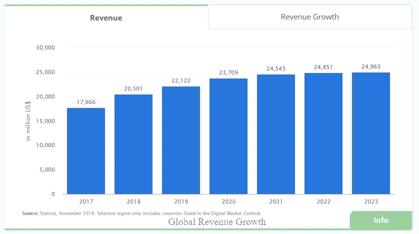
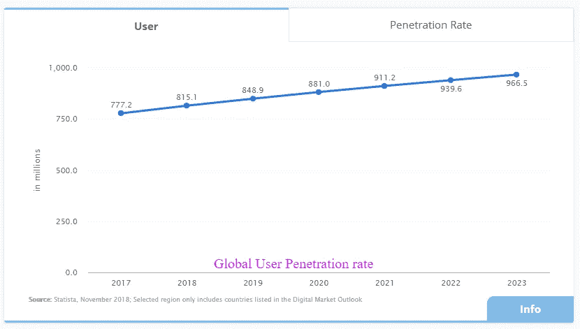
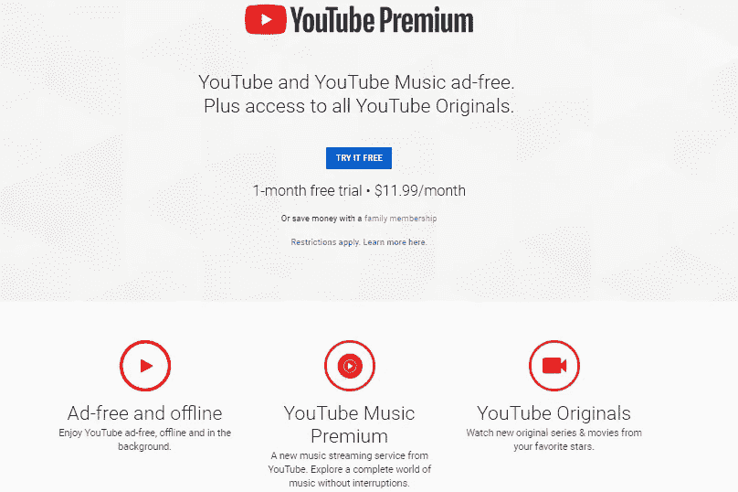

# 如何开始在线视频流业务|视频内容创作者的 3 个盈利思路

> 原文：<https://medium.com/hackernoon/how-to-start-an-online-video-streaming-business-3-profitable-ideas-for-video-content-creators-e1332fde35d2>

随着互联网的成熟，现在似乎是开始在线视频流业务的好时机。当在线视频到 2022 年将占互联网流量的 80%以上时，为什么没有人会想到开始像网飞、Hulu、YouTube 和亚马逊 Prime 这样的视频流媒体服务？

现在，有人会问，像网飞、Hulu 等巨头。已经统治了视频流市场，开始自己的视频流业务并期望生存下去是否可行？

的确，是的！

考虑到**迪士尼流媒体服务**(尚未发布)的最新进入，如果这些巨头已经在市场上，认为你不能要求你的观众和收入份额是不切实际的。像其他新加入者一样，如果你有一些有趣的内容可以展示，人们就会来寻找它。网飞、Hulu 和每一个知名的视频流媒体服务能够共存，只是因为它们能提供一些独特的东西。无论是基于订阅的网飞商业模式，基于广告的 YouTube 商业模式，还是 Hulu 的电视直播商业模式，创新和排他性是在这个竞争激烈的市场中取得成功的关键。

因此，这篇文章只是一个简明的指南，告诉你需要知道的一切，如果你相信你有独特的商业想法来开始自己的视频流业务。

# 视频流服务|过去和现在

流媒体的早期(90 年代中期)并不好玩。

网络太混乱了。

大雨期间连接会中断。

电脑很慢

移动互联网可以忽略不计

用户会花大部分时间观察这个永无止境的“缓冲”循环。

视频不清晰，像素化。

声音断断续续。

生活在那个时代的人们甚至无法想象通过互联网连接的高清、杜比或 4K 等术语。渐渐地，历史开始演变。互联网发展更快。首先，一周内有 5700 万人收听网络电台(桥收视率)，然后 2006 年人们在 YouTube 上观看了超过 100 万个视频[路透社]。2006 年，电视频道 ABC 开始在互联网上播放电视节目。这对电视内容消费者来说是新的，因为现在如果他们错过了任何电视广播，他们可以点播观看像“实习医生格蕾”这样的节目。

视频流媒体服务的成功故事始于通过网络观看电视节目的媒介，但随着竞争的加剧，流媒体服务开始慢慢制作“原创”。随着网飞原创电影的巨大成功，如《奇异的事物》、《纸牌屋》等，其他流媒体服务面临着采用这种新趋势的巨大挑战。很快，其他视频流媒体服务开始呈现他们最好的原创节目。

良好的原创内容和独特的定价结构等方面，使所有视频流媒体业务彼此不同。

目前，根据 Statista 2018-

仅通过 SVoD 模式获得的视频流收入就达 205.01 亿美元。

到 2023 年，通过视频流媒体服务产生的收入将以 4.0%的年增长率获得 249.63 亿美元的市场规模。

仅在美国就产生了大部分视频流收入；2018 年准确来说是 104.43 亿美元。

这是两张视频流媒体业务全球收入增长和用户渗透率增长的图表。

# 视频流服务——一个未来的想法

以上数据足以承认视频流业务是一种未来主义的商业。随着互联网、网络开发和越来越多的内容交付网络的进步，在 2018 年，人们可以享受前所未有的视频流功能，例如-

点播视频流

实时视频流

4K 视频流

直播体育流媒体

多角度和多摄像机直播

无缓冲流式传输的动态比特率切换

与实时流媒体进行实时聊天互动

视频货币化的多种方法

分屏直播

离线视频流

多平台视频流，如 WebRTC、Android 和 iOS 应用程序、智能电视应用程序。

向巨人学习

去年，网飞以令人惊讶的举动震动了视频流媒体行业。它宣布计划在 2018 年花费 80 亿美元用于原创内容，从而明确了其转型视频点播服务的意图。凭借制作 80 多部新电影和网络系列的计划，这家巨头设立了一个标准，视频流已经远远超出了电视节目广播的范围。

直播 OTT (Over the Top)视频是视频内容广播的发展趋势。直到几年前，视频内容还被有线电视所垄断，现在正被视频点播服务所统治。HBO Go 就是一个很好的例子，在那里可以通过订阅观看一系列知名的电视连续剧和原创节目。

随着互联网普及率和移动用户数量的增加，越来越多的用户被视频流媒体服务所吸引。人们可以注意到一个典型的移动用户有不止一个视频流应用程序。

投资者正拿出巨额预算来制作世界级的网络连续剧。

由于 OTT 流媒体不受许多审查规则的限制，内容创作者正在推出与传统电视广播完全不同的内容。

大多数家庭仍然通过有线电视或 DTH 收看传统的电视节目。然而，随着智能电视上大量流媒体应用的出现，传统的电视浏览逐渐被 OTT 服务消费所取代。

确切地说，OTT 流媒体和电视广播的未来完好无损。电视节目的制作将继续增长，因为他们现在既有传统广播又有 OTT 作为媒介。

# 视频流商业模式让你成为百万富翁

除了好的独家内容，视频流媒体业务的成败主要取决于它选择的最合适的收入模式。凭借正确的商业模式，网飞锁定了视频流媒体业务市场，YouTube 成为最大的市场，Hulu 也变得非常受欢迎。选择商业模式时，最好的方法是研究竞争对手的商业模式，然后决定最适合自己业务的方案。

这里是市场上最大的公司采用的四种创收模式，它们在每个部分都做得非常好-

**1。** **订阅式 VOD 模式(SVOD)**

在 SVOD，顾名思义，用户需要订阅每月或每年的会员计划才能观看视频。通过 SVOD，用户可以无限制地访问所有视频、高清流媒体、访问其他增值服务、离线下载等等。

最好的例子:*网飞，亚马逊 Prime，HBO GO，Hulu。*

**2。** **交易式视频点播模式(TVOD)**

这里，用户不需要订阅整个服务。相反，他们可以只为他们想看的个人内容付费。根据不同的政策，一些平台提供对购买内容的有限时间访问，而其他平台则允许永久访问。这种方案的一个简单名称可以是按次付费模式。最适合体育直播、音乐会流媒体等内容。

*最好的例子:WWE 流媒体 App。*

**3。** **广告支持(AVOD)**

这种模式是应用最少但最流行的商业模式。流媒体服务提供免费视频。然而，有一个问题。用户时不时会看到广告。遵循该模型的平台通常支持三种广告模型:

*   前置广告——视频前的广告。
*   中置广告——视频中间的广告。
*   后置广告——视频结尾的广告。

最好的例子:YouTube、CW 应用、AMC 应用等。

**4。** **混合视频点播模式(SVOD+TVOD+AVOD)**

顾名思义，它是上述两种或全部商业模式的混合。流媒体服务提供一系列附加和增值服务，将免费用户转化为付费用户。“添加的”可以是任何东西，例如

*   无广告视频
*   离线视频
*   访问高清视频。
*   访问“原始”内容。

最好的例子:YouTube Premium 或者 YouTube Red。

# 开始视频流服务的内容想法。

视频流媒体业务确实是一个竞争激烈的市场，它正被巨头们所统治。但是，消费者不是诱惑一个平台，而是寻求好的内容。无论是从网飞这样的成熟平台，还是通过一个初创平台，他们都在赚钱，直到用户获得好的内容观看。

注:当然用户体验也很重要，但内容和商业模式是两大因素，只能用时间来建立。你总是可以通过利用一个好的网飞克隆或 YouTube 克隆脚本来创造一个好的 UX，但是不能发展一个用户群；你得自己去争取。

内容永远是王道。因此，这里有三个趋势和有利可图的内容想法来开始你自己的在线视频流业务。

# 1.娱乐

人们喜欢电影和网络连续剧。像 HBO Go 这样的平台的成功证实了纯娱乐是最赚钱的利基。而且，迪士尼即将推出的流媒体服务也是同样的例子。

如果你是一个创作者，制作节目和电影来娱乐人们，在同一个领域开始在线视频流业务是一个很好的主意。娱乐不是网飞、HBO、Hulu 或亚马逊 Prime 的垄断。娱乐行业的观众足够大，可以容纳市场上的许多新的流媒体工具。只要提供一些好的娱乐节目或电影，消费者不会用大牌歧视你。我们已经看到许多基于 YouTube 的内容创作者在平台上获得良好声誉后推出了自己的流媒体平台。如果你打算这样做，奥特正是你要去的地方。

# 2.健康

企业家们已经找到了一种方法来利用健身爱好者的兴趣，为视频点播服务开辟一个新兴的利基市场。由于可以随时访问健身相关的视频，有很大一部分视频消费者愿意订阅。此外，可以提供许多插件来从 YouTube、Vimeo 或 Daily Motion 等平台上获得免费视频。事实上，基于健身的流媒体服务将比雇佣私人教练或获得健身房会员资格更便宜。

健身不仅仅限于健身房训练，还有更多的机会来利用这个有利可图且竞争较少的利基市场。你可以就像瑜伽，健康饮食技巧，舞蹈训练等话题进行创作。

# 3.教育

YouTube 是“如何做”视频的热门目的地之一。人们可以找到一系列教授某些东西的视频。然而，由于争夺更多的观看次数，也可以发现许多假视频。很难发现某个特定的教程是正确的还是可信的。最终，降低了这个流行的视频分享平台的用户体验。

不要紧，因为，YouTube 的这个弊端正是你开始教程视频流媒体业务的最好机会。通过适当的身份验证、质量检查和可信名称的可信度，您可以发布 N 个教程和在线课程。你可以选择许多细分市场来吸引更多类别的受众。例如，学习魔术、计算机编程、瓶子绘画、蛋糕制作或折纸的地方。这一类别中可能有数百个细分市场。

# 启动在线视频流业务的最快方式

几年前，没有什么比“启动视频流媒体业务的最快方式”更好的了。你必须从头开始，打造自己的视频流平台。今天，通过互联网和现成的解决方案，一切皆有可能。你不需要成为一个专业的编码器来启动你的视频流业务。流行的视频流媒体网站和应用程序的克隆脚本让企业家们可以轻松使用。

例如，标有白色标签的网飞克隆版拥有和网飞一样的用户界面和功能。这意味着如果你想建立一个网飞，比如视频流媒体网站或移动应用，并采用相同的订阅模式业务，只需谷歌，你就会在互联网上找到 N 个克隆版本。

这些克隆体有创新性吗？

使用网飞或 YouTube 的克隆脚本，并不意味着你正在推出另一个复制的业务。相反，这些克隆脚本是高度可定制的，人们可以根据独特的商业主张和品牌身份对它们进行调整。称它们为克隆只是为了建立一个标准，或者与现代视频流媒体平台进行比较。

例如，以 NFA 工作室为例。教育娱乐流媒体平台是在网飞的复制品上开发的。然而，最终的平台比原来的脚本要独特得多。该脚本是定制的，以提供一个独特的身份和功能，这个高度利基视频流媒体服务。所以是的，克隆脚本是由经验丰富的行业专家开发的，肯定有巨大的创新空间。