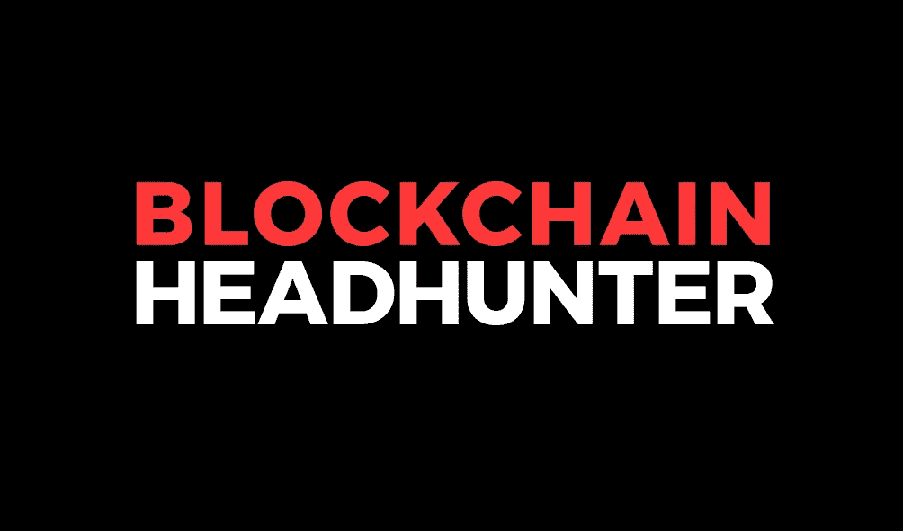

# 如何开始区块链技术的职业生涯？

> 原文：<https://medium.com/hackernoon/how-to-start-your-career-in-blockchain-technology-5eb392d38cfc>

随着革命性的区块链技术的出现，过去一年多的时间见证了一个新技术时代的曙光。分布式账本技术有助于解决许多行业面临的问题，从医疗保健、房地产、供应链、物流到教育。我们目前正在见证这项技术在许多此类领域的应用。

新闻一直在热烈讨论许多这样的合作和伙伴关系，导致推出基于区块链的试点项目。由于其无数的用例，区块链不断得到全球领导者、资深行业专家甚至新兴企业家的认可。事实上，区块链被预示为下一次大工业革命的先兆。如果你想成功谋生，那么区块链技术的职业生涯可能是正确的选择。

在考虑开始区块链技术职业生涯之前，你可能想了解区块链技术的基础知识。分布式账本技术最初是由一个名叫中本聪的人或一群人开发出来的，作为一种计算点对点数字货币比特币的方法。自诞生以来，该技术已经取得了许多飞跃，今天它已经超越了比特币，现在开始服务于加密货币以外的用例，如上所述。

区块链在各行业领域的积极部署以及对一项有可能开启另一场技术革命的技术的热情，激起了对区块链相关工作的需求。根据全球自由职业网站 Upwork 的一份报告，区块链在 2018 年 Q1 up work 增长最快的 20 项技能中名列榜首。另一方面，TechCrunch 在 2018 年初的一篇文章中报告称，区块链职业需求巨大，因为区块链工作当时是劳动力市场上增长第二快的职业。文章举例说明，当时 1 个区块链开发人员有多达 14 个职位空缺。

尽管区块链正在掀起波澜，但就业领域相对较新，职业道路也是以前没有尝试过的。因此，在这个领域开始职业生涯可能像技术本身一样具有实验性和创新性。

长期以来，一个好的大学学位被认为是获得高薪工作的途径。事实上，学生们一直遵循着同样的道路——在学校取得好成绩，进入一所好大学的班级，学习一门受欢迎的课程，最后毕业，找到一份高收入的工作。尽管从那以后这种情况有所改变。事实上，许多大学毕业生带着沉重的债务离开学校。据新闻报道，美国大学生的债务已经高达 150 万美元。还有一些人完成了学业，却找不到与专业相关的工作。上述教育和技能差距的后果导致公司努力寻找理想的候选人。在当今科技发达的时代，越来越多的人认为技能比候选人的学历更重要。

**区块链教育**

由于区块链技术仍处于起步阶段，那些在这一革命性领域寻找职业生涯的人必须明白，他们的职业道路将与在他们之前成名的科技企业家完全不同。为了在这个领域建立一个成功的职业生涯，候选人应该明白现在需要的是能够不断提高自己技能的人。由于区块链在不断发展，候选人跟上该领域的发展非常重要。如果你想马上在区块链行业开始你的职业生涯，那么你必须放弃遵循传统教育流程的想法。相反，下面是要遵循的步骤！

**了解基本面**

与当时的任何其他技术不同，区块链具有独特的价值主张。就像互联网的出现如何搅动了另一个时代一样，区块链技术已经开始了一场价值交换革命。对这一点的理解，对于区块链职业生涯的开始非常关键。去中心化、Daaps 和智能合约等功能是区块链的本质，任何想在这个行业开始职业生涯的人都应该了解它的本质。

对于区块链开发人员来说，分布式账本技术中的技术技能是他们职业生涯的支柱。对于智能合约的开发，Solidity 是一个很好的起点，对于网站的开发，JavaScript 是一个很好的起点。事实上，学习编程语言也可以帮助你找到一份兼职工作，直到你磨练出区块链相关技能。因此，计算机科学或类似的学位在这里会很有帮助。人们可以选择在线教育项目，而不是参加专业课程或接受正规教育，这些项目在当今的数字时代已经非常突出。

**去参加密码学培训**

资产正从物理世界转移到数字领域。因此，密码学变得越来越重要。区块链的分布式账本技术在资产管理中发挥着至关重要的作用，因为它是一种通过密码学艺术促进数字资产保护的技术。大型组织依靠加密技术来保护其资产，任何代码部署的失败都会对这些组织以及用户的隐私造成毁灭性的影响。为了在区块链领域取得成功，有志者必须参加知名在线资源的高级密码学课程，如 Udacity、Coursera 等。

**了解分布式计算理论及其使用案例**

在当前技术发展到全新水平的时代，可靠性和安全性已经成为影响用户、组织和整个世界的两个最重要的问题。这就是区块链发挥作用的地方！通过分布式计算，区块链技术提供了前所未有的解决方案。然而，区块链的部署受到过度能耗和可扩展性等无数其他问题的困扰。有志于区块链的学生需要了解这些问题，并提出跨部门和行业成功实施区块链的解决方案。

**成为区块链社区的一员**

加密货币及其底层技术区块链拥有蓬勃发展的社区，这些社区负责推动这项革命性技术的发展。如今，市场上有几个加密货币项目。这些项目为完成任务提供奖励。对于区块链行业的新生来说，参与这些项目至关重要，因为它们是在职培训机制。为了能够参与这些项目，学生需要接触区块链初创公司，并提供有助于社区外联的服务，无论是领导力讲座、活动组织还是在区块链开发应用程序。作为一名区块链专业的学生，以这种方式开始将会给你在利基行业与合适的人一起工作和建立关系网的杠杆作用。

**创造自己的道路**

毫无疑问，区块链领域的工作正在蓬勃发展，但未来对那些在这一前沿技术领域工作的人来说有着更大的潜力。这是有抱负的学生参与社区并创造他们自己的职业成功之路的恰当时机。对于区块链来说，花几年时间接受正规教育尚不重要。上面提到的策略肯定有助于规划你的道路。

 [## 黑客正午的毒品技术工作

### 黑客如何找到最好的技术工作？官方工作委员会的出版物，黑客中午！黑客如何开始他们的…

jobs.hackernoon.com](https://jobs.hackernoon.com/)