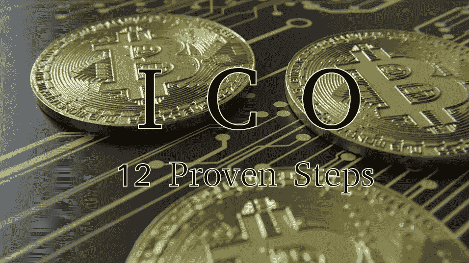
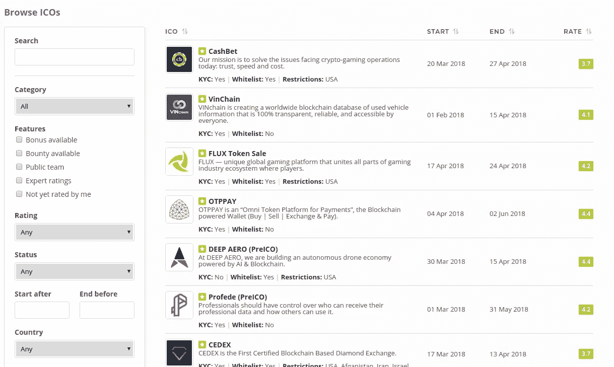
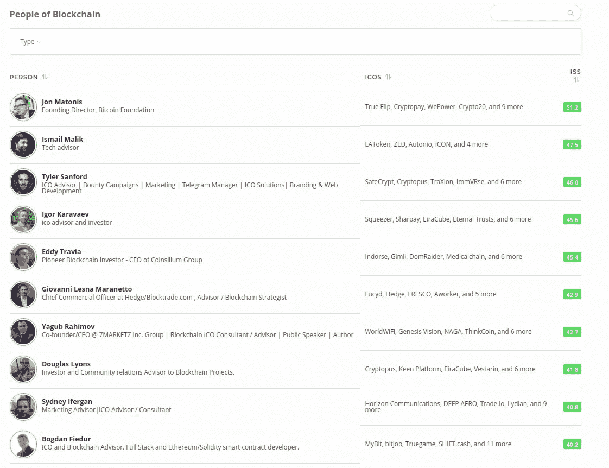
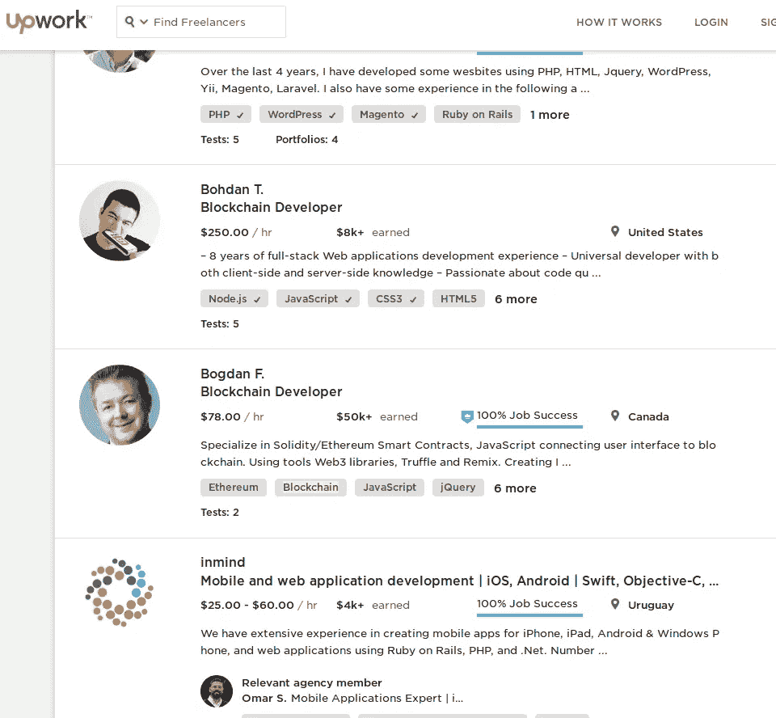

# 初学加密时如何创建自己的 ICO——12 个成熟步骤

> 原文：<https://medium.com/hackernoon/how-to-start-your-own-ico-when-you-are-new-to-crypto-12-proven-steps-edc09f25ad66>

作为一名 ICO 顾问，我面临许多关于 ICO 流程的问题。每天都有更多的项目，越来越多的人进入这个领域，他们对加密完全陌生，并被媒体报道的高额融资所吸引。我意识到，这是一个写下 ICO 执行步骤和解决启动 ICO 时面临的常见话题和问题的好时机。这篇文章是写给那些看到通过 crypto 为他们的项目提供资金的机会的人，或者那些听说了[区块链](https://hackernoon.com/tagged/blockchain)技术的潜力，并且希望升级他们的业务以适应这些新概念，以便在技术完全成熟时做好准备的人。

让我们从定义一些词汇开始。

**ICO —初始硬币发售**
Investopedia 定义如下。

> “首次硬币发行(ICO)的定义
> 
> 为新的加密货币企业筹集资金的一种不受监管的方式。初创公司使用首次公开募股(ICO)来绕过风险资本家或银行要求的严格和受监管的融资流程。在 ICO 活动中，一定比例的加密货币被出售给项目的早期支持者，以换取[法定货币](https://www.investopedia.com/terms/l/legal-tender.asp)或其他加密货币，但通常是用于[比特币](https://www.investopedia.com/terms/b/bitcoin.asp)。

当然，由于几个原因，这个定义不再准确了。

今天贡献最大的货币是以太，因为大多数代币都是在以太坊区块链进行的。

另一个我不同意的观点是，ICO 被初创公司用来绕过监管。

该声明的作者从金融的角度看待 ico，但没有提到大多数 ico 使用区块链作为其底层技术，其目标通常包括提供透明度、不变性和消除银行和金融机构等第三方以降低金融交易成本。如果说有什么不同的话，那就是区块链和智能合约的出现是为了随着技术的成熟，改善监管或取而代之。在这个定义中，没有一个词是关于区块链或智能合约的。

我猜写钱的网站看不到他们的主要目标。

**加密货币**

据 investopedia 报道

> 加密货币是一种数字或虚拟货币，它使用加密技术来保证安全性。由于这种安全特征，加密货币很难伪造。加密货币的一个定义特征，也可以说是它最迷人的魅力，是它的有机本质；它不是由任何中央权力机构发布的，这使得它在理论上不受政府干预或操纵。

你可以注意到这个定义没有再提到 blockchian。虽然区块链不是实现加密货币的必要条件，但几乎所有现有的加密货币都使用某种形式的区块链技术。

我认为这是这些定义的主要失败之处。

他们没有抓住要点。他们在谈论这些词的意思，却没有提到意思中最重要的部分，即强调整个过程的技术。

**区块链** 根据维基百科

> 区块链是所有[加密货币](https://www.investopedia.com/terms/c/cryptocurrency.asp) [交易](https://www.investopedia.com/terms/t/transaction.asp)的数字化、去中心化、公共[分类账](https://www.investopedia.com/terms/g/generalledger.asp)。随着“已完成”[块](https://www.investopedia.com/terms/b/block-bitcoin-block.asp)(最近的交易)被记录并按时间顺序添加到其中，它不断增长，允许市场参与者跟踪数字货币交易，而无需中央记录。每个节点(连接到网络的计算机)都有一份自动下载的区块链。

在定义了主要概念之后，让我们回顾一下 ICO 中的技术细节和更具体的步骤。

# 1.**查看其他 ico，了解您需要改进的地方**

你可以向在你之前成功或失败的人学习。在网上冲浪，找出哪些 ico 筹集了可观的资金，以及他们是如何做到的。有各种网站对 ico 进行评级。通过访问他们，你可以查看他们的团队、顾问、白皮书、营销策略、评级以及 ICO 领域专家的评论。值得开始研究的网站之一是 ICOBench。他们目前有超过 2500 个新的和旧的 ICO 列表，你可以浏览它们，按各种标准搜索并分析它们。

ICOBench ICO Search

请记住，当您执行项目时，您的项目将经历同样的审查。当你在那里时，订阅他们的 Telegram 和 Slack 频道，找到他们的 Bitcointalk 线程，阅读他们的媒体文章。给自己几个星期到两个月的时间来准备这个阶段的 ICO。

# 2.**创建白皮书**

有些服务可以为你写一份白皮书。虽然我同意在某些时候你应该雇佣专业人士来帮助你润色和评论，但初稿应该你自己写。你是一个有想法的人，也是一个应该把它表达出来的人。

此外，在你与专业编辑交谈之前，花必要的时间与顾问接触，他们会帮助你解决作品中任何不清楚的措辞，并为你提供反馈和建设性的批评

顾问不是免费的，但在你真正成功完成 ICO 之前，他们不会花你任何钱。顾问概念的工作方式是通过向他们提供一定比例的代币，您将在 ICO 期间发行代币。从技术上来说，顾问是你团队的一部分，但寻求帮助并了解他们能为你提供多少帮助取决于你自己。召集会议、提出问题并让你的顾问参与进来，这取决于你。寻找有良好业绩记录的顾问取决于你。找到顾问的一个好地方是 ICObench，这是一个列出 ico 和被认可为专家并有能力评价 ico 的人的网站。如果你在你的 ICO 上市前接触了这些顾问，他们可以加入你的团队和你一起工作。

你可以在这里看到 ICO 人的名单[。这些人按照评分算法进行排序，简而言之，这意味着顾问在名单上的位置越高，他们被邀请的 ico 就越多，而且可能拥有同等的经验。也有可能是因为他们更忙，不容易接近。这些男人和女人已经把做顾问当成了一份全职工作。](https://icobench.com/people)

ICOBench — Expert listing

确保你在你的白皮书中回答了所有的问题，这些问题是你发现投资者/贡献者在问的，专家在批评的。确保你有充分的理由说明你将在你的项目中使用区块链的原因，如果你没有充分的理由，解释你正在使用令牌和加密来为你的项目和与之相关的价值筹集资金。

# 3.**组建团队**

建立您的团队是创建白皮书之后第二重要的任务。我发现，最好的团队是那些拥有 2 到 3 名高层成员的团队，他们已经建立了工作关系，并且住得很近，彼此有业务往来，在解决最初的业务挑战时，他们的技能可以互补。

当然，拥有现有产品的现有公司最有可能成功。

> ***有了好的团队，你就能:*** 1。接近该领域的严肃玩家
> 2。在流程的早期构建您的产品
> 3。吸引受欢迎的顾问等等…

那么，如果你的团队有潜在的成员住在世界的其他地方，你如何吸引他们呢？首先，不要给他们发邮件或者在脸书上联系他们。这不仅不够专业，重要的有技能和知识的人都很忙，没有时间来回应这种形式的外联。

寻找团队成员的一个更好的方法是使用 LinkedIn 作为开始联系的方式。在 LinkedIn 上，你可以找到一些人的简介，这些人在你试图寻求帮助或填补职位的领域内很容易被识别出来。

与他们建立联系，通过电话、skype 或其他交流方式要求一个时间进行交谈。为你创造一种方式，让潜在的团队成员与你的其他联合创始人见面，并使这成为一次视觉对话，以便双方都能看到对方。当你创造这种交流方式时，你表明你对你的事业是认真的，就像他们想和你的事业合作一样认真。我已经在商界工作了很多年，我注意到人们变得更容易接受，当你能创造一个视觉对话时，你会为未来的合作发展关系。事实是，一个运行良好的可视对话会更专业，更“正式”，会议会更令人难忘

# 4.**解决你的法律** **问题**

在你的辖区内，与经验丰富、知识渊博的法律顾问交往是非常重要的。大多数法律专业人士会接受你作为客户，但你需要确保你支付的是真正的服务，而不是法律顾问的教育。由于加密货币和 ico 是一个新的领域，并不是每个律师都有机会深入研究如何应对这些新的法律要求的法律后果。浏览 ico 的名单，访问他们的网站，找到他们的法律顾问，然后联系他们。联系他们中的一些人，回顾他们的提议和经历。

> 请记住，您所在的司法管辖区可能没有运行 ICO 的法律框架。

你注册 ICO 的唯一方法可能是将你的企业迁移到一个加密友好的司法管辖区。此外，如果代币被认为是有价证券，就要了解在你所在地区提供代币的合法性。即使你设计了一个基于效用的代币，也要和你的法律顾问一起工作，确保代币的效用方面有明确的定义，并且没有任何问题没有答案。在某个时候，监管机构可能会要求你向他们解释，如果你的项目非常成功，这种情况更有可能发生。即使您所在的司法管辖区批准了您的令牌，您仍然可能需要承担将您的令牌出售给那些您的令牌被视为非法的国家的公民的责任。确保通过 KYC 和反洗钱注册系统限制此类用户。

# 5.**准备您的网站**

你的网站是你的在线商业面孔，在那里你未来的贡献者将会看到你所有的工作。花时间创建一个好的网站，避免那些廉价的千篇一律的网站，每个人都可以在几个小时内创建。雇佣优秀的设计师，让你的网站脱颖而出。你的网站应该加载速度快，安全良好的主机和分布式拒绝服务保护。它应该有一个到你的白皮书“原型”的链接，包括重要的细节，如关于令牌分配的信息，到你的社交媒体帐户，沟通渠道和你的博客的链接。

# 6.**你的 ICO 平台安全**

智能合约开发遵循某些规则，包括安全协议。

以下是开发智能合同时可以遵循的较好指南之一。

[https://github . com/ConsenSys/smart-contract-best-practices/blob/master/docs/known _ attacks . MD](https://github.com/ConsenSys/smart-contract-best-practices/blob/master/docs/known_attacks.md)

您的 smart contract 或 crowdsale contract 不能被 Cloudflare 或任何本地服务器隔离，因为 smart contract 可以通过各种公开可用的工具进行访问，这超出了您的控制范围。

任何知道你的 ICO 投稿地址并有技术技能的人，都可以直接与之互动，无需使用你的网站。

众卖智能合约必须以这样一种方式构建，当有人试图通过你的网站以外的方式访问它时，它可以保护自己免受攻击。

> 另一方面，你的登陆页面是一个不同的问题。
> 可以被劫持，也可以被黑。

对于备受瞩目的 ICOs，黑客们成功地修改了网站的 DNS 设置，并将流量重定向到一个看起来完全相同但贡献地址不同的网站。

一些黑客能够侵入网站并直接修改投稿地址，为此你需要与处理网站安全的安全专家交流。

如果您预计高流量，您应该为您的登录页面设置平衡服务器。你可以考虑使用[这个](https://queue-it.com/)服务来分配一段时间内的流量到你的网页，同时也减缓对你的智能合约的贡献，这样就不会使以太坊主网过载。

# 7.**其他安全注意事项**

其他一些安全准则是，你不要在你的电报、推特或博客上分享你的众筹地址。

> 那个地址只在一个地方，那就是你的网站。

地址可能会显示在那里，或者贡献者需要登录/注册。

监控你的 slack 和电报中那些名字和创始人或团队成员一模一样的账户。冒名顶替者会用各种欺骗性的信息联系用户，向不同于你的智能合同地址的地址投稿。

强调帮助你的用户不要被任何冒名顶替者所迷惑，只需将被钉上的消息称为官方消息即可。请记住，任何人都可以发布官方消息，并将投稿重定向到不同的地址。

# 8.**雇佣你的智能合同开发人员并审计他们的工作**

我自己是一名开发人员，通过自由职业网站 [Upwork](https://www.upwork.com/freelancers/~01061326cf9181e197) 获得了智能合同开发的经验。你将有能力搜索最高评级的开发商，并找到项目和他们的价格完全匹配。自由职业者网站负责处理付款，你可以安排里程碑，只支付工作的交付部分。被评为顶级的开发者不仅在他们自己宣传的领域有专业知识，而且他们还付出额外的努力来满足他们的客户，以维持他们的排名。

Upwork search for developers in “blockchain”

由于 ICO 是一次性事件，收集的捐款可能高达数千万美元，因此由第三方审计员对开发者所做的工作进行审计是非常重要的。根据您接触的对象，审计可能比实际开发更昂贵，但与智能合约设计有错误或安全漏洞时您可能面临的潜在问题相比，这一成本仍然微不足道。确保你联系一个声誉好的公司进行审计工作，因为最有声誉的公司可能要等几个星期甚至几个月。

# 9.确保你的众筹活动遵循共同的规则

每个众筹活动都有一些参数，如最低限额、最高限额、活动持续时间、代币分配以及未售出的代币的情况。有这样一种趋势，将最小上限设置得很低，将最大上限设置得很高。如果你的最低限额是最高限额的 1%,那么你的项目看起来不是很严肃。例如，如果你的最高上限是 1000 万美元，最低上限是 10 万美元，那么很明显，如果你对 10 万美元感到满意，你就不需要 1000 万美元来加注。

请记住，如果您的活动没有提高最低限额，您有义务将您筹集的资金返还给捐助者。适当衡量你的期望。

通知您的贡献者未售出的代币将会如何处理。假设您只销售了初始供应量的 20%，这意味着 80%的代币仍在合同中。解释一下这些代币会发生什么。有些 ico 会烧掉未售出的代币，有些则会分配给将来使用。

为早起的鸟儿提供丰厚的奖金，并提供合理的阶梯定价模式，以便在您活动的每个给定阶段，您的贡献者都认为等待购买对他们的口袋没有好处。

为顾问、奖金、团队成员和联合创始人预留代币。至少要有 50%的代币可供出售，否则投资者和捐助者不会欢迎你。

# 10.宣布你的 ICO

在过去的一年半时间里，新的网站已经建立起来，它们列出 ico，对它们进行评级，并提供评估它们表现的选项。你可以向他们提供大量关于你的 ICO 的相关信息，比如你的团队、白皮书、里程碑、博客和网站的链接等等。

随着新的强大玩家进入市场，并带来如何展示新 ico 的新想法，这些网站的重要性不断变化。

在下面你会找到一些文章和论坛的链接，这些文章和论坛列出了你的 ICO 的最佳网站。

[https://hacker noon . com/top-10-ico-listing-sites-ico-alert-679191242 da0](https://hackernoon.com/top-10-ico-listing-sites-ico-alert-679191242da0)

【https://bitcointalk.org/index.php?topic=2891192.0 号

【https://bitcointalk.org/index.php?topic=2903597.0 

[https://iconow.net/top-10-ico-listing/](https://iconow.net/top-10-ico-listing/)

[https://www . quora . com/Which-are-the-main-ICO-listing-websites-out-there](https://www.quora.com/Which-are-the-main-ICO-listing-websites-out-there)

[https://www . techbullion . com/ten-popular-ico-websites-and-listing-directory/](https://www.techbullion.com/ten-popular-ico-websites-and-listing-directories/)

# 11.你的社交媒体和沟通渠道

**电报**

任何值得尊敬的 ICO 都应该拥有社交档案，并使用流行的通信应用程序。一个似乎非常受欢迎的通信应用程序是 Telegram。如果你没有电报频道，很多人会认为你是 ICO 界的业余爱好者。确保你有它。根据我的估计，你的电报频道的受欢迎程度将直接影响你的 ICO 将筹集多少资金。如果你想筹集 2000 万美元，确保至少有 8000 至 1 万名活跃用户，而且他们必须是懂加密的用户。

购买 telegram 用户或者把不相关地区的用户驱动到你的 Telegram 上，都不会很有用。

**BitcoinTalk**

创建存在感的另一个重要地方是 Bitcointalk。请确保您有一个活动的 Bitcointalk 线程。如果你不能在最受欢迎的加密论坛上对你的 ICO 感兴趣，你就不会吸引很多加密投资者。如果你没有 50 页这样的讨论，根据我写这篇文章时的估计，你的 ICO 很可能筹集不到 100 万美元，或者可能失败。

**中等**

你应该在媒体上创建自己的出版物，并开始为你的读者创作文章。
在这个平台上，一个 ICO 应该有自己的文章。

**Github**

它是一个流行的存储平台，也是程序员寻找项目和协作的地方。公开存储您的智能合同和原型代码(除非它是安全敏感的)，这样每个人都可以看到它，并证明您不仅仅是白皮书中的一个好主意。那些理解编程语言的人将能够看到你的技术专长的程度，并在论坛和电报中提供他们的意见。

**脸书、Twitter 和 Reddit。**

拥有这三者的社交资料，分享你的文章和其他与你的 ICO 相关的信息。

**Youtube**

创建你的 YouTube 频道，发布一段解说视频和对团队、联合创始人和项目领域专家的采访。

# 12.公关和营销

除非你已经有一个经验丰富的营销团队，否则请雇佣在 ICO 领域有良好记录的专业人士。我参与的许多 ico 认为，他们已经具备了在密码领域进行营销的经验。他们经常没有意识到，他们正在与三个不同的贡献者/投资者群体打交道，作为 ICO 参与者，他们在习惯和需求上有着天壤之别。

1.  加密投资者，他们不一定阅读彭博，或花时间在脸书，而是花时间在 Reddit，BitcoinTalk，Telegram，Discord 和/或 Slack 频道，并阅读 Coindesk，Cointelegraph 和 Steemit 等。
2.  传统的高价值投资者，他们从未创建过加密钱包，听说比特币每年升值 1000%。这个群体通常不精通技术，希望与有声望的人打交道，让他们参与 ICO。
3.  不会说英语、居住在中国、韩国、日本或俄罗斯的投资者，需要在特定语言的论坛上找到他们，并通过他们的母语进行介绍。他们还需要得到他们语言的支持。

你需要了解接触这些受众的方法，这些方法不同于传统的广告方法。

脸书很快会继谷歌和推特之后禁止与加密相关的广告，这将使使用传统方法进行推广变得更加困难。寻找成功的 ico，询问谁为他们做营销，并接近这些公司。一些成功的 ico 在营销和公关上花费 50 万至 100 万美元并不罕见。

# 结论

暂时就这样了。

在你成功的 ICO 活动之后，将会有很多工作要做。你需要努力在交易所上市你的代币，与你的社区保持同步更新，雇佣新员工，开发你的产品。

祝你一切顺利。

如果我的建议对你有所帮助，你可以通过这个以太坊地址支持我。它接受 Ether 和任何其他 ERC20 兼容令牌。0 XB 8 f 80d 88 abf 97 b 20662 f 997 b 31d 8 a3 DCE 09 A8 b 46