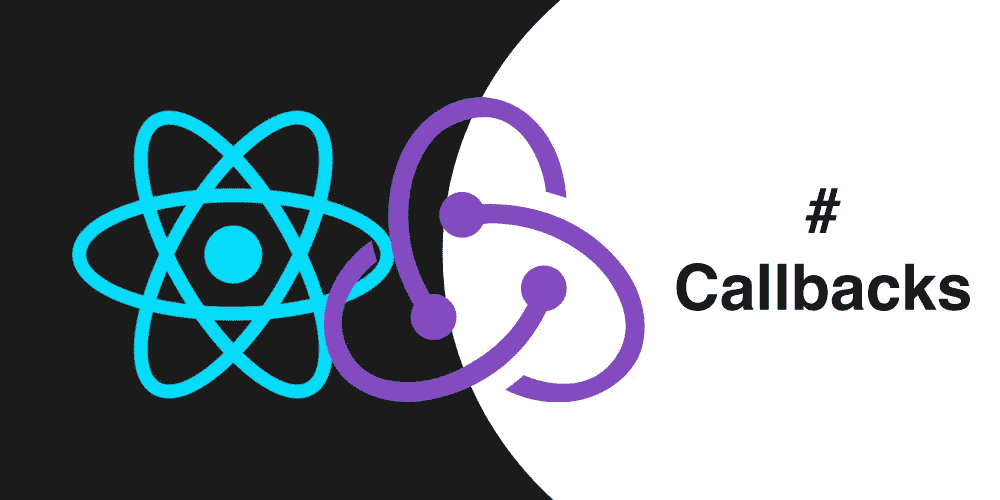

# 如何停止使用回调，开始生活

> 原文：<https://medium.com/hackernoon/how-to-stop-using-callbacks-and-start-living-1e5ed92e68e8>



Javascript 有两种处理异步任务的主要方式——回调和承诺。一般来说，承诺被认为比回电更容易使用和维护。但事实上，仅仅是承诺并不能让你快乐。异步代码可能仍然很难阅读和理解。因此，第三方库[，例如 co](https://github.com/tj/co) ，提供了编写类似同步的异步代码的方法。

我个人更喜欢世界上的一切都像 [**redux-saga**](https://github.com/redux-saga/redux-saga) 一样清晰美好。但是并不是每个人都能幸运地使用 React 和 Redux 来使用传奇。在本文中，我将展示在现代 Javascript 中，不使用任何第三方库来编写结构良好且易于理解的异步代码并不困难。

# 回调地狱

先说个例子。比方说，我们有一个可以从流中读取一些数据的对象，这个对象使用一个事件发射器来通知每个对事件感兴趣的人。这些事件是“开始”、“数据”、“停止”，更复杂的是，“暂停”。

因此，我们希望捕获“开始”事件，我们希望在这个事件上开始获取和存储数据，同时侦听“数据”事件。对于“停止”事件，我们需要执行一些数据处理。在“暂停”事件时，我们停止等待下一个“数据”事件，而是等待“开始”来继续获取和存储数据。

代码如下:

```
let data = '';

const handleStart = () => {
   streamReader.removeAllListeners('pause', handlePause);

   streamReader.on('data', (chunk, err) => {
       if (err) {
           console.error(err);
           streamReader.removeAllListeners('data');
           streamReader.removeAllListeners('pause');
           return;
       }

       data += chunk;
   })
}

const handleStop = () => {
   streamReader.removeAllListeners('data');
   streamReader.removeAllListeners('pause');
   streamReader.removeAllListeners('stop');

   processData(data, (err, result) => {
       if (err) {
           console.error(err);
           return;
       }

       storeResult(result, () => {
           console.log('Stored')
       })
   });
}

const handlePause = () => {
   streamReader.removeAllListeners('data');
   streamReader.on('start', handleStart);
}

streamReader.once('start', handleStart);
streamReader.on('stop', handleStop)
streamReader.on('pause', handlePause);
```

这里我们有一堆事件监听器和事件处理器来实现上面描述的流程。还有一些名为 **processData** 和 **storeData** 的函数，它们执行一些异步操作，并在完成时调用一个回调函数。

这段代码有什么问题？嗯…我想，这完全是一场噩梦。首先，有一个全局变量**数据**不可能去掉。我上面也提到了一个流程，但是代码中没有流程。很难理解动作的顺序，因此很难调试。人们不会无缘无故地称之为‘回调地狱’。

# 出口

Javascript 中异步回调的好处是，如果您不想使用它们，就不必使用它们。任何回调都可能变成承诺。最简单的例子是这样的:

```
const processDataPromise = new Promise((resolve, reject) => {
   processData(data, (err, result) => {
       if (err) reject(err);
       resolve(result);
   });
})
```

或者更一般的解决方案:

```
function promisify(f, context, isEvent) {
   const ctx = context || this;
   return function () {
       return new Promise((resolve, reject) => {
           f.call(ctx, ...arguments, (...args) => {
               const err = arguments ? args.find((a) => a instanceof Error) : null;
               if (err) {
                   reject(err);
               } else {
                   if (isEvent) {
                       resolve({
                           type: arguments[0],
                           cbArgs: [...args],
                       });
                   } else {
                       resolve([...args]);
                   }
               }
           })
       });
   }
}
```

一般的解决方案并不能立即明确，所以让我来解释一下。

函数 **promisify** 将一个异步函数作为第一个参数，并返回一个函数，该函数除了回调之外，采用与原始函数相同的所有参数。当这个返回的函数被调用时，它返回一个承诺。原始函数在 Promise 内部被调用，当原始函数调用回调时，Promise 被解析。如果原始函数有一个上下文( **promisify** 的**上下文**参数),那么当在 Promise 内部调用时，它就被绑定到这个上下文。如果原始函数只是一个普通的异步函数，我们用回调的参数来解析承诺。如果它是一个事件监听器( **isEvent = true** )，我们返回事件类型和回调参数。如果回调被错误调用，承诺将被拒绝。

**promisify** 的应用看起来是这样的:

```
const processDataPromise = promisify(processData);
const storeResultPromise = promisify(storeResult);
const onEventPromise = promisify(emitter.once, emitter, true);
```

这个承诺可以这样使用:

```
processDataPromise(data).then(([err, processedData]) => {
/* do something with the data*/
})
```

但是有更好的方法。

# 传奇般的天堂

我们确实需要一个更好的方法，因为要把上面描述的这种流程压缩成一个承诺链几乎是不可能的。

更好的方法是 Javascript **async** 函数，这里是同一流程的另一个实现:

```
async function readStream(streamReader, initialData) {
 const processDataPromise = promisify(processData);
const storeResultPromise = promisify(storeResult);
const onEventPromise = promisify(streamReader.once, streamReader, true);

   await onEventPromise('start');
   let data = initialData || '';

   while (true) {
       try {
           const event = await Promise.race([
               onEventPromise('data'),
               onEventPromise('stop'),
               onEventPromise('pause'),
           ]);

           const {type} = event;

           if (type === 'data') {
               const [chunk] = event.cbArgs;
               data += chunk;
           }

           if (type === 'pause') {
               readStream(streamReader, data);
               break;
           }

           if (type === 'stop') {
               const [err, processedData] = await processDataPromise(data);
               await storeResultPromise(processedData);
               return processedData;
           }
       } catch (err) {
           handleError(err);
           return;
       }
   }
}
```

那么，这个实现有什么好处呢？首先，它看起来更漂亮。其次，也是更重要的一点，这段代码中有一个流程。这几乎就像流程图，你可以一步一步地追踪整个序列的每个循环和每个分支。它确实看起来像我在开始提到的一个传奇，但没有必要了解任何关于 **redux-saga** 的知识来编写这样的代码。更重要的是，这是一个你可以忍受的准则。

[](https://hackernoon.com/missing-part-of-redux-saga-experience-1d2d169ba765) [## Redux Saga 体验中缺失的部分

### Redux saga 是应用程序和 redux store 之间的中间件，由 redux actions 处理。这意味着，它可以…

hackernoon.com](https://hackernoon.com/missing-part-of-redux-saga-experience-1d2d169ba765) [](https://hackernoon.com/using-normalizr-to-organize-data-in-stores-practical-guide-82fa061b60fb) [## 使用 Normalizr 组织商店中的数据——实用指南

### 在对 Normalizr 的工作结果应用一些简单的操作之后，我们得到了可以存储的数据

hackernoon.com](https://hackernoon.com/using-normalizr-to-organize-data-in-stores-practical-guide-82fa061b60fb) [](https://hackernoon.com/usage-of-reselect-in-a-react-redux-application-fcdca05cc00d) [## 在 React-Redux 应用程序中使用重选

### 为什么重选这么好

hackernoon.com](https://hackernoon.com/usage-of-reselect-in-a-react-redux-application-fcdca05cc00d) [](https://hackernoon.com/using-normalizr-to-organize-data-in-store-part-2-d9646133b7df) [## 使用 Normalizr 组织存储中的数据。第二部分

### 文章的第二部分讲述了如何使用 Normalizr 来组织商店中的数据。

hackernoon.com](https://hackernoon.com/using-normalizr-to-organize-data-in-store-part-2-d9646133b7df) 

由 Ilya Bohaslauchyk 撰写