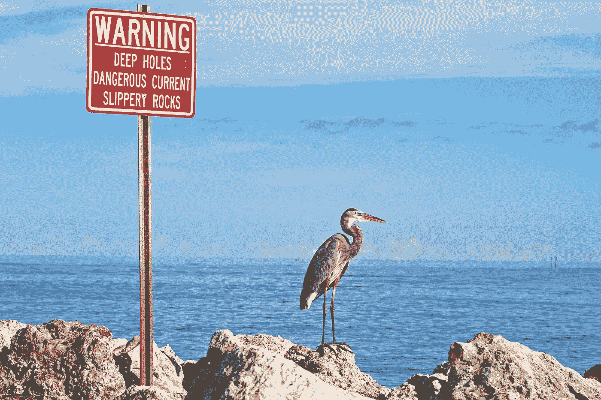
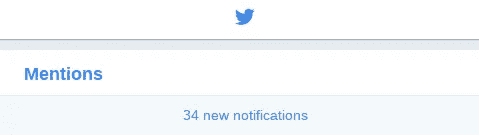

# 如何停止担忧并开始发微博

> 原文：<https://medium.com/hackernoon/how-to-stop-worrying-and-start-tweeting-a22f84e1cebb>

## 我希望我有丢失的 Twitter 手册

Photo by [Tyler B](https://unsplash.com/photos/MTjP7QxJESM?utm_source=unsplash&utm_medium=referral&utm_content=creditCopyText) on [Unsplash](https://unsplash.com/?utm_source=unsplash&utm_medium=referral&utm_content=creditCopyText)

有很多很好的理由让你开始使用 Twitter。Rachel Thomas 在“[与个人品牌和平相处](http://www.fast.ai/2017/12/18/personal-brand/)”中列出了一些更重要的问题。

对我来说，吸引力很简单。我倾听并偶尔与在我所关心的领域中做出惊人成就的人交谈(机器学习，重点是深度学习)。我也有时候会幻想自己写的东西对别人有帮助。大部分都是我在做梦。

但是 Twitter 并不是没有怪癖，有些事情并不像它们表现出来的那样。

下面，我展示了丢失的手册——我希望在开始使用该平台时就拥有它。

## 呆一会儿，听听

你已经在推特上了吗？或者也许你正在考虑报名？

这些是你需要考虑的事情:

1.  你对什么感兴趣？有什么爱好或爱好吗？
2.  在你感兴趣的领域里，有没有你想了解更多的作家或其他有成就的人？

然后你要做的就是跟着第二组的人走。

从现在开始，他们将能够与你分享他们的想法。他们也可能把你介绍给其他你可能感兴趣的人。

这不是很棒吗？以前从未有过这样一种简单而开放的方式来倾听一个人要说的话。

以这种方式使用 Twitter 有很多好处，并且避免了几乎所有麻烦的部分。

但你指出 Twitter 的核心是一个社交网络是对的。大声说出来并让别人了解你是有价值的。

这就是问题开始的地方。Twitter 做出了很多设计决策，这让它变得非常困难。

下面我分享一下我使用的策略。它对我来说非常有效。但是，在我们进一步深入之前，让我们更仔细地了解一下平台本身。

## 了解野兽的本性

如果你是人类，社交网络的设计很可能并没有考虑到你。

让我说得更具体一些。多年来，数十亿美元被投入到优化社交网络中，目的只有一个——最大化利润。

这一目标通常与维护用户的福祉截然相反。

关于这个问题已经写了很多。例如，你可能会发现了解[为什么社交媒体老板不使用社交媒体](https://www.theguardian.com/media/2018/jan/23/never-get-high-on-your-own-supply-why-social-media-bosses-dont-use-social-media)非常有趣。

大部分原因归结为这样一个事实:让用户开心和放松并不能提高参与度。你想要快乐，对吗？你想要内心平静。

因此，我们需要谨慎行事，因为我们即将开始使用一个目标与我们的利益不一致的平台。

那我们怎么开始谈呢？

## 选择一个主题

想让你的声音穿过噪音被听到吗？选择一个主题来说话。

当你的饲料被你的猫的照片淹没时，一个对滑板感兴趣的人没有足够的时间来挑出你有一些有趣的事情要说。或者你的早餐。

This might just work though. ([source](http://www.catster.com/molz/kitten-on-a-skateboard-2))

偶尔发个人微博的日子会到来，但只会在人们更了解你的时候。

## 增加你的追随者数量 101

为什么你首先需要更多的追随者？除非你想卖东西——在这种情况下，离我远点——否则你不会。

还记得不是每个人都想成为名人的时代吗？当人们只是想认识别人的时候。

你现在打开 FB，每个人都是过着完美生活的最成功的人。这是错误的。

Twitter 的情况更糟。扩大受众的吸引力非常强。但这是一条通向苦难的道路。

找几个人，也许 3 或 4 个，他们正在做一些有趣的事情。开始和他们说话。也许他们会和你顶嘴。一旦有 2-3 个人愿意和你交谈，你就万事俱备了。

知足常乐。你成功了。

如果一个你钦佩的人与他们的追随者分享你的一些工作，或者和你顶嘴，那是最好的。如果你有什么有趣的事情要说，外面有一些真正的好人会帮助你被听到。

但这不能成为你的目标。如果你想追人气，这就又是高中了。你会发疯的。

## 它是异步的或者什么都没有

社交网络的第一条规则是禁用推送通知。任何事情都不能随意打断你的思绪。

尤其是当它内置了让你上瘾的算法时。

Bring it on Twitter. Is this all you got?

但是，即使您禁用了推送通知，情况也并不简单。

我可以告诉你所有关于斯金纳的事。声称自由意志不存在并让动物听命于他的美国科学家。他的作品在多大程度上影响了大型社交平台的设计选择，这很耐人寻味。

相反，让我向你推荐一篇内部人士的文章，他提出了一个很好的观点。想知道[老虎机是如何被放进十亿个口袋里的吗](https://journal.thriveglobal.com/how-technology-hijacks-peoples-minds-from-a-magician-and-google-s-design-ethicist-56d62ef5edf3#f59a)？

## 我已经迷上了社交媒体。我能怎么做呢？

视情况而定，有时寻求专业帮助可能是明智的。如果使用适度，也许你可以改掉这个习惯，把它变成有用的东西。

我经常发现自己把手机从口袋里拿出来，准备按下或按下 Twitter 图标。但幸运的是，我有一个非常慢的手机。

即使我按下了图标，在应用程序加载之前也会有一两秒钟的白屏。

在那短暂的一刻，我重获自由。我给你买了推特。

我很快取消，并按下门德利。这是一个我用来组织我想阅读的科学论文的应用程序。

我深吸一口气。恭喜自己。然后我喜欢阅读对我有益的东西。

重点不是不使用社交媒体。重点是不要一直用。

给自己时间思考和呼吸。

你的门德利是什么？

## 推特作为配菜

当你与人交谈和交换想法时，Twitter 工作得最好。当你收到有益的建议并向他人学习时。

但是要很好地利用这个建议，你需要给予它关注。当你打开 Twitter 客户端时，这不会发生。

或者当你在乎别人是否喜欢你写的东西时。

更重要的是，你爱的人可能在也可能不在 Twitter 上。这不重要。

你不能透过手机屏幕看他们的眼睛。你不能拥抱他们或和他们一起散步。

争取你的注意力，把注意力给你爱的人和事。

你这样做的能力不会永远持续下去。

*讽刺的是，你可以在推特上找到我* [*这里*](https://twitter.com/radekosmulski) *。我主要发关于机器学习的微博。*

如果你对此感兴趣，请随意关注。

只要确保你不要太频繁地检查你的饲料。