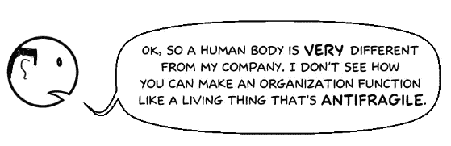
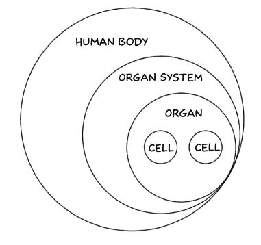

# 如何组织你的组织从混乱中获利

> 原文：<https://medium.com/hackernoon/how-to-structure-your-organization-to-profit-from-chaos-daea5fcdab36>

## **利用 Holacracy 建立一个反脆弱组织**

嘿 CEO！为什么这么难过？

哦，你是说这家伙让你头疼:

他有不同的名字。压力、变化、冲击、分裂。但为了简单起见，我们姑且称之为“紧张”。这是我们想要却没有的东西时的感觉。

据**尼古拉斯·纳西姆·塔勒布**称，紧张可能是件好事

…谁写了《T4》这本书。

他说，在一个如此不稳定和不可预测的世界中，我们需要建立从变化和冲击中受益的系统，而不是遭受它们。

换句话说，我们的组织需要变得更加脆弱，才能从压力和紧张中获益。

> **抗脆弱！**

这是它的意思。让我们拿三种不同的物体来说:

并对它们施加张力。

玻璃是易碎的。它被紧张伤害了。

保险箱很坚固。它保持不变

当暴露在[混乱](https://hackernoon.com/tagged/chaos)中时，DNA 会发生变异。 **DNA 是抗脆弱的。它受益于紧张。**

人体是抗脆弱的一个很好的例子:

1.  当周期性的压力施加在骨头上时，骨头会变得更致密。
2.  当你举重时，你会压迫你的肌肉。下次你的身体适应举起更重的重量。
3.  此外，当你在有限的时间内剥夺身体的食物和水，你的身体会变得强壮。这就是为什么间歇性禁食对健康有很多好处。

这里告诉你如何像一个活的有机体一样构建你的组织，使它具有抗脆弱的特性。

# 如何像人体一样构建一个组织

你以前见过这种结构？

它被称为**管理层级**——一种自上而下管理组织的命令和控制系统。高层的老板做出重大决策。底层的人大部分时间都在听从指示，而中间的管理者则平衡老板和工人的需求。

这是一种能够抵御风险和变化的结构。

在一个快速变化的世界中，我们被要处理的信息和要做出的决定所淹没。所以像这样的结构使得人们很难有效地工作。

但这不是组织结构的唯一方式。你可以像人体一样构造它。

请注意，在人体内没有老板细胞告诉其他细胞做什么。每个细胞在器官内自主运行，器官又在体内自主运行。

人体是抗脆弱的，因为它能适应环境中的压力，变得更强壮。

类似地，通过构建一个像人体一样的组织，它可以有效地处理环境中的紧张关系，以适应自身，更有效地实现其目标。

# **Holacracy——快速变化世界的新管理系统**

[Holacracy](https://hackernoon.com/tagged/holacracy) 是一种组织的自我管理实践，它让人们能够做出有意义的决定来追求组织的目标。

在 Holacracy 中，不是“经理”和“老板”有权告诉人们做什么，而是一套分配权力的规则，这样人们就可以在各自的角色中成为领导者。

当一个组织采用 Holacracy 时，结果不是一个扁平的组织，而是一个非常结构化的组织，它包含角色而不是人员的层次结构:

使用 Holacracy 的组织结构—角色而非人员的层次结构

# 实行 Holacracy 的组织从压力中获益的 6 种方式

# 1.它鼓励压力和紧张

> *“就像在床上呆一个月会导致肌肉萎缩一样，当失去压力源时，复杂系统会被削弱甚至死亡。”* Taleb，抗脆弱

## **管理层级:**

## **Holacracy:**

在实行 Holacracy 的组织中，团队成员被鼓励带来紧张气氛。他们被视为变革的驱动力。

事实上，有些会议的具体目的是制造紧张局势，并找到处理紧张局势的途径。

# 2.快速适应的反应结构

> *“在一个系统中，一些(抗脆弱)单元的牺牲往往是其他单元或整体的福祉所必需的。每一家初创企业的脆弱性都是经济抗脆弱的必要条件。”* Taleb，抗脆性

## 管理层级

管理层级是一种僵化的结构。它旨在抵御风险和变化。

## Holacracy

在实践 Holacracy 时，组织会根据角色填充者感受到的压力而不断变化。创建新的角色、改变职责、添加或删除策略等等。

这使得组织的*部分*变得脆弱。

但是*整个*组织变得**抗脆弱**，因为它为任何新的变化、机遇和威胁做好了准备。

# 3.决策是在整个组织中进行的

> *“自上而下的方法阻碍了抗脆弱性和增长，而自下而上的方法在适当的压力和无序下会蓬勃发展。”*塔勒布，抗易碎

## 管理层级

## Holacracy

Holacracy 的实践允许任何人感觉到组织中的紧张，并迅速可靠地将其转化为有意义的变化。

团队成员不再需要老板或经理的许可。

只要他们没有违反宪法，他们可以做出任何决定来实现他们角色的目的。

# 4.解决紧张局势的许多途径

> 让士兵们别无选择，看看他们能变得多脆弱 Taleb，抗脆性

## 管理层级

## Holacracy

当人们没有解决紧张的选择或途径时，他们会感到沮丧。他们要么诉诸政治，要么干脆放弃。

Holacracy 的美妙之处在于，它为角色填充者提供了几种解决紧张情绪的选择，让他们能够找到前进的创造性方法..

# 5.游戏中的皮肤

> *“我们今天所做的与资本主义或社会主义无关。这是一种将资金转移到官僚金库的裙带型制度。社会最大的“碎片化者”是游戏中缺乏皮肤。”* Taleb，抗脆弱

## 管理层级

## Holacracy

你如何让你的团队成员有内在的动力？如果他们不能自主决定自己的工作，那就很难了。

但是，当他们有自主权做出有意义的决定时，他们也与结果有利害关系。

换句话说，他们拥有游戏中的*皮肤*，这给了他们内在的动力让他们的想法成功。

# 如何入门 Holacracy？

是啊！如果我们有一个抵抗紧张的结构，紧张就会成为一个问题。

但是，当我们有一个邀请它的结构时，紧张和压力就会变成一种力量，使我们的组织朝着它的目标前进。

**以下是 Holacracy 的一些入门资源。**

[Holacracy.org](http://www.holacracy.org/)官网。查看他们的战术性&治理会议。

**💬** [***在 Twitter 上关注我***](https://twitter.com/CalmAchiever) *了解更多关于生产力、GTD 和自我管理的见解。*