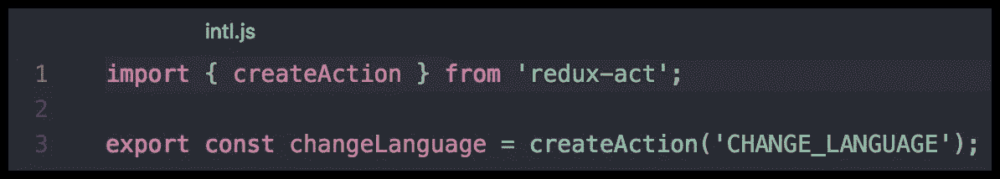
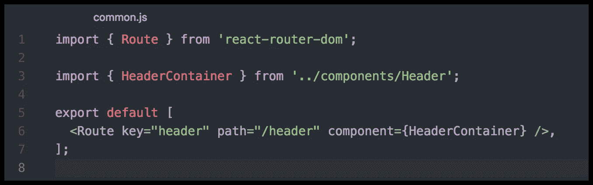

# 如何构建你的 react 应用？

> 原文：<https://medium.com/hackernoon/how-to-structure-your-react-app-98c48e102aad>

当你在一个大团队中工作时，拥有一个风格指南总是好的，不仅对于 CSS 和 JS，而且对于构建组件和文件夹也是如此。我决定写我自己的来展示我如何以及在哪里放置我的文件和文件夹。开始吧！

[链接到第二部分。](https://itnext.io/how-to-structure-your-react-app-2-2cf3b8040634)

我总是根据商业价值来划分我的组件。我称之为`bundle`。

例如，我曾经构建的每一个[应用程序](https://hackernoon.com/tagged/application)都有一个公共包，它包含了所有的公共组件，比如页眉、页脚、按钮、模态等等。如果你有一个用户页面(设置，照片，个人资料)，它将是一个用户捆绑包，其中将有特定于一个用户的所有组件。拥有这样的结构真的很方便，因为无论何时你在浏览器中看到一个页面，你都可以说你需要去哪里找到那个组件。对于那些不知道你是如何构建组件的新手来说，这也是一件好事。他们能够猜出这是什么包。例如:`/user/22/preview`页面将显示用户包中的一个组件。很容易猜到。

每个包都有几个文件夹:

1.  `**actionCreators**`举行 redux-actions。

2.`**Components**`是一个包中所有组件的文件夹。组件文件夹中的每个文件夹都应该以第一个大写字母命名，作为所有组件的文件。我总是使用第一个大写字母的原因是，当你在你的项目中通过名字搜索一个文件时，你总是可以通过名字`header`和`Header`识别组件，你总是知道第二个是一个组件。在你开始进一步阅读之前，请考虑阅读这篇[文章](/@dan_abramov/smart-and-dumb-components-7ca2f9a7c7d0)。

现在来说说为什么有三个文件而不是一个。

`Header.js`只是一个普通的视图。它可能是一个无状态的组件(函数)或者一个类。我更喜欢使用类，因为类可以和 HMR 一起开箱即用，但这取决于你。你应该知道的唯一一件事是视图是一个愚蠢的组件，它只能渲染道具，不应该有任何业务逻辑。

`HeaderContainer.js` 是一个“智能”组件。这类组件总是进行数据提取、准备数据、从 redux-store/ [relay](https://hackernoon.com/tagged/relay) 获取数据、定义动作、注入 intl 或 jss。这是组合[高阶组件](https://reactjs.org/docs/higher-order-components.html)的好地方。通常，您不会在智能组件中导入 react，因为您不应该在那里呈现任何内容。它应该是这样的:

`index.js`只需再出口组件。如果你在应用程序的某个地方导入你的组件，你会这样做`import Header from 'bundles/common/components/Header/Header.js’`。为了避免重复`Header/Header.js`，我们可以在 index.js 中重新导出我们的 Header 组件。把它放在这里也很好，因为你可能有两个容器和一个视图，例如:`CreateUserFormContainer.js` `UpdateUserFormContainer.js`和一个视图`UserForm.js`。当然你有两条不同的路线:`update-user` & `create-user`。

现在我们可以像`import { Header, HeaderContainer } from 'bundles/common/components/Header';`一样导入我们的组件

3.`**reducers**` 是一个用于一个束的所有异径管的文件夹。intl.js 的 Reducer 如下所示:

4.`**routes**`文件夹保存当前束的所有路线。同一个包可以有几个路由文件。对于公共包，有任何路由是不正常的，因为它是公共包，但是假设我们有一个路由显示我们的头:`/header`。

我收集了每个路由文件中的所有路由，并将它们导出为一个数组。后来，在我的应用程序的入口点，我导入所有的路线，将它们合并成一个数组，并在`Router`中渲染。

结论。唯一重要的是你和你的团队之间的合作有多愉快。风格指南只是你和你的团队定义的一个约定。希望你喜欢这篇文章。喜欢请点赞&分享。和平。

[链接到第二部分](https://itnext.io/how-to-structure-your-react-app-2-2cf3b8040634)。