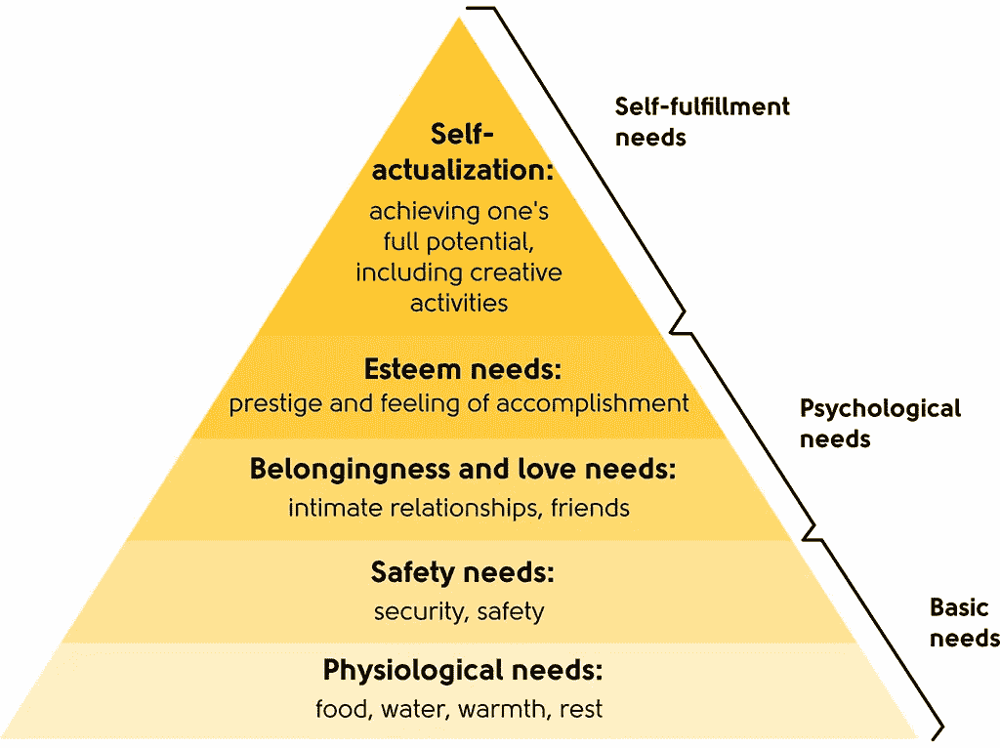

# 如何成功建立和管理分布在世界各地的团队

> 原文：<https://medium.com/hackernoon/how-to-successfully-build-and-manage-a-team-distributed-around-the-world-546678903fa3>

不管你受过多少教育，有多少经验，有多少动力，也不管你有没有决心经营一家成功的企业，总有一种稀缺资源会让你无法独自完成这件事，现在，我说的是时间。作为一名企业家，意味着你一直处于压力之下，在很短的期限内工作，不管你愿不愿意承认，你都需要帮助。正如许多投资者和成功的企业家会说的那样，如果没有一个能让事情发生的好团队，商业创意就什么都不是。

建立一个团队可能是非常具有挑战性的任务，尤其是如果你没有用人的经验。找到合适的人，有才华的人，帮助你实现业务目标已经够难了，如果你把团队管理加入到等式中，事情会变得更具挑战性。假设你仍处于创业初期，没有钱从专业人力资源机构获得帮助，让我们列出一些关于如何建立和管理团队的指导方针。作为一个小小的奖励，我甚至会分享一些关于管理一个分布在[世界](https://hackernoon.com/tagged/world)的[团队的技巧。](https://hackernoon.com/tagged/distributed)

# 建立一个团队

首先，我们来排除一些人们在创业时最常犯的错误。与你亲密的私人朋友一起创业会给经营企业带来更多的问题，而不是帮助。考虑到你在未知的领域里冒险，把一切都置于危险之中，创业可能是一件非常可怕的事情。正因为如此，人们倾向于与亲密的私人朋友一起创业，以寻求支持和理解，甚至与他们信任的人分担压力。另一方面，朋友通常避免给出真实的反馈，这导致处理错误的信息和对你业务情况的错误评估，而这正是导致失败的原因。

组建团队的另一个常见错误是雇佣和你想法一样的人。你的队友需要对你的业务有同样的热情，但思考和解决问题的方式需要不同，以取得进展并克服你在日常生活中面临的问题。

现在我们已经排除了最常见的错误，让我们来谈谈建立和管理优秀商业团队的正面例子和技巧:

# 1.确定你的需求

根据你从事的行业，你需要不同类型的团队成员。作为公司创始人，你的工作是确定你的团队需要什么类型的人和技能，并创建非常准确的职位描述。请记住，多学科导致创新和更好的业务绩效，所以请集中精力在您的团队中寻找在您需要的领域有才华的人。

# 2.想想你的公司文化

找到一个有合适资质的人并不意味着他们会给你的团队增加最好的价值。我经历过很多次，非常有才华的人被解雇或离开团队，因为他们不适合公司的文化。你应该总是寻找那些能够概括出你正在努力推广的商业文化的人，并把这种文化转移到你的合作伙伴、客户和其他团队成员的工作中去。

你雇佣的人不仅要和你相处好，还要和其他人相处好

团队。当你建立一个相处融洽的团队时，他们会做得更好，这也是事实

更容易应对你的团队将面临的挑战。

# 3.设定明确的期望

为了优化团队的工作，您需要制定一系列您的团队成员将遵循的指导原则和程序。一套指导方针可以帮助新员工很快适应新工作，也可以帮助你最大限度地减少花在标准化活动上的时间。

另一方面，太多的规则会影响生产力，阻碍创造力。在太多和刚好足够的指导方针和规则之间找到正确平衡的关键是设定明确的期望。给你的员工任何他们需要的必要资源和明确的指导方针和目标，让他们知道你对他们的期望，但给他们留下足够的空间来即兴发挥和发挥他们的创造力。庆祝小小的胜利，保持开放的沟通，与所有员工一起组织公司活动，让他们感觉他们是团队的一部分，并了解他们对公司成功的影响。

# 4.重视每个团队成员

正如我们之前提到的，多学科是许多成功团队背后的秘密成分。为了组建一个强大的团队，选择那些有特殊技能的人来帮助你走得更远。如果一个人不能给你的团队带来独特的价值，就不要雇佣他。除了选择合适的员工，作为首席执行官，你的工作还包括确保团队中的每个人都充分意识到他们对团队的独特价值。这将帮助他们获得目标感，激励他们，同时提高他们的表现。

# 5.刺激

建立和管理一个团队最难的不是招人的过程，而是不断激励员工，让热情始终保持高涨的过程。所以，这里的问题是，真正激励人们的是什么。传统的方法是，你给员工的报酬越高，他们对工作的积极性和满意度就越高。事实是，钱只是第一步，它只带来短期的动力。为了解释这一点，我们来看看下图中马斯洛的需求层次理论。钱只会覆盖基本需求——心理和安全需求。当一个人能够过上体面的生活并支付标准费用时，他们需要满足心理和自我实现的需求。每当你的团队成员达到另一个里程碑时，你可以用肯定的话语和庆祝小胜利来帮助你的员工获得成就感。通过设定明确的期望并为创造力留出空间，我们在第二段中讨论过，你的员工可以实现他们的全部潜力，这不仅极大地反映了员工的进步，也反映了整个公司的进步。

Maslow’s hierarchy of needs

# 6.沟通

建立和执行建立和管理团队的前五条指导方针的最佳方式是沟通。所有员工都必须能够随时获得有关公司、战略、现状和其他团队成员的信息。尽可能保持一定程度的透明度非常重要，即使信息并不与团队中的每个人直接相关。为了帮助团队成员之间的沟通，使用 Slack、Teamwork、Zoom 等应用程序，并建立自己的 CRM 系统:

*   **Slack** 将帮助你在公开渠道组织你的团队对话。你可以为你需要的项目、话题或任何相关主题创建一个频道，每个参与的人都可以看到透明的信息。当你觉得信息敏感时，你甚至可以创建私人频道。了解更多关于 Slack:【https://slack.com/】T2
*   **团队合作**是一款你可以信赖的项目管理 app、聊天 app 和帮助台软件。通过团队合作，您可以将所有任务集中在一个地方，运行帮助台来处理客户支持查询，并实现团队成员之间的实时通信。在[https://www.teamwork.com/](https://www.teamwork.com/)检验团队合作。对于不需要项目管理的所有铃铛&哨子的较小团队来说，今天一个非常流行的解决方案是 **Trello** ，可以在[http://www.trello.com](http://www.trello.com/)获得。
*   Zoom 是目前世界上最受欢迎的视频会议服务，如果你希望在你的分布式组织中有健康的交流，这是一个天赐良机。虽然比著名的 Skype 或 Google Hangout 年轻得多，但它提供了卓越的视频和音频质量，这在多人会议时尤其明显。强烈推荐，更多详情在 [http://www.zoom.us](http://www.zoom.us/) 。
*   如果你和许多高收入客户合作，建议使用客户关系管理(CRM)。CRM 是一种管理公司与客户互动的策略。好的客户关系管理将帮助你提高公司的盈利能力，并让你的销售人员及时了解所有重要的客户信息。

CRM 将帮助您跟踪所有的事情——给客户的电话和电子邮件，召开的会议，甚至客户的个人信息。所有通信、文档和会议的完整历史记录都存储在一个位置，可供您的员工使用。

好的 CRM 软件的一个例子是 **Hubspot CRM** ，而且对于在线业务来说 **Intercom** 平台非常受欢迎，这是一个全方位服务的平台，可以帮助你在&上留住客户，创建&共享内容，大规模支持客户并与客户实时聊天。欲了解更多信息，请访问 https://www.intercom.com/[和 http://www.hubspot.com](https://www.intercom.com/)。

*随着时间的推移，我们将继续出版这本书的某些部分，这样你就能感受到书中所有内容的*价值*，并邀请你在*[*FromZerotoBusinessHero.com*](https://fromzerotobusinesshero.com/)*亲自查看这本书。*

***甚至还有价值 55K 美元的大赠品专为读者准备(*** [***第 125 页***](https://fromzerotobusinesshero.com/) ***)。***

我们希望你会喜欢它，就像我们喜欢制作它一样。

*最初发布于*[*www . Avalon . host*](https://www.avalon.host/blog/how-to-successfully-build-and-manage-a-team-distributed-around-the-world/)*。*