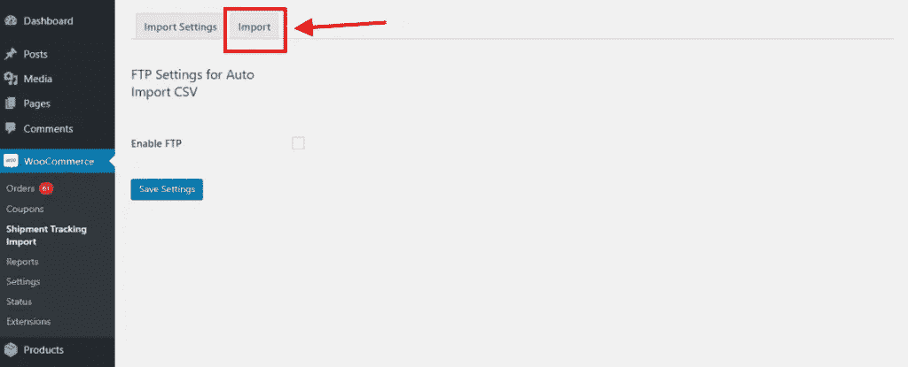
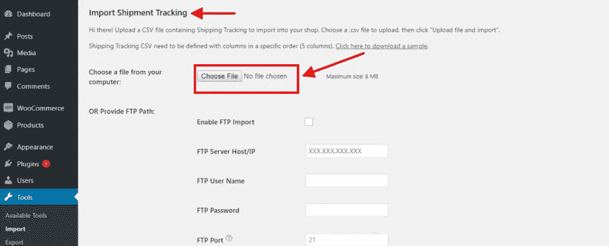
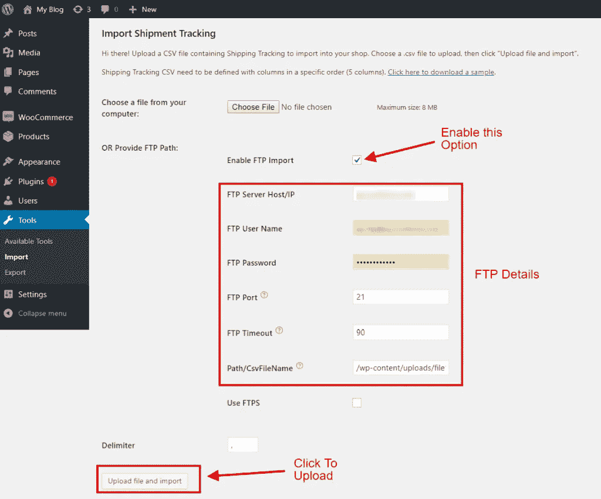
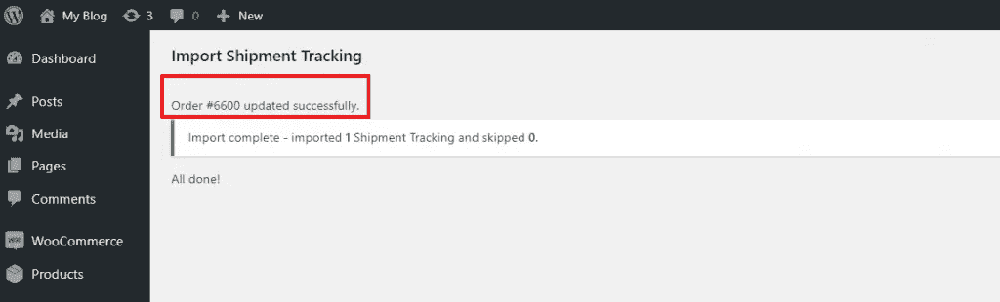
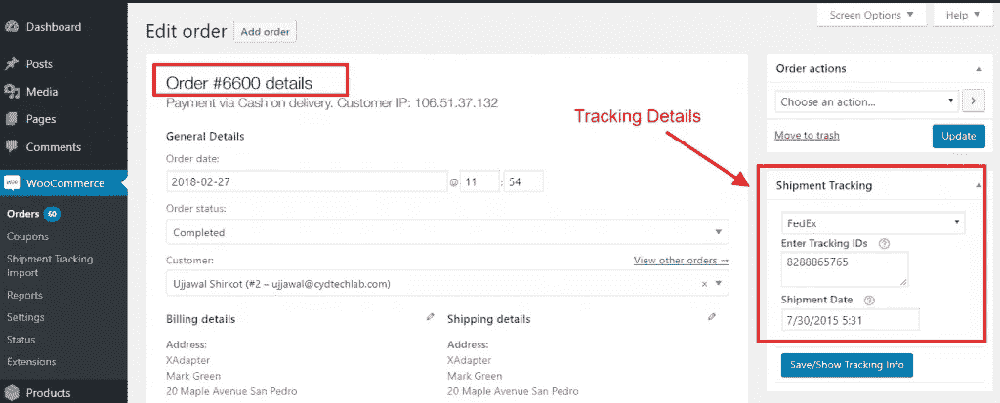

# 如何在 WooCommerce 中成功导入追踪详情？

> 原文：<https://medium.com/hackernoon/how-to-successfully-import-tracking-details-in-woocommerce-6627225e7300>

WooCommerce 是最受欢迎的电子商务平台之一。WooCommerce 上运行着数百万个网站。当拥有一个电子商务网站时，WooCommerce 商店的店主享受许多功能。对于 WooCommerce 用户来说，通过 UPS、FedEx、USPS 等运输公司向客户运送产品是一种非常常见的做法。然而，有一些事情让 WooCommerce 用户浪费了大量的时间——跟踪货物。理想情况下，WooCommerce 店主手动更新订单中发货的[跟踪](https://hackernoon.com/tagged/tracking)细节。对于小企业主来说，这似乎是最好的做法。然而，对于一家中等规模的 WooCommerce 企业主来说，每天都有多批货物发运，这种做法需要花费更多的时间和人力。

WooCommerce 店主需要的是一种自动机制来更新订单中的跟踪细节。这种方式不仅可以节省大量的时间，而且可以使整个过程自动化，从长远来看可以节省资金。

在本文中，我们将介绍使用 WooCommerce 订单跟踪插件处理订单跟踪细节的最佳方法之一。这篇文章将向你展示**如何成功迁移网络商务追踪号码。**

# 将 WooCommerce 跟踪详情直接导入订单

WooCommerce 店主可以选择使用一些订单跟踪插件来更新订单的跟踪细节。使用这些插件，WooCommerce 店主可以通过以下方法导入跟踪细节。

*   **使用 CSV 文件手动导入**
*   **使用 FTP 访问导入**

在本文中，我们将使用[**woo commerce Shipment Tracking Pro**](https://www.pluginhive.com/product/woocommerce-shipment-tracking-pro/)，因为这是最好的跟踪插件之一，使用该插件我们将演示如何轻松地导入跟踪细节。但是在我们开始导入跟踪细节的整个过程之前，让我们给你一个关于 WooCommerce Shipment Tracking Pro 插件的简单介绍。

# [WooCommerce 货件追踪专业版](https://www.pluginhive.com/product/woocommerce-shipment-tracking-pro/)

WooCommerce Shipment Tracking Pro 是顶级订单跟踪插件之一。它允许 WooCommerce 店主一次性导入多个订单的跟踪信息。使用这个插件，WooCommerce 店主可以更新订单中的跟踪细节，并更改订单的状态。这样，客户将收到订单完成电子邮件形式的自动回复。该电子邮件将包含包裹的跟踪编号以及帮助客户直接从电子邮件中跟踪其包裹的链接。

现在，既然我们都已经熟悉了这个插件，让我们继续将跟踪细节导入到 WooCommerce 订单中。

# 使用 CSV 文件导入追踪详细信息

使用 CSV 文件导入包裹追踪详细信息的过程是更新包裹追踪详细信息的最简单方法之一。这个过程包括用正确的信息手动填充 CSV 文件，然后使用插件上传它。成功更新订单所需的信息包括:

*   **订单编号**
*   **承运人名称**
*   **追踪号**
*   **装运产品的日期和时间**

WooCommerce 商店的店主可以很容易地在插件设置中选择导入 CSV 文件。下图显示了将 CSV 添加到商店的选项。

Import Settings

Upload CSV here

为了便于理解，这里有一个快速教程视频，用于通过 CSV 向您的订单添加货件跟踪详情。

通过这种方式，WooCommerce 店主可以轻松地导入货物跟踪数据，并将其附加到订单中。一旦文件上传成功，WooCommerce 店主将能够看到每一个订单的跟踪细节。使用这一流程，店主无需手动将订单标记为**完成**。因为一旦文件上传，订单将自动标记为完成。客户将在**订单完成电子邮件**中收到这些详细信息。在该电子邮件中，客户将获得其包裹的跟踪 ID，以及一个链接，以便在运输公司的官方网站上轻松访问跟踪详细信息。下图显示了订单完成电子邮件中的跟踪编号和链接。

Tracking Number and Link attached to the Order Completion Email

# 通过 FTP 导入导入跟踪详细信息

WooCommerce 店主也可以通过 FTP 直接导入 CSV 文件来导入订单的跟踪细节。这样，店主可以确信文件不会被任何人修改或删除。使用 WooCommerce 货件追踪专业版，WooCommerce 店主可以通过 FTP 导入轻松更新订单的追踪详情。

店主可以在**货件追踪导入设置**中轻松输入他们的 FTP 凭证。下面的图片会给你一个界面的概念，你可以在这里添加 FTP 细节。

Upload via FTP

一旦商店所有者输入正确的凭证和 CSV 文件的路径，他们就可以上传文件。这样，订单中的跟踪细节将自动更新。下图显示了订单中的跟踪详细信息更新成功时显示的消息。

File uploaded successfully

在上图中，您可以清楚地看到更新后的订单编号。您甚至可以检查订单编号中的跟踪详细信息是否已更新。下图显示了订单编号#6600，跟踪详情已成功更新。

Tracking Details Updated in the Order

下面的教程视频解释了上传包含跟踪细节的 CSV 文件的整个过程。

# 摘要

所以这一切都是为了导入 WooCommerce 订单的跟踪细节。WooCommerce 店主可以轻松地使用自动订单跟踪系统，如 WooCommerce Shipment Tracking Pro 插件，将跟踪细节导入订单，而不是手动完成。这样，店主可以节省大量时间，他们可以很容易地投资于一些生产任务。此外，对于每一个 WooCommerce 店主来说，拥有这样一个既能让您的生活变得轻松又不影响客户体验的解决方案是最好的选择。

## 插件链接

*   [**免费版**](https://www.pluginhive.com/woocommerce-order-tracking-plugin-free/)
*   [**高级版**](https://www.pluginhive.com/product/woocommerce-shipment-tracking-pro/)