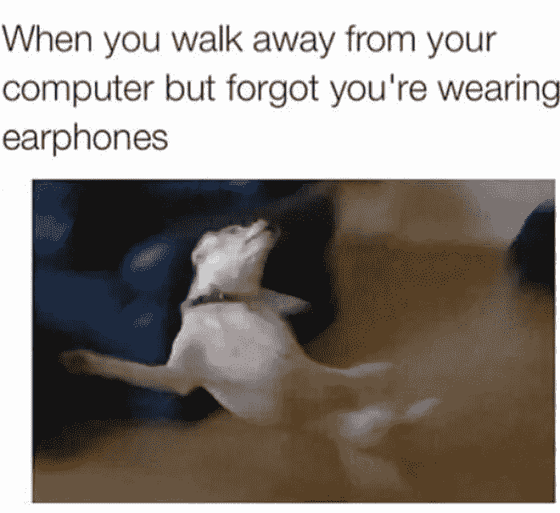
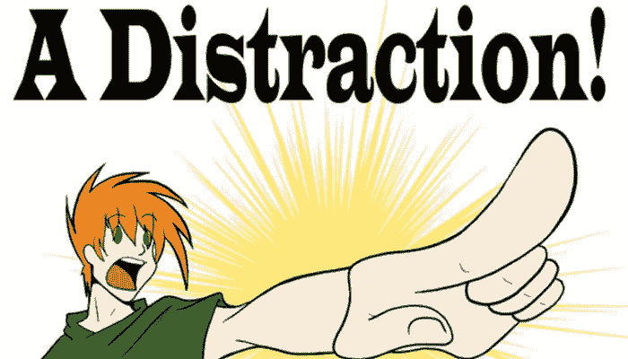
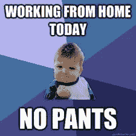

# 如何在嘈杂的办公室环境中生存

> 原文：<https://medium.com/hackernoon/how-to-survive-a-noisy-office-environment-a5823b66ed59>

这是继冰激凌的美味之后最广为人知的事实。软件工程师绝对讨厌开放式计划或开放式办公室。

它们嘈杂而紧张，令人分心，令人神经崩溃，它们做的最后一件事就是帮助你进入心流状态。除非你很幸运，你的同事知道这种痛苦，并采取相应的行动。

不幸的是，开放式办公室是我们日常工作中不可避免的资源，在未来几年内都是如此，尽管有很多反对的声音。尽管开放计划有一些好处，但我认为坏处更大。

下面是一些帮助你生存的建议

# 买一套好的耳机。

我在以前的一篇文章中提到过这个话题，但我怎么强调都不为过。当生活给了你柠檬，那就做点柠檬汁吧。当你听到噪音时，试着用你的耳机做一些精神隔离。就像这只狗一样:

The truth

# 让你的邻居知道你的工作规律。

你和谁通话最多？用于工作和非工作目的。通常是周围的开发者和你的技术负责人。如果你是技术负责人，首先是你的晋升，其次，你也少了一个需要担心的人。:)但是，我们也鼓励你在你的队友中推广这样的良好实践。

比如说，你正在用一种类似番茄工作法的技术工作。让他们知道，除非是非常紧急的事情，否则你最多想在 X 分钟内再次分心。通常，人们会尊重这一点。如果他们等不及，那么公司聊天应用程序上的一条消息通常会完成这项工作。

# 多休息片刻

如果你正在使用一种类似番茄工作法的技术，这是你生产力系统的一部分。但是如果没有，请确保你做更多这样的事情。休息有助于你更好地休息，如果你休息得更好，就不太可能屈服于愚蠢的干扰。

Thank you CareerAddict.com

# 改变你的时间

先到办公室，或者最后离开。不是对你的经理示好，而是因为，两个小时的[深度工作(强烈推荐的书)](https://amzn.to/2yC7eT8)会比八个小时半工作半专注有更好的结果。

# 如果以上都不行，那就待在家里。

尽管不是每个人都一样，但总的来说，在家工作会让你更有效率(T4)。

This!!

有很多人在家工作，但他们实际上想完成工作。如果你的雇主在工作地点上很灵活，那么偶尔可以离开家一天。

# 最后但同样重要的是，尊重他人。

并不总是因为隔壁办公室的本做了错事或粗鲁无礼，或是珍无缘无故地大喊大叫。有可能，你可能就是这里的 j*rk。

**因此，请确保以下内容得到应用(至少，这不是一份详尽的清单):**

*   如果你想把某件事告诉一个“邻居”，确保尽可能少的人能听到，从而分散注意力(即使这不是秘密)。
*   你的手机和电脑的扬声器都应该静音。
*   即使你的电脑上已经连接了耳机，也要确保耳机的音量不会打扰到旁边的人(当然也会损伤耳朵)。
*   如果你有一部台式电话，你可能无法让它静音，但让它以较低的音量响起来，只能得到积极的反馈。
*   如果你想碎 200 张纸，那就在一大早，而不是 12:00，那时所有人都在工作。
*   把你的私人事务带出办公室。私人电话应在胡同里或外面打，午餐应在厨房等
*   遵守你的时间承诺，不要迟到(至少没有重要的原因)

而且我可以持续几天..这里的黄金法则是，就像 Metallica 会说的`*Do unto others as they've done to you*`

# 结局

感谢您抽出时间阅读本文。我真的希望听到你最好的提示，为一件事，我们都关心。在此之前，祝你开业愉快。

*原文发表于*[https://perigk.github.io/](https://perigk.github.io/)*。*