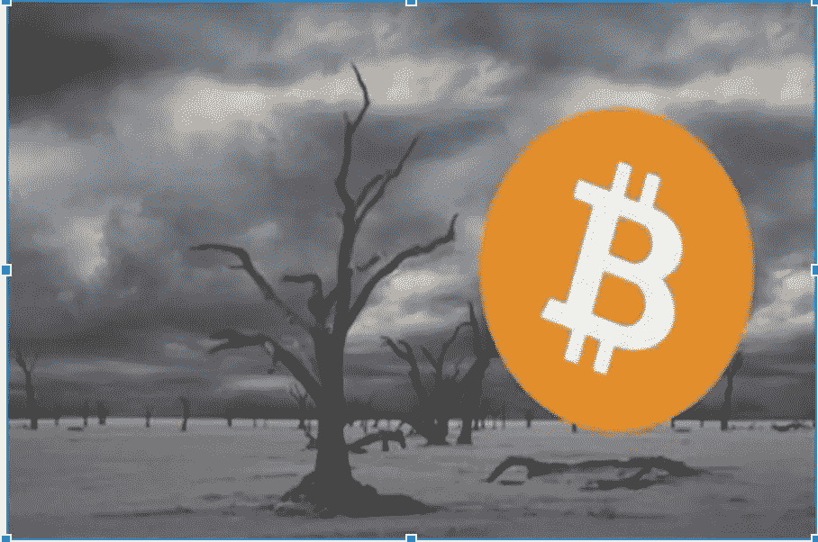

# 如何在加密启示录中生存并获利？

> 原文：<https://medium.com/hackernoon/how-to-survive-and-get-profit-during-the-crypto-apocalypse-c3ae92f13b6a>

2018 年 11 月最新的臭名昭著的加密自由落体持续了一年多，将所有加密资产降至最低水平。总市值回到了 2017 年 8 月的水平，市场情绪远非兴奋。

11 月 20 日，比特币在 24 小时内下跌了 12%，自 2017 年 10 月以来首次跌破 5000 美元。然而，过去是多头控制着市场，而今天是空头控制着市场。与此同时，以太坊正在慢慢消亡，因为 SEC 对两个 ico 的另一项指控使它们都处于恐慌模式。ETH 最近再次被砸，再次下跌 13%，至 150 美元以下，为 2017 年 5 月以来的最低水平。事实是，即使在 ICO 17 '繁荣之前以太坊表现更好，所以它可能是高价以太网的末日。

明智的策略不是等待利率回落，而是在这种情况下适应生存并取得胜利。

一个人很高兴看到自己的数字收入随着时间的推移而增长，但通过购买代币并平静地等待利率逐渐增长到销售可以盈利的水平来取得成功并不是成功的关键。这只不过是一个菜鸟游戏，受到大多数新市场玩家的青睐。

未来会带给我们什么？

事实是，大多数世界顶级分析师认为，资产快速增长和 1000 倍的意外快速增长的时代已经结束了。

这确实是一个值得关注的问题，因为超过 2075 个现有数字资产的总市值最近已飙升至近 1.4 亿美元。不利的一面是，这些货币最近一直处于弱势，因为大多数资产已经从峰值大幅下跌。

在这种条件下生存的关键是学会如何在停滞不前的市场上赚钱。当你是小投资者之一，被鲸鱼的市场游戏消息淹没时，如何处理这种情况？在这种情况下，等待增长的另一次飞跃是最糟糕的建议——你也可能因为经常被黑客攻击而失去在交易所的资产，这在未来不会停止。

**确保胜利的方法**

在加密市场崩溃的情况下，投资者可以通过几种方式获利。

**1)逢低买入**

第一个买入 dip 的人可以产生诱人的回报。无论如何，交易者应该有足够的资格去做这件事，因为有效地完成这件事并不像第一次上釉那么容易。

投资者必须投入大量资金进行市场研究，才能成功运用这一策略——这对于许多专家来说是相当具有挑战性的。请注意，在 2013 年见顶后，比特币价格在大约两年的时间里逐渐贬值。

事实上，市场崩溃提供了大量的机会。

坚持住，看在上帝的份上

数字货币市场中最著名的生活窍门之一是抓住宝贵的生命，或者简单地说是一种策略，许多人将其称为 HODL。

这种方法意味着购买加密货币，并在相当长的一段时间内持有它们，不管可能的损失，也不管数字资产的价值波动有多大。这是许多菜鸟交易者使用的经典方法，分析表明，在可能的市场崩溃期间，大多数投资者可能会使用它。

毫无疑问，以这种方式持有是一种可行的策略，决定坚持下去的投资者应该持有主要资产，而不是有人宣传为未来顶级的替代货币——只需在市值最高的五种加密货币中进行选择。

**3)使用像样的自动化解决方案**

然而，交易者需要一个方便的工具来最小化风险，并在停滞的市场中获胜。套利适合这种动荡，利用这种优势的平台肯定能在这种情况下获胜。

其中一个解决方案是总部位于英国的 [Arbidex](https://arbidex.uk.com/) 平台，该平台利用自动化交易算法让用户参与加密投资过程，并在降低风险的情况下赚取利润。为什么？该平台不关心下跌或上涨，或高或低的市值，唯一重要的是套利的工作是利率差异。

由于交易的机器人性质，它还节省了一个人的时间，并大大增加了获利的机会——因为在这种情况下，人类的失败被排除在等式之外。

**4)退出菲亚特市场**

一些交易员建议，当加密市场可能崩溃时，回归法定货币。然而，一些市场专家指出，退出法定货币需要谨慎的市场时机，当你选择退出和返回时，如果你想这样做。最好的方法是选择你可以承担风险的金额，然后不管市场上发生了什么，继续你的计划。

**5)比特币做空**

交易员也可以通过做空比特币获得非常丰厚的回报——如今许多交易所都提供这种机会。

例如，Bitfinex、Poloniex 和北海巨妖都提供这种功能。

无论如何，做空是一种针对有经验投资者的策略，因为这种方法风险很大。

还要注意的是，在使用任何策略从市场崩盘中获利之前，投资者应该确保进行尽职调查。

没有人知道另一个增长假期会持续多久，所以所有使用数字货币的交易都应该尽可能快——当接近 20%的利润时，你可以安全地平仓，转向新的方向。不要冻结资本几个月，在这几个月里，每天有可能增加 5-10%。

有人说，这个行业的未来看起来很光明，但不确定的时期还很长——根据最新消息，24 小时内损失了近 200 亿美元，比特币现金几乎耗尽，它的老大哥也紧随其后。只有时间能告诉我们未来会发生什么——你必须确保自己能在当前的环境中取得成功。