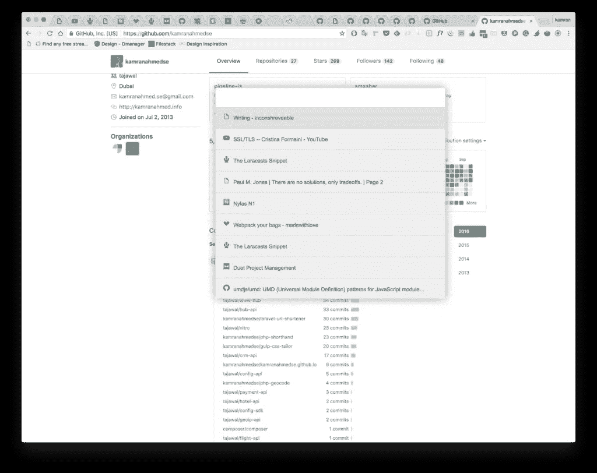

# 如何使用键盘在 Chrome 标签之间切换

> 原文：<https://medium.com/hackernoon/how-to-switch-between-your-chrome-tabs-using-your-keyboard-9a06fd161517>

有时候你可能需要打开很多标签页，浏览它们可能会有点痛苦，因为你的列表可能太拥挤了，你无法从标签页列表中读取任何标题。您只能查看选项卡的图标。Chrome 有一个很棒的扩展，可以让你只用键盘就能搜索和浏览你的标签。

它被称为 TabSwitcher，旨在通过减少在您需要时找到正确标签所需的时间来帮助提高您的生产率。您可以写下您想要导航到的标签的标题，使用键盘上的上下箭头来上下移动列表并打开您想要的标签，或者关闭您不再需要的任何标签。

您可以使用键盘上的 *Enter* 键，或者单击鼠标来选择选项卡。

可以用*；*关闭选中的标签页。

一旦你安装了它，你需要刷新开始标签页，然后使用以下键:COMMAND+SHIFT+K 或 CTRL+SHIFT+K。

它甚至可以搜索多个窗口中的标签。

[TabSwitcher](https://chrome.google.com/webstore/detail/tabswitcher/dnnmaaanhggngdohooaogfcnokngjcbc) 不能在新的 Chrome 标签上使用，根据我自己的经验，暂时也不能在谷歌文档上使用。

这个插件是开源的，你可以在 [Github](https://github.com/kamranahmedse/tab-switcher) 上查看源代码。

这个伟大插件的作者是 [Githunt](https://www.fatosmorina.com/get-trending-github-projects-chrome-tab-githunt/) 的作者，它在 Github 的新标签页上显示流行的开源项目，在开源社区非常活跃。

Chrome 还有另外一个很棒的扩展叫做 [*很棒的悬挂器*](https://www.fatosmorina.com/reduce-chromes-ram-usage-great-suspender-extension/) 可以停用不活跃的标签，结果是减少了你的内存使用，你也会喜欢的。