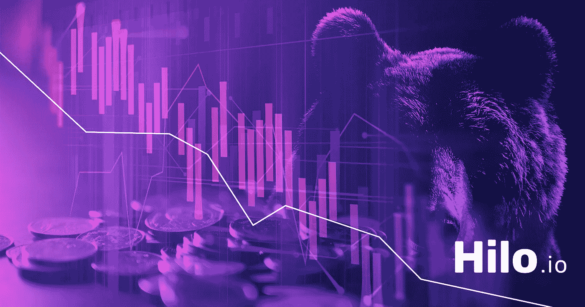

# 如何利用熊市

> 原文：<https://medium.com/hackernoon/how-to-take-advantage-of-a-bear-market-30721fa8bd6>

在某个时候，每种资产类别都会出现熊市。现在，[加密货币](https://hackernoon.com/tagged/cryptocurrency)熊市让[区块链](https://hackernoon.com/tagged/blockchain)空间的许多人担心整个区块链行业的长期前景。在熊市中，价格被压低，交易量减少，止损被触发，导致价格和情绪的螺旋式下降。然而，在许多人只看到厄运的地方，熊市也充满了机遇。在这篇文章中，我们探讨了在熊市中经常被忽视的无数机会。

**红色表示“打折”**

熊市最明显的好处是可以买到好的交易。在熊市中，BTC 和瑞士联邦理工学院都可以以好价钱收购。当整个市场都在抛售，价格下降，这是一个很好的时期来获得更多你最喜欢的硬币或代币。许多个人购买 BTC，目的是获得比最初购买价格高几个数量级的收益。虽然许多人通过追逐炒作进入区块链，但区块链技术的真正信徒是长期投资者。客观地说，目前比特币的价格大约是去年同期的两倍。此外，熊市在过去几年也很普遍。自 2011 年以来，比特币市场已经有过几次超过 70%的跌幅。对于你相信的知名项目，你可以将熊市视为“打折期”。沃伦·巴菲特说得很简洁: ***“当别人贪婪时要恐惧，当别人恐惧时要贪婪。”***

**购买力差异**

在熊市中，并非所有加密货币都以相同的速度贬值。例如，在过去的几个月里，以太坊的价格接近⅓2017 年牛市期间的价格。然而，许多较小的替代硬币现在是⅕到⅛的牛市历史高点。许多这些贬值的硬币也是声誉良好的项目。这使得以太坊和比特币在下跌市场中的购买力增加。人们可以利用这一点来分散他们的投资组合，并获得更多的声誉良好的低价竞标单位。这种策略的缺点是，你会以远非理想的价格放弃一些 BTC 和 ETH。但是在所有形式的交易中对冲赌注是很常见的。在此期间，你可以强烈考虑投资新的 BTC 或 ETH 硬币和代币。当 ETH 和 BTC 没有像其他资产那样大幅贬值时，这是明智的。

**黄牛天堂**

刷单的行为是根据加密货币图表中频繁出现的微观价格变动进行许多小额交易。这通常是一件苦差事，而且并不总是有利可图。一个人必须做足够多的小利润交易，这些交易最终可以积累相当可观的利润。剥头皮有两种方法。有些人这样做是为了增加特定硬币的单位。例如，当你认为某个硬币的价格会下跌时，你可以买入或卖出你持有的部分。当价格实际下跌时，你可以在更低的价格买入，以增加你的头寸。另一种策略是更传统的低买高卖，但间隔更频繁。这依赖于每小时的波动。有些人依赖软件(bot 交易)，因为它允许更高频率的交易发生，但亏损的风险总是存在。很容易通过一笔出错的交易抹去利润。

**将你的心态从交易者转变为投资者**

交易并不总是最好的策略，有时候买了再交易才是最好的。交易是快节奏的，需要大量的研究来确保你有相关的信息。当霍德林，这是一个伟大的时间来研究新的前景，以及刷上你对区块链的整体理解。加密可能是一个比一些人想要的更长的游戏，但投资是一个漫长的游戏。像所有重要的技术一样，区块链可能需要一个中间阶段，在此期间，项目必须获得牵引力并找到合适的市场。无论市场处于何种状态，重要的是要做好调查，清楚地了解你到底在投资什么。

**赌注、空投、主节点和其他被动收入来源**

要运行 masternode，您实际上是在存储一个特定区块链的完整副本。为了抑制不良行为者，大多数货币要求你为节点抵押足够的基础货币单位。例如，为了运行 DASH [的 masternode，您需要在 walle](https://dash-news.de/dashtv/#value=2000) t 中安装 2000 台 DASH。此外，您还需要存储空间来保存 DASH 区块链，并需要 24/7 互联网接入来捕捉区块链的更新。运营 masternode 的回报是间歇性的加密货币支付，几乎就像利息一样。masternodes 的缺点是开销大。虽然你可能在被动地赚取硬币，但熊市也会导致你的硬币贬值。换句话说，运行主节点所需的硬币持有量。如果你有资金，建议只为你做多的硬币建立主节点。

许多人将 PoS(股份证明)视为 masternodes 的扩展。实际上，并不是所有允许 masternodes 的硬币都是 PoS。功能上，PoS 币的操作类似于 masternodes，您可以在赌注钱包中持有一定数量的货币，以获得相应的奖励。通常 PoS 货币没有最低限额，此外还有不同类型的 PoS 支付。像 OKCash 这样押一些货币会支付更多单位的相同货币。在其他情况下，一些货币支付不同的货币，如 NEO 的情况。打桩 NEO 会产生气体。在这两种情况下，下注都是在交换钱包中存放硬币的绝佳选择。虽然赌注的收益可能微不足道，但至少它们是一致的。对于投机来说也不一定如此。

空投是加密货币项目运营的常见营销活动。为了有资格获得特定空投，有时可能必须满足不同的条款。例如，一些空投是基于百分比的。也就是说，相对于您现有的持有量，您将获得一定数量的硬币。其他空投从接收方请求任务。例如，有些人可能会要求你关注项目的社交媒体账户。重要的是要小心，因为许多人以空投的形式掩盖骗局。永远不要给空投送硬币或私人钥匙。在任何情况下都没有必要提供这些来申请空投。有许多资源，从电报组，到专门寻找不同空投物资的网站。在任何情况下，在进行空投之前，确保你完全清楚空投背后的规定和条款。无论如何，在熊市中留意空投总是好的。从长远来看，你今天收集的小额硬币可能价值不菲。你尝试空投的次数越多，你获得丰厚回报的机会就越大。

没有研究，所有这些策略都是徒劳的，这就是为什么我们要建立 Hilo.io。Hilo.io 是一个面向密码交易员的社交平台。Hilo.io 的平台就像一个仪表板，允许用户与朋友互动，管理你的投资组合，发现新的硬币，并了解所有加密的事情。我们的代币将用于激励用户、交易和鼓励普通人广泛采用代币。Hilo.io 是您与 crypto 的连接。

**想了解更多关于 Hilo.io 的信息，**请访问 https://www.hilo.io/。

**加入电报讨论，**拜访[https://t.me/HiloCrypto](https://t.me/HiloCrypto)