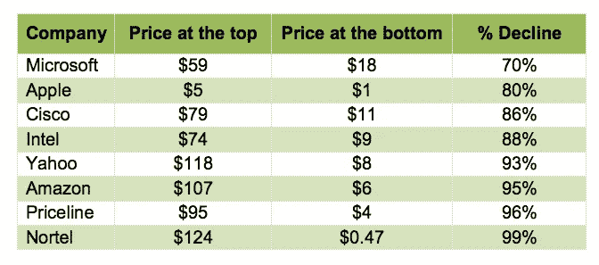

# 如何利用 ICO 市场即将到来的恐慌性抛售

> 原文：<https://medium.com/hackernoon/how-to-take-advantage-of-the-coming-panic-sale-in-the-ico-market-389d7e7d36dc>

*帕维尔·切尔卡申和朱莉娅·德姆金娜*

Source: Shutterstock

初始硬币发行(ICO)市场现在过热，以目前的价格投资可能不是最佳选择。那么，对于谨慎的机构投资者来说，什么是合理的 ICO 投资策略呢？

我们推荐的策略基于以下假设:

区块链技术和加密货币具有**的长期基本面价值，它们将在未来 10-20 年内对全球经济产生重大影响，尽管目前实际的、经过验证的用例数量有限(就像 90 年代末的互联网一样)。**

**目前的加密市场市值和估值主要基于预期**而非技术的实际应用。由于非合格投资者的准入门槛低，估值被高估了。

现在任何时候，投资者都会对市场感到失望，并开始抛售。我们估计这将在 2018 年底至 2019 年年中发生。

当市场的资本总额低于某一水平时，恐慌抛售将开始，因为不合格的投资者将失去信心，并希望在他们的货币变得一文不值之前获取尽可能多的价值。

如果这些假设成真，对于将有限的资金分散在数百个加密代币中的小投资者来说，这将不是一个好消息，因为有限的流动性将进一步推低价格。

然而，对于大型机构投资者来说，这种情况代表着参与将为新的全球经济奠定基础的项目的巨大长期机会。为了抓住机会，投资者需要回答两个主要问题:

哪些项目将度过危机并值得支持？

这个问题可以通过对团队、可交付成果、牵引力和当前估值的标准风险评估来回答，因为有些项目太大而不能倒。以下是我们关于如何做到这一点的一些提示。

投资者应该在什么价位开始买入？

这个问题要复杂得多。过早投资可能会耗尽全部内部收益率(IRR ),因为项目需要太长时间才能将其估值恢复到购买水平。投资太晚不值得，因为其他投资者会意识到所有的好处。

如果出现恐慌性抛售，为了帮助找到理想的投资时机，我们提出了以下假设:

如果恐慌性抛售不遵循经济逻辑，纯粹是心理现象怎么办？换句话说，当投资者绝望地抛售时，价格下降到一定的心理最低点。

如果这是真的，那么每一次恐慌性抛售都应该有一个相似的模式，因此我们应该能够根据过去相似的市场条件来估计心理上的最低限度。

最接近的事件是 2000 年至 2002 年的互联网泡沫破裂。(这个话题有很多很棒的文章；我们推荐阅读 [**《戳破泡沫:加密货币 vs .网络公司**](https://hackernoon.com/popping-the-bubble-blockchain-and-cryptocurrency-7130156f91b2) 。互联网危机用过度膨胀的期望和空洞的承诺冲走了大多数公司。但敢于购买最杰出公司股票的投资者享受了非常有利的估值，并在接下来的十年里获得了可观的回报。

我们特别挖掘了科技公司股票的情况。纳斯达克指数在短短一年半多的时间里下跌了 79%，从 2000 年 3 月 10 日的 5048.62 点跌至 2002 年 10 月 09 日的 1114 点。即使是在危机中幸存下来的公司也跌到了临界水平。不同的来源显示不同的数字，但总体情况是清楚的:

我们在这里看到以下心理层面:

● **拥有稳定现金流和可预测经济模式的公司，如微软和苹果，其股价下跌不超过 80%** ，因为投资者可以看到这些公司即使在艰难时期也能生存和增长。

● **商业模式完全依赖互联网的公司下跌超过 90%** ，因为投资者不清楚它们适应新经济环境的能力。如果互联网被大众市场拒绝，仍然是 IT 人群的昂贵玩具，亚马逊、雅虎、思科、北电和 Priceline 将向谁出售他们的产品和服务？

就收入和产品组合的多样性而言，在区块链世界，微软和苹果还很少。像比特大陆或比特弗瑞这样开发采矿设备的公司倾向于依赖更传统的工具，比如 IPO，而不是 ico。比特币、以太坊和 Ripple 可能属于这一类，因为它们具有储备货币的功能，并可能为处于恐慌状态但仍想继续使用加密技术的投资者扮演“安全港”的角色。

根据这些数据，为即将到来的恐慌性抛售做准备并加以利用，投资者可能希望遵循以下策略:

> 1.建立一个他们认为会在危机中幸存的加密货币的列表。
> 
> 2.趁市场还在上涨时筹集资金。当恐慌性抛售开始时，心理学将胜过任何数学计算和经济研究，说服投资者承担风险几乎是不可能的。
> 
> 3.更保守的投资者更喜欢关注核心(储备)货币，当它们下跌 60-70%时开始买入，如果它们进一步下跌，继续买入。
> 
> 4.更激进的投资者可能希望观察他们认为具有真实经济潜力的其他货币，等到它们进一步下跌 80%—90%后再买入，然后构建他们的投资组合，期待更长期的市场采用和增长。

当然，重要的是要记住，加密市场比股票市场更有活力，更容易被世界各地数百万小投资者所利用。这造成了更高的波动性，因此可能会出现更深的下跌。

***

Pavel Cherkashin 是一位风险投资高管和企业家，作为创始人、投资者和董事会成员，他有着创建数十亿美元公司的成功记录。作为 Mindrock Capital 和 GVA 资本的联合创始人和管理合伙人，帕维尔投资于人工智能、区块链和自动驾驶技术。

*朱莉娅·德姆金娜曾在 Mindrock Capital 实习，担任投资机会分析师。她在莫斯科物理技术学院(MIPT)学习创新管理和技术创业，并在物流领域创业。*