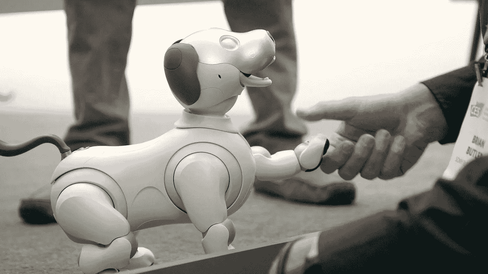

# 如何驯服人工智能:企业简要指南

> 原文：<https://medium.com/hackernoon/how-to-tame-ai-a-brief-guide-for-businesses-869f93e6e594>

人工智能的商业应用正在加速发展。据 SAS 报道，来自不同行业的公司的⅔预计他们的活动将在未来 5 到 10 年内由人工智能塑造。然而，高昂的热情受到组织准备不足的阻碍。许多人犹豫是否值得现在就开始——通常是因为人工智能只适合大玩家的观点而气馁。但真的是这样吗？

**嗯，先举几个例子。不，不是来自谷歌或亚马逊。**

一位来自皮埃蒙特 的[酿酒师意识到，他的葡萄酒质量(以及他生意的成功)取决于计算，不亚于生产努力。因此，他加入了领先的意大利-德国人工智能软件公司](http://www.nocetomichelotti.it/) [Ors 集团](https://www.orsgroup.io/)。他们三年合作的成果是 Algo-Wine，这是一个可以准确预测葡萄最佳收获时间的软件。它给酿酒商带来高达 30%的年收益。听起来很诱人，不是吗？

一个 [**小型在线会计企业**](https://www.inniaccounts.co.uk/) 努力使管理和归档账户变得简单快捷。它建立了一个正在进行的研究项目，并引入了基于云的人工智能软件，旨在实现会计任务的自动化。2017 年，它赢得了会计行业最负盛名的奖项[卓越实践先锋](https://www.accountingweb.co.uk/practice/general-practice/practice-excellence-2017-pioneer-shortlist)的称号。就在今年，它的销量超过了 100 万。对于这家只有 30 名员工的公司来说，这是一个不错的结果。

一家[**珠宝店**](https://www.rockher.com/) 来自钻石区，在激烈的竞争中挣扎，在引入一个虚拟宝石专家后找到了拯救，该专家利用人工智能搜索全球钻石市场。只需几秒钟，它就能处理一百万个数据点，帮助顾客为订婚戒指做出完美的选择。客户喜出望外:不再有毁灭性的搜索。公司所有者也同样高兴:大约 2000 名竞争对手被甩在了后面。

好吧，也许你不需要再被说服了，但仍然，有一个问题从哪里开始。因为每个人都在谈论人工智能的重要性，但是有相当多的人解释了如何做到这一点。那么，我们需要弄清楚的第一件事是什么应该被称为人工智能。

# 什么是狭义和广义的人工智能

“人工智能”一词现在有不同的含义。从狭义上讲，AI 代表模仿人脑工作的软件。从广义上讲，它是几种不同技术的总称，包括:

*   **机器学习**。ML 使用统计技术来改进基于各种数据的计算机系统性能，而不需要或只需要最少的人工干预。脸书的面部识别很好地说明了它是如何工作的。
*   **智能机器人**。今天的智能机器人是应用 ML 技术从环境中获取信息的 AI 系统。它们已经被用于许多行业，完成从医疗诊断到烹饪比萨饼的任务。

*   **虚拟辅助**。虚拟助理是一个软件代理，当用户使用网站或搜索信息时，它使用认知计算为用户提供 24/7 的帮助。也许，你已经有机会认识 X.ai 的 Amy 和 IBM 的 Watson 这样的虚拟助手了。
*   **决策管理**。自动化决策支持依赖于基于规则的系统在没有人工参与的情况下为重复性[管理](https://hackernoon.com/tagged/management)问题做出决策的能力。基于人工智能的决策已经被用于交通管理系统和在线招聘系统。Cypress 软件系统公司是这项技术的知名领导者之一。
*   **语音识别**。这是计算机程序听人说话并理解它的能力。亚马逊的 Alexa，谷歌的 Assistant，微软的 Cortana，苹果的 Siri 都属于这里。

*   **自然语言生成**。这项技术旨在分析数据并将其转换为人类可读的文本。《福布斯》已经用它来制作公司收益报告，加拿大环境部也用它来制作天气预报。

这些技术已经在如此众多的行业中得到应用，它当然值得一篇特别的文章——这是我们承诺提供的。但是无论你决定将什么想法付诸实践，你都要从一些常见的步骤开始。

# 在商业中实施人工智能:第一步

你的公司不可能在几天内引进人工智能。初步审计和优化现有程序和政策大有帮助。如果你不想在 5 到 7 年后放弃，你真的需要从现在开始。以下是一些值得首先考虑的行动。

熟悉人工智能技术。了解它们背后的含义以及如何应用它们。你可能会在 Udemy、Coursera 和 Udacity 上找到很多教育资料。NVIDIA 已经为各个级别开发了一个全面的人工智能课程列表，从初级到高级-真的很方便。自己尝试 AI 产品，了解自己喜欢和不喜欢它们的地方。集思广益，让你的客户在处理你的产品时如何使用类似的技术。

**重新考虑你的生意**。问问你自己，在你的行业中，哪里可以通过应用 AI 获得竞争优势。或者，相比之下，你在哪些问题上落后了，人工智能如何帮助你赶上进度。例如，如果你的问题是寻找线索，考虑使用机器学习来寻找潜在客户、广告和推销。如果你需要提高现场参与度，智能聊天机器人可能会很有用。想想你可以如何将人工智能能力添加到现有的服务中。一些选项是[改进你的网站](https://stfalcon.com/en/blog/post/artificial-intelligence-in-website-development)，优化营销活动，加强客户服务或建立社交策略。设定可衡量的目标，并向技术专家寻求建议。

**做出初步估计**。评估实施的成本。人工智能与传统软件的不同之处在于，你不能只设置它就忘记它。机器学习的过程需要监控。你打算委托谁呢？你是要用机器学习工程师来加强你自己的员工，还是要让第三方专业人士参与进来？

**获取数据驱动**。为了有学习的地方，人工智能需要在一个地方收集现成的数据集。因此，为了打好基础，开始整合您的数据。它可能包括来自您的客户关系管理、广告活动、电子邮件列表、流量分析、社交媒体回应、竞争对手的公开信息等。

**升级 IT 基础设施**。检查你的 IT 服务是否需要重新设计，以适应人工智能驱动的解决方案。

**选择一段作为试验场地**。考虑从一个单一的业务领域开始。请记住，当涉及到人工智能时，沸腾海洋项目比一个更小的想法更容易失败。

# 结论

就像互联网在过去二十年里改变了我们所有的生活方式一样，人工智能也将在不久的将来成为一股无与伦比的变革力量。你越早开始分析人工智能可以提升你业务的领域，你在市场竞争中的地位就越好。

人工智能的采用依赖于实际准备。这意味着要有工具和熟练的员工来有效地利用这项技术。将人工智能引入贵公司工作流程的最初步骤包括:

*   熟悉人工智能技术；
*   深入分析你的业务，以期推出人工智能驱动的解决方案；
*   初步成本和人员估算；
*   数据整合；
*   公司 IT 基础设施的调整；
*   为软发射分配一个实验段。

乍一看，这一切似乎太复杂了。但是不要过于担心，被恐惧所困。事实上，传统软件应用比人工智能更容易失败。你现在处于哪个阶段？让我们一起走这条路吧！

*最初发表于*[T5【stfalcon.com】](https://stfalcon.com/en/blog/post/artificial-intelligence-first-steps-in-implementation)*。*