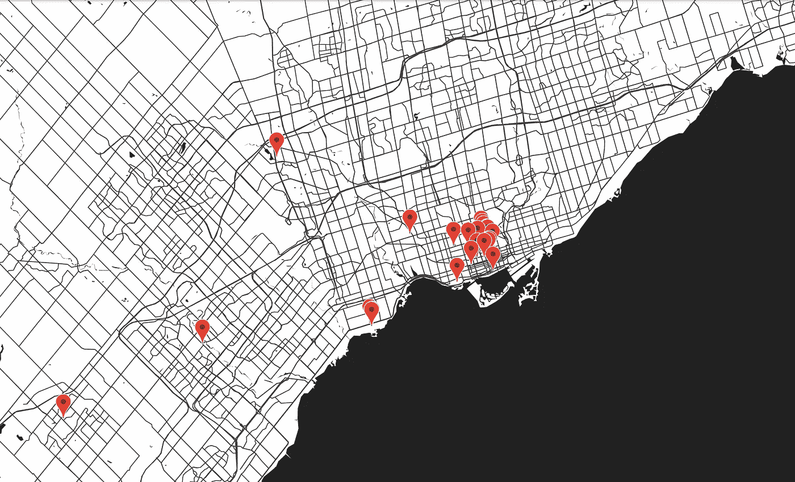
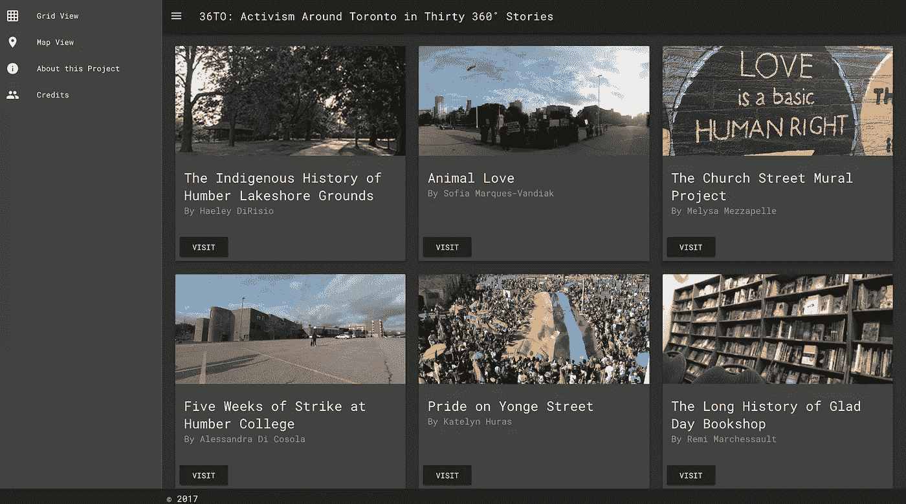

# 如何教互动讲故事:来自 36to.ca 的五堂课

> 原文：<https://medium.com/hackernoon/how-to-teach-interactive-storytelling-five-lessons-from-36to-ca-b937535dcc2f>

我向交流者教授代码和交互设计的一个大目标是让他们感觉到从没有得到代码到能够自己编程的飞跃不是那么大。诀窍通常是利用他们讲故事的动机来激发他们对代码的兴趣，但课程中很少有时间来教授足够的代码，以允许学生构建能够满足他们的创作本能的作品，同时也支持他们发展讲故事的技能。

去年秋天，在给一班新闻专业的学生讲授交互式讲故事的介绍时，我想给他们一个机会，让他们在尝试 360 度摄影时开发一个真正的项目，360 度摄影是新闻编辑室里一个闪亮的新工具。通过与我的同事丹·罗的合作，结果是[36 对:30 个 360 度的故事](http://36to.ca/#/)中的行动主义。学生们使用基于地点的有声和 360 度图片讲故事，创作了一系列关于多伦多活动家声音的历史和景观的鼓舞人心的故事，从[动物权利](http://36to.ca/#/scene/savemove)到[堕胎运动](http://36to.ca/#/scene/prochoice)到[土著历史](http://36to.ca/#/scene/lakeshore)到[黑人的命也是命](http://36to.ca/#/scene/blm)、[先锋派艺术史](http://36to.ca/#/scene/ago)、[奥斯卡王尔德](http://36to.ca/#/scene/allan)和 LGBTQ 社区[壁画](http://36to.ca/#/scene/mural)。

这个项目激发了一些有趣的实验，让我思考了很多关于如何教授互动讲故事的问题。以下是几点建议。

**1。** **合作**

教授互动讲故事是一项课程挑战。为了完全独立地开发和设计作品，学生们需要对编程和框架、UX 和视觉设计、讲故事和报告有很强的掌握，还需要时间来学习有效地使用新媒体，在这种情况下就是 360 度摄影。理想情况下，他们还会有时间思考模范工作。很少有课程能够一次教授所有这些内容，并且有深度。

与丹·罗(Dan Rowe)的新闻与社会公正课程合作完成这项任务，让每门课程的学生都能集中精力学习。这个合作项目没有让他们在一个作业中承担过多的讲故事和开发任务，而是让丹支持他们报道原创故事，而我们则在课堂上专注于数字讲故事的机制。其结果是一个两门课的作业，有足够的空间让学生创作既有技术深度又有故事深度的项目。

**2。** **保持真实**

在设计讲故事的作业时，我喜欢使用一个共同的主题和架构来开发项目，这样学生的作品就可以汇集到一个集体平台上。这种结构有助于学生了解他们的声音是如何被收集到环境中的，这种环境就像他们在线互动的基于 feed 的渠道，并有助于将他们的项目放大到具有更大影响的东西。通过在相同的主题和结构中处理不同的主题，他们也可以感受到他们的个人声音是多么的多样化、强烈和有效，我认为这有助于提高他们作为创作者的自信水平。

在为这样的项目寻找一个共同的主题时，我也喜欢尝试从我们正在探索的新媒体中获得灵感。我们决定看看多伦多基于场所的行动主义的故事，部分原因是受到 360 摄影本身的启发，它让观众环顾四周——看到一个空间，自己发现它的细节，并从新奇的角度看待事物。我们利用 360 度摄影的机会，呼吁以更广阔的视野讲述故事——从各个角度看待事物，融入主流之外的观点。

将学生的作业引入面向公众的媒体，似乎让他们在学校的经历与他们作为媒体消费者的生活紧密相连，因此，用教育学术语来说，这种事情是真实的。当作业感觉真实时，学生的参与度就会提高。

**3。通过向后工作来教授一位码**

我已经在别处[写过](https://medium.freecodecamp.org/how-to-solve-a-cms-problem-when-youre-caught-between-restful-wordpress-and-a-hard-place-77bbebe49e1b)关于为这个项目设计一个学生友好的内容管理策略的一些技术挑战和突破。(TL；大卫:我想找到一种简单的方法让学生记者上传和整合他们的媒体。解决方案是使用 WordPress 表单和 JSON 的混合体。)

另一个挑战是决定学生需要学习多少代码来很好地执行这个项目。

在向沟通者教授代码的过程中，我有时发现最好的方法是逆向工作，首先帮助学生创建一个数字项目，然后解释代码是如何工作的，而不是强迫他们在开始自己创建激励他们的酷东西之前学习所有(无聊的)基础知识。另一种变通方法是开发模块化代码，只需稍加编辑即可适应特定的项目，然后向学生解释代码块如何工作，以及他们需要做些什么来使其成为自己的代码块。

对于这个项目，我决定为故事创建一个可重用的代码结构，一旦学生们使用它来集成他们自己的媒体，我就可以向他们解释。为了构建它，我加入了伟大的 webVR 框架 [A-Frame](https://aframe.io/) ，它有一个奇妙的生态系统，在 Glitch 上有[资源。我用三张照片重新制作了他们的一个样本场景，通过添加带有开始/停止功能的音频和可访问性和清晰度的脚本来作为讲故事的界面。为了构建包含这些故事的整个 web 应用程序，我将这个结构放入 Vue 化接口内的 Vue.js 组件中，这使得项目的设计和开发变得可行。为了确保学生们与他们故事背后的代码有一些联系，我还将模块化的故事结构构建成一个可重新组合的独立故障](https://glitch.com/@aframe)[项目](https://glitch.com/edit/#!/360-story-starter)，并教他们代码如何工作，以及如何编辑它来展示他们自己的故事。这样，如果他们愿意，他们可以独立于班级项目分享他们的故事，也可以更好地了解哪些代码片段在做什么——而不是面对编译后的 web 应用程序的黑盒复杂性。

我没有教他们设计和开发原创故事架构所需的所有代码，而是帮助学生组装一个他们可以感到自豪的工作交互项目，然后拉开底层代码的帷幕。这种方法打破了学习在多个层面建立强大的互动工作的压倒性任务，以便理想地给学生留下他们可以感到自豪和拥有的工作，以及新水平的技术工艺和理解。

**4。** **让学生告诉你他们学到了什么**

这个项目很难，但对学生来说很有趣。除了磨练他们的报道技能，他们还需要利用新媒体(通过 360 度摄影进行数字故事讲述)来完成出色的工作，同时努力应对创建和管理包含多个媒体组件的项目的笨拙本质。

尽管故事环境结构非常简单，但它要求学生们收集 19 个不同的媒体片段进行上传:标题、故事情节、署名、描述、三张 360 度图像、三张图像描述、三张导航缩略图、三个音频文件和三份文字记录。我没有预见到学生们收集和整理所有这些文件会有多困难。编组、编辑和组装所有这些媒体的挑战给他们上了一堂很好的课，让他们知道即使是最简单的项目也会变得多么复杂，并向他们展示了严格的媒体管理过程是交互开发的一个主要部分。这是一个很好的教训——也是一个我真的没有计划的教训。

他们发现 360 度摄影既令人兴奋又困难。按计划预订和共享学校的摄像机迫使他们进行协作，管理他们的时间，并制定有效捕捉媒体的策略。他们从拍摄地回来，讲述了他们如何藏在柱子后面和小巷里，同时确保相机支架不会被风或行人吹倒，从而避开他们的照片。这些困难激发了惊人的创造力。一个学生，而不是试图隐藏在框架之外，使她的脸和身体的存在成为她的故事的一部分，辉煌的效果。学生们从克服新媒体的挫折中获得了创造性的信心，并学到了掌握令人生畏的技术的兴奋感——另一个有用的教训。

我只是着手创建一个项目，让学生们体验 360 度摄影的互动创作。通过听他们讲述执行工作的故事，我意识到他们从所有这些挑战中学到的东西超出了我最初的目标。我从他们学到的东西中学习。

**5。** **和你的学生一起实验**

几个月后，我听到了许多故事，讲述了参与这个项目如何帮助学生们走向暑期工作。提供实习机会是因为学生们了解 360 度摄影，并熟悉互动讲故事的技巧。

因此，我的一大收获是，尝试尖端技术真的会给学生带来回报。潜在雇主*希望*雇佣理解新时尚的人，并且乐观地认为他们可以学会使用下一个即将到来的时尚，而不是害怕新奇。

这并不意味着我们应该仅以传统的讲故事为代价来教授这种聪明的新事物，但是通过对新媒体的潜力充满热情并带着我们的学生一起兜风来了解和探索新媒体的局限性具有强大的价值。学校应该是老师和学生进行实验的地方。

我从这个项目中带着一种新的感觉离开，我作为一名教育工作者的工作不是回避最新的前沿媒体技术，因为它可能只是昙花一现，而是与我的学生一起试验测试它的极限，这样他们可能会在离开我的班级时强烈感受到艺术的状态，它可以被推动多远，以及接下来可能会发生什么——当他们掌舵时。

杰西卡·达芬·沃尔夫 *在亨伯学院教授讲故事的设计和编码，她是数字通信和新闻学教授。她拥有英语和图书历史博士学位，是《多伦多书评》的创始主编。*