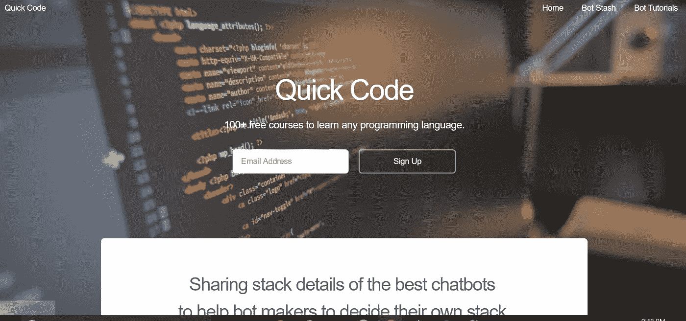
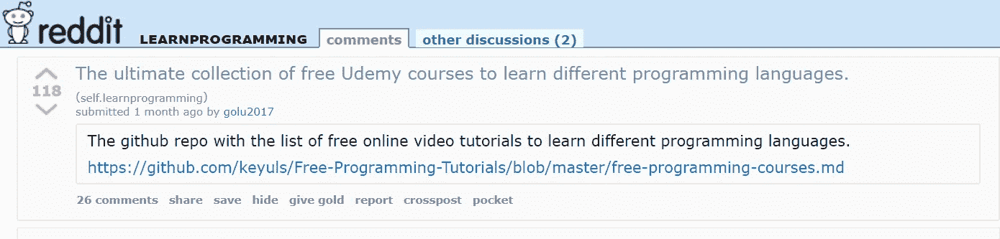
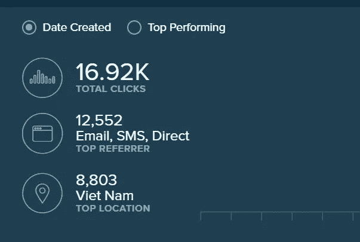
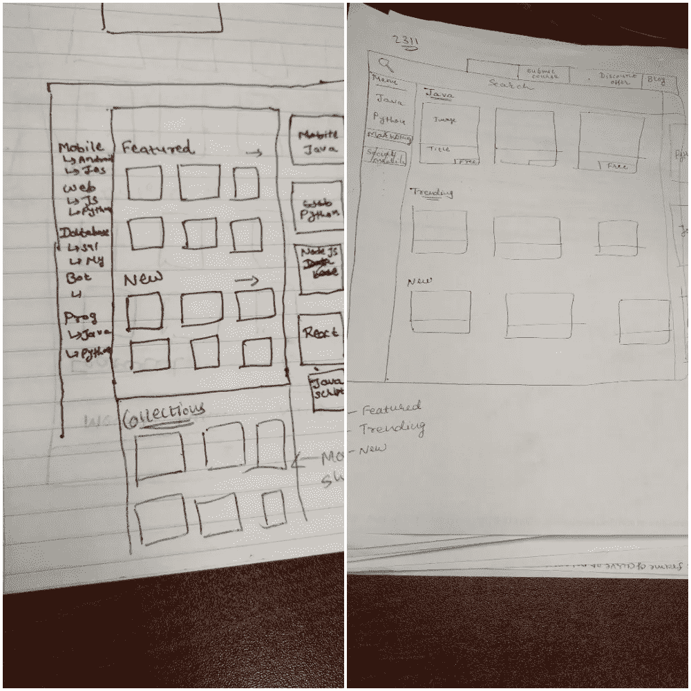
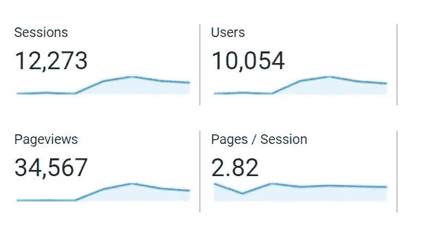

# 如何在不上市的情况下测试产品的市场

> 原文：<https://medium.com/hackernoon/how-to-test-a-market-for-the-product-without-launching-it-272dbf8ff083>

几个月前，我在找一门课程，复习 Java Spring 框架基础。我在寻找一个教程，它能给我一个 Spring 概念的快速浏览，而不用太深入，这样我就可以开始写代码，而不用花太多时间在阅读上。在各种在线课程网站上搜索了几个小时后，我找到了一个免费的[合适的课程](http://www.quickcode.co/free/course/learn/Spring-Framework-And-Dependency-Injection-For-Beginners/261)。

几天后，我和朋友讨论[编程](https://hackernoon.com/tagged/programming)，他问我在哪里可以找到免费视频教程。我向他解释了我寻找免费在线课程的步骤。一个月后，另一个想修改软件测试概念的朋友问了一个类似的问题。

我意识到其他人也可能在寻找免费课程上有问题。所以我决定建立一个网站，收集不同编程语言和工具的所有免费课程。

但在花时间集思广益的功能和建立完整的网站之前，我需要验证这个想法。我想确定是否真的需要它。所以在我把时间和精力投入到这个项目之前，这是很重要的。

# 想法验证

在开始[产品开发](https://hackernoon.com/tagged/product-development)的实际工作之前，我用多种方式验证了这个想法。

首先，我用一个简单的模板和 messenger 聊天机器人创建了一个注册页面。我用网站和聊天机器人链接在各种脸书团体上发帖。

几个小时后，150 人注册(53 人通过电子邮件，97 人通过 Facebook Messenger)。这显示了这个想法的潜力。

下一步，我收集了所有免费的编程课程，并根据编程语言对它们进行了分类。我把名单上传到了 [*GitHub*](https://github.com/keyuls/Free-Programming-Tutorials/blob/master/free-programming-courses.md) 上，分享到了 [*Reddit*](https://redd.it/7a7api) 。这获得了 118 张赞成票，并在 Reddit 上引发了热烈的讨论。GitHub 库瞪了 50 多次。

在此期间，有人复制了整个列表并发布在越南受欢迎的博客上，在 3-4 天内点击量达到了 17000 次。(我使用了 URL shortener 服务来跟踪点击，他们把所有的点击都复制到了博客上。)

在验证了这个想法的潜力之后，我开始着手建立一个网站。我工作日晚上工作 2 小时，周末工作 6-8 小时。

# 构建产品

首先，我头脑风暴了所需特性的列表。最初的名单很长。作为一个制造商，你总是想让产品具备所有的功能，而构建所有的功能会花费很多时间，而且你永远不知道客户会使用多少这些功能。

> 只构建那些能为你的受众解决实际问题的特性。

该网站的目的是让用户能够简单方便地找到免费课程。记住这一点，我缩小了首次 MVP 发布所需的特性。我在页面上设计了一些模型，以便在开始编码前获得更多的想法。

在这之后，我开始写代码开发网站。在这个过程中，首先我设计了网站的整体架构(重要的是花更多的时间在这方面)，然后建立后端系统，最后进行前端设计。再过几周， [*快码*](http://www.quickcode.co) 的第一个 MVP 就做好了。

# 第一次发射

下一步是向公众推出第一个版本。产品发布的最佳地点是产品搜寻。网站提前一周就准备好了，我想推出。我克制住自己的诱惑，决定在感恩节的长周末推出这个网站。产品搜寻发布日的选择非常重要。在过去，我已经推出了其他产品( [Bot Stash](https://www.producthunt.com/posts/bot-stash) 、 [Product Huntian bot](https://www.producthunt.com/posts/product-huntian) 等)。)在寻找产品方面，那次经历让我在选择发布日时有了很多明智的选择。

我在太平洋标准时间凌晨 1:00 左右发布了产品搜索的快速代码。早上，当我醒来的时候，Quick Code 已经在产品搜索上排名第二了。我欣喜若狂。我检查了现场交通，这太疯狂了。每分钟大约有 25-30 名用户访问该网站。我回复了 Product Hunt 上的所有评论，并感谢 Twitter 上的每个人分享了这个网站。参与社区活动是非常重要的。到了晚上，Quick Code 在产品搜索上排名第一。

> 在接下来的几天里，网站的流量还是一样。在发布的三天里，有 10，000 人访问了该网站。

Traffic on Quickcode.co after ProductHunt launch

# 吸取的教训

*   确定你的目标受众的利基，并首先推出。它能快速验证你的想法，并给你信心去制造实际的产品。
    (在这种情况下，在编写代码之前，我在 Reddit 的“*学习编程*”部分和脸书小组中发布了这个列表。)
*   明智地利用你的时间和资源来测试 idea 市场是否适合合适的受众。
*   不要过度工程化。先解决你的用户最重要的问题。稍后添加新功能以增强用户的能力。
*   使用[产品搜索](https://medium.com/u/b8b4445269d0?source=post_page-----272dbf8ff083--------------------------------)、[测试列表](https://medium.com/u/64041d67d947?source=post_page-----272dbf8ff083--------------------------------)等渠道推出产品。(仔细选择发布日期和时间)
*   与其寻找一个具体的想法，不如想想你在日常生活中面临的问题，找出其中的规律并尝试解决它。

# 下一步是什么

在想法验证和发布之后，在过去的几个月里，许多新的特性被添加到了[快速代码](http://quickcode.co)中。

*   用户可以[注册](http://www.quickcode.co/signup)，关注主题，比如&收藏课程，发表对课程的评论或评论。
*   从 64 种不同的编程语言、框架和工具中找到免费的在线课程，分为 21 个部分。
*   找到 13 种不同的本地语言的免费课程，包括西班牙语、法语、中文、阿拉伯语等。
*   通过[电报](https://t.me/freecoursesupdate)、[信使](http://m.me/1493528657352302)、[电子邮件](https://quickcode.us17.list-manage.com/subscribe/post?u=31d967fc6c4b82b014f037ca8&id=c09304288c)获取新免费课程的更新。
*   在[学员空间](http://quickcode.co/learner/)与其他成员分享学习进度
*   通过我们的[出版物](https://medium.com/quick-code)与世界分享你的知识或故事。